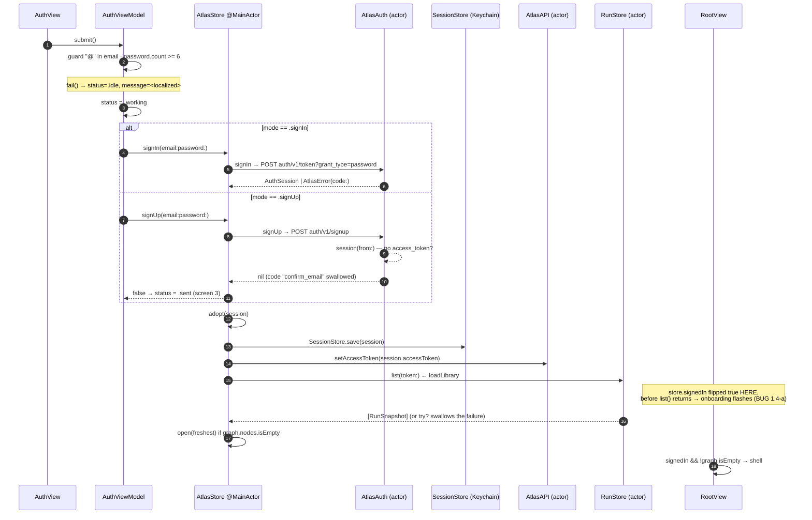
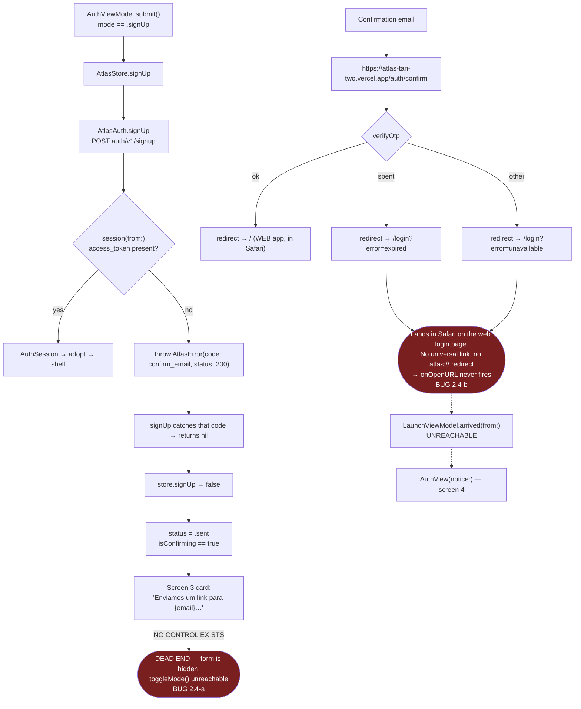
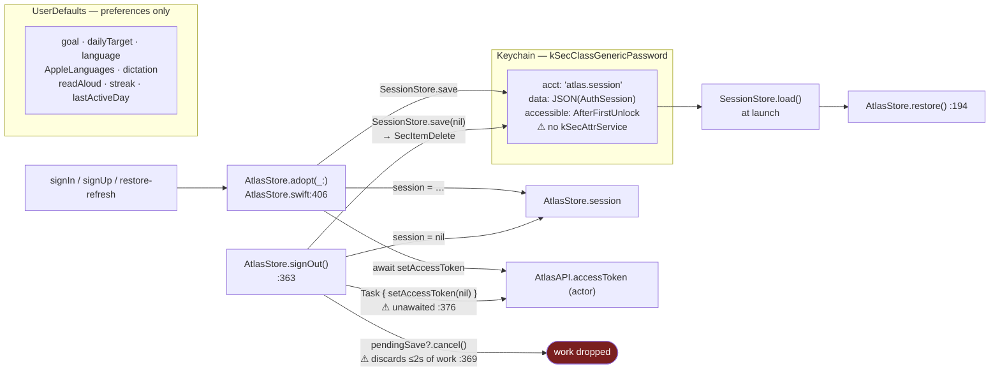
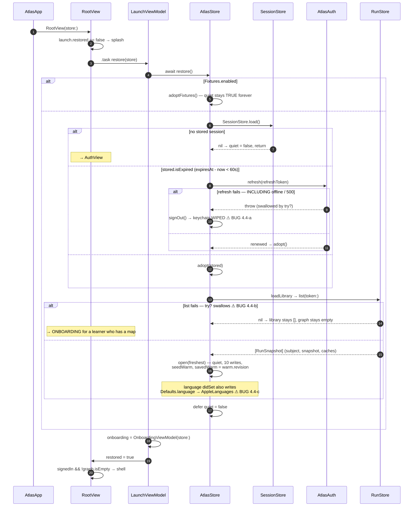
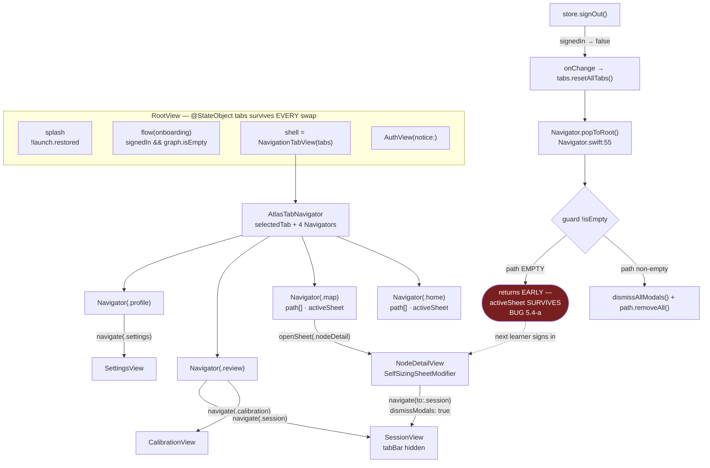
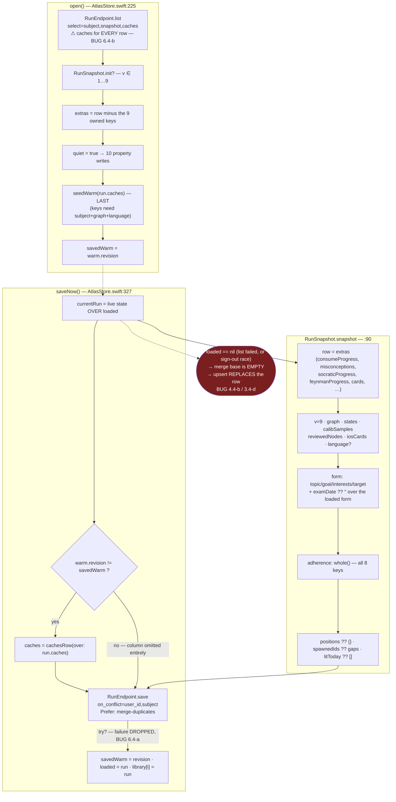

# Atlas iOS — Audit: Auth + App shell / navigation / session persistence

Scope: `Features/Auth/*`, `App/*`, `Data/{AtlasAuth,SessionStore,RunStore,RunSnapshot}.swift`,
`App/Sources/AtlasApp.swift`, `Project.swift`, and the three test files that pin them.
Cross-referenced against `Data/AtlasStore.swift`, `Data/AtlasEndpoint.swift`,
`Data/Warm.swift`, `Core/Support.swift`, `Features/Profile/*`, `ios/AGENTS.md`,
the web app's `lib/persistence.ts` / `app/auth/confirm/route.ts`, the
`run_states` migration, and the vendored `Navigation` package (cloned from
`github.com/joaoigorandrade/NavigationPackage@main` to read `Navigator.popToRoot`
and `NavigationTabView` exactly rather than infer them).

All line references are `file:line` against the working tree as read. Nothing in
the repo was modified.

---

## Contents

1. [Sign in / Sign up](#1-sign-in--sign-up)
2. [Email confirmation & expired link](#2-email-confirmation--expired-link)
3. [Session persistence & keychain](#3-session-persistence--keychain)
4. [Launch & session restore](#4-launch--session-restore)
5. [Tab shell + routing](#5-tab-shell--routing)
6. [Run snapshot persistence / sync with web](#6-run-snapshot-persistence--sync-with-web)
7. [Cross-cutting bug table](#7-cross-cutting-bug-table-ranked)

---

## 1. Sign in / Sign up

### 1.1 Objective

Screens 1–2 of the design. One screen that changes its mind between _Entrar_ and
_Criar conta_, backed by Supabase GoTrue over its REST API with no SDK. It is the
only gate into the app: `AtlasStore.session` going non-nil is what makes
`RootView` swap the auth screen for the shell, and it is also the only way a
bearer token reaches `AtlasAPI` and the keychain. Failures must land as a
Portuguese/English sentence _under_ the form, derived from GoTrue's `error_code`
— never the server's own English, never an alert.

### 1.2 How it works

**View layer.** `AuthView` (`AuthView.swift:6`) holds `@State private var model:
AuthViewModel?` (`:8`) and builds it exactly once in `.task`
(`:19`) — the AGENTS §MVVM "a view model is built once, in `.task`" rule. Until
then it renders `Color.clear` (`:15`). The body is one `ScrollView` column:
kicker (`:25`), `model.title` (`:26`), `model.blurb` (`:30`), then either
`confirmation(model)` when `model.isConfirming` or `form(model)` (`:35–39`), then
the amber message banner when `model.showsMessage` (`:41–54`). Three
`.animation(…, value:)` modifiers on `mode`, `status` and `message` (`:61–63`)
make the mode flip and the error arrival one animated screen rather than a cut.

`form(_:)` (`:68`) rebinds through `@Bindable var model = model` (`:69`) and
draws two `AuthField`s (`:71`, `:77`), the `CTAButton` (`:91`), and the
mode-switch button (`:95`). `AuthField` (`:125`) is a local shadowed card that
swaps `SecureField`/`TextField` on `secure` (`:134–138`) and hosts an accessory
(the eye toggle, `:78–88`, correctly labelled at `:87` and sized to `Metrics.tap`
at `:83`).

**Model layer.** `AuthViewModel` (`AuthViewModel.swift:9`) is the whole state
machine: `Mode {signIn, signUp}` × `Status {idle, working, sent}` (`:10–11`) plus
`message`, `email`, `password`, `revealPassword` (`:15–18`). Every string the
view shows is a `LocalizedStringKey` computed here (`:29–55`), which is the
AGENTS §Copy rule ("a view model exposes `LocalizedStringKey` for anything the
view only displays"); `message` is the one `String`, because `showsMessage`
inspects it with `.isEmpty` (`:52`) — also per §Copy.

`submit()` (`:63`) is the transition:

1. Local validation first, before any request: `address.contains("@")` (`:65`)
   and `password.count >= 6` (`:66`), each returning `fail(String(localized:…))`.
2. `status = .working; message = ""` (`:68–69`).
3. `.signIn` → `store.signIn(email:password:)`; `.signUp` →
   `store.signUp(…)`, and a `false` return means "confirmation email sent" →
   `status = .sent; return` (`:71–76`).
4. On success `status = .idle` and the swap is `RootView`'s job (`:77–78`).
5. `catch` → `fail(sentence(for: error))` (`:79–81`).

`sentence(for:)` (`:90`) is the AtlasError-code → learner-copy table:
`invalid_credentials`/`auth`, `email_not_confirmed`, `user_already_exists`,
`weak_password`, `validation_failed`/`request`, the three rate-limit codes, and a
default. The server's `message` is never read — correct per AGENTS §Networking.

**Store layer.** `AtlasStore.signIn` (`AtlasStore.swift:348`) is
`adopt(try await auth.signIn(…))` then `await loadLibrary()`. `adopt` (`:406`)
does three things and only three: sets `session`, writes the keychain, and pushes
the token into the `AtlasAPI` actor. `signUp` (`:356`) returns `false` when
`auth.signUp` returned `nil`.

**Transport.** `AtlasAuth` (`AtlasAuth.swift:18`) is an actor with its own
`URLSessionNetworkClient` pointed at `Secrets.supabaseURL`, built with
`successStatusCodes: 0..<600` (`:28`) so a 4xx body survives to be classified.
`signIn` posts `auth/v1/token?grant_type=password` (`:34`), `signUp` posts
`auth/v1/signup` (`:41`). `token(_:grant:_:)` (`:51`) executes, maps any thrown
transport error to `AtlasError.transport` (`:57`), and on non-2xx throws
`Self.authError(…)` (`:60`), which lifts GoTrue's own `error_code` into
`AtlasError.code` and falls back to `codeForStatus` (`:98`). `session(from:)`
(`:67`) decodes, and — the load-bearing bit — throws a synthetic
`AtlasError(code: "confirm_email", …, status: 200)` when the payload carries a
user but no tokens (`:76–78`); `signUp` catches exactly that code and returns
`nil` (`:42–44`). `AuthTests.swift:8–18` and `:20–25` pin both halves.



### 1.3 User value

The learner's map, streak and progress follow the account rather than the
handset — sign in on a second device and the run arrives with the session
(`AtlasStore.swift:350–352`) instead of on the next launch. Failures are
actionable in their own language: "E-mail ou senha incorretos.", "Confirme seu
e-mail pelo link que enviamos", "Tentativas demais por agora" — not
`AuthApiError: Invalid login credentials`. Client-side validation means a typo'd
email costs nothing and a short password is rejected before a round trip.

### 1.4 Bugs

**(a) CONFIRMED — MEDIUM-HIGH. Signing in flashes the onboarding screen while the
library loads.** `AtlasStore.signIn` (`AtlasStore.swift:348–353`) sets
`session` inside `adopt` _before_ awaiting `loadLibrary()`. `session` is an
`@Observable` stored property, and `await runs.list(token:)`
(`AtlasStore.swift:218`) is a guaranteed main-actor suspension point, so SwiftUI
gets to re-evaluate `RootView.body` in between. At that instant
`launch.restored == true`, `store.signedIn == true` and `store.graph.nodes.isEmpty
== true`, which is exactly the `flow(onboarding)` branch (`RootView.swift:27–28`).

_Scenario:_ returning learner with one saved map, on a slow connection. Taps
_Entrar_ → the app cross-fades (`Motion.enter`, `RootView.swift:38–39`) into
`WelcomeView` ("what do you want to learn?") for the duration of the
`run_states` GET, then cross-fades again into their map. The splash logic at
`RootView.swift:20–26` exists specifically to prevent this at launch; the same
guard is missing on the sign-in path. Fix: keep `restored`/a `busy` flag false
until `loadLibrary` returns, or set `session` only after the library lands.

**(b) CONFIRMED — LOW. §Copy violation: the mode switcher concatenates two
catalogue entries.** `AuthView.swift:96–97`:

```swift
(Text(model.switchPrompt).foregroundStyle(Palette.inkMuted)
 + Text(model.switchAction).foregroundStyle(Palette.accent).underline().bold())
```

`switchPrompt` is `"Novo no Atlas? "` (with a trailing space baked into the key,
`AuthViewModel.swift:48`) and `switchAction` is `"Criar uma conta"` (`:49`).
AGENTS §Copy: _"Interpolate, never concatenate. `a + " " + b` is two languages
spliced in Portuguese word order."_ Both keys are in
`App/Resources/Localizable.xcstrings` with English, so nothing is untranslated
today — but the sentence is assembled in Portuguese order, and a trailing-space
key is a translator trap (any editor that trims it silently produces
"New to Atlas?Create an account"). Severity is low only because the two
languages currently shipped happen to agree on the order.

**(c) CONFIRMED — LOW. No password `textContentType`, so no iCloud Keychain.**
`AuthView.swift:77` sets no `.textContentType` on the password field, and `:73`
sets `.emailAddress` on the email field rather than `.username`. Consequence: iOS
offers neither autofill of a saved password nor a strong-password suggestion on
sign-up, and a saved credential cannot be filled at all. This is also why a
learner is more likely to hit the "E-mail ou senha incorretos." path.

**(d) SUSPICION — LOW. Re-entrant submit.** `submit()` has no
`guard status != .working`. `CTAButton` is disabled while working
(`AuthView.swift:92`) but `.onSubmit` on the password field (`:89`) is not, so a
keyboard _return_ during an in-flight request starts a second one. The second
request wins the `adopt` race; both write the keychain. Harmless in practice
(same credentials, same outcome) — hence "suspicion", not a defect I can show
producing a wrong result.

**Not a bug (checked):** every auth string resolves in both languages — I parsed
`Localizable.xcstrings` (290 keys, `sourceLanguage: pt-BR`, **zero** keys without
an `en` localization), and spot-checked all 25 auth/tab keys individually. The
interpolated `confirmationLine` compiles to
`"Enviamos um link de confirmação para %@…"` and that key is present and
translated. `Text(verbatim: model.message)` (`AuthView.swift:42`) is correct —
`message` is already the output of `String(localized:)`, so `verbatim:` is
deliberate and right per §Copy.

### 1.5 Must-improve (ranked)

1. **Don't flip `signedIn` before the library lands** — `AtlasStore.swift:348–353`.
   See 1.4(a). Cheapest fix: `signIn` sets a `private var opening = true`,
   `RootView` keeps the splash while it is set.
2. **Add `.textContentType(.password)` / `.newPassword`** driven by `model.mode`,
   and `.username` on the email field — `AuthView.swift:71–77`. One line each,
   and it is the difference between an app that works with a password manager and
   one that doesn't.
3. **Replace the `Text + Text` splice with one key** — `AuthView.swift:96–97`.
   `Text("Novo no Atlas? [Criar uma conta](atlas://switch)")` with
   `.tint(Palette.accent)`, or two separate `Button`s on separate lines, either of
   which keeps the sentence whole for the catalogue.
4. **Announce the error banner to VoiceOver** — `AuthView.swift:41–54`. The
   sentence appears below the form with no focus change and no
   `AccessibilityNotification.Announcement`, so a VoiceOver user taps _Entrar_,
   hears nothing, and has to hunt for what changed.
5. **Add `@FocusState` so return advances email → password** —
   `AuthView.swift:71–89`. Today return on the email field does nothing and
   `.onSubmit` only exists on the password field.
6. **Guard re-entry in `submit()`** — `AuthViewModel.swift:63`.
7. **Disable the fields while working**, not just the CTA — `AuthView.swift:92`.
8. **Consider surfacing `offline` distinctly** — `sentence(for:)`
   (`AuthViewModel.swift:99`) collapses `offline` (produced by
   `AtlasError.transport`, `AtlasError.swift:40`) into "Não conseguimos falar com
   o servidor agora", which is true but less useful than "Você está sem conexão".

---

## 2. Email confirmation & expired link

### 2.1 Objective

Screens 3–4. When Supabase is configured to require email confirmation, a sign-up
produces an account but no session; screen 3 says so and tells the learner to open
the link. Screen 4 is the same auth screen carrying a notice, for the case where
the learner returns via a link that has already been spent or that the service
could not verify — the same two reasons `app/auth/confirm/route.ts` distinguishes
on the web.

### 2.2 How it works

**Screen 3.** `AtlasAuth.session(from:)` (`AtlasAuth.swift:67–85`) throws
`AtlasError(code: "confirm_email", status: 200)` when GoTrue answers a signup
with a _user_ and no tokens. `AtlasAuth.signUp` (`:39–45`) catches that one code
and returns `nil`. `AtlasStore.signUp` (`AtlasStore.swift:356–361`) turns `nil`
into `false`. `AuthViewModel.submit` maps `false` → `status = .sent`
(`AuthViewModel.swift:73–76`). `isConfirming` (`:51`) then selects
`confirmation(model)` (`AuthView.swift:108–121`), a green card with the fixed
title "Confirme seu e-mail" and `model.confirmationLine` (`:53–55`), which
interpolates `email.trimmed` into one whole sentence — the §Copy "interpolate,
never concatenate" rule, done right.

**Screen 4.** `RootView` installs one `onOpenURL`
(`RootView.swift:43`) → `LaunchViewModel.arrived(from:)`
(`LaunchViewModel.swift:35–45`), which pulls `?error=` out of the URL and maps
`link`/`expired` and `unavailable` to two localized notices. The notice is passed
down as `AuthView(notice: launch.notice)` (`RootView.swift:32`) and seeded into
the model's `message` (`AuthViewModel.swift:24–27`). `toggleMode()` clears it on
purpose (`:57–61`).



### 2.3 User value

_Intended:_ a sign-up that needs confirmation reads as a state and not a failure —
the learner is told which address the link went to and what to do next, rather
than shown a red error for an action that succeeded. And a learner who clicks a
week-old link is told the link is spent, in one sentence, on the screen that can
fix it, rather than dropped on a generic error page.

_Delivered:_ the first half only, and it dead-ends (2.4a). The second half never
runs at all (2.4b).

### 2.4 Bugs

**(a) CONFIRMED — HIGH. Screen 3 is a dead end; the learner must kill the app.**
`AuthView.swift:35–39` renders `confirmation(model)` _instead of_ `form(model)`
whenever `model.isConfirming`. `isConfirming` is `status == .sent`
(`AuthViewModel.swift:51`), and **nothing in the type ever sets `status` back to
`.idle` from `.sent`** — `fail()` (`:84–87`) is only reached from `submit()`, and
`toggleMode()` (`:57`) is only reachable from the mode-switch button, which lives
inside `form(_:)` (`AuthView.swift:95–101`) and is therefore not on screen.

_Scenario:_ learner taps _Criar conta_ → sees screen 3 → switches to Mail →
opens the link → comes back to Atlas. `AuthView`'s `@State model`
(`AuthView.swift:8`) survives, `status` is still `.sent`, and the copy the app is
showing them literally says _"…e depois volte para entrar"_ ("…then come back and
sign in") while offering no way to do so. `RootView` will not rebuild the view
(`store.signedIn` is still false, the `else` branch keeps the same view
identity), so the only escape is force-quitting the app. The confirmation card
needs a "Já confirmei — entrar" `GhostButton` that calls a new
`AuthViewModel.backToForm()`.

**(b) CONFIRMED — HIGH. The confirmation link cannot reach the app, so screen 4
is unreachable code.** Three independent facts:

- `Project.swift:32` registers a **custom scheme only**:
  `"CFBundleURLTypes": [["CFBundleURLSchemes": ["atlas"]]]`. There is no
  `com.apple.developer.associated-domains` entitlement anywhere in `Project.swift`
  and no `apple-app-site-association` file in the repo (`find` returned nothing),
  so `https://atlas-tan-two.vercel.app/…` is not a universal link.
- `AtlasAuth.signUp` (`AtlasAuth.swift:41`) posts only `{email, password}` — no
  `redirect_to` — so GoTrue stamps the project's default Site URL into the email.
  The only `emailRedirectTo` in the repo is the web app's
  (`components/auth/LoginScreen.tsx:134`, `${window.location.origin}/auth/confirm`).
- `app/auth/confirm/route.ts:16,23,31` redirects to `/` or `/login?error=…` —
  always an `https` URL on the web host, never `atlas://`.

_Scenario:_ learner signs up in the iOS app, opens the emailed link. It opens in
Safari, confirms the account there, and drops them into the **web** app signed in.
Atlas on the phone is still parked on screen 3 (see 2.4a). `onOpenURL`
(`RootView.swift:43`) never fires, so `LaunchViewModel.arrived(from:)`
(`LaunchViewModel.swift:35–45`) and both of its carefully-written localized
notices are dead code. The fix is either an `atlas://` `redirect_to` on the
signup call plus a matching branch in `app/auth/confirm/route.ts`, or associated
domains + an AASA file so `/login` opens the app.

**(c) CONFIRMED — MEDIUM. A notice arriving after `AuthView` is built is
silently dropped; a stale one is later resurrected.** `AuthView` captures
`notice` into the model exactly once, in `.task { if model == nil { … } }`
(`AuthView.swift:19`). When `launch.notice` changes afterwards
(`LaunchViewModel.swift:40/42`), `RootView` re-evaluates and passes the new
`notice` into a _new_ `AuthView` struct, but `@State model` persists and the
`if model == nil` guard skips the rebuild — so the notice never reaches the
screen. Conversely, `LaunchViewModel.notice` is never cleared, so if the learner
does sign in and later signs out, `RootView.swift:32` builds a fresh
`AuthViewModel` seeded with the old "esse link expirou" sentence for no reason.
Both are latent today because of 2.4(b), but they are defects in the code as
written. Fix: `.onChange(of: notice) { model?.arrive($0) }`, and clear
`launch.notice` once it has been shown.

### 2.5 Must-improve (ranked)

1. **Give screen 3 a way out** — `AuthView.swift:108–121`. A `GhostButton("Já
confirmei — entrar")` calling a `backToForm()` that sets `status = .idle`.
   Without it this screen is a trap.
2. **Make the link come back to the app** — `AtlasAuth.swift:41` should send
   `redirect_to` pointing at an `atlas://` URL (or the web `/auth/confirm` should
   308 to one), and `Project.swift` should gain associated domains. Until then,
   `LaunchViewModel.arrived` is untestable-in-practice code that reads as if it
   works.
3. **Add a "reenviar link" action** to screen 3 — GoTrue's
   `auth/v1/resend` is one more `GoTrueEndpoint.token`-shaped call, and "the email
   never arrived" is the single most common confirmation failure.
4. **Bind the notice reactively** — `AuthView.swift:19` (see 2.4c), and clear it
   after display so it does not reappear post-sign-out.
5. **Show the confirming email as data, not copy** — `confirmationLine`
   (`AuthViewModel.swift:53–55`) interpolates the address into a
   `LocalizedStringKey`, which is right; but consider rendering the address in
   the serif face so the learner can proof-read it for a typo, which is the other
   reason the link "never arrives".
6. **`LaunchViewModel.arrived` swallows unknown `error` values** (`:43`, `default:
break`). A `?error=` the web adds later would silently show nothing; log it.

---

## 3. Session persistence & keychain

### 3.1 Objective

Keep the learner signed in across launches without ever putting a credential
somewhere a backup or a file dump can read it. The stored value is the whole
`AuthSession` — access token, refresh token, expiry and email — because the
refresh token is what buys a new access token at the next launch, and the email
is what `ProfileViewModel.email` renders.

### 3.2 How it works

`AuthSession` (`AtlasAuth.swift:7–14`) is a `Codable, Sendable` struct with
`isExpired` defined as `expiresAt.timeIntervalSinceNow < 60` (`:13`) — a
deliberate 60-second cushion so a token that is _about_ to die is refreshed
rather than used and rejected. `AuthTests.swift:27–31` pins exactly that.
`expiresAt` is computed device-side at decode time from GoTrue's `expires_in`
(`AtlasAuth.swift:82`), so it is always relative to this device's clock and
therefore internally consistent.

`SessionStore` (`SessionStore.swift:5`) is a four-line keychain wrapper:
`query()` (`:8–10`) is `kSecClassGenericPassword` + `kSecAttrAccount:
"atlas.session"`; `save` (`:12–19`) deletes then adds, JSON-encoding the session
and stamping `kSecAttrAccessibleAfterFirstUnlock` (`:17`); `load` (`:21–28`)
copies the data back and decodes, returning `nil` on any failure.
`save(nil)` is the delete-only path, which is what `signOut` uses
(`AtlasStore.swift:375`).

The only writer is `AtlasStore.adopt(_:)` (`AtlasStore.swift:406–410`), which is
called from `restore` (`:202`, `:204`), `signIn` (`:349`) and `signUp` (`:358`) —
i.e. the keychain and `AtlasAPI`'s in-actor token can never disagree, because one
function writes both. Nothing in the app puts a token in `UserDefaults`:
`Defaults` (`Defaults.swift:5–42`) holds seven keys and every one of them is a
preference (`goal`, `dailyTarget`, `language`, `dictation`, `readAloud`,
`streak`, `lastActiveDay`). **The AGENTS rule that credentials never touch
`UserDefaults` is honoured.**



### 3.3 User value

Open the app tomorrow and you are still you: the map, the streak and the queue
are there with no login screen in between. Sign out and the credential is gone
from the device, not merely from memory — the next person to pick up the phone
cannot resume the session. And because the token is in the keychain rather than a
plist, an iTunes/Finder backup or a jailbroken file dump does not hand it over.

### 3.4 Bugs

**(a) CONFIRMED — HIGH. `signOut()` cancels the pending save instead of flushing
it, so up to two seconds of work is thrown away.** `AtlasStore.signOut`
(`AtlasStore.swift:363–377`) opens with `quiet = true` and `pendingSave?.cancel()`
(`:368–369`). Every other bulk transition in the file flushes first:
`switchTo` does `await saveNow()` before `open` (`:253`), `newMap` does
`await saveNow()` before `clearRun` (`:262`). `signOut` does not.

_Scenario:_ the learner grades the last card of a review session — `store.cards`
`didSet` → `saveSoon()` (`:23`, `:307`) arms a 2-second timer — then immediately
taps Perfil → _Sair_ (`ProfileView.swift:113`, which has no confirmation dialog
either). `pendingSave?.cancel()` kills the timer, `clearRun()` blanks the live
state under `quiet`, and the grade never reaches Postgres. On the next sign-in the
card comes back due. Fix: make `signOut` `async` and `await saveNow()` first, the
way its two siblings do.

**(b) CONFIRMED — LOW/MEDIUM (security hygiene). The keychain item has no
`kSecAttrService`, no error checking, and survives app deletion.**
`SessionStore.swift:8–10` builds the primary key from `kSecAttrAccount` alone. For
`kSecClassGenericPassword` the item's identity is
`(kSecAttrAccount, kSecAttrService, kSecAttrAccessGroup, …)`, so this stores under
service `""` — it works, but it is an unqualified item in a shared keychain
namespace and it would collide with any other component that made the same
omission. Separately, `SecItemAdd`'s `OSStatus` is discarded (`:18`): a failed
write is indistinguishable from a successful one, and the learner simply finds
themselves signed out at the next launch with no log line. And because keychain
items outlive the app on iOS, delete-and-reinstall silently restores the previous
account's session — which is surprising for a "start fresh" gesture and, on a
shared device, is a genuine leak. Fix: add
`kSecAttrService: "com.joaoigor.atlas"`, check the status, and clear the item on
first launch after install (a `UserDefaults` "installed" sentinel).

**(c) CONFIRMED — LOW. `Task { await api.setAccessToken(nil) }`
(`AtlasStore.swift:376`) is fire-and-forget.** `signOut` returns before the
`AtlasAPI` actor has actually dropped the token, so a request issued in the same
turn (a warm still in flight, `Warm.swift` tasks are deliberately _not_ cancelled
on `clear()`) can still go out bearing the ex-learner's bearer. It will land in
their own row, so it is not a cross-account leak — but it is a request made on
behalf of somebody who has signed out. Fix: make `signOut` async and await it,
which the 3.4(a) fix requires anyway.

**(d) CONFIRMED — MEDIUM (race). An in-flight `saveNow` outliving `signOut`
resurrects `loaded` and `library` across accounts.** `signOut` can only cancel
`pendingSave`; it cannot cancel a `saveNow()` that is already awaiting
`runs.save` (the debounce task sets `pendingSave = nil` _before_ flushing —
`AtlasStore.swift:316`, which is the fix `SaveTests.swift:8–12` documents). When
that upsert returns, `saveNow` runs its tail (`:339–345`): `loaded = run` and
`library.insert(run, at: 0)` — writing learner A's snapshot into a store that
`signOut` has already emptied.

_Scenario:_ A's debounce fires; 400 ms later A taps _Sair_; the upsert completes.
`library` now holds A's run and `loaded` holds A's `RunSnapshot`. Learner B signs
in on the same device and has **no** saved runs, so `loadLibrary`
(`AtlasStore.swift:218–220`) sets `library = saved` (empty) but never calls
`open`, leaving `loaded` as A's snapshot. B finishes onboarding; `currentRun`
(`:284–285`) starts from `loaded ?? RunSnapshot(subject:)` — i.e. **from A's row**
— so B's first upsert carries A's `extras` (`consumeProgress`, `misconceptions`,
`positions`), A's `form.examDate`/`paretoPct` and A's `adherence.streak`, all
merged in by `RunSnapshot.snapshot` (`RunSnapshot.swift:90–121`). Narrow window,
real consequence. Fix: have `saveNow` capture the token/identity it started with
and bail on its tail if `session` changed underneath it.

### 3.5 Must-improve (ranked)

1. **Flush before signing out** — `AtlasStore.swift:363`. Make it `async`, `await
saveNow()` first, and update the two call sites
   (`ProfileViewModel.swift:35`, `SettingsViewModel.swift:90`).
2. **Guard `saveNow`'s tail against an identity change** — `AtlasStore.swift:339–345`.
3. **Qualify and verify the keychain item** — `SessionStore.swift:8–19`: add
   `kSecAttrService`, check `SecItemAdd`/`SecItemDelete` statuses, and consider
   `kSecUseDataProtectionKeychain: true`.
4. **Purge the keychain on first launch after install** — otherwise
   delete-and-reinstall is not the reset gesture every user believes it is.
5. **Confirm the sign-out tap** — `ProfileView.swift:113` fires `signOut()`
   immediately from a row that sits directly below two navigation rows in the same
   card. An `.alert("Sair da sua conta?")` costs one modifier.
6. **Consider not storing the access token at all.** Only `refreshToken` and
   `email` are needed across launches; `restore` could always refresh. That
   shrinks the blast radius of a keychain compromise from "a live bearer" to "a
   token that must be exchanged".

---

## 4. Launch & session restore

### 4.1 Objective

Get from cold start to the right screen without ever showing the wrong one. The
app must not flash the login screen at a signed-in learner, and must not flash
onboarding at a learner who already has a map — so nothing is drawn until the
stored session has been picked up, renewed if stale, and the learner's saved runs
fetched and the freshest one opened.

### 4.2 How it works

`AtlasApp` (`AtlasApp.swift:9`) builds the store once as a stored property
(`:10–13`), reading `ATLAS_BASE_URL` out of `Info.plist` via `url(_:)` (`:26–31`),
which `fatalError`s on a missing/malformed value; Supabase and OpenRouter come
from `Secrets.swift` (uncommitted, gitignored at `.gitignore` "Dev-phase
credentials…"). The scene is one `WindowGroup { RootView(store: store) }` (`:16`).

`RootView` (`RootView.swift:6`) holds three pieces of state: the store (`:7`),
`LaunchViewModel` (`:8`), and the `AtlasTabNavigator` as a `@StateObject` (`:10`),
plus `settled` for the splash fade (`:12`). Its `body` (`:18–55`) is a four-way
`Group`:

| Condition                                                                 | Branch                                                                                                          |
| ------------------------------------------------------------------------- | --------------------------------------------------------------------------------------------------------------- |
| `!launch.restored`                                                        | `splash` (`:26`, `:60–72`) — the wordmark + `AtlasPulse` on `Palette.paper`, fading up from `scaleEffect(0.96)` |
| `launch.onboarding != nil && store.signedIn && store.graph.nodes.isEmpty` | `flow(onboarding)` (`:27–28`, `:78–90`)                                                                         |
| `store.signedIn`                                                          | `shell` (`:29–30`, `:92–96`)                                                                                    |
| else                                                                      | `AuthView(notice: launch.notice)` (`:32`)                                                                       |

Three `.animation(Motion.enter, value:)` (`:37–39`) make every one of those swaps
a cross-fade. `.environment(store)` (`:41`) is the single injection point; every
screen reads `@Environment(AtlasStore.self)`.

`.task { await launch.restore(store) }` (`:42`) →
`LaunchViewModel.restore` (`LaunchViewModel.swift:18–23`): `guard !restored`,
`await store.restore()`, build the `OnboardingViewModel`, then `restored = true`.
That ordering is what keeps the splash up for the whole restore.

`AtlasStore.restore()` (`AtlasStore.swift:194–207`) is the mechanism:

1. `if Fixtures.enabled { return adoptFixtures() }` (`:195`) — deliberately
   _before_ the `defer`, so `quiet` stays `true` forever and a demo run can never
   be upserted onto a real account (`:395–404`).
2. `defer { quiet = false }` (`:196`) — this is what ends the "the store is being
   filled in" phase; `saveSoon` (`:308`) no-ops while `quiet`.
3. `guard let stored = SessionStore.load() else { return }` (`:197`) — no stored
   session, quiet lifts, `AuthView` is drawn.
4. `if stored.isExpired` → `auth.refresh(stored.refreshToken)`; on failure
   `signOut()` (`:198–201`); otherwise `adopt(renewed)`.
5. `await loadLibrary()` (`:206`) — `runs.list(token:)`, `library = saved`, and
   `if let freshest = saved.first, graph.nodes.isEmpty { open(freshest) }`
   (`:212–221`).

`open(_:)` (`:225–247`) is a quiet bulk write: it saves and restores the previous
`quiet` (`:226–228`), sets `loaded`, clears the warm cache, then assigns ten
properties, applies `run.language` only when the row records one (`:242`), seeds
the warm cache from `run.caches` _last_ because warm keys are built from subject +
graph + language (`:245`), and finally syncs `savedWarm = warm.revision` (`:246`)
so the large `caches` column is not re-uploaded on the next save.



### 4.3 User value

The app "arrives out of" its launch screen rather than after it
(`RootView.swift:20–26`): same paper, same wordmark, one continuous fade into
the map. The learner never sees a login screen they don't need, never sees
onboarding they already finished, and never watches an empty map fill in. A stale
token is renewed invisibly.

### 4.4 Bugs

**(a) CONFIRMED — HIGH. A transient refresh failure at launch signs the learner
out permanently and wipes the keychain.** `AtlasStore.swift:198–201`:

```swift
if stored.isExpired {
    guard let renewed = try? await auth.refresh(stored.refreshToken) else {
        return signOut()
    }
```

`try?` erases the distinction that `AtlasAuth` went to trouble to preserve:
`AtlasError.transport` (`AtlasError.swift:33–43`) classifies
`NetworkError.noInternetConnection` as `offline` and `.timeout` as `upstream`,
and `authError` (`AtlasAuth.swift:89`) lifts GoTrue's `error_code` for a genuinely
bad token. All of them land in the same `else`, and `signOut()` deletes the
keychain item (`AtlasStore.swift:375`) and clears the run (`:374`).

_Scenario:_ learner last used the app three hours ago (Supabase default access
token TTL is 1 h, so `isExpired` is true). They open it on the Underground / on a
captive-portal Wi-Fi / while Supabase is having a 502. The refresh throws,
`signOut()` runs, and they are dropped on the login screen with their credential
destroyed — offline, so they cannot sign back in. The map is still safe in
Postgres, but the app is unusable until they have connectivity _and_ remember
their password. Fix: only sign out on a genuine auth-class code (`auth`,
`invalid_grant`, `refresh_token_not_found`); on `offline`/`upstream`, keep the
stored session and retry, showing the shell in a degraded read-only state or a
"sem conexão" notice.

**(b) CONFIRMED — CRITICAL. A failed `runs.list` drops the learner into
onboarding, and rebuilding under the same subject destroys the saved row.**
`loadLibrary` (`AtlasStore.swift:212–221`) is entirely best-effort:

```swift
guard let saved = try? await runs.list(token: token) else { return }
```

On failure `library` stays `[]`, `graph` stays empty, and `RootView.swift:27–28`
therefore shows `flow(onboarding)` — the learner is looking at "what do you want
to learn?" with no indication that anything went wrong. The ponytail at
`AtlasStore.swift:213–216` calls this "wrong but recoverable — building a map
with the same subject upserts the same row." **It is not recoverable; that
sentence describes the data loss rather than avoiding it.**

_Scenario:_ learner has a three-week-old _Cálculo I_ run with a full
`consumeProgress`, `misconceptions`, FSRS `cards` and megabytes of `caches`,
built partly in the browser. They open the app on a flaky connection; the list
fails; they get onboarding; they type "Cálculo I" again and build a new map.
`OnboardingViewModel.finish()` (`:207–222`) writes `store.subject`, `graph` and
`states`, which arms `saveSoon`; two seconds later `saveNow` runs `currentRun`
with `loaded == nil` (`AtlasStore.swift:285`), so the merge base is an **empty**
`RunSnapshot`, and `RunEndpoint.save` (`AtlasEndpoint.swift:49–56`) POSTs it with
`on_conflict=user_id,subject` + `Prefer: resolution=merge-duplicates`. PostgREST
turns that into `INSERT … ON CONFLICT (user_id, subject) DO UPDATE SET snapshot =
excluded.snapshot`, i.e. a **whole-column replacement**. Three weeks of work,
including everything only the browser wrote, is gone; and because `savedWarm` is
stale after `clearRun`/`warm.clear()` (`:382–383`, `Warm.swift:111–116`), the
`caches` column is replaced with `{}` on the same write. Severity: critical —
silent, irreversible, and triggered by a network blip.

Fix (any one of these breaks the chain): surface the list failure and refuse to
show onboarding when the fetch failed rather than when the library is genuinely
empty; distinguish "no runs" from "couldn't ask"; and/or have onboarding refuse
to overwrite an existing subject without an explicit confirmation.

**(c) CONFIRMED — HIGH. Restoring a run silently rewrites the _interface_
language, permanently.** `AtlasStore.language`'s `didSet`
(`AtlasStore.swift:48–58`) unconditionally runs `Defaults.language = language`
(`:51`), and `Defaults.language`'s setter (`Defaults.swift:19–25`) writes **both**
its own key and `AppleLanguages` — the key `Bundle.main` reads to pick an
`.lproj`. The `quiet` guard on `:55` protects only `loaded?.language`, not the
`Defaults` write. `open(_:)` assigns `self.language = language` at `:242`, and
Swift's `didSet` fires on _any_ assignment, including one that does not change the
value.

_Scenario 1 (language flip):_ learner's phone is Portuguese; they built a run in
the browser in English, so the row carries `"language": "en"`. First launch on the
phone: `restore` → `loadLibrary` → `open` → `self.language = "en"` →
`AppleLanguages = ["en"]`. The next launch draws the **entire app** in English —
every `Text`, every `String(localized:)` — with no prompt and no way back except
Settings › Atlas › Language. `SettingsViewModel.choose(language:)`
(`SettingsViewModel.swift:35–39`) is supposed to be the only place this happens,
and it deliberately raises an alert and `exit(0)` because the switch is that
disruptive (`ios/AGENTS.md` §Copy). `open` does the same write with none of the
ceremony.

_Scenario 2 (pinning, always happens):_ even when `run.language` matches, the
write pins `AppleLanguages` to a literal value where it was previously unset. A
learner who later changes their iOS system language finds Atlas stubbornly
frozen in the old one.

Fix: split the two concerns — `AtlasAPI.language` (content) may follow the run,
but `Defaults.language`/`AppleLanguages` (interface) must only be written from
`SettingsViewModel.choose(language:)`. Guard the `Defaults` write with `if !quiet`
alongside the `loaded?.language` write, or move it out of `didSet` entirely.

**(d) CONFIRMED — LOW. `open()` overwrites the device's `goal` and
`dailyTarget` preferences.** `AtlasStore.swift:41–42` write `Defaults.goal` /
`Defaults.dailyTarget` in `didSet` with no `quiet` guard, and `open` assigns both
(`:231–232`). The comment at `:37–40` says the device keeps the last answer
because it seeds a _fresh_ map; opening an old map silently redefines it. Minor,
but the same shape as (c).

**(e) CONFIRMED — MEDIUM. No `scenePhase` flush: the last ≤2 s of work is lost
on background or kill.** `saveSoon` (`AtlasStore.swift:307–319`) sleeps 2 s. I
grepped the whole of `ios/` for `scenePhase`, `willResignActive`,
`didEnterBackground` and `applicationWillTerminate` — **there are none.** So
every change made in the last two seconds before the learner swipes up is
dropped; iOS may suspend the process before the timer fires and will not resume a
`Task.sleep` on a killed app. `SettingsViewModel.restart()` (`:51–54`) knows to
`await store.saveNow()` before `exit(0)`; the app-wide equivalent is missing. Fix:
`.onChange(of: scenePhase) { if $1 != .active { Task { await store.saveNow() } } }`
on `RootView`, plus a `beginBackgroundTask` so the upsert has time to land.

**(f) SUSPICION — LOW. Concurrent `restore` could burn the refresh token.**
`LaunchViewModel.restore` guards on `restored` (`LaunchViewModel.swift:19`) but
only sets it at the end (`:22`). If `RootView`'s `.task` (`RootView.swift:42`)
were ever re-run before the first completes (a view-identity change), two
`auth.refresh` calls would go out with the same token. Supabase rotates refresh
tokens, so with reuse-detection enabled the second call fails and `signOut()`
runs. I could not construct a concrete trigger for the re-run given the stable
`Group` identity, so this is a suspicion, not a confirmed defect. A
`private var restoring = false` set at the top would close it regardless.

**(g) SUSPICION — LOW. `RunStore.list` is all-or-nothing at the array level.**
`RunStore.swift:33` decodes `[Row].self` and any single malformed row throws
`upstream` for the whole list (`:35`), which then hits 4.4(b). The doc comment at
`:25–27` promises the opposite ("one unreadable run must not take the dashboard
down with it") — the `compactMap` at `:37` only implements the _version_ skip,
not a decode skip. Given `snapshot jsonb not null`
(`supabase/migrations/20260719120000_run_states.sql:8`) I cannot name a row that
actually fails, so: suspicion. Decoding `[JSONValue]` and mapping per row would
make the comment true.

### 4.5 Must-improve (ranked)

1. **Never show onboarding because a fetch failed** — `AtlasStore.swift:212–221`,
   `RootView.swift:27–28`. This is bug 4.4(b), the highest-severity finding in the
   whole audit. Add a `libraryLoadFailed` flag; when set, show a retry state, not
   the map builder.
2. **Classify the refresh failure** — `AtlasStore.swift:198–201`. Sign out only on
   an auth-class code; keep the session on `offline`/`upstream`.
3. **Stop `open()` writing `AppleLanguages`** — `AtlasStore.swift:51` /
   `Defaults.swift:19–25`. Interface language belongs to screen 13 alone.
4. **Flush on `scenePhase` change** — `RootView.swift:42` neighbourhood.
5. **Retry the failed save.** `saveNow` (`AtlasStore.swift:338`) drops a failure on
   the floor and the ponytail at `:325–326` acknowledges it. The web app draws a
   permanent "not saved" chip; the phone shows nothing at all, which means a
   learner working through a whole session offline gets no hint that none of it is
   being kept.
6. **Guard `quiet` around the `Defaults` writes in `goal`/`dailyTarget` didSets** —
   `AtlasStore.swift:41–42`.
7. **`fatalError` on a missing `ATLAS_BASE_URL`** (`AtlasApp.swift:28`) is right
   for a generation-time mistake but produces an unattributable crash on a
   TestFlight build; consider a visible "misconfigured build" screen instead.

---

## 5. Tab shell + routing

### 5.1 Objective

Four destinations — Início · Mapa · Revisão · Perfil — each with its own
navigation stack so a stack survives a trip through another tab, and one named
enum for everything that is _not_ a tab, so a destination is named rather than
built at the call site. Session is deliberately not a tab: it is pushed from the
map, over the map. And the whole thing must be resettable, because signing out
means the previous learner's screens cannot survive into the next learner's
session.

### 5.2 How it works

`AtlasTab` (`AtlasTab.swift:6`) is a `String, TabRoute, CaseIterable` enum with
four cases. `title` (`:9–16`) returns `LocalizedStringKey` literals (all four
present and translated in the catalogue — verified), `symbol` (`:18–25`) returns
SF Symbol names, `tabLabel` (`:27`) is `Label(title, systemImage: symbol)` — so
every tab is labelled for VoiceOver by construction — and `tabContent` (`:29–37`)
builds the four root views.

`AtlasRoute` (`AtlasRoute.swift:8`) is a `ModalRoute` enum with four cases:
`.nodeDetail(ConceptNode)`, `.session(ConceptNode, phase: Phase?)`, `.settings`,
`.calibration`, plus `destination` (`:19–27`). The two typealiases at `:32–33`
name the concrete `Navigator<AtlasRoute>` and
`TabNavigator<AtlasTab, AtlasRoute>`.

`RootView.shell` (`:92–96`) is `NavigationTabView(tabs).environmentObject(tabs)`.
Inside the package (`Tab/NavigationTabView.swift:33–46`) that builds a
`TabView(selection:)` over `Tab.allCases`, each `SwiftUI.Tab` wrapping a
`NavigationStackWrapper(navigator: tabNavigator.navigator(for: tab))` and
injecting that per-tab `Navigator` into the environment (`:40`).
`NavigationStackWrapper` (`Core/NavigationStackWrapper.swift:16–42`) owns the
`NavigationStack(path: $navigator.path)`, the
`.navigationDestination(for: Route.self)` and the `.sheet(item:)` /
`.fullScreenCover(item:)` bindings — which is why `AtlasRoute` needs both a
`destination` and a `presentationStyle`.

Two kinds of transition in the app:

- **Push** — `navigator.navigate(to:)`. `NodeDetailView.swift:94` pushes
  `.session(node, phase:)`, `ReviewView.swift:208` pushes the same,
  `ReviewView.swift:37` pushes `.calibration`, `ProfileView.swift:105` pushes
  `.settings`. `Navigator.navigate` (`Core/Navigator.swift:23–28`) dismisses
  modals first, which is exactly the "there is no `onDismiss` dance" the AGENTS
  file describes — the node drawer closes on the way into a session.
- **Sheet** — `MapView.swift:51` `navigator.openSheet(.nodeDetail(node))`, closed
  by `NodeDetailView.swift:84,135` `dismissSheet()`. `MapView.swift:31–34`
  watches `navigator.activeSheet` and clears the canvas highlight when it goes
  nil.

`SessionView` correctly takes the whole screen: `.toolbar(.hidden, for: .tabBar)`
plus `.toolbar(.hidden, for: .navigationBar)` and `.navigationBarBackButtonHidden()`
(`SessionView.swift:39–41`), and pops itself when the pass finishes (`:31`).

**Reset on sign-out.** `RootView.swift:46–48`:
`.onChange(of: store.signedIn) { _, signedIn in if !signedIn { tabs.resetAllTabs() } }`.
`TabNavigator.resetAllTabs` (`Tab/TabNavigator.swift:36–40`) calls `popToRoot()`
on each of the four navigators.

**Onboarding re-arm.** `RootView.swift:52–54` watches
`store.graph.nodes.isEmpty` and calls `launch.restartOnboarding(store)`
(`LaunchViewModel.swift:29–31`) so both ways back into onboarding — signing out
and "Novo mapa" — get a fresh machine rather than the finished one re-shown.



### 5.3 User value

Tapping away from a half-read screen and back finds it exactly as it was — each
tab keeps its own stack. A session takes the whole screen with its own way back,
so the spiral is never competing with a tab bar for the learner's attention. And
because every destination is a named case, the shell can reset the entire
navigation state in one call when the learner changes — no screen from the last
account bleeds into the next.

### 5.4 Bugs

**(a) CONFIRMED — HIGH. `resetAllTabs()` does not dismiss a sheet on a tab whose
stack is empty, so the previous learner's node drawer survives into the next
learner's session.** `Navigator.popToRoot` (vendored
`Sources/Navigation/Core/Navigator.swift:55–61`):

```swift
public func popToRoot(dismissModals: Bool = true) {
    guard !isEmpty else { return }          // ← returns BEFORE dismissing modals
    if dismissModals { dismissAllModals() }
    …
}
```

The Map tab's normal state is exactly `path == []` with `activeSheet ==
.nodeDetail(node)` — the drawer is opened via `openSheet`
(`MapView.swift:51`), which does not touch `path`. So `resetAllTabs()`
(`RootView.swift:47`) is a no-op for precisely the navigator that most often has
something presented.

_Scenario:_ learner A taps a node on the Mapa tab (drawer opens), switches to
Perfil, taps _Sair_. `store.signedIn` → false → `resetAllTabs()` → the map
navigator's `guard !isEmpty` returns early → `activeSheet` still holds
`.nodeDetail(A's node)`. The tab view is torn down as `RootView` swaps to
`AuthView`, but `tabs` is a `@StateObject` on `RootView` (`RootView.swift:10`) and
`RootView` is never re-created, so the `Navigator`'s `@Published activeSheet`
survives. Learner B signs in on the same device, `open(freshest)` gives them a
map, `shell` is rebuilt from the same `tabs` object — and the moment B touches the
Mapa tab, `NavigationStackWrapper`'s `sheetBinding`
(`Core/NavigationStackWrapper.swift:44–53`) presents **A's node drawer**, with A's
concept label and summary, over B's map. `NodeDetailView` takes a `ConceptNode`
value, so it renders happily. This is exactly what the AGENTS rule at
`RootView.swift:44–45` is written to prevent.

Fix in the app (do not wait on the package): call
`tabs.navigators.values.forEach { $0.dismissAllModals(); $0.popToRoot() }`, or
better, `reset()` (`Navigator.swift:83–89`) which also clears history — plus
`tabs.switchTab(to: .home)`, see (b).

**(b) CONFIRMED — LOW. `selectedTab` is not reset on sign-out.**
`RootView.swift:46–48` resets the stacks but not `tabs.selectedTab`
(`Tab/TabNavigator.swift:5`), which was initialised to `.home`
(`RootView.swift:10`) and is left wherever the last learner put it — in the
sign-out flow, necessarily `.profile`. The next learner's first screen after
onboarding is therefore _Perfil_, not _Início_.

**(c) CONFIRMED — LOW. `AtlasRoute.presentationStyle` claims `.sheet` for routes
that are pushed.** `AtlasRoute.swift:17` returns `.sheet` for all four cases,
including `.session`, whose own doc comment two lines above says _"Pushed rather
than covered"_ (`:11–12`), and `.settings`/`.calibration`, which are also pushed
(`ProfileView.swift:105`, `ReviewView.swift:37`). The property is only read by
`Navigator.present(_:)` (`Core/Navigator.swift:130–135`), which this app never
calls, so nothing misbehaves today — but the declaration contradicts the
comment beside it and would silently do the wrong thing the first time anyone
reaches for `present(_:)`. `ModalRoute` already defaults to `.sheet`
(`Modal/ModalRoute.swift:8`), so the honest change is to delete the override or
make it `case .nodeDetail: .sheet` and `.fullScreenCover` for the rest.

**(d) NOT A BUG — verified.** Session correctly hides the tab bar
(`SessionView.swift:39`); the four tab titles are all in the catalogue in both
languages; `Label(title, systemImage:)` gives each tab an accessible name; the
"one `onOpenURL`" rule is honoured (exactly one, `RootView.swift:43`); and no
screen in `AtlasKit` reaches for `NavigationStack`, `NavigationLink`,
`sheet(item:)` or `@Environment(\.dismiss)` — I grepped, and every push/present in
the app goes through a `Navigator`.

### 5.5 Must-improve (ranked)

1. **Dismiss modals on sign-out regardless of stack depth** —
   `RootView.swift:46–48`. Do not rely on `popToRoot`'s early return. This is a
   cross-account content leak.
2. **Reset `selectedTab` to `.home` on sign-out** — same block.
3. **Fix or delete `presentationStyle`** — `AtlasRoute.swift:17`.
4. **`.calibration` and `.settings` keep the tab bar** while `.session` hides it.
   That is probably intentional, but it is undocumented — one line of comment at
   `AtlasRoute.swift:24–25` would stop a future reader "fixing" it.
5. **The self-sizing sheet falls back to `.medium`** while height is unknown
   (`Internal/SelfSizingSheetModifier.swift:22`), so the node drawer visibly
   resizes on first present. Consider seeding `contentHeight` from a measured
   estimate.
6. **No `DeepLinkHandler` is wired.** AGENTS anticipates one
   (`ios/AGENTS.md` §Navigation) and the package ships it
   (`DeepLink/DeepLinkHandler.swift`). Not needed yet — but note that when it
   lands it must be composed with the existing `onOpenURL`, not added as a second
   one.

---

## 6. Run snapshot persistence / sync with web

### 6.1 Objective

The run is a row, and it saves itself. One `run_states` row per
`(user_id, subject)` holds the whole run as JSON, shared byte-for-byte with the
browser — so a map built on the phone opens in Chrome and a week of browser work
opens on the phone. The iOS client renders a strict subset of what the web writes,
so every read is partial and every write is a **merge**: any key this client does
not name must be handed back exactly as it arrived.

### 6.2 How it works

**Schema.** `supabase/migrations/20260719120000_run_states.sql:5–11`:
`(user_id uuid default auth.uid(), subject text, snapshot jsonb not null,
updated_at timestamptz)`, primary key `(user_id, subject)`, RLS on with four
per-user policies (`:15–34`), and a `before update` trigger that touches
`updated_at` (`:37–51`). `20260801120000_content_cache.sql:77` adds the `caches`
column.

**Transport.** `RunStore` (`RunStore.swift:10`) is an actor with its own client
(same `0..<600` treatment, `:20`). `list(token:)` (`:28–40`) GETs
`RunEndpoint.list` — `select=subject,snapshot,caches&order=updated_at.desc`
(`AtlasEndpoint.swift:41`) — decodes `[Row]`, and `compactMap`s each through
`RunSnapshot(subject:snapshot:caches:)`. `save(_:caches:token:)` (`:46–50`)
builds `{subject, snapshot}` and adds `caches` **only when asked**, then POSTs
`RunEndpoint.save` with `on_conflict=user_id,subject` and
`Prefer: resolution=merge-duplicates,return=minimal`
(`AtlasEndpoint.swift:50–55`). A column left out of the body is a column the
upsert does not touch — that is what lets the small hot snapshot and the large
cold `caches` travel apart.

**Shape.** `RunSnapshot` (`RunSnapshot.swift:20`) holds the fields this client
renders as themselves, plus three private JSON bags: `form` (`:44`), `adherence`
(`:45`) and `extras` (`:47`).

`init?(subject:snapshot:caches:)` (`:63–87`) gates on
`row["v"] ∈ 1...9` (`:59`, `:65`), reads its own keys, then sets
`extras = row` and nils out the nine keys it owns (`:82–86`) — everything else
survives.

`var snapshot: JSONValue` (`:90–121`) is the inverse: start from `extras`, stamp
`v: 9`, write graph/states/calibSamples/reviewedNodes/iosCards, write `language`
only if recorded (`:98`), rebuild `form` over the loaded one (`:100–110`,
including `examDate` defaulted to `""`), run `adherence` through `whole(_:)`
(`:111`, `:144–154`) so all eight keys are present, and default
`positions`/`spawnedIds`/`litToday` when absent (`:115–119`). Those five defaults
exist because the web's `migrate` (`lib/persistence.ts:164–183`) fills in
`shakyReasons`/`reviewedNodes`/`cards`/`consumeProgress`/… but **not**
`positions`, `spawnedIds`, `litToday`, `examDate` or `adherence.lastDay` — the
iOS side covers exactly the gap, and `RunSnapshotTests.swift:80–95` pins it.

The card queue is the one field the two clients genuinely cannot share (SM-2 here,
FSRS there), so iOS writes `iosCards` (`:97`) and the web's `cards` key rides
through `extras` untouched — pinned by `RunSnapshotTests.swift:105–123`.

**Store side.** Every run property on `AtlasStore` has `didSet { saveSoon() }`
(`:14–29`, `:41–42`, `:48–58`); `saveSoon` (`:307–319`) debounces 2 s, nils its
own handle _before_ flushing (`:316` — the bug `SaveTests.swift:8–12` documents),
then `saveNow` (`:327–346`) builds `currentRun` (`:284–301`, live state written
over `loaded`), decides `sendCaches` from `warm.revision != savedWarm`
(`:335–337`), merges the caches column via `cachesRow(over:)`
(`Warm.swift:333–342`), upserts, and on success updates `savedWarm`, `loaded` and
`library`.



### 6.3 User value

A learner reads three sections in the browser on their laptop at lunch, opens the
phone on the train, and the reading pass is _already there_ — no generation, no
wait, because `run_states.caches` seeded the warm cache
(`Warm.swift:312–328`). Drag a node on the phone and the browser's reading
positions, misconceptions and FSRS queue are still intact when they get home. The
map genuinely outlives the process and the device, which is the entire premise of
"your progress lives in your account".

### 6.4 Bugs

**(a) CONFIRMED — HIGH. A failed save is dropped silently and the learner is
never told.** `AtlasStore.swift:338`:
`guard (try? await runs.save(run, caches: sendCaches, token: token)) != nil else { return }`.
There is no retry, no queue, no flag and no UI. Combined with the fact that the
access token is **never refreshed after launch** (the ponytail at `:192–193`
admits it: _"refreshed at launch only"_), the failure mode is a slow one:

_Scenario:_ the learner opens the app in the morning and works for 70 minutes.
Somewhere past the hour the access token expires; `RunStore.save` gets a 401,
`storageError` (`RunStore.swift:69–77`) codes it `auth`, `try?` swallows it. Every
subsequent change re-arms the debounce and fails the same way. The app looks
perfectly healthy — states change on the map, cards get graded, the streak
ticks — and **none of it is being persisted**. On the next launch, `restore` sees
an expired token, refreshes successfully, loads the row as it was 70 minutes ago,
and an hour of work is simply not there. This is the highest-consequence
consequence of the "refresh at launch only" decision, and it is invisible.
Fix: refresh on a 401 (the `auth` code is already carried), and surface a "não
salvo" indicator the way the web app does.

**(b) CONFIRMED — MEDIUM/HIGH. `RunEndpoint.list` downloads every run's entire
`caches` column, which is exactly what the schema split exists to avoid.**
`AtlasEndpoint.swift:41`: `select=subject,snapshot,caches`. Compare the web,
which never does this: `loadRunCore` selects `subject, snapshot`
(`lib/persistence.ts:333`), `listRuns` selects `subject, snapshot`
(`:384`), and caches are fetched separately, for **one** subject, by
`.select("caches")` (`:418`). The migration comment
(`20260801120000_content_cache.sql:15`) and `ios/AGENTS.md` §State both call
`caches` "the large half of the row".

_Scenario:_ a learner with four maps, each with a full reading pass, Socratic
script, Feynman rubric, Connect and Crucible content across ~15 nodes. Every
launch, every sign-in, and every `loadLibrary` pulls **all four** caches columns —
plausibly tens of megabytes — over cellular, decodes them into
`[String: JSONValue]` (`RunSnapshot.swift:68`), and holds all four in
`library` (`AtlasStore.swift:34`) for the whole session, when only one run's cache
is ever seeded (`:245`). Note the fix is not a one-liner: `saveNow`'s
`cachesRow(over: run.caches)` merge (`:337`) depends on `loaded.caches` being
populated, so narrowing `list` requires a second, per-subject caches fetch at
`open` time — which is precisely the shape the web already has.

**(c) CONFIRMED — LOW. A pre-v3 row's inline caches are ignored.**
`lib/persistence.ts:125` records that "v1 and v2 carry the content caches
inline, which v3 moved to their own column", and the web handles it
(`toLoadedRun` → `inlineCaches`, `:364`). iOS reads caches only from the column
(`RunSnapshot.swift:68`, `caches?.fields ?? [:]`), so a v1/v2 row opens on the
phone with an empty warm cache and regenerates content the learner already paid
for. The inline `caches` key does at least survive the round trip — it lands in
`extras` (`:82–86` does not nil it) and is written back — so nothing is lost, it
is just not used. Low, and arguably not worth fixing if no v1/v2 rows remain.

**(d) NOT A BUG — verified, and worth recording because it looks like one.** iOS
stamps `v: 9` on every write (`RunSnapshot.swift:91`) without migrating the
fields an older row lacked. I checked whether that can hand the browser a row
that claims v9 but is missing v9 keys: the web's `migrate`
(`lib/persistence.ts:164–183`) runs on **every** load regardless of version and
fills `shakyReasons`, `reviewedNodes`, `cards`, `consumeProgress`,
`modalityTally`, `socraticProgress`, `feynmanProgress`, `connectProgress` and
`misconceptions` with `?? {}`/`?? []`. The five keys `migrate` does _not_ guard —
`positions`, `spawnedIds`, `litToday`, `form.examDate`, `adherence.lastDay` — are
precisely the five `RunSnapshot.snapshot` writes unconditionally (`:109`, `:111`,
`:115–119`). `graph`, `states` and `calibSamples` are always written. And
`form.paretoPct` is optional on the web (`lib/curriculum/calibration.ts:346–348`).
So the contract holds. `RunSnapshotTests.swift:80–95` is the test that keeps it
holding.

**(e) NOT A BUG — verified.** The `updated_at.desc` ordering that `loadLibrary`
depends on to pick "the freshest" (`AtlasStore.swift:220`) is honest for the iOS
write path: `Prefer: resolution=merge-duplicates` becomes
`INSERT … ON CONFLICT DO UPDATE`, which fires the `before update` trigger
(`20260719120000_run_states.sql:48–51`); a genuinely new row gets
`default now()`.

**(f) NOT A BUG — verified, and this was the specific question asked.** _The
empty-run write on sign-out does **not** clobber the row._ `signOut`
(`AtlasStore.swift:363–377`) sets `quiet = true` on its first line, before
anything else, and `clearRun` (`:382–391`) then performs seven property writes
whose `didSet`s all call `saveSoon`, which returns immediately on `guard !quiet`
(`:308`). There is a second, independent guard: `session = nil` runs at `:370`,
_before_ `clearRun` at `:374`, so `signedIn` is already false and `saveSoon`'s
`guard … signedIn` would stop it anyway. A third: `subject` becomes `""`
(`:385`), and `saveSoon`/`saveNow` both guard `!subject.isEmpty`. The mechanism is
correct and belt-and-braces. The related defects are elsewhere — the _cancelled_
save (3.4a) and the in-flight save that outlives it (3.4d).

### 6.5 Must-improve (ranked)

1. **Refresh the token on a 401 and retry the save** — `AtlasStore.swift:338`,
   `RunStore.swift:60–62`. The `auth` code already reaches the call site; a
   `refresh → adopt → retry once` loop closes the single largest silent
   data-loss path in the app.
2. **Surface save state.** A "não salvo" chip driven by a
   `AtlasStore.lastSaveFailed` flag — the ponytail at `:325–326` already scopes
   the work; it is worth doing before the run is worth more than a rebuild.
3. **Stop listing `caches`** — `AtlasEndpoint.swift:41`. Split into
   `RunEndpoint.list` (subject + snapshot) and a new
   `RunEndpoint.caches(subject:)`, called from `open` only. Mirrors the web
   exactly.
4. **Flush on background** — see 4.5(4). The 2-second debounce is the right shape
   only if something flushes it at the process boundary.
5. **Cap or paginate `list`** — `AtlasEndpoint.swift:39–44` has no `limit`. A
   learner with twenty maps pulls twenty full snapshots on every launch to render
   a grid that needs `graph` + `states` + `goal`.
6. **Make the "skip an unreadable run" comment true** — `RunStore.swift:25–27,33`.
   Decode row-by-row so one bad row cannot fail the array (see 4.4g).
7. **Consider `Prefer: return=representation` on the upsert** so `loaded` is
   updated from what the server actually stored rather than from what the client
   hoped it stored — which would also make a merge conflict with a concurrent
   browser write visible instead of last-writer-wins.

---

## 7. Cross-cutting bug table (ranked)

| #   | Severity     | Confirmed?    | File:line                                                               | One-line failure                                                                                                                                   |
| --- | ------------ | ------------- | ----------------------------------------------------------------------- | -------------------------------------------------------------------------------------------------------------------------------------------------- |
| 1   | **critical** | confirmed     | `AtlasStore.swift:212–221` + `AtlasEndpoint.swift:49–56`                | A failed `runs.list` shows onboarding; rebuilding the same subject upserts an empty snapshot over a real row — irreversible loss.                  |
| 2   | **high**     | confirmed     | `AtlasStore.swift:194,338` + `RunStore.swift:60`                        | No token refresh after launch; every save 401s silently ~1 h in, an hour of work vanishes at next launch.                                          |
| 3   | **high**     | confirmed     | `AtlasStore.swift:198–201`                                              | Offline/500 at launch is treated as a bad refresh token → `signOut()` wipes the keychain; learner is locked out while offline.                     |
| 4   | **high**     | confirmed     | `AtlasStore.swift:369`                                                  | `signOut` cancels the pending save instead of flushing it (unlike `switchTo`/`newMap`); last ≤2 s of work is discarded.                            |
| 5   | **high**     | confirmed     | `AuthView.swift:35–39` + `AuthViewModel.swift:51`                       | Screen 3 has no control back to the form; `status` never leaves `.sent`. Force-quit is the only escape.                                            |
| 6   | **high**     | confirmed     | `Project.swift:32`, `AtlasAuth.swift:41`, `LaunchViewModel.swift:35–45` | No universal link and no `redirect_to`: the confirmation link opens Safari, `onOpenURL` never fires, screen 4 is dead code.                        |
| 7   | **high**     | confirmed     | `AtlasStore.swift:51,242` + `Defaults.swift:19–25`                      | `open()` writes `AppleLanguages`, permanently switching the _interface_ language to the opened run's content language.                             |
| 8   | **high**     | confirmed     | `RootView.swift:46–48` + vendored `Navigator.swift:55–57`               | `popToRoot`'s `guard !isEmpty` skips `dismissAllModals`, so the map tab's node drawer survives sign-out into the next learner's session.           |
| 9   | medium-high  | confirmed     | `AtlasStore.swift:348–353` + `RootView.swift:27–28`                     | Sign-in flips `signedIn` before the library lands → onboarding flashes for the length of the GET.                                                  |
| 10  | medium-high  | confirmed     | `AtlasEndpoint.swift:41`                                                | `list` selects `caches` for every run — tens of MB on cellular at every launch, all held in `library`.                                             |
| 11  | medium       | confirmed     | `AtlasStore.swift:307,339–345`                                          | No `scenePhase`/background flush anywhere in `ios/`; an in-flight `saveNow` that outlives `signOut` resurrects `loaded`/`library` across accounts. |
| 12  | medium       | confirmed     | `AuthView.swift:19` + `LaunchViewModel.swift:35`                        | A notice arriving after the model is built is dropped; a stale one is re-shown after a later sign-out.                                             |
| 13  | low          | confirmed     | `AtlasStore.swift:41–42`                                                | `open()` overwrites the device's `goal`/`dailyTarget` defaults.                                                                                    |
| 14  | low          | confirmed     | `SessionStore.swift:8–19`                                               | Keychain item has no `kSecAttrService`, discards `SecItemAdd`'s status, and survives app deletion.                                                 |
| 15  | low          | confirmed     | `AuthView.swift:96–97`                                                  | §Copy violation: two catalogue keys concatenated (with a trailing-space key) into one sentence.                                                    |
| 16  | low          | confirmed     | `AuthView.swift:71–77`                                                  | No `.textContentType(.password/.newPassword/.username)` — no password-manager support.                                                             |
| 17  | low          | confirmed     | `AtlasRoute.swift:17`                                                   | `presentationStyle` returns `.sheet` for routes the app pushes, contradicting the comment beside it.                                               |
| 18  | low          | confirmed     | `RootView.swift:46–48`                                                  | `selectedTab` not reset on sign-out; the next learner starts on Perfil.                                                                            |
| 19  | low          | confirmed     | `AtlasStore.swift:376`                                                  | `Task { await api.setAccessToken(nil) }` is unawaited; an in-flight warm can still send the ex-learner's bearer.                                   |
| 20  | low          | confirmed     | `RunSnapshot.swift:68`                                                  | Pre-v3 rows' inline caches are ignored (preserved, but not seeded) — content is regenerated needlessly.                                            |
| 21  | low          | **suspicion** | `LaunchViewModel.swift:19–22`                                           | `restored` set only at the end; a re-run `.task` would double-refresh and could burn a rotated refresh token.                                      |
| 22  | low          | **suspicion** | `RunStore.swift:33`                                                     | `[Row]` decodes all-or-nothing, so one malformed row fails the whole list — contradicting the comment at `:25–27`.                                 |
| 23  | low          | **suspicion** | `AuthViewModel.swift:63`                                                | `submit()` is re-entrant via `.onSubmit` while the CTA is disabled.                                                                                |

### Localisation status

Clean. `App/Resources/Localizable.xcstrings` is `sourceLanguage: pt-BR` with 290
keys and **zero** keys lacking an `en` localization (parsed, not sampled). Every
auth and tab-shell key resolves in both languages. No Portuguese literal is
missing English; no `Text(someString)` in this area picks the non-localising
overload by accident — the two `verbatim:` uses (`AuthView.swift:42` for
`model.message`, `RootView.swift:62` for the "Atlas" wordmark) are both correct
and deliberate. The one §Copy rule broken is _interpolate, never concatenate_
(bug 15).

### One note outside the audit's scope, recorded because it is adjacent

`Secrets.swift` is correctly gitignored (`.gitignore`, "Dev-phase credentials in
the iOS source"), only `Secrets.example.swift.txt` is committed, and
`AtlasAuth`/`RunStore` use the publishable key with RLS as the real access
control — which is the right model. The OpenRouter key in the same file is a
spend credential that ships inside the binary; the example file says so
explicitly. Nothing to add beyond: the auth path itself does not leak anything.
