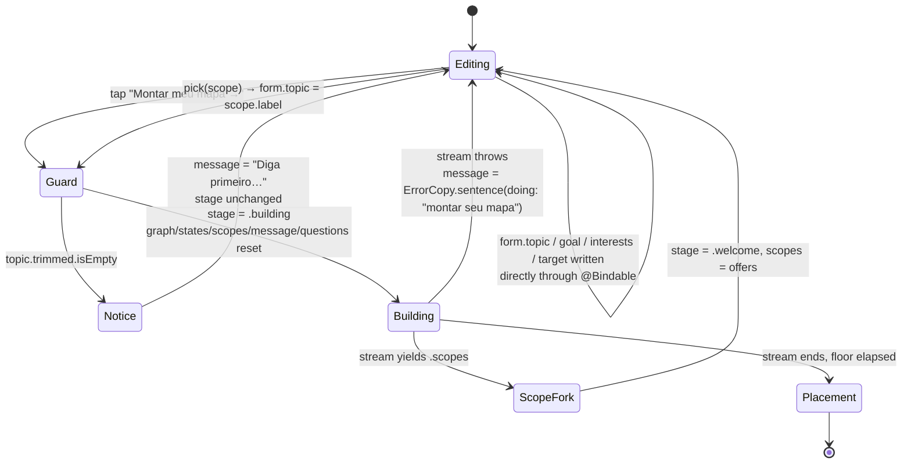
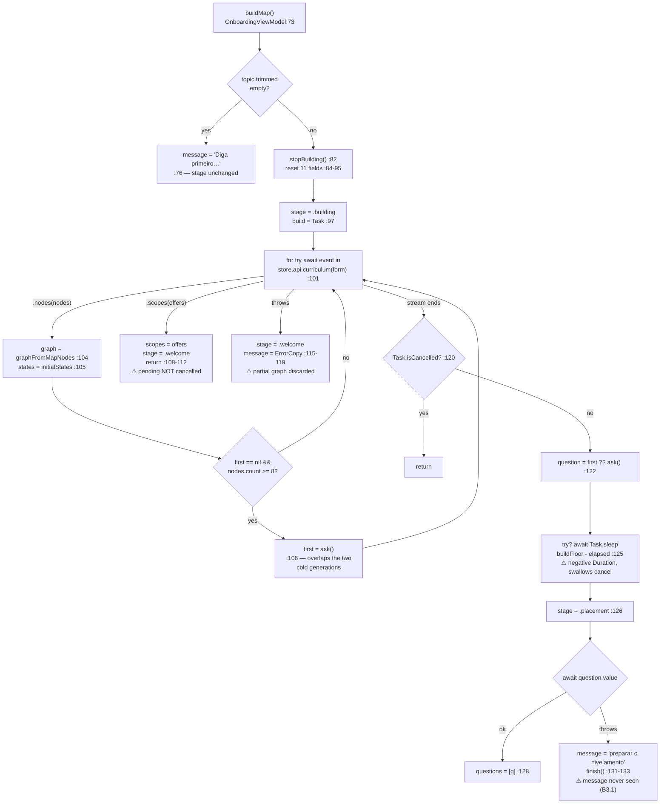
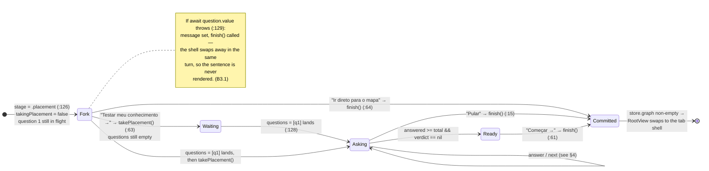
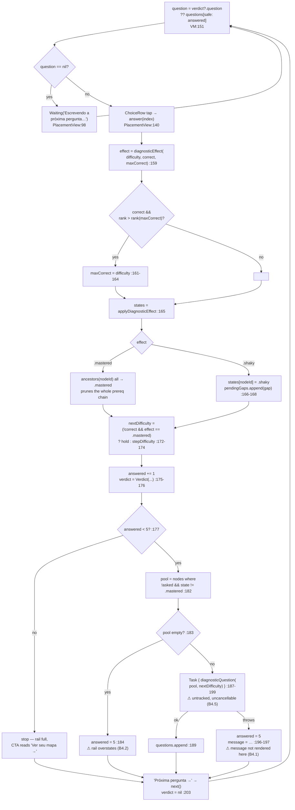
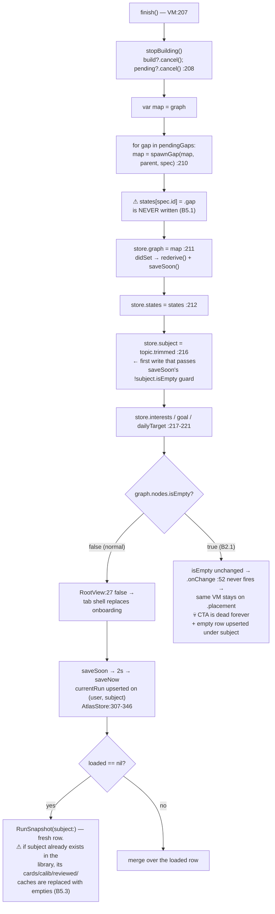

# Atlas iOS — Onboarding audit (screens 5–8)

**Scope**: `Features/Onboarding/{WelcomeView,BuildingView,PlacementView,OnboardingViewModel}.swift`,
`Domain/{Diagnostic,Concept}.swift`, `Tests/AtlasKitTests/{DiagnosticTests,ConceptTests}.swift`.
Seams read for context: `Data/{AtlasAPI,Prompts,NDJSONStream,AtlasStore,RunSnapshot}.swift`,
`App/{RootView,LaunchViewModel}.swift`, `Core/{Components,Theme,Support}.swift`.
Web comparison: `components/atlas/useOnboarding.ts`, `components/onboarding/*`,
`lib/curriculum/{calibration,replan,types}.ts`, `lib/server/generate/map.ts`.

Every line of the seven required files was read. Findings are labelled
**confirmed** (provable from the code as written) or **suspected** (depends on a
runtime behaviour I could not execute here).

---

## Summary of the sharp edges

| #           | Finding                                                                                                                      | Severity | Status    |
| ----------- | ---------------------------------------------------------------------------------------------------------------------------- | -------- | --------- |
| B5.1        | Placement-diagnosed gap nodes are spawned with **no mastery state** — they paint grey/"Bloqueado", not red/"Lacuna"          | **High** | confirmed |
| B2.1 / B5.2 | `finish()` can commit an **empty graph**, which deadlocks the shell on the placement screen forever and upserts an empty row | **High** | confirmed |
| B5.3        | Re-onboarding an existing subject **silently destroys** that run's cards, calibration and cache                              | Medium   | confirmed |
| B3.1        | The "we couldn't prepare the placement" sentence is **unreachable** — set on a view model that is torn down in the same turn | Medium   | confirmed |
| B4.1        | A mid-placement writer failure is **silent on the screen where it happens**; the rail jumps 2/5 → 5/5 with no reason         | Medium   | confirmed |
| B2.2        | A stream that dies mid-flight **throws away every concept that landed** (AGENTS §Networking says keep it and offer a retry)  | Medium   | confirmed |
| B2.3        | A short-but-clean stream is committed as a finished map with the server's **provisional** (unsettled) layout                 | Medium   | confirmed |
| B1.1 / B1.2 | Goal grid and daily-target row **truncate at large Dynamic Type** and carry **no selected trait** for VoiceOver              | Medium   | confirmed |
| —           | **No test anywhere touches `OnboardingViewModel`**                                                                           | Medium   | confirmed |

Two things the audit specifically looked for and did **not** find: an off-by-one
in the segment counts (there is none — see §4), and a violation of
ios/AGENTS.md §Networking's _"never derive is-this-the-last-item from a streamed
array's length"_ in the placement (it is honoured — see §4). The map stream is
the one place completion is inferred from "the stream ended", but that payload
carries no total to read instead (§2, B2.3).

---

# 1 · Welcome — goal, interests, daily target

## Objective

Collect, on one scroll, everything the map generation needs: the topic (free
text), _why_ the learner is learning it (`GoalKind`, which the server turns into
map size and ordering), optional interests (which every later prompt draws
analogies from), and the daily minute target that becomes the streak's unit.
It is also where the two honest answers to a bad topic land — a scope fork when
the topic is a continent, and an error sentence when the build fails.

## How it works

`WelcomeView` is a `VStack` of a `ScrollView` over a single `Dock`
(`WelcomeView.swift:10–82`). It binds straight into the view model with
`@Bindable var onboarding` (`:6`) and writes `onboarding.form` fields directly —
`form.topic` (`:93`), `form.interests` (`:44`), `form.goal` (`:159`),
`form.target` (`:58`). `OnboardingForm` is a plain `Sendable` struct with
defaults `goal = .exam`, `target = 15`, `paretoPct = 20`
(`Domain/Diagnostic.swift:24–32`); `dailyTargets = [10, 15, 20, 30]` mirrors the
web's `DAILY_TARGETS` (`Diagnostic.swift:36` ↔ `lib/curriculum/calibration.ts:331`).

One private `pill(_:on:action:)` (`:164–181`) draws every selectable control on
the screen — the four goals in a 2×2 `Grid` (`:31–40`) and the four targets in an
`HStack` (`:56–62`). Selection is expressed purely as colour + weight:
`Palette.accent`/`accentBg` and `.semibold` when on, `Palette.inkSoft`/`card` and
`.regular` when off.

The CTA calls `onboarding.buildMap()` (`:76`). `buildMap` trims the topic and
guards it (`OnboardingViewModel.swift:74–78`); an empty topic writes
`message = "Diga primeiro o que você quer aprender."` and returns without
changing stage, so the notice (`WelcomeView.swift:134–144`) appears under the
field. Two `.animation(…, value:)` modifiers on `scopes.count` and `message`
(`:86–87`) are what make both answers slide in under the topic rather than
appear.

The scope fork: when the curriculum stream answers `.scopes` instead of
`.nodes`, the build task sets `scopes` and returns the stage to `.welcome`
(`OnboardingViewModel.swift:108–112`), which re-renders this screen with
`scopeOffers` (`WelcomeView.swift:111–132`) above the goal grid. Tapping one
calls `pick(_:)` (`OnboardingViewModel.swift:139–143`), which makes the label the
topic and immediately re-enters `buildMap()`.



## User value

One screen, no wizard: the learner says what they want and how much a day is,
and gets a map built for _that_ purpose — an exam map is ordered and sized
differently from a Pareto map, and the interests string is what makes the later
analogies theirs. The scope fork is the genuinely good bit: "Cálculo" comes back
as three territories instead of an unusable 200-concept map, and picking one
rebuilds in a tap.

## Bugs

**B1.1 — Goal and target labels truncate at large Dynamic Type.**
`WelcomeView.swift:164–181` (`pill`). Confirmed. Medium.
`.lineLimit(1)` + `.minimumScaleFactor(0.85)` inside a fixed `minHeight: 48` and
a fixed 2×2 `Grid` (`:31–40`) / 4-up `HStack` (`:56–62`). `Font.atlas` is
`Font.custom(_:size:)` (`Theme.swift:52–54`), which _does_ scale with Dynamic
Type — which is exactly the problem: at AX3 and above `"Construir um projeto"`
scales down to 85% and then truncates with an ellipsis, and the four
`"%lld min"` pills get roughly 72pt of width each on a 393pt screen and become
`"10…"`. Neither container reflows to one column. ios/AGENTS.md §Touch: _"Dynamic
Type is honoured … a screen that breaks at the largest size is not done."_

**B1.2 — Selection is invisible to VoiceOver.**
`WelcomeView.swift:164–181`. Confirmed. Medium.
The pills are bare `Button`s. There is no `.accessibilityAddTraits(.isSelected)`,
no `accessibilityValue`, and no radio-group semantics; the only carriers of
"this one is chosen" are `Palette.accent` and `.semibold`. A VoiceOver user hears
four indistinguishable buttons and cannot learn or confirm their goal or their
daily target. The web sets `aria-pressed={form.goal === key}`
(`components/onboarding/WelcomeScreen.tsx:313`).

**B1.3 — Pareto share is collected nowhere and hard-coded to 20.**
`Domain/Diagnostic.swift:29`, `Data/AtlasAPI.swift:155`. Confirmed. Low.
`paretoPct` defaults to 20, `curriculum(_:)` faithfully sends it only for the
Pareto goal — and nothing on any screen can change it. The web offers
`PARETO_LEVELS = [20, 50, 80]` (`lib/curriculum/calibration.ts:334`,
`WelcomeScreen.tsx:327–336`) and the server sizes the whole map off the value
(`mapNodeBounds`, `lib/server/generate/map.ts:236–241`: 20% → ~7 concepts,
80% → ~17). Failure scenario: a learner picks the Pareto goal expecting the
80/20 dial the product promises and always receives the smallest possible map.
The iOS label `"Top 20%"` (`Diagnostic.swift:15`) additionally hard-codes the
number into copy, so making the control real also means changing a catalogue key.

**B1.4 — `examDate` is not collected at all.**
`Domain/Diagnostic.swift:24–32`. Confirmed. Low.
The web's form carries an ISO exam date (`lib/curriculum/calibration.ts:341–343`,
`WelcomeScreen.tsx:343–361`) and the pacing surface shows a countdown from it.
`OnboardingForm` on iOS has no such field, so an "exam" run on the phone can
never show a deadline, and a run built on the phone loses the field the browser
would have drawn.

**B1.5 — A vertical `TextField` with `.submitLabel(.done)` inserts newlines into
the run's primary key.** `WelcomeView.swift:93–97`,
`OnboardingViewModel.swift:74`, `:216`. Suspected. Low.
`axis: .vertical` makes Return insert a newline; `.submitLabel(.done)` only
relabels the key and there is no `.onSubmit`, so a learner who taps "Done"
mid-topic gets `"Cálculo\nI"`. `trimmingCharacters(in:.whitespacesAndNewlines)`
strips only the ends, so the interior newline reaches `store.subject` — which
`finish()`'s own comment (`:213–215`) identifies as _half the row's primary key_,
matched against `form.topic.trim()` written by the browser. The browser would
open a second row it never joins.

**B1.6 — The keyboard-dismiss on submit misses the interests field.**
`WelcomeView.swift:7`, `:75`, `:96`. Confirmed. Low.
`@FocusState private var editing` is bound only to `topicField`. `editing = false`
in the CTA action is a no-op when the focused field is "Seus interesses", so the
keyboard stays up over the transition to `BuildingView`.

## Must-improve (ranked)

1. **Make the grid reflow and stop truncating** — `WelcomeView.swift:31–40`,
   `:56–62`, `:164–181`. Read `@Environment(\.dynamicTypeSize)`; at
   `.isAccessibilitySize` stack the goal grid to one column and the target row to
   a 2×2, and drop `.lineLimit(1)`/`.minimumScaleFactor` in favour of
   `.fixedSize(horizontal: false, vertical: true)` with `minHeight: Metrics.tap`.
2. **Give the pills selection semantics** — `WelcomeView.swift:164–181`. Add
   `.accessibilityAddTraits(on ? .isSelected : [])` inside `pill`, and wrap each
   group in `.accessibilityElement(children: .contain)` with a label. One edit
   fixes both groups because there is one `pill`.
3. **Add the Pareto share control** — `WelcomeView.swift:30–41` +
   `Diagnostic.swift:29`. Mirror `PARETO_LEVELS`; reveal the row only when
   `form.goal == .pareto`, exactly as `WelcomeScreen.tsx:321`. Change the goal
   label off the hard-coded `"Top 20%"` in the same change.
4. **Collect `examDate`** — `Diagnostic.swift:24–32` and a `DatePicker` under the
   goal grid when `form.goal == .exam`, so the field round-trips through
   `RunSnapshot` instead of being dropped on the phone.
5. **Fix the topic field's submit** — `WelcomeView.swift:93–97`. Either
   `.onSubmit { editing = false }` with `axis` dropped, or keep vertical and
   collapse interior whitespace in `buildMap` before it becomes `subject`.

---

# 2 · Map building — the curriculum stream

## Objective

Turn the form into a concept graph the learner _watches assemble_. It is the one
generation in the app that can never be warmed (its node ids do not exist until
it returns), so the design spends the wait rather than hiding it: concepts land
one at a time behind a centred progress line with an honest count, over a
deliberate 2.6s floor.

## How it works

`buildMap()` (`OnboardingViewModel.swift:73–136`) is the whole machine.

1. **Reset.** `stopBuilding()` cancels any previous `build` and `pending` task
   (`:82`, `:234–237`), then eleven fields are cleared (`:84–95`): `graph`,
   `states`, `scopes`, `message`, `questions`, `answered`, `verdict`,
   `takingPlacement`, `pendingGaps`, `asked`, and the two ladder variables
   `nextDifficulty = .medium` / `maxCorrect = nil`. This is the iOS equivalent of
   the web's `buildIdRef` token (`useOnboarding.ts:119`) — cancellation instead of
   a generation counter.
2. **Stream.** `build = Task { [form] in … }` iterates
   `store.api.curriculum(form)` (`:101`). `AtlasAPI.curriculum`
   (`AtlasAPI.swift:147–185`) builds the context (`topic`, `goal`, `language`,
   plus `paretoPct` only for Pareto), calls `stream("curriculum", …)`, and
   **replaces frames by index, never appends** (`:168–169`) — because the
   server's settling pass re-sends every slot once the column heights are known
   (`lib/server/generate/map.ts:447–469`). Partial frames and frames with no `i`
   are skipped (`:165`).
3. **Paint.** Each `.nodes` event rebuilds the whole graph:
   `graph = graphFromMapNodes(nodes)` and `states = initialStates(graph)`
   (`:104–105`). `graphFromMapNodes` (`Concept.swift:84–94`) drops prereq edges
   pointing outside the list, which is exactly what lets it run mid-stream —
   pinned by `aPartialMapIsStillARealGraph` (`DiagnosticTests.swift:47–65`).
   `BuildingView` reads `onboarding.graph` through `MapBackdrop`
   (`BuildingView.swift:10`, `:52–71`) which fits the canvas to whatever has
   landed, so the map grows in place instead of jumping a column at a time.
4. **Overlap.** The first placement question fires from _inside_ the stream loop
   the moment `nodes.count >= poolMinimum` (8) (`:106`, `:69`), so the two cold
   generations run concurrently. Exact mirror of `DIAGNOSTIC_POOL_MIN`
   (`useOnboarding.ts:45`, `:240–241`).
5. **Fork or fail.** `.scopes` sets `scopes` and returns to `.welcome`
   (`:107–112`). A thrown stream sets `.welcome` + `ErrorCopy.sentence(…, doing:
"montar seu mapa")` (`:115–119`).
6. **Floor.** After the loop, `guard !Task.isCancelled` (`:120`), then
   `first ?? ask()` covers a short map where the overlap never fired (`:122`),
   then `try? await Task.sleep(for: Self.buildFloor - opened.duration(to: .now))`
   (`:125`) — `buildFloor = 2.6s` (`:63`) is a floor, not a target, per SPEC §2
   and `ios/PLAN.md` phase 4.
7. **Open.** `stage = .placement` (`:126`) _before_ awaiting the question, so the
   fork opens on its own and the question lands behind it (`:123–124`, `:128`).

Note on the seam: neither `curriculum` nor `diagnosticQuestion` is in
`Prompts.streamed` (`Prompts.swift:168–175` ports only `consume` and `socratic`),
so both onboarding generations go to `/api/generate` on the deployed web app and
require a bearer token. That matches ios/AGENTS.md §_Where a call goes_.



## User value

The wait becomes the product's first promise kept: the learner sees _their_
territory being drawn, foundations first, with a real count ("14 conceitos
posicionados") rather than a bar that stalls at 90%. The 2.6s floor makes a fast
generation still read as "this was built for me". The overlap means the placement
question is usually already written by the time the fork opens, so the two cold
calls cost roughly one wait rather than two.

## Bugs

**B2.1 — `finish()` can commit an empty graph, deadlocking the shell.**
`OnboardingViewModel.swift:207–222`, `RootView.swift:27`, `:52–54`,
`LaunchViewModel.swift:29–31`. Confirmed. **High.**

`finish()` has no non-empty guard. The shell decides between onboarding and the
tab shell on `store.graph.nodes.isEmpty` (`RootView.swift:27`), and rebuilds the
machine only from `.onChange(of: store.graph.nodes.isEmpty)` (`:52–54`) — a
_transition_.

Failure scenario, step by step: the curriculum stream returns 200 with an empty
or truncated body (or every frame is skipped by the `partial != true, let index`
guard at `AtlasAPI.swift:165`). `bytes.lines` yields nothing,
`continuation.finish()` runs with no error (`NDJSONStream.swift:35`), so the
`for try await` at `:101` completes normally with `graph.nodes == []`. `first`
is nil, so `ask()` fires with an empty pool (`:122`, `:226–227`); the server
rejects it, the catch at `:129` runs, `message` is set, and **`finish()` is
called** (`:133`). `store.graph = ConceptGraph()` — still empty, so
`graph.nodes.isEmpty` does not _change_, `restartOnboarding` never fires, and the
same `OnboardingViewModel` stays parked at `stage == .placement` showing "Seu
mapa está pronto." Every subsequent tap on "Começar →" / "Ir direto para o mapa"
calls `finish()` again and does nothing. The learner is stranded with no back
button and no tab bar.

Worse, `store.subject` _is_ written (`:216`), which satisfies `saveSoon`'s
`!subject.isEmpty` guard (`AtlasStore.swift:308`) and upserts a row with an empty
map under that subject — a junk entry in "Seus mapas".

The class doc at `OnboardingViewModel.swift:8–10` states the opposite invariant:
_"Nothing half-built reaches the store, so the shell shows onboarding for exactly
as long as there is no map."_ The web guards this explicitly — `useOnboarding.ts:168–174`:
_"the save is gated on a non-empty graph."_

**B2.2 — A stream that dies mid-flight throws away everything that landed.**
`OnboardingViewModel.swift:115–119`, `AtlasAPI.swift:179–181`,
`NDJSONStream.swift:30–32`. Confirmed. Medium.
`NDJSONStreamer` correctly turns the server's `__error` frame into a thrown
`AtlasError(code: "upstream", status: 200)`. The build's catch then sets
`stage = .welcome` and a sentence — and nothing offers to keep the 18 of 20
concepts already on screen. ios/AGENTS.md §Networking: _"A frame named `__error`
means the stream died after committing to a 200: keep what landed and offer a
retry."_ Half the rule is implemented; the half that matters to the learner is
not. Failure scenario: a 40-second generation dies at concept 18, and the learner
pays for the whole thing again from zero.

**B2.3 — A short-but-clean stream is committed as a finished map, with the
server's provisional layout.** `OnboardingViewModel.swift:120–128`. Confirmed. Medium.
`lib/server/generate/map.ts` enforces `bounds.min` only on the non-streaming
fallback (`:122`); the streaming generator yields whatever validated and then
re-yields the settled layout at the end (`:447–469`). A stream that produces 3
concepts and closes gracefully therefore _completes_ — no error to catch — and
iOS treats "the loop ended" as "the map is complete". The fork then says "Seu
mapa está pronto." over a 3-node map whose `y` values are still the provisional
`440 + i*140` (columns never centred). The payload carries no total and no
"settled" marker for the client to read instead, so this cannot be fixed on the
client alone — but the client can at least refuse to open the fork below a
plausible minimum.

**B2.4 — The scope and error exits leak the in-flight first question.**
`OnboardingViewModel.swift:108–112`, `:115–119`, `:48–51`. Confirmed. Low.
Both paths `return` without calling `pending?.cancel()`; only `stopBuilding()`
(`:234–237`) does, and it is reached only from the next `buildMap()` or from
`finish()`. The comment at `:48–51` states the exact intent being violated: _"a
question nobody will ever see is a model call nobody is paying for on purpose."_
Failure scenario: a topic that streams 8 concepts and _then_ answers `.scopes`
fires and abandons one paid `diagnosticQuestion` call.

**B2.5 — Negative sleep duration and a cancellation swallowed by `try?`.**
`OnboardingViewModel.swift:125`. Suspected. Low.
`Self.buildFloor - opened.duration(to: .now)` is negative whenever generation
outran 2.6s, which is the common case. The web clamps: `Math.max(0, BUILD_MS - …)`
(`useOnboarding.ts:194`). More concretely, `try?` swallows a genuine
`CancellationError`: a build cancelled _during_ the floor still falls through to
`:126–134`, sets `stage = .placement` and can call `finish()` for an abandoned
run. The `guard !Task.isCancelled` at `:120` sits before the sleep and does not
cover it. There is no UI path into that window today (BuildingView has no back
affordance), which is the only reason this is not a live bug.

**B2.6 — The build beat announces nothing to VoiceOver.**
`BuildingView.swift:22–32`. Confirmed. Low.
`ProgressView()` is indeterminate and unlabelled, and the count is a plain
`Text(verbatim:)` with `.contentTransition(.numericText())` — a visual
transition, not an announcement. There is no `.accessibilityElement`, no
`accessibilityLabel`, and no live region, so a VoiceOver user gets silence for
the entire build. The web marks the same beat `role="status" aria-live="polite"`
(`BuildingOverlay.tsx:43–44`).

**B2.7 — One static line where the web narrates.** `BuildingView.swift:14`.
Confirmed. Cosmetic drift.
iOS shows "Mapeando os pré-requisitos…" for the whole build. The web rotates four
lines on a 1.4s timer (`BuildingOverlay.tsx:11–26`, `:36–39`) with the reasoning
written down: _"the wait is real, so the copy should feel like it's narrating
work, not stalling on one sentence."_

## Must-improve (ranked)

1. **Guard `finish()` on a non-empty graph** — `OnboardingViewModel.swift:207`.
   `guard !graph.nodes.isEmpty else { message = …; stage = .welcome; return }`.
   This closes B2.1 and B5.2 in one line and restores the invariant the class doc
   already claims. Pair it with a floor (`graph.nodes.count >= 5`, matching
   `mapNodeBounds().min`) to close B2.3.
2. **Keep the partial map and offer a retry** — `OnboardingViewModel.swift:115–119`.
   On a throw _after_ nodes have landed, stay on `.placement` with a "continuar
   com o que chegou" / "tentar de novo" pair instead of dropping to `.welcome`
   with the graph silently intact but unreachable.
3. **Cancel `pending` on both early exits** — `OnboardingViewModel.swift:111`,
   `:118`. Call `pending?.cancel()` (or `stopBuilding()`) before each `return`.
4. **Clamp the floor and honour cancellation** —
   `OnboardingViewModel.swift:125`. `let left = Self.buildFloor - opened.duration(to: .now)`,
   `if left > .zero { try await Task.sleep(for: left) }` with a real `try` inside
   the do-block so cancellation exits instead of falling through.
5. **Announce the build** — `BuildingView.swift:12–33`. Put the count into an
   `.accessibilityLabel` on a container marked
   `.accessibilityAddTraits(.updatesFrequently)`, and rotate the serif line the
   way the web does.

---

# 3 · Direct-or-questions fork

## Objective

Make the placement genuinely optional at the moment it costs something. The map
is the product; the placement is a nice-to-have that prunes what the learner
already knows. The fork must therefore open _without waiting_ on the question,
and it must not punish the learner who wants to go straight in.

## How it works

`PlacementView` is one screen in three states (`PlacementView.swift:22–26`):

- `takingPlacement && !placementDone` → `questions`
- otherwise → `fork`, which serves double duty as the _opening_ fork and the
  _map-is-ready_ closing beat, branching on `onboarding.placementDone`
  (`:43–45`, `:60–65`).

The three view-model reads that drive it:

```swift
public var total: Int { max(diagnosticCount, questions.count) }                     // :149
public var question: DiagnosticQuestion? { verdict?.question ?? questions[safe: answered] }  // :151
public var placementDone: Bool { takingPlacement && answered >= total && verdict == nil }    // :152
```

`takePlacement()` (`:147`) only flips `takingPlacement`; nothing is asked until
the fork is answered, which is what makes the opt-in real. `finish()` is bound to
three affordances — "Ir direto para o mapa" (`:64`), "Pular" in the top bar
(`:15`), and "Começar →" after the placement ends (`:61`).

Critically, `stage = .placement` is set _before_ `await question.value`
(`OnboardingViewModel.swift:126–128`), so the fork is on screen and interactive
while question 1 is still being written. The comment at `:123–124` states the
reason: _"a learner who wants the map should not wait on a test they are about to
skip."_



## User value

Nobody is held hostage by a diagnostic. The learner who wants to start now taps
once and is on their map; the learner who wants the pruning gets it, and can
still bail at any question via the top-bar "Pular". The fork's own copy is
honest about the trade — five questions that "podam o que você já sabe e acendem
sua fronteira real".

## Bugs

**B3.1 — The placement-failure sentence is unreachable.**
`OnboardingViewModel.swift:129–134`, `PlacementView.swift:48–53`,
`RootView.swift:27`. Confirmed. Medium.
When question 1 fails, the catch sets
`message = ErrorCopy.sentence(…, doing: "preparar o nivelamento")` and then calls
`finish()`. `finish()` writes a non-empty `store.graph`, `RootView`'s condition at
`:27` goes false, and the onboarding view — the only thing that renders `message`
(`PlacementView.swift:48–53`) — is torn down in the same runloop turn. The
learner is dropped onto the map with no explanation of why the promised placement
never happened. The comment at `OnboardingViewModel.swift:130–131` says exactly
what was intended: _"Open it, but say why the step is missing."_ The web survives
this because its equivalent is a toast that outlives the screen change
(`showError(err, { context: "placement" })`, `useOnboarding.ts:277`); iOS has no
toast channel, so the sentence has nowhere to live.

**B3.2 — Skipping the placement records a spurious failure.**
`OnboardingViewModel.swift:128–134`, `:234–237`. Confirmed. Low.
Tapping "Ir direto para o mapa" while question 1 is in flight calls `finish()` →
`stopBuilding()` → `pending?.cancel()` _and_ `build?.cancel()`. The build task is
suspended on `try await question.value` (`:128`), which now throws
`CancellationError`. The catch is not cancellation-aware, so it writes an error
sentence for a deliberate user action and calls `finish()` a second time.
`finish()` happens to be idempotent (`var map = graph` is rebuilt each call and
`spawnGap` is idempotent per id, `Concept.swift:114–116`), so the only damage is
the false message and one redundant `saveSoon` — but the pattern is wrong and
becomes visible the moment B3.1 is fixed.

**B3.3 — The view computes what the view model should own.**
`PlacementView.swift:43–46`, `:74`, `:159–176`. Confirmed. Low.
The segment rail is mapped in `body` (`:74`), the fork's body copy is a ternary
in `body` (`:43–45`), and the whole verdict paragraph is assembled in a `private
func` on the view (`:159–176`). ios/AGENTS.md §MVVM names two of these three
literally: _"Segment rails, greetings, queue minutes and error sentences are
prepared in the model, not mapped per redraw."_

**B3.4 — The "your map is ready" beat is silent for VoiceOver.**
`PlacementView.swift:35–68`. Confirmed. Low.
`MapBackdrop` (`:37`) is a decorative `Canvas` with no `.accessibilityHidden(true)`,
and nothing announces that the build finished — the screen simply changes under a
VoiceOver user with focus wherever it was.

## Must-improve (ranked)

1. **Give the failure sentence somewhere to live** —
   `OnboardingViewModel.swift:131–133`. Either delay the `finish()` behind an
   acknowledged notice on the fork, or add the app's missing toast channel and
   route `ErrorCopy` sentences through it (the web's `showError`, three call
   sites in `useOnboarding.ts`, all suffer the same problem here).
2. **Treat cancellation as cancellation** — `OnboardingViewModel.swift:129`.
   `catch is CancellationError { return }` before the general catch, so a
   deliberate skip is not logged as a failure.
3. **Move the derived copy into the model** — `PlacementView.swift:43–46`,
   `:74`, `:159–176` → `OnboardingViewModel`. Expose `rail: [Color?]`,
   `forkBody: LocalizedStringKey`, `verdictKicker`/`verdictBody`. This is the
   convention _and_ it removes the per-redraw work from a screen that animates on
   every answer.
4. **Hide the backdrop from the accessibility tree and announce the beat** —
   `PlacementView.swift:37`.

---

# 4 · Adaptive placement questions

## Objective

Five ENEM-style adaptive probes that write _real_ mastery into the map before the
learner has done anything: a correct answer prunes the concept and its whole
prerequisite chain; a genuine miss marks the concept shaky and queues a gap
sub-concept; a miss that reads as a slip is discounted to a prune. Each question's
difficulty is chosen from how the last was answered, so they cannot be batched.

## How it works

The domain half is a faithful, well-tested mirror of
`lib/curriculum/calibration.ts`:

- `stepDifficulty` (`Diagnostic.swift:75–79`) ↔ `calibration.ts:251–260`.
- `diagnosticEffect` (`Diagnostic.swift:85–95`) ↔ `calibration.ts:276–284` —
  _strictly_ easier than the hardest correct answer counts as a slip.
- `applyDiagnosticEffect` (`Diagnostic.swift:102–115`) ↔ `calibration.ts:295–308`.
- `ancestors` (`Diagnostic.swift:118–128`) is a line-for-line mirror of
  `ancestorsOf` (`calibration.ts:362–377`), including the reverse-index build and
  the seed set containing `id` itself.
- `diagnosticCount = 5` (`Diagnostic.swift:53`) ↔ `DIAGNOSTIC_COUNT`
  (`calibration.ts:226`).

`DiagnosticTests.swift` pins the two rules that would otherwise lie silently:
chain pruning on a correct answer and node-only marking on a miss
(`:8–28`), and the ladder plus the slip discount (`:30–41`).
`ConceptTests.swift:7–31` pins the frontier derivation those writes feed.

The loop lives in `answer(_:)` (`OnboardingViewModel.swift:156–200`), and every
effect runs in the handler — the same discipline as the web's `answerDiagnostic`,
whose comment (`useOnboarding.ts:359–360`) explains why (React may re-invoke
updaters; here it is so the pool below filters on post-answer truth):

1. Guard: `verdict == nil, let question = questions[safe: answered]` (`:157`).
2. `effect = diagnosticEffect(question.difficulty, correct:, maxCorrect:)`
   (`:159`) — computed **before** `maxCorrect` is updated (`:161–164`), matching
   the web exactly.
3. `states = applyDiagnosticEffect(states, effect, nodeId:, edges: graph.edges)`
   (`:165`).
4. `if effect == .shaky, let gap = question.gap { pendingGaps.append(…) }`
   (`:166–168`) — queued, not spawned, until `finish()`.
5. `asked.insert(question.nodeId)` (`:169`), a `Set` because the pool filter asks
   it once per node after every answer (`:53–55`).
6. Ladder: a discounted miss **holds** the level rather than stepping down
   (`:172–174`) ↔ `useOnboarding.ts:395–398`.
7. `answered += 1`, `verdict = Verdict(...)` (`:175–176`).
8. `guard answered < diagnosticCount else { return }` (`:177`).
9. Pool = `graph.nodes.filter { !asked.contains($0.id) && states[$0.id] != .mastered }`
   (`:182`) ↔ `useOnboarding.ts:410–414`.
10. Empty pool → `answered = diagnosticCount` and stop (`:183–186`).
11. Otherwise fetch the next question at `nextDifficulty` (`:187–199`); a failure
    ends the placement and sets `message`.

`next()` (`:203`) is a single `verdict = nil`; `question` (`:151`) then falls
through to `questions[safe: answered]`, which is `nil` while the writer is still
writing — rendered as `Waiting("Escrevendo a próxima pergunta…")`
(`PlacementView.swift:98`).



### Termination and off-by-one — checked, clean

**Termination.** Four independent exits, all reachable: `answered >= diagnosticCount`
(`:177`), an empty pool (`:183–186`), a fetch failure (`:196`), and the top-bar
"Pular" which is visible for the entire duration of
`takingPlacement && !placementDone` (`PlacementView.swift:14–19`). The loop cannot
hang, and a hung (as opposed to rejected) fetch still leaves the escape hatch —
which is exactly the trap the web calls out at `DiagnosticPanel.tsx:432–434`.

**Off-by-one on segment counts — none found.** The append at `:189` is gated by
`answered < diagnosticCount` (`:177`), and `answered` is 1…4 at that gate, so
`questions.count` maxes at exactly 5. `total = max(diagnosticCount, questions.count)`
(`:149`) is therefore always 5 in a real run, matching
`Math.max(expected ?? questions.length, questions.length)` (`DiagnosticPanel.tsx:112`).
The rail lights `$0 < answered` (`PlacementView.swift:74`) and the final CTA
branches on `answered >= total` (`:103`) — both consistent with the web.
`placementDone` additionally requires `verdict == nil` (`:152`), which is what
makes the learner tap "Ver seu mapa →" _then_ "Começar →" rather than skipping the
last verdict — deliberate, and identical to `done` at `DiagnosticPanel.tsx:113`.

**"Never derive is-this-the-last-item from array length" (ios/AGENTS.md §Networking)
— respected here.** `total` reads the explicit `diagnosticCount` constant, never
`questions.count` alone; the "last question" test is `answered >= total`, not
`answered == questions.count - 1`; and `question` indexes with `[safe:]`
(`Support.swift:9–11`) precisely so indexing past the end is a wait, not a crash.
`Diagnostic.swift:50–52` writes the rule down. The map stream is the one place the
app _does_ infer completion from the stream ending (§2, B2.3) — but that payload
carries no total to read instead, so the rule has nothing to point at there.

## User value

The learner spends 90 seconds and their map is honest from day one: everything
they already own goes green, including everything it stands on, and the two or
three concepts they fumbled become their real frontier instead of a generic
"start at the beginning". The slip discount is the humane part — acing a hard
question then fumbling an easy one does not cost them a false gap. The verdict
copy tells the exact truth about the write, including the awkward case ("nada foi
adicionado ao seu mapa").

## Bugs

**B4.1 — A mid-placement writer failure is silent on the screen where it happens.**
`OnboardingViewModel.swift:194–198`, `PlacementView.swift:48–53`, `:22–26`.
Confirmed. Medium.
The catch sets `answered = diagnosticCount` _and_ `message`. But `message` is
rendered only inside `fork` (`:48–53`), and `fork` is hidden while
`takingPlacement && !placementDone`. Failure scenario: question 4 fails to
generate; the learner sees the rail jump from 2/5 to 5/5 and the CTA silently
change to "Ver seu mapa →" with no explanation. The sentence appears one tap
later, underneath the _success_ headline "Seu mapa está pronto." and the body
"Podamos o que você já domina e acendemos sua fronteira" — which reads as a
contradiction. The comment at `:194–196` states the intent being missed: _"say
so, rather than looking like the app decided it had learned enough about them."_

**B4.2 — `answered = diagnosticCount` overstates the rail.**
`OnboardingViewModel.swift:184`, `:196`; `PlacementView.swift:74`.
Confirmed. Low.
Both early exits jam `answered` to 5, so `SegmentBar` lights all five segments
after two real answers. Shared with the web (`useOnboarding.ts:418`, `:439`), but
it is still a false statement about what the learner did, on the one control whose
whole job is saying "you moved" (`Components.swift:310–311`).

**B4.3 — No retry on the first question.**
`OnboardingViewModel.swift:224–231`. Confirmed. Low.
The web retries once — `const pending = fetchOne().catch(fetchOne)`
(`useOnboarding.ts:220`) — with the reasoning written down: _"This call is never
cached (unlike every other generation, its node ids don't exist until the map
above resolves), so it fails more often than a warmed call would — one retry
before giving up on the learner's very first question."_ `ask()` has none, so a
single flake skips the entire placement, and (via B3.1) does so without a word.

**B4.4 — `DiagnosticQuestion.note` is decoded and never rendered.**
`Diagnostic.swift:60`; no render site anywhere in `ios/AtlasKit/Sources`
(grep for `.note` finds only `ScopeOffer.note` at `WelcomeView.swift:120`).
Confirmed. Low.
The web draws it under the options (`DiagnosticPanel.tsx:354–363`). It is the one
line that tells the learner what the question is actually probing, and the model
is being asked to write it on every call.

**B4.5 — The follow-up question `Task` is untracked and uncancellable.**
`OnboardingViewModel.swift:187–199`, `:234–237`. Confirmed. Low.
`stopBuilding()` cancels `build` and `pending` only. Tapping "Pular" mid-placement
leaves a `diagnosticQuestion` request running whose result is appended to a view
model the shell has already replaced (`LaunchViewModel.swift:29–31` builds a fresh
one). The web guards the equivalent with its build token
(`useOnboarding.ts:433`, `:438`). Same class of waste the file's own comment at
`:48–51` says it exists to prevent.

**B4.6 — No spoken progress; "pergunta i de N" is specified but never rendered.**
`PlacementView.swift:74`, `Diagnostic.swift:50–52`. Confirmed. Low.
`Diagnostic.swift:51–52` justifies the fixed count by saying _"both the rail and
'pergunta i de N' need the total before the last one exists"_ — but no surface
ever renders that sentence, and `SegmentBar` (`Components.swift:298–314`) is
unlabelled `Capsule`s. A VoiceOver user gets no sense of where they are in the
five questions, and no sighted user gets a number either.

**B4.7 — A malformed `correctIndex` grades every answer wrong and spawns a gap.**
`PlacementView.swift:148–152`, `:163`; `OnboardingViewModel.swift:41`.
Confirmed. Informational (model-quality dependent).
`:163` correctly guards the _answer label_ with `[safe:]`, and the comment there
says _"say the rest and leave the answer out rather than trapping."_ But
`Verdict.correct` (`:41`) and `mark(_:_:)` (`:150`) compare against
`question.correctIndex` directly, so an out-of-range index makes every option
wrong, marks nothing green, writes `.shaky`, and queues a gap the learner never
earned. Not a crash — but a question the model malformed becomes a guaranteed
false gap on the map.

## Must-improve (ranked)

1. **Render `message` on the questions screen** — `PlacementView.swift:72–115`.
   Hoist the amber notice out of `fork` so it sits above the rail in both
   branches. One move fixes B4.1.
2. **Retry the first question once** — `OnboardingViewModel.swift:224–231`.
   Mirror `fetchOne().catch(fetchOne)`; this is the single highest-yield change
   for placement completion rate, and the web has already paid for the lesson.
3. **Show `question.note`** — `PlacementView.swift:86` (under `options`). It costs
   one `Text(verbatim:)` and recovers a field the model already writes on every
   call.
4. **Stop the rail from lying** — `OnboardingViewModel.swift:184`, `:196`.
   Track `asked.count` (or a separate `planned` value) for the rail rather than
   reusing `answered` as both the cursor and the terminator; light only the
   segments actually answered and dim the rest.
5. **Track the follow-up task** — `OnboardingViewModel.swift:187`. Assign it to a
   stored `next: Task<Void, Never>?` and cancel it in `stopBuilding()`.
6. **Validate `correctIndex` on decode** — `Diagnostic.swift:57–68`. A custom
   `init(from:)` that rejects `correctIndex` outside `opts.indices` turns B4.7
   into a normal generation failure (which the retry above then covers) instead of
   a false gap written into the learner's map.
7. **Label the rail** — `PlacementView.swift:74`:
   `.accessibilityElement()` + `.accessibilityLabel("Pergunta \(answered + 1) de \(total)")`,
   prepared in the view model per §3 B3.3.

---

# 5 · Commit-to-store at `finish()`

## Objective

End onboarding with exactly one write. Everything the run needs — the graph, the
mastery the placement wrote, the gap nodes its misses split out, the subject, the
interests, the goal and the daily target — lands on `AtlasStore` together, so the
shell shows onboarding for exactly as long as there is no map and the map screen
never paints a stream in progress.

## How it works

```swift
public func finish() {                                    // :207
    stopBuilding()                                        // :208
    var map = graph
    for gap in pendingGaps { map = spawnGap(map, parentId: gap.parent, gap.spec) }  // :210
    store.graph = map                                     // :211
    store.states = states                                 // :212
    store.subject = form.topic.trimmingCharacters(...)    // :216
    store.interests = form.interests                      // :217
    store.goal = form.goal                                // :220
    store.dailyTarget = form.target                       // :221
}
```

Each of those is a `didSet` on `AtlasStore` that calls `saveSoon()`
(`AtlasStore.swift:14–19`, `:41–42`); `graph` and `states` additionally call
`rederive()` (`:124–131`), which recomputes `display`, `frontier` and
`masteredCount` in one pass. `saveSoon` is guarded by `!quiet, signedIn,
!subject.isEmpty` (`:308`) — so the first five writes are no-ops for persistence
(subject is still `""` on a fresh run) and the `subject` write at `:216` is what
actually schedules the upsert, two seconds later, of the whole `currentRun`
(`:284–301`).

The subject is trimmed deliberately (`:213–215`): it is half the run row's primary
key and the browser writes `form.topic.trim()`, so an untrimmed topic would open a
second row the web never joins.

`RootView` then reacts: `store.graph.nodes.isEmpty` goes false, the shell replaces
the onboarding flow (`RootView.swift:27–33`), and `.onChange` (`:52–54`) does
_not_ fire `restartOnboarding` because it only fires on `empty == true`.



## User value

The run is a row, and it exists from the first second on the map: close the app,
open the browser, and the map, the pruned mastery and the daily target are there.
Nothing half-built is ever visible — the learner never sees a map that is still
being written, and the goal and target they chose during onboarding are the ones
screens 12 and 13 read.

## Bugs

**B5.1 — Gap nodes are spawned into the graph with no mastery state.**
`OnboardingViewModel.swift:210`; `Concept.swift:114–124`, `:163–175`;
`NodeDetailViewModel.swift:18`, `:39–47`. Confirmed. **High.**

`spawnGap` writes `state: .gap` onto the `ConceptNode` value
(`Concept.swift:119`), but `NodeState` is _not_ read from the node — every
surface reads `store.display`, which is `displayStates(states, graph)`
(`AtlasStore.swift:113`, `:125`). `displayStates` starts from
`states[node.id] ?? .unknown` (`Concept.swift:170`) and, because `node.gap == true`,
refuses to promote it to `.frontier` (`:172`). With no `states` entry, the gap
resolves to `.unknown`.

Consequences, concretely:

- The node paints `NodeState.unknown.color` = `0xB3ADA2` grey instead of
  `NodeState.gap.color` = `0xC1574A` red (`Concept.swift:10`, `:15`).
- `NodeDetailViewModel.headline` returns `"Bloqueado"` instead of `"Lacuna"`
  (`:39–47`), and `state` is `.unknown` so nothing distinguishes it from a
  concept the learner simply has not reached.
- The map records no evidence at all that the placement diagnosed anything.

Failure scenario: the learner misses question 3 at a difficulty no easier than
their best correct answer, so `effect == .shaky` and `pendingGaps` receives the
spec (`OnboardingViewModel.swift:166–168`). The verdict promises "Vamos encaixar
`<tag>` no seu mapa" (`PlacementView.swift:171`), and the map shows an anonymous
grey dot.

This is unambiguously an omission, not a design choice: **both** other spawn
sites in the app write the state on the very next line —
`SessionViewModel.swift:84–85` and `:100–103` — and so does the web,
`useRunState.ts:274–275`:

```ts
setGraph((g) => spawnGap(g, parentId, spec));
setStates((prev) => ({ ...prev, [spec.id]: "gap" }));
```

**B5.2 — `finish()` commits an empty graph and deadlocks the shell.**
Same defect as **B2.1**; see §2 for the full walkthrough. Confirmed. **High.**
The one-line fix belongs here: `finish()` (`:207`) is the correct place for the
non-empty guard, because it is the only writer.

**B5.3 — Re-onboarding an existing subject silently destroys that run.**
`OnboardingViewModel.swift:216`; `AtlasStore.swift:261–267`, `:284–301`, `:338`.
Confirmed. Medium.
`finish()` writes `store.subject` with no check against `store.library`.
`newMap()` sets `loaded = nil` (`:265`), so `currentRun` builds a _fresh_
`RunSnapshot(subject: subject)` (`:285`) with empty `cards`, `calib`, `reviewed`
and `caches`, and `runs.save` upserts on the subject key. Failure scenario: a
learner has a three-week-old "Cálculo I" run with a review queue and cached
readings, taps "+ Novo mapa", and types "Cálculo I" again — the old row is
replaced. `AtlasStore.newMap`'s own comment (`:258–260`) assumes the opposite:
_"onboarding's `finish()` writes a **new** row under the new subject. Nothing is
deleted."_ Nothing warns the learner, and there is no undo.

**B5.4 — `finish()` never pins the run's content language.**
`OnboardingViewModel.swift:207–222`; `AtlasStore.swift:284–301`. Confirmed. Low.
The web calls `setRunLanguage(languageRef.current)` at build time with the
reasoning spelled out (`useOnboarding.ts:152–153`): _"A fresh map is generated in
the UI language, so this is the one moment the run's content language is known
for certain."_ iOS gets the right answer only by accident: `currentRun` stamps
`run.language = language` when `loaded == nil` (`AtlasStore.swift:296`), which
happens to hold during onboarding. The moment `finish()` runs with a `loaded` row
present, the map's actual generation language is lost — and `RunSnapshot.language`
is explicitly designed to be write-once (`:292–295`).

**B5.5 — `finish()` leaves no terminal state of its own.**
`OnboardingViewModel.swift:207–222`. Confirmed. Low.
`stage` stays `.placement`, `pendingGaps` is never cleared, and there is no
`committed` flag. The screen's disappearance is entirely delegated to the shell
noticing `graph.nodes.isEmpty` flip — which is precisely the coupling that fails
in B5.2. A `stage = .done` (or a `committed` guard at the top of `finish()`)
would make the double-call in B3.2 a no-op and give the deadlock somewhere to be
caught.

**B5.6 — The gaps land all at once, silently.**
`OnboardingViewModel.swift:210` vs `useOnboarding.ts:462–475`. Confirmed. Low.
The web stages the first live re-plan: each queued gap is attached on its own
timer with a "Mapa atualizado" toast naming the sub-concept, its parent and the
reason (`spec.reason`). iOS folds them into the same write that opens the map, so
the learner never sees the re-plan happen and never reads _why_ each gap was
split out — even though `GapSpec.reason` is carried all the way through
(`Concept.swift:106`, and `spawnGap` even stores it as the node's `summary`,
`:119`).

**B5.7 — No `shakyReason` is recorded.**
`OnboardingViewModel.swift:165–168` vs `useOnboarding.ts:388–391`.
Confirmed. Low.
The web writes `setShakyReason(q.nodeId, "diagnostic-hesitation")`
(`lib/curriculum/types.ts:162–163` defines the four reasons). iOS has no such
concept anywhere (`grep -r shakyReason ios/` → nothing), so the node drawer cannot
say _why_ a concept came out Instável. `RunSnapshot.extras`
(`RunSnapshot.swift:47`) passes the browser's own value through untouched, which
means the two clients can disagree about the same node: the browser shows a
reason it wrote, the phone shows none for the ones it wrote.

**B5.8 — `String.trimmed` exists and is not used.**
`Support.swift:14–16` vs `OnboardingViewModel.swift:74`, `:216`. Cosmetic.
Both sites spell out `trimmingCharacters(in: .whitespacesAndNewlines)`.

## Must-improve (ranked)

1. **Write the gap state** — `OnboardingViewModel.swift:210`:
   ```swift
   for gap in pendingGaps {
       map = spawnGap(map, parentId: gap.parent, gap.spec)
       if map.nodes.contains(where: { $0.id == gap.spec.id }) { states[gap.spec.id] = .gap }
   }
   ```
   matching `SessionViewModel.swift:100–103` exactly. Order matters: `states` must
   be mutated before `store.states = states` at `:212`.
2. **Guard the commit** — `OnboardingViewModel.swift:207`. Refuse an empty (or
   implausibly small) graph, and set a terminal `stage` so a second `finish()` is
   a no-op. Closes B5.2, B5.5 and the visible half of B3.2.
3. **Warn before overwriting an existing subject** —
   `OnboardingViewModel.swift:216`. `store.library.contains { $0.subject == topic }`
   is already in memory; either offer to open the existing run or disambiguate the
   subject before the upsert.
4. **Pin the run language explicitly** — add `store.language = AtlasAPI.language`
   to `finish()` (`:220`), so the run records what it was actually generated in
   rather than inheriting it from `loaded == nil`.
5. **Stage the gaps with a beat** — `OnboardingViewModel.swift:210`. Even without
   the web's toast channel, spawning them after the map opens (with the map screen
   centring each in turn) turns a silent write into the "Mapa atualizado" moment
   the product promises.
6. **Port `ShakyReason`** — `Domain/Concept.swift` + `RunSnapshot`. Four cases and
   one copy table; it is what makes the Instável state legible on both clients.

---

# 6 · Cross-cutting

## Localisation — clean, with one copy nit

Every localised literal in the four onboarding files resolves against
`App/Resources/Localizable.xcstrings` with an English translation present. I
checked all 34 keys used by `WelcomeView`, `BuildingView`, `PlacementView`,
`OnboardingViewModel` and the two `LocalizedStringKey` label tables in
`Diagnostic.swift`. **No missing keys, no concatenation, no Swift-side plural
ternaries.**

Two things done right and worth naming, because they are easy to regress:

- `BuildingView.swift:42–47` resolves the count through `String(localized:)` with
  the plural in the catalogue — `%lld conceitos posicionados` carries
  `one`/`other` variations in _both_ pt-BR and en, exactly as ios/AGENTS.md §Copy
  requires.
- Generated material is consistently `verbatim:` — the topic echo
  (`WelcomeView.swift:113` interpolates it into a `LocalizedStringKey`, which is
  correct: the key is `“%@” é um continente…`), the scope label/note (`:119–120`),
  the question tag and text (`PlacementView.swift:120`, `:82`), and the option
  labels (`Components.swift:246`).

**One nit (confirmed, cosmetic):** the English for `"Quase lá"` is `"Close"`
(catalogue), which reads as the verb — the web says `"Not quite"`
(`DiagnosticPanel.tsx:25`). Same for `"Quase lá — contado como escorregão"` →
`"Close — counted as a slip"`. ios/AGENTS.md §Verifying: _"English is usually the
longer of the two"_ — here it is shorter _and_ ambiguous, which is the signal that
it was translated word-wise rather than as copy.

## Accessibility — the weakest area

Collected: **B1.1** (Dynamic Type truncation on the goal grid and target row),
**B1.2** (no selected trait on any pill), **B2.6** (build beat announces nothing),
**B3.4** (decorative `Canvas` not hidden, no arrival announcement), **B4.6** (no
"pergunta i de N", unlabelled rail).

Two things that are fine and worth recording so they are not "fixed" into
regressions: every tappable control clears `Metrics.tap` — `pill` at 48pt
(`WelcomeView.swift:172`), `ChoiceRow` at `minHeight: Metrics.tap` with real
vertical padding for wrapped options (`Components.swift:257–259`), the top-bar
"Pular" at `minHeight: Metrics.tap` (`PlacementView.swift:18`). And
`Font.atlas` is `Font.custom(_:size:)` (`Theme.swift:52–54`), which scales — the
problem is the fixed containers around it, not the type scale.

## Test coverage

**No test anywhere touches `OnboardingViewModel`** — `grep -rl
"OnboardingViewModel\|buildMap\|takePlacement" ios/AtlasKit/Tests/` returns
nothing. `DiagnosticTests.swift` and `ConceptTests.swift` cover the _pure_
functions well (chain pruning, node-only marking, the ladder, the slip discount,
partial-graph decoding, gap idempotence, frontier derivation) — but every bug in
this report lives in the orchestration layer those tests do not reach.

This is not a structural obstacle: `SessionTests.swift:9–30` already builds a
real `AtlasStore` against `AtlasAPI(baseURL: "https://atlas.test")` and drives a
`@MainActor` view model. The four tests that would have caught the High findings:

1. `finishRefusesToCommitAnEmptyGraph` — `buildMap` over a stream that lands zero
   nodes, then `finish()`; assert `store.subject.isEmpty` and that the shell's
   condition is unchanged. (B2.1 / B5.2)
2. `aDiagnosedGapLandsOnTheMapAsAGap` — queue a `pendingGap`, `finish()`, assert
   `store.display[spec.id] == .gap`. (B5.1)
3. `thePlacementAlwaysTerminates` — drive `answer(_:)` through all four exits and
   assert `answered == diagnosticCount` and `total == 5` in each. (§4)
4. `finishDoesNotClobberAnExistingSubject` — seed `library` with a subject, run
   onboarding with the same topic, assert the cards survive. (B5.3)

## Faithfulness to the web — scorecard

| Rule                                        | Web                                                     | iOS                                            | Verdict                   |
| ------------------------------------------- | ------------------------------------------------------- | ---------------------------------------------- | ------------------------- |
| Gap spawning on a genuine miss              | `pendingGapsRef.push` → `attachGap` (graph **+ state**) | `pendingGaps.append` → `spawnGap` (graph only) | ✗ **B5.1**                |
| Prereq-chain pruning on a correct answer    | `ancestorsOf` (`calibration.ts:362`)                    | `ancestors` (`Diagnostic.swift:118`)           | ✓ line-for-line           |
| Slip discount (strictly easier)             | `diagnosticEffect` (`calibration.ts:276`)               | `diagnosticEffect` (`Diagnostic.swift:85`)     | ✓                         |
| Ladder holds on a discounted miss           | `useOnboarding.ts:395–398`                              | `OnboardingViewModel.swift:172–174`            | ✓                         |
| Pool excludes asked + pruned                | `useOnboarding.ts:410–414`                              | `OnboardingViewModel.swift:182`                | ✓                         |
| `buildFloor` is a floor, clamped at 0       | `Math.max(0, …)` (`:194`)                               | unclamped subtraction (`:125`)                 | ~ **B2.5**                |
| First question fires at 8 concepts          | `DIAGNOSTIC_POOL_MIN` (`:45`, `:240`)                   | `poolMinimum` (`:69`, `:106`)                  | ✓                         |
| First question retried once                 | `fetchOne().catch(fetchOne)` (`:220`)                   | none                                           | ✗ **B4.3**                |
| Abandoned build's frames rejected           | `buildIdRef` token                                      | task cancellation                              | ✓ (different, equivalent) |
| Save gated on a non-empty graph             | `:168–174`                                              | none                                           | ✗ **B2.1**                |
| Failure sentence survives the screen change | toast (`showError`)                                     | view-model `message`                           | ✗ **B3.1**, **B4.1**      |
| `question.note` shown                       | `DiagnosticPanel.tsx:362`                               | never rendered                                 | ✗ **B4.4**                |
| `shakyReason` recorded                      | `:389`                                                  | absent                                         | ✗ **B5.7**                |
| Gaps re-planned with a visible beat         | `:462–475`                                              | silent bulk write                              | ✗ **B5.6**                |
| Pareto share / exam date collected          | yes                                                     | no                                             | ✗ **B1.3**, **B1.4**      |

## The five changes I would make first

1. `OnboardingViewModel.swift:210` — write `states[spec.id] = .gap` beside every
   `spawnGap`. (**B5.1**, High, one line)
2. `OnboardingViewModel.swift:207` — guard `finish()` on a non-empty graph and
   set a terminal stage. (**B2.1 / B5.2 / B5.5 / B3.2**, High, three lines)
3. `PlacementView.swift:72–115` — render `onboarding.message` in the questions
   branch, not only in `fork`. (**B4.1 / B3.1**, Medium)
4. `OnboardingViewModel.swift:224–231` — one retry on the first placement
   question. (**B4.3**, Medium, highest yield on completion rate)
5. `WelcomeView.swift:164–181` — `.accessibilityAddTraits(.isSelected)` and a
   Dynamic-Type reflow in `pill`, which is the one function every selectable
   control on the screen goes through. (**B1.1 / B1.2**, Medium, one function)
