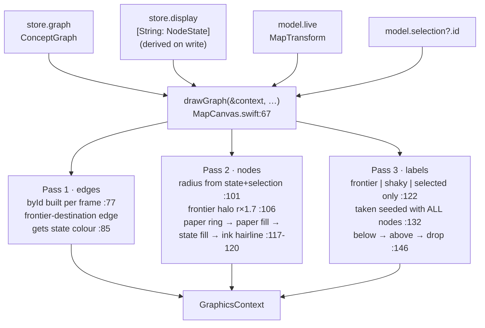
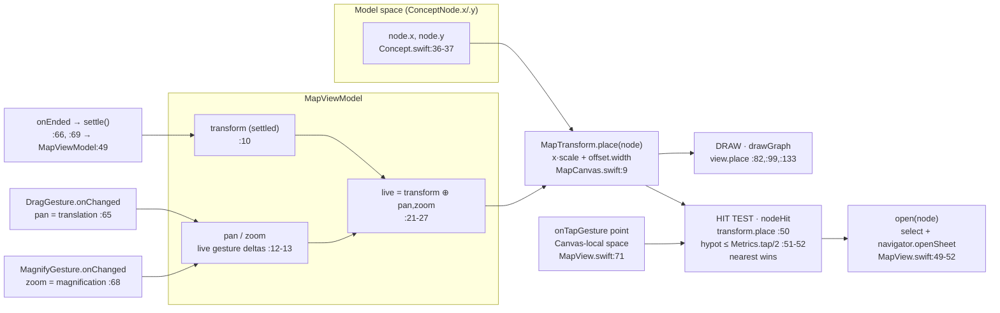
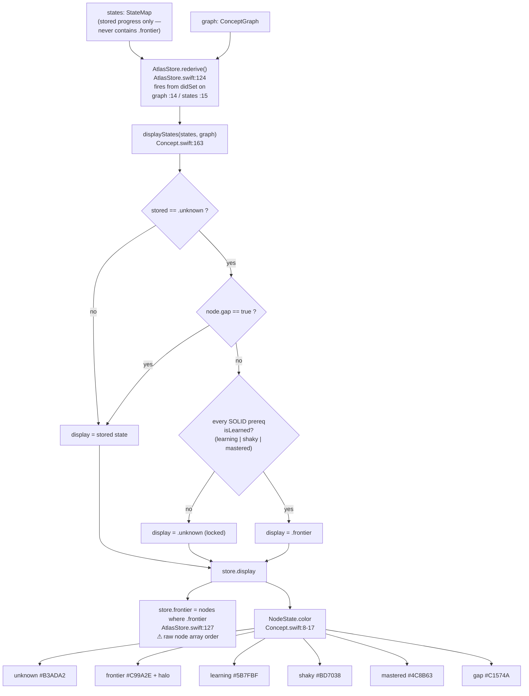
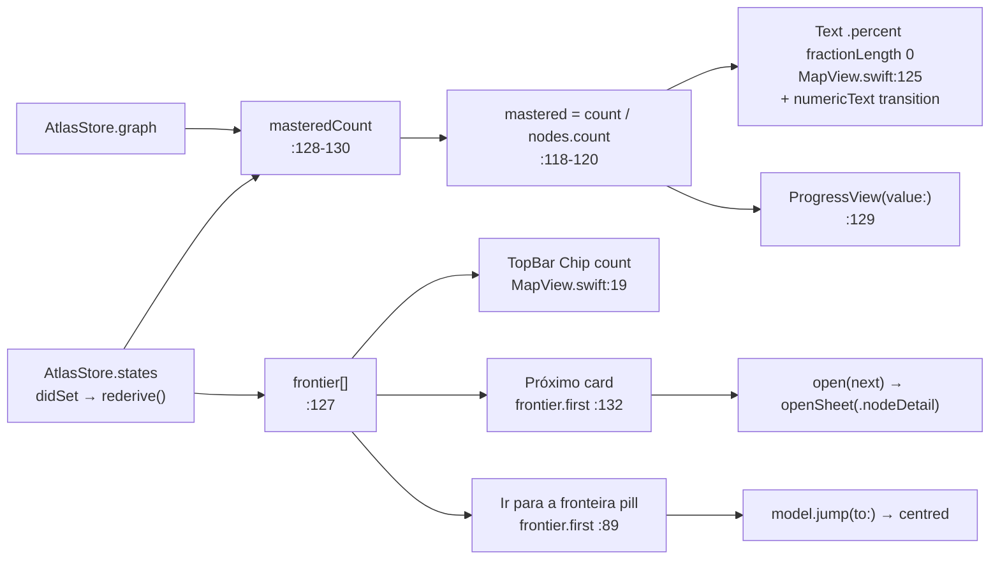
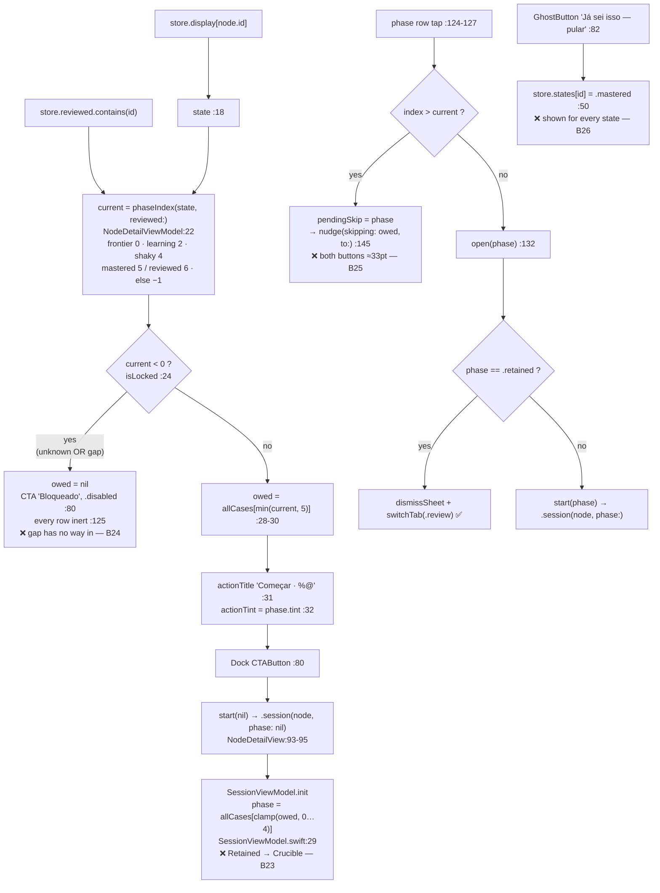
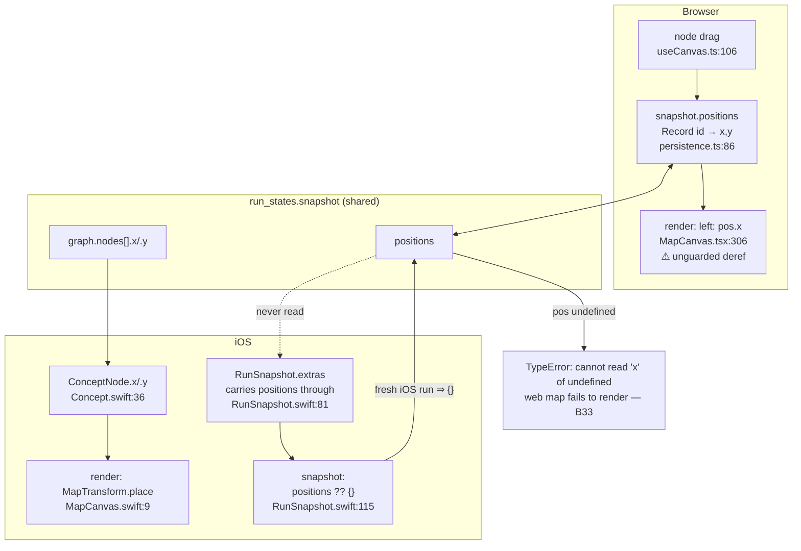
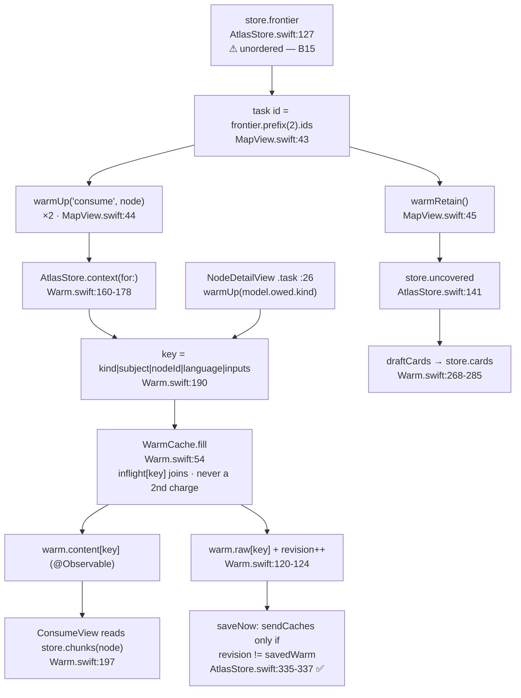

# Atlas iOS — Engineering Audit: The Concept Map

**Scope:** canvas rendering, pan/zoom & hit testing, frontier derivation & mastery
colouring, the map bottom sheet, the node detail drawer, node positions, and
map-driven warming.

**Files read in full:** `MapView.swift` (160 ll), `MapCanvas.swift` (165 ll),
`MapViewModel.swift` (70 ll), `NodeDetailView.swift` (192 ll),
`NodeDetailViewModel.swift` (51 ll), `Domain/Concept.swift` (274 ll),
`Tests/MapTests.swift`, `Tests/ConceptTests.swift`.
**Context:** `Data/AtlasStore.swift`, `Data/Warm.swift`, `Data/RunSnapshot.swift`,
`Core/Theme.swift`, `Core/Components.swift`, `App/AtlasRoute.swift`,
`App/RootView.swift`, `Data/Fixtures.swift`, `Features/Session/SessionViewModel.swift`,
`ios/AGENTS.md`.
**Web source of truth compared against:** `lib/curriculum/types.ts`,
`lib/curriculum/replan.ts`, `lib/curriculum/calibration.ts`,
`components/atlas/useCanvas.ts`, `components/atlas/useRunState.ts`,
`components/atlas/useSpiral.ts`, `components/map/MapCanvas.tsx`,
`components/map/NodeDetail.tsx`, `lib/persistence.ts`.

---

## Executive summary

The map's _arithmetic_ is unusually clean. `MapTransform` is a single value type
that both the renderer and the hit-test go through, so the classic off-by-scale
tap bug **is not present** — I traced it specifically and both paths call the same
`place(_:)` (`MapCanvas.swift:9`). Frontier derivation is a faithful port of
`replan.ts` and is derived-on-write in `AtlasStore.rederive()` rather than
recomputed per frame, which is the right call. Observation granularity is used
correctly: a pan frame invalidates the `GeometryReader` subtree only, not the
bottom sheet.

The problems are at the edges of that clean core:

- **Zoom is completely unclamped and unrecoverable** (`MapViewModel.settle():49`).
  The web clamps `[0.4, 1.7]`; iOS clamps nothing, zooms about the origin rather
  than the pinch centroid, and offers no "fit"/"reset" control. A learner can
  reach a state the app cannot get out of.
- **A map built on the phone crashes the browser's map.** `RunSnapshot.snapshot`
  writes `positions: {}` (`RunSnapshot.swift:115`); the web indexes
  `positions[node.id]` and dereferences `pos.x` unguarded
  (`components/map/MapCanvas.tsx:306`). A test pins the broken value.
- **Gap nodes are a dead end on iOS.** `phaseIndex(.gap) == -1` locks the drawer;
  the web has a whole "Reparo direcionado · Passagem socrática" branch, and iOS
  _does_ spawn gaps (`SessionViewModel.swift:84,100`).
- **The dock CTA lies for a finished node.** It says `Começar · Retained` and
  pushes a **Crucible** session.
- **The Canvas is invisible to VoiceOver**, while the app's _other_ Canvas
  (`CalibrationView.swift:66`) carries a label — the convention exists and the
  map ignores it.
- **Frontier ordering ignores the goal.** The web runs `orderedFrontier(display,
graph, goal)`; iOS uses raw node array order for "Próximo", "Ir para a
  fronteira" _and_ what it pays a model to warm.

Counts: **6 confirmed high**, **7 confirmed medium**, **9 confirmed low /
convention**, **3 suspected**.

---

# 1. Map canvas rendering + edges

## 1.1 Objective

Draw the whole concept graph — edges, state-coloured node discs, the frontier
halo, and a sparse set of labels — into a single SwiftUI `Canvas`, in one
immediate-mode pass, so the map reads as one picture rather than as several
hundred SwiftUI views. The same drawing routine has to serve both the live map
tab and onboarding's assembling map behind screens 6 and 7.

## 1.2 How it works

`MapView.canvasLayer` (`MapView.swift:56-85`) wraps a `GeometryReader` whose only
content is a `Canvas`. The renderer closure is a single call:

```
Canvas { context, _ in
    drawGraph(&context, store.graph, store.display, view, selected: model.selection?.id)
}                                                                   // MapView.swift:59-61
```

`drawGraph` (`MapCanvas.swift:67-152`) is a free function, not a method, precisely
so `BuildingView` can paint the same territory with `labels: false`
(`MapCanvas.swift:58-63`). It runs three ordered passes:

1. **Edges** (`:77-94`). A `byId` dictionary is built first (`:77`) so the
   endpoint lookup per edge is O(1). Every edge is a two-point `Path` between
   `view.place(a)` and `view.place(b)`. The one piece of semantics: an edge whose
   **destination** displays as `.frontier` (`:85`) is stroked in
   `NodeState.frontier.color.opacity(0.45)` at 1.6pt; everything else is
   `Palette.ink` at 0.13 (solid) or 0.08 (dashed), 1.1pt, with a `[4, 5]` dash
   pattern for gap edges (`:88-93`).
2. **Nodes** (`:96-125`). Radius is chosen from state and selection
   (`:101`): 15 for frontier-or-selected, 11 for a gap node, 13 for any lit
   state, 10 for unknown. The frontier halo is one soft disc plus a ring at
   `radius * 1.7` (`:106-110`) — the comment at `:104-105` records that two
   stacked discs used to merge adjacent frontiers into an amber cloud. Every node
   then gets a _paper_ ring and a _paper_ fill before its state colour
   (`:117-119`), which is what stops edges showing through pale discs and keeps
   two close nodes reading as two.
3. **Labels** (`:122-151`). Only frontier, shaky and selected nodes are labelled
   (`:122`) — "on the real canvas only the nodes that carry a decision are
   labelled". Placement is a greedy non-overlap: `taken` is seeded with a 34×34
   rect around **every** node (`:132-135`) so type never lands on a disc, frontier
   labels are placed first (`:136`), and each label tries below-then-above
   (`:146`), being dropped entirely if neither fits.



## 1.3 User value

The learner sees their whole subject as one picture and can answer "where am I?"
without reading anything: green is done, amber glows at the edge, red is a
diagnosed gap, grey is locked. The label policy is the strongest thing here — the
map stays a _map_ instead of degenerating into a word cloud, and the only names
printed are the ones that carry a decision. The paper-ring trick is why a dense
region still reads as discrete concepts rather than a blob.

## 1.4 Bugs

**B1 · `byId` and `taken` are rebuilt on every redraw frame — CONFIRMED, medium.**
`MapCanvas.swift:77` allocates a `Dictionary` over every node, and `:132-135`
allocates a `[CGRect]` over every node, inside the renderer closure. The renderer
closure re-runs on every pan and pinch frame (`model.live` is a dependency —
`MapView.swift:58`). On a 300-node map that is two full O(n) allocations 60×/s
during a drag, in addition to the drawing itself. _Failure scenario:_ a
university-sized generated map (the generator has no node cap) drops frames the
moment the learner drags. **Fix:** hoist both into `MapViewModel` (or into a
small `PreparedGraph` value) keyed on `graph`, since neither depends on the
transform.

**B2 · Text is resolved and measured per label per frame — CONFIRMED, medium.**
`MapCanvas.swift:140` (`context.resolve(text)`) and `:143` (`resolved.measure`)
run Core Text shaping inside the render loop. With 20 frontier nodes that is 20
shape-and-measure operations every frame of a pan, none of which change with the
transform (the label text and its point size are transform-independent — see B3).
_Failure scenario:_ pan judder proportional to frontier size, worst exactly when
the map is most useful (many concepts unlocked). **Fix:** measure once per
`(label, font)` and cache; only the _box origin_ depends on the transform.

**B3 · Label measurement is clipped to a hard-coded 24pt height — CONFIRMED, low.**
`MapCanvas.swift:143`: `resolved.measure(in: CGSize(width: 400, height: 24))`.
`Font.atlas` is built from `Font.custom(_:size:)`, which scales with Dynamic Type,
so at accessibility text sizes a 14pt serif label is drawn well above 24pt and is
measured — and therefore drawn (`:150` passes the same `box`) — truncated.
_Failure scenario:_ AX3+ user; every frontier label on the map is cut off
vertically. **Fix:** measure with `.greatestFiniteMagnitude` height and let the
one-line policy come from `lineLimit`, not from the measuring box.

**B4 · The `taken` seed rect is smaller than a frontier node's glow — CONFIRMED,
low (cosmetic).** `:132-135` seeds a 34×34 rect (17pt half-extent) around every
node, but a frontier node draws a halo out to `15 * 1.7 = 25.5`pt (`:107`). A
neighbouring label can therefore be printed on top of another node's amber halo,
which the pass explicitly exists to prevent ("a label may never be printed over a
circle", `:131`). **Fix:** seed the rect from the same radius expression the draw
pass uses.

**B5 · `Text(item.node.label)` uses the bare `Text(String)` overload — CONFIRMED,
low (convention).** `MapCanvas.swift:138`. Behaviourally correct (a `String`
variable cannot convert to `LocalizedStringKey`, so the non-localising overload
wins and `make strings` sees nothing), but `ios/AGENTS.md` § _Copy_ is explicit:
"a bare `Text(someString)` picks the non-localising overload silently, so writing
`verbatim:` is how the next reader knows it was meant." Every other generated-text
site in the repo obeys this. **Fix:** `Text(verbatim: item.node.label)`.

**B6 · No viewport culling — SUSPECTED, low→medium (scales with graph size).**
`drawGraph` iterates every edge (`:78`) and every node (`:97`) regardless of
whether `view.place(…)` lands inside the canvas. At a zoomed-in scale most of the
graph is off-screen but still costs a `Path` allocation and a `stroke`/`fill`
call. Not observable on the 11-node fixture; it is the second thing to bite after
B1/B2 on a real generated map. **Fix:** an `if !viewport.insetBy(-40,-40).contains(point) { continue }`
guard in each pass.

**Not a bug (verified):** the three-pass ordering genuinely guarantees type on
top; `byId` uses `uniquingKeysWith: { first, _ in first }` (`:77`) so a duplicate
node id degrades gracefully instead of trapping; edges whose endpoints are missing
are skipped (`:79`) rather than drawn at the origin.

## 1.5 Must-improve (ranked)

1. **Hoist the per-frame O(n) work out of the renderer** — `MapCanvas.swift:77`
   and `:132`. One `PreparedGraph` value on `MapViewModel`, invalidated on
   `store.graph`.
2. **Cache resolved label metrics** — `MapCanvas.swift:140-143`.
3. **Cull to the viewport** — `MapCanvas.swift:78, 97`; pass the `size` the
   renderer closure currently discards (`MapView.swift:59` binds it to `_`).
4. **Fix the label measuring box** — `MapCanvas.swift:143`.
5. **Match the `taken` seed to the drawn glow** — `MapCanvas.swift:132-135`.
6. **`verbatim:` on the node label** — `MapCanvas.swift:138`.
7. **Design parity note:** on the web the node layer sits inside
   `transform: … scale(view.scale)` (`components/map/MapCanvas.tsx:211`), so discs
   and labels grow with zoom. On iOS radii (`MapCanvas.swift:101`) and type
   (`:138`) are fixed in screen space, so pinching only spreads nodes apart. That
   is defensible on touch (constant tap targets), but it should be a written
   decision, because combined with the missing zoom clamp (§2, B7) it produces a
   pile of same-size discs at low zoom.

---

# 2. Pan / zoom + hit testing

## 2.1 Objective

Let the learner move and scale the map with one and two fingers, keep the gesture
transform in exactly one place so the drawing and the tap hit-test can never
disagree about where a node is, and turn a tap into "which node".

## 2.2 How it works

`MapTransform` (`MapCanvas.swift:5-39`) is the single transform value. It is
deliberately minimal:

```
func place(_ node: ConceptNode) -> CGPoint {
    CGPoint(x: node.x * scale + offset.width, y: node.y * scale + offset.height)
}                                                                  // MapCanvas.swift:9-11
```

`offset` is **post-scale** (screen space), which is why the drag handler can
assign `$0.translation` straight into it with no division by `scale`
(`MapView.swift:65`). This is the detail that makes the transform correct.

`MapViewModel` (`MapViewModel.swift`) splits the transform in two: a settled
`transform` (`:10`) and live gesture deltas `pan`/`zoom` (`:12-13`). `live`
(`:21-27`) composes them. `settle()` (`:49-54`) folds the deltas back and zeroes
them, so there is never more than one source of truth. `fit(_:in:)` (`:29-33`)
delegates to `MapTransform.fitting` (`MapCanvas.swift:14-30`), which centres the
whole graph inside a 46pt inset and caps scale at 1.6.

**Do the draw and hit-test transforms genuinely agree? Yes — verified.** Both go
through the same `place(_:)`:

- draw: `MapView.swift:58` captures `let view = model.live`, passed to
  `drawGraph`, which calls `view.place(node)` at `MapCanvas.swift:82, 99, 133`.
- tap: `MapView.swift:72` → `MapViewModel.node(_:at:)` (`:56-58`) →
  `nodeHit(graph, live, at:)` → `transform.place(node)` at `MapCanvas.swift:50`.

Both read `live`; `pan`/`zoom` are zero/one whenever no gesture is in flight; the
tap location arrives in the Canvas's local space, which is the `GeometryReader`'s
space, which is the space `place` produces. **There is no off-by-scale tap bug.**
The reach is also scale-independent (`Metrics.tap / 2`, `MapCanvas.swift:47`) and
so are the drawn radii (`:101`), so target and picture stay in step at any zoom —
that is a genuinely well-made decision, and `MapTests.swift:8-22` pins it.

**Gesture state and redraws.** `pan`/`zoom` are `@Observable` `var`s, i.e. they
_do_ trigger a redraw — which is correct here, because the canvas must follow the
finger. What matters for `ios/AGENTS.md` § _State_ is the blast radius, and it is
right: `model.live` is read **inside** the `GeometryReader` content closure
(`MapView.swift:58`), which is its own SwiftUI attribute, and Observation tracks
per-property. So a pan frame invalidates the Canvas subtree only — not
`MapView.body`, not the bottom sheet, not the `frontierButton` (which is an
`.overlay` on the _outer_ `canvasLayer`, `MapView.swift:84`, outside the
`GeometryReader`). This is correct but _accidental-looking_: moving that one
`let` up two lines would put the sheet's percentage animation on the drag loop.



## 2.3 User value

Direct manipulation of the whole subject: drag to explore, pinch to see the
neighbourhood or the whole plan, tap anywhere near a node to open it. The 44pt
reach is the thing that makes a 13pt-radius disc usable at all — without it the
map would be untappable on a phone. `jump(to:)` (`MapViewModel.swift:64-69`) plus
the "Ir para a fronteira" pill gives a one-tap answer to "where do I go now".

## 2.4 Bugs

**B7 · Zoom is unclamped, and there is no way back — CONFIRMED, HIGH.**
`MapViewModel.settle()` (`:49-54`) does `transform = live`, i.e.
`scale = transform.scale * zoom`, with no bounds anywhere. The web clamps
explicitly: `Math.min(1.7, Math.max(0.4, current.scale * factor))`
(`components/atlas/useCanvas.ts:59`). _Failure scenario:_ three successive pinch-out
gestures put `scale` past 15; every node is now off-screen and the learner is
looking at blank paper. `resize()` refuses to re-fit because `moved` is `true`
(`MapViewModel.swift:40`), and the only recovery control — the frontier pill —
exists only `if let target = store.frontier.first` (`MapView.swift:89`), so a
learner who has finished their map has **no way to recover the view** short of
force-quitting or switching maps. Pinching _in_ is worse: `scale → 0.01` collapses
every node onto a single point, and `nodeHit`'s "nearest within 22pt" then opens
an essentially random node. **Fix:** clamp in `settle()` (and in `live`, so the
rubber-band is visible during the gesture) to the web's `0.4…1.7` scaled by the
fit, and always show a "fit"/reset affordance.

**B8 · Pinch zooms about the canvas origin, not the pinch centroid — CONFIRMED,
HIGH.** `live` (`MapViewModel.swift:21-27`) multiplies `scale` by `zoom` but
leaves `offset` untouched, so `place` scales every point about `(0,0)` of the
canvas — the top-left corner. The web anchors to the cursor:
`x: mx - (mx - current.x) * (nextScale / current.scale)`
(`components/atlas/useCanvas.ts:63-64`). `MagnifyGesture` exposes `startAnchor` /
`startLocation` for exactly this. _Failure scenario:_ the learner pinches out on a
node in the lower-right to inspect it; the node shoots off the bottom-right edge
and they have to hunt for it. This is the single most-felt interaction defect on
the screen. **Fix:**
`offset' = anchor - (anchor - offset) * zoom` inside `live`.

**B9 · No pan bounds and no rubber-banding — CONFIRMED, medium.** Nothing in
`MapViewModel` constrains `transform.offset`. A long flick sends the graph
arbitrarily far off-screen with no elastic resistance and no snap-back on release.
Combined with B7's missing recovery control this is how a learner ends up staring
at empty paper. **Fix:** clamp `offset` on `settle()` so at least one node stays
within the viewport, with a rubber-band factor while the finger is down.

**B10 · Simultaneous drag+pinch double-applies the delta when one ends first —
SUSPECTED (high confidence), medium.** `MapView.swift:63-70` composes
`DragGesture(…).simultaneously(with: MagnifyGesture(…))` and both sub-gestures'
`onEnded` call the _same_ `settle()`. `settle()` folds `pan` and `zoom` into
`transform` and zeroes both. But `DragGesture.Value.translation` and
`MagnifyGesture.Value.magnification` are **cumulative from their own gesture's
start**. If SwiftUI ends the magnify phase while the drag is still live (lift one
of two fingers — magnify needs two touches, drag needs one), the next
`onChanged` re-assigns `model.pan = $0.translation`, re-applying the translation
`settle()` has already folded in. _Failure scenario:_ pinch-and-drag, then lift
one finger — the map jumps by the distance travelled during the pinch. Symmetric
case: drag ends first, and the magnify's next frame re-applies its cumulative
magnification on top of the already-folded scale, squaring the zoom. **Fix:**
don't call `settle()` from two ends. Track a per-gesture baseline
(`panBaseline`/`zoomBaseline` captured on first `onChanged`) so each sub-gesture
contributes a _delta_ rather than a cumulative value, or use a single
`SimultaneousGesture` whose combined `onEnded` settles once.

**B11 · `withAnimation` in `jump(to:)` almost certainly does nothing —
SUSPECTED (high confidence), low.** `MapViewModel.swift:66`:
`withAnimation(Motion.enter) { transform = live.centred(on: node, in: canvas) }`.
`MapTransform` is `Equatable` but not `Animatable`, and it reaches the Canvas as
a plain captured value in the renderer closure (`MapView.swift:58-61`) — SwiftUI
has nothing to interpolate. _Failure scenario:_ "Ir para a fronteira" snaps
instead of gliding; the learner loses the spatial thread of where the map went,
which is precisely what the animation was for. **Fix:** make `MapTransform`
`Animatable` (its `AnimatableData` is `AnimatablePair<AnimatablePair<CGFloat,
CGFloat>, CGFloat>`) and drive it through an animatable `@State`, or animate a
scalar progress value the renderer interpolates between two transforms.

**B12 · The drag jumps 10pt at the start — CONFIRMED, low.**
`MapView.swift:64-65` uses `DragGesture()` with the default
`minimumDistance` of 10. The first `onChanged` therefore already carries a
translation of ≥10pt, which lands as an instantaneous 10pt shift of the map.
The web pans from the first pixel (`useCanvas.ts:114-118`). **Fix:**
`DragGesture(minimumDistance: 0)` — the `onTapGesture` still wins short taps
because a tap produces no drag update — or subtract the first translation as a
baseline.

**B13 · Closing the drawer fires a selection haptic — CONFIRMED, low.**
`MapView.swift:74` triggers `.sensoryFeedback(.selection, trigger: model.selection?.id)`;
`MapView.swift:32-34` sets `model.select(nil)` when the sheet closes, changing the
trigger from an id to `nil` and buzzing on _dismiss_. **Fix:** trigger on
`model.selection?.id` only when non-nil, or use `.sensoryFeedback(trigger:) { old, new in new != nil }`.

**B14 · A frontier node's outer halo is not tappable — CONFIRMED, low.** Drawn
glow radius is `15 * 1.7 = 25.5`pt (`MapCanvas.swift:107`); `nodeHit`'s reach is
22pt (`:47`). The 3.5pt annulus looks like part of the node and does nothing.
**Fix:** `reach = max(Metrics.tap / 2, drawnRadius(state) * 1.7)`.

**Not a bug (verified):** `fitting` returns identity for an empty graph or a
degenerate size (`MapCanvas.swift:16-17`) and `resize` re-fits once real geometry
arrives (`MapViewModel.swift:38-42`); `moved` correctly makes the learner's
placement win over a later re-fit; `.onChange(of: store.subject)` (`MapView.swift:80`)
does catch a map switched in underneath the tab, because `AtlasStore.open` writes
`subject` and `graph` in the same main-actor turn (`AtlasStore.swift:232-234`).

## 2.5 Must-improve (ranked)

1. **Clamp zoom and add a reset/fit control** — `MapViewModel.swift:49-54`,
   `MapView.swift:88-109`. This is the one defect that leaves the screen in an
   unrecoverable state.
2. **Anchor the pinch to its centroid** — `MapViewModel.swift:21-27`, using
   `MagnifyGesture.Value.startAnchor`.
3. **Give each sub-gesture its own baseline instead of two `settle()` calls** —
   `MapView.swift:63-70`, `MapViewModel.swift:49`.
4. **Clamp/rubber-band the pan** — `MapViewModel.swift:49`.
5. **Make `MapTransform` `Animatable`** so `jump` actually glides —
   `MapCanvas.swift:5`, `MapViewModel.swift:66`.
6. **`minimumDistance: 0`** — `MapView.swift:64`.
7. **Add a `// keep this read inside the GeometryReader` note** at
   `MapView.swift:58`. The current scoping is correct and load-bearing, and
   nothing in the file says so.

---

# 3. Frontier derivation & mastery colouring

## 3.1 Objective

Hold one vocabulary of six mastery states with one colour each, derive "which
nodes are the learner's edge" from prerequisites rather than storing it, and make
that derivation the only thing any surface reads — matching `lib/curriculum`
exactly, since the two clients share a database row.

## 3.2 How it works

`NodeState` (`Concept.swift:5-21`) enumerates the six states and owns the palette;
`AGENTS.md` forbids inventing a state or a colour outside it. `isLearned`
(`:20`) is the prerequisite predicate.

`displayStates(_:_:)` (`Concept.swift:163-175`) is the single derivation. It
builds a solid-edge prereq index (dashed edges never lock, `:165`), then for each
node emits `.frontier` iff `state == .unknown && node.gap != true && all solid
prereqs isLearned`, otherwise the stored state (`:172`).

`AtlasStore` derives **on write, not on read** (`AtlasStore.swift:113-131`).
`graph` and `states` both carry `didSet { rederive(); saveSoon() }` (`:14-15`),
and `rederive()` produces `display`, `frontier` and `masteredCount` in one pass
(`:124-131`). The comment at `:110-112` gives the reason, and it is the right one:
a single `body` reads `display` half a dozen times, so one pass per change beats
one per read — and it is exactly what keeps the Canvas renderer cheap.



## 3.3 Drift against the web — verified line by line

| Concern                  | Web                                                          | iOS                                      | Verdict                         |
| ------------------------ | ------------------------------------------------------------ | ---------------------------------------- | ------------------------------- |
| State set                | `types.ts:10-11`                                             | `Concept.swift:6`                        | **identical**                   |
| Colours                  | `STATE_COLOR`, `types.ts:96-103`                             | `NodeState.color`, `Concept.swift:8-17`  | **identical**, all six hexes    |
| `isLearned`              | `replan.ts:22-24`                                            | `Concept.swift:20`                       | **identical**                   |
| Dashed edges don't lock  | `replan.ts:30`                                               | `Concept.swift:165`                      | **identical**                   |
| Gap never joins frontier | `replan.ts:52`                                               | `Concept.swift:172`                      | **identical**                   |
| `displayStates`          | `replan.ts:40-58`                                            | `Concept.swift:163-175`                  | **identical**                   |
| `initialStates`          | `replan.ts:17-19`                                            | `Concept.swift:97-99`                    | **identical**                   |
| `spawnGap`               | `replan.ts:195-218`                                          | `Concept.swift:114-124`                  | **identical** (incl. `week: 4`) |
| `PHASES`                 | `types.ts:197-204`                                           | `Concept.swift:179-183`                  | **identical**                   |
| `phaseIndex`             | `calibration.ts:171-184`                                     | `Concept.swift:244-252`                  | **identical**                   |
| `graphFromMapNodes`      | `types.ts:84-94`                                             | `Concept.swift:84-94`                    | **identical**                   |
| Mastery %                | `masteredCount / nodes.length`, `useDerived.ts:165-167`      | `AtlasStore.swift:118-120`               | **identical**                   |
| `PHASE_SKIP_NUDGE_PT`    | `types.ts:221-228`                                           | `Concept.swift:227-236`                  | **identical** (all six)         |
| **Frontier ordering**    | `orderedFrontier(display, graph, goal)`, `replan.ts:112-132` | raw node order, `AtlasStore.swift:127`   | **DRIFT — B15**                 |
| **Reading correction**   | `readingPhaseIndex`, `calibration.ts:200-210`                | absent (ponytail at `Concept.swift:242`) | **DRIFT — B16**                 |
| **State labels**         | `STATE_LABEL_PT`, `types.ts:114-121`                         | `NodeDetailViewModel.headline:39-48`     | **DRIFT — B17**                 |
| `removeNode`             | `replan.ts:225-230`                                          | absent                                   | gap, low                        |
| `unmetPathOf`            | `replan.ts:64-74`                                            | absent                                   | gap, low (§5)                   |

## 3.4 User value

One vocabulary means "amber = my next move" is learnable once and true on both
platforms and on every screen. Deriving rather than storing the frontier means it
can never go stale: grading a Crucible flips one entry in `states` and every
downstream node re-evaluates in the same frame. `masteredCount` being derived at
the same time is what makes the sheet's percentage honest for free.

## 3.5 Bugs

**B15 · The frontier is unordered — CONFIRMED, HIGH.**
`AtlasStore.swift:127`: `frontier = graph.nodes.filter { shown[$0.id] == .frontier }`.
That is generation order, not plan order. The web sorts by goal:
`mastery` → `x` ascending (foundations first); everything else → transitive
`unlocks` descending, `x` as tie-break (`replan.ts:112-132`), captioned to the
learner as _"ordenado por alavancagem — o essencial primeiro"_ (`replan.ts:95-100`).
`AtlasStore.goal` exists (`AtlasStore.swift:41`) and round-trips through
`RunSnapshot` — it is simply never read by the map. _Failure scenario:_ the
learner sets goal = exam; `store.frontier.first` names whichever frontier node the
generator happened to emit first. That value drives **three** things: the
"Próximo" card (`MapView.swift:132`), the "Ir para a fronteira" target
(`MapView.swift:89`), **and which nodes the app pays OpenRouter to warm**
(`MapView.swift:43-44`). The phone therefore recommends — and pre-generates for —
a different node than the browser, for the same run and the same goal. **Fix:**
port `orderedFrontier` into `Concept.swift` and sort inside `rederive()`.

**B16 · The phase spiral claims two phases the learner never did — CONFIRMED,
HIGH.** `Concept.swift:244-252` is a faithful port of `phaseIndex`, but the web
never calls it bare from the detail rail — it calls `readingPhaseIndex`
(`calibration.ts:200-210`), which demotes a `learning` node back to Consume or
Socratic based on `ConsumeProgress`. iOS has no `ConsumeProgress` at all (grep:
zero hits outside the ponytail at `Concept.swift:242-243`), and
`SessionViewModel.init` writes `.learning` the instant a session opens
(`SessionViewModel.swift:33-34`). _Failure scenario — one interaction:_ tap a
frontier node → "Começar · Consume" → the session marks it `.learning` → back out
without reading a word → reopen the drawer. `phaseIndex(.learning) == 2`, so the
spiral now shows **Consume ✓ and Socratic ✓** and the CTA reads
"Começar · Feynman". The learner is told they have read and reasoned about a
concept they never opened. This is called out as a known ponytail, but the
ponytail says "arrives with Consume in phase 5" and Consume has since shipped
(`Features/Session/Consume/`), so the guard is now overdue rather than deferred.

**B17 · `unknown` is labelled "Bloqueado", not "Desconhecido" — CONFIRMED, low
(drift).** `NodeDetailViewModel.headline` (`:39-48`) returns `"Bloqueado"` for
`.unknown` and `"Instável · revisar"` for `.shaky`; the web's `STATE_LABEL_PT`
(`types.ts:114-121`) says `"Desconhecido"` and `"Instável"`. The other four match
exactly. The iOS wording is arguably _better_ (it matches `STATE_CONFIDENCE_PT`'s
"Bloqueado. Resolva os pré-requisitos…"), but it is undeclared drift in shared
vocabulary. **Fix:** pick one and note the decision beside `STATE_LABEL_PT`.

**Not a bug (verified):** `ConceptTests.swift:7-30` correctly pins that a gap node
with stored state `.unknown` displays as `.unknown` (not `.gap`), and
`MapTests.swift:43-51` pins that the fixture's `epsilon` (stored `.gap`) displays
as `.gap`. Both are right, and together they cover the `node.gap != true` clause.

## 3.6 Must-improve (ranked)

1. **Port `orderedFrontier` and sort in `rederive()`** — `AtlasStore.swift:127`;
   read `goal` (`:41`). Highest leverage: it fixes the recommendation _and_ what
   the app spends money warming.
2. **Add `ConsumeProgress` + `readingPhaseIndex`** — `Concept.swift:244`; the
   snapshot key already exists on the web (`persistence.ts:96-99`) and currently
   rides through iOS's `extras` untouched.
3. **Reconcile `headline` with `STATE_LABEL_PT`** — `NodeDetailViewModel.swift:39-48`.
4. **Add a `displayStates` case to `ConceptTests`** that a `.gap`-stored node
   still displays `.gap` when its parent is learned — currently only covered
   transitively via the fixture test.

---

# 4. Map bottom sheet — subject + % dominado

## 4.1 Objective

The mobile translation of the web's `LeftRail`: a permanently visible strip under
the canvas that answers "what am I learning", "how far in am I", and "what is
next", without taking the map off screen.

## 4.2 How it works

`MapView.sheet` (`MapView.swift:113-159`) is a plain `VStack` in the screen's
`VStack`, not a presented sheet — it is `Palette.cardAlt` with an 18pt top corner
radius and a hairline (`:156-158`), which is how the design's rail-becomes-sheet
rule lands. Three blocks:

- **Subject** — `Kicker("Assunto")` + `Text(verbatim: store.subject)` (`:116-117`).
  Correctly `verbatim:` (a learner-typed topic is not copy).
- **Território dominado** — the label is a localised literal (`:123`); the figure
  is `store.mastered.formatted(.percent.precision(.fractionLength(0)))` (`:125`)
  with `.contentTransition(.numericText())`, over a `ProgressView(value:)` tinted
  `Palette.accent` (`:129`). `store.mastered` is `masteredCount / nodes.count`
  (`AtlasStore.swift:118-120`), matching `useDerived.ts:165-167`.
- **Próximo** — `if let next = store.frontier.first`, a 48pt-tall card with the
  frontier dot, the node label, and a `+N` mono count (`:132-150`), opening the
  same drawer as a canvas tap via `open(next)`.

Animation is scoped: `.animation(Motion.reward, value: store.mastered)` on the
sheet (`:152`) for the fill-up moment, and `.animation(Motion.standard, value:
store.frontier.count)` on the screen (`:30`) for the count and card changes.



## 4.3 User value

The one number that says "this is working" sits permanently under the map, and
the `numericText` + `Motion.reward` pairing means finishing a concept is _seen_
rather than discovered. "Próximo" removes the hunt: the learner never has to find
the amber node on the canvas, they can tap the card. The `+N` count quietly says
how much else is open without drawing a list.

## 4.4 Bugs

**B18 · `store.mastered`'s doc comment contradicts its code — CONFIRMED, low.**
`AtlasStore.swift:117` says _"Share of the map learned at least once"_, which is
`isLearned` (learning ∪ shaky ∪ mastered); `:128-130` counts `== .mastered` only.
The code is right (it matches the web and the label "Território dominado"); the
comment will mislead the next reader into "fixing" it and silently inflating every
learner's percentage. **Fix:** correct the comment.

**B19 · The mastery bar and percentage are one unreadable pair for VoiceOver —
CONFIRMED, medium (a11y).** `MapView.swift:121-130` produces three separate
accessibility elements: "Território dominado", "34%", and an unlabelled
`ProgressView` (`:129`) that VoiceOver announces as a bare progress indicator with
no name. **Fix:** `.accessibilityElement(children: .ignore)` on the `VStack` with
`.accessibilityLabel("Território dominado")` and
`.accessibilityValue(Text(store.mastered.formatted(.percent…)))`.

**B20 · The frontier count chip has no label — CONFIRMED, low (a11y).**
`MapView.swift:19-21`: `Chip(verbatim: "\(store.frontier.count)", dot: …)`.
VoiceOver reads "3" with no indication of what three is. `AGENTS.md` § _Touch,
safety, accessibility_ requires a label on anything whose meaning is carried by an
icon; an amber dot plus a bare integer is exactly that. **Fix:**
`.accessibilityLabel("\(store.frontier.count) conceitos na fronteira")` (and add
the plural variation to the catalogue).

**B21 · An empty frontier still shows an amber "0" — CONFIRMED, low.**
`MapView.swift:19` is unconditional, so a completed map shows a glowing amber chip
reading `0`, while the pill (`:89`) and the "Próximo" card (`:132`) both correctly
vanish. **Fix:** hide the chip at zero, or swap it for the mastered-green
"finished" state.

**B22 · No `paceStatus` / goal caption — CONFIRMED, low (feature gap).** The web's
`LeftRail` carries `goalOrderCaption` (`replan.ts:103`) and `paceStatus`
(`replan.ts:158-175`) — the "you are behind your exam date" signal. Neither is
ported. Not a defect in what exists, but the sheet is the only place they could
live, and `dailyTarget` + `goal` are already on the store.

## 4.5 Must-improve (ranked)

1. **Group the mastery row into one labelled accessibility element** —
   `MapView.swift:121-130`.
2. **Label the frontier chip** — `MapView.swift:19`.
3. **Fix the `mastered` doc comment** — `AtlasStore.swift:117`.
4. **Hide the chip at zero** — `MapView.swift:19`.
5. **Consider porting the goal caption** — it is one line under the subject and it
   is what makes the frontier ordering (B15) legible once it lands.

---

# 5. Node detail drawer — state, summary, phase spiral, prereq chips, dock CTA

## 5.1 Objective

The desktop right rail as a self-sizing bottom sheet: what state this node is in,
what the concept actually _is_, where it sits in the six-phase spiral, what
unlocks it, and the one action to take — with a gentle nudge when the learner taps
past the phase they are owed.

## 5.2 How it works

Presentation is entirely the `Navigation` package's: `AtlasRoute.nodeDetail(node)`
declares `.sheet` (`AtlasRoute.swift:17`) and `MapView.open` calls
`navigator.openSheet` (`MapView.swift:51`) — no `sheet(item:)` anywhere, as
`AGENTS.md` § _Navigation_ requires.

`NodeDetailView` builds its model once in `.task` (`:22`), correctly following
`AGENTS.md` § _MVVM_ ("a view model is built once, in `.task`"), and warms the owed
phase on the way in (`:26`) — "opening the drawer is the clearest statement of
intent there is".

`NodeDetailViewModel` is a thin derivation layer over the store:

- `state` = `store.display[node.id] ?? .unknown` (`:18`) — the shared derivation,
  never a second copy.
- `current` = `phaseIndex(state, reviewed: store.reviewed.contains(node.id))` (`:22`).
- `owed` clamps 6 → 5 so the finished spiral doesn't index off `allCases` (`:28-30`).
- `actionTitle` / `actionTint` / `headline` are `LocalizedStringKey` (`:31-32,
39-48`) — the right type per `AGENTS.md`.
- `prerequisites` reads `graph.prerequisites(of:)` (`Concept.swift:266-273`), which
  builds `byId` once rather than per prereq.

`row(_:at:_:)` (`NodeDetailView.swift:100-128`) draws each phase: done rows carry
`NodeState.mastered.color`, the current row carries the node's state colour, later
rows are `Palette.inkGhost`. Every row is a 46pt tap target (`:121`) and forks at
`:126`: ahead-of-owed sets `pendingSkip`, otherwise `open(phase)` — which routes
`.retained` to the Review **tab** (`:132-139`), mirroring the web's `onPhaseAction`.



## 5.3 User value

This is the screen that turns a coloured dot into a decision. The summary box
(`:44-55`) answers "what _is_ this?" with the concept's own sentence rather than
boilerplate about mastery, with the state colour as a 3pt leading rule. The spiral
makes the method visible — the learner can see that understanding has five moves,
not one — and every row being tappable means re-doing a phase is a first-class
action rather than a hidden one. The nudge (`:145-175`) is the product's whole
posture in one control: it does not block the skip, it names what is being skipped
and lets the learner choose.

## 5.4 Bugs

**B23 · The dock CTA says "Retained" and opens the Crucible — CONFIRMED, HIGH.**
For a node with `state == .mastered`, `current` is 5 (or 6 if reviewed), so `owed`
is `.retained` (`NodeDetailViewModel.swift:28-30`) and the CTA reads
"Começar · Retained" (`:31`). Tapping calls `start()` with `phase: nil`
(`NodeDetailView.swift:80, 93-95`), and `SessionViewModel.init` clamps a nil phase
to `Phase.allCases[max(0, min(owed, count - 2))]` — index **4**, the Crucible
(`SessionViewModel.swift:29`). _Failure scenario:_ the learner finishes a concept,
opens it, taps the button labelled Retained, and lands in a Crucible problem.
Worse, the _row_ for the same phase does the right thing (`NodeDetailView.swift:133-136`
switches to the Review tab), so the drawer contradicts itself. The web is
unambiguous here: `cta.mastered` is `"Revisar agora"` (`NodeDetail.tsx:60`).
**Fix:** route `.retained` through `open(_:)` from the CTA too, and adopt the web's
per-state CTA vocabulary (below).

**B24 · A gap node is a dead end — CONFIRMED, HIGH.** `phaseIndex(.gap)` falls to
`default: -1` (`Concept.swift:250-251`), so `isLocked` is true
(`NodeDetailViewModel.swift:24`), `owed` is nil, the CTA is "Bloqueado" and
`.disabled` (`NodeDetailView.swift:80`), and every phase row returns early at
`:125`. Yet the headline correctly says "Lacuna" (`NodeDetailViewModel.swift:45`),
and iOS actively **spawns** gap nodes from a failed Crucible and a Feynman beat
(`SessionViewModel.swift:84, 100`). The web branches entirely on `isGap`
(`NodeDetail.tsx:184`): no six-phase spiral, a "Reparo direcionado / Passagem
socrática / uma passagem · fecha esta lacuna" block (`NodeDetail.tsx:340-379`), an
"Originado de" parent-chip list, and a red CTA "Corrigir esta lacuna"
(`NodeDetail.tsx:59`). _Failure scenario:_ the learner fails a Crucible, the map
grows a red node, they tap it, and the app says "Bloqueado" with no way forward —
the entire replanning loop terminates in a dead end on mobile. **Fix:** give
`.gap` its own branch: headline + summary (the gap's `reason` is already its
`summary`, `Concept.swift:120`), a single Socratic CTA, and the parent chip.

**B25 · Both nudge buttons are ~33pt tall — CONFIRMED, medium.**
`NodeDetailView.swift:155-157`: `.padding(.horizontal, 13).padding(.vertical, 9)`
around 13pt text ≈ 33pt. `:160-166` is worse — `.padding(.vertical, 9)` with **no
horizontal padding**, so the "Pular para X →" hit region is the underlined glyph
run itself. `AGENTS.md` § _Touch_: "Nothing tappable is under `Metrics.tap` (44pt)…
shrinking one to fit is a layout bug, not a trade-off." _Failure scenario:_ the
learner accepts the nudge, misses, and taps through to the row underneath.
**Fix:** `.frame(minHeight: Metrics.tap)` on both, plus horizontal padding on the
second.

**B26 · "Já sei isso — pular" is offered on every node, including locked ones —
CONFIRMED, medium.** `NodeDetailView.swift:82-85` renders the `GhostButton`
unconditionally; `skip()` writes `.mastered` (`NodeDetailViewModel.swift:50`). The
web gates it: `{displayState === "frontier" && (…)}` (`NodeDetail.tsx:637`), and
its own doc comment says "Prune a **frontier** node as diagnosed-known"
(`NodeDetail.tsx:108`). _Failure scenario:_ the learner opens a grey locked node
five layers deep, taps "Já sei isso", and it turns green — skipping every
prerequisite, inflating "Território dominado", and unlocking a frontier they have
no foundation for. Also live on a `.gap` node, where it deletes a diagnosed
failure with one tap. **Fix:** `if model.state == .frontier`.

**B27 · The drawer does not scroll — CONFIRMED, medium (Dynamic Type / a11y).**
`content(_:)` (`NodeDetailView.swift:32-87`) is a `VStack` with no `ScrollView`.
At default type its intrinsic height is already ~650pt (26pt title + summary box +
six 46pt rows + prereq grid + a 52pt CTA and a 48pt ghost in the `Dock`). `Font.custom(_:size:)`
scales with Dynamic Type, so at AX3+ this is comfortably 1500pt. _Failure scenario:_
an AX-size learner opens a node with five prerequisites and cannot reach the CTA
at all — the `Dock` is pushed below the screen with nothing to scroll.
`AGENTS.md`: "a screen that breaks at the largest size is not done." **Fix:** wrap
everything above the `Dock` in a `ScrollView` and give the sheet
`presentationDetents` (`AtlasRoute.swift:9` claims "sized to its own content", but
nothing in the repo sets a detent — the only `presentationDetents` call is
`ConsumeView.swift:74`).

**B28 · `pendingSkip` is view `@State` and `row` computes in `body` — CONFIRMED,
low (AGENTS).** `NodeDetailView.swift:14` holds `pendingSkip: Phase?`, and
`:101-103` derives `done` / `isCurrent` / `tint` per row per redraw. `AGENTS.md`
§ _MVVM_: "A view holds no `@State` a view model could hold and computes nothing in
`body` that a stored property could carry. Segment rails … are prepared in the
model, not mapped per redraw." A `[PhaseRow]` array on `NodeDetailViewModel` is
exactly the prescribed shape. The web also resets its equivalent on state change
(`NodeDetail.tsx:199`), which iOS has no equivalent guard for.

**B29 · CTA vocabulary is collapsed — CONFIRMED, low (drift).**
`NodeDetailViewModel.swift:31` produces `"Começar · <phase>"` for every unlocked
state. The web has five distinct verbs (`NodeDetail.tsx:28-34, 54-60`):
`frontier → "Começar · Consume"`, `learning → "Continuar · Feynman"`,
`shaky → "Tentar de novo · Crucible"`, `mastered → "Revisar agora"`,
`gap → "Corrigir esta lacuna"`. On iOS a shaky node — one whose last application
_failed_ — is invited to "Começar", which misdescribes what is about to happen.
**Fix:** a `switch` on `state` in `actionTitle`.

**B30 · Copy drift on the skip button — CONFIRMED, low.** iOS
`"Já sei isso — pular"` (`NodeDetailView.swift:82`) vs web
`"Eu já sei isso — pular"` (`NodeDetail.tsx:69`). Trivial, but the catalogue is
the place to record which one won.

**B31 · The prereq chip grid is a `LazyVGrid` used as a flow layout — CONFIRMED,
low.** `FlowChips` (`NodeDetailView.swift:179-192`) uses
`GridItem(.adaptive(minimum: 110))`, which allocates **equal-width** columns. A
one-word chip ("Limites") and a five-word chip ("Regra da cadeia composta") get
the same width, so short chips are surrounded by dead space and long ones truncate
at the column boundary — not what a flow of chips looks like in the design. The
comment (`:183-184`) frames this as an intentional trade against a custom
`Layout`, which is fair, but the visual result is not "wraps the same way".
`ViewThatFits` or a small `Layout` is ~25 lines. **Fix or re-check against the
artboard.**

**B32 · `.task` has no `id:` — SUSPECTED, low.** `NodeDetailView.swift:21-27`
guards on `model == nil`. If SwiftUI ever reuses this view's identity across two
different `nodeDetail` presentations (same type, same position in the sheet
hierarchy), the drawer would render the _previous_ node's model against the new
`node` property. Low risk today because `navigate` dismisses the drawer between
opens (`AGENTS.md` § _Navigation_), but the guard is a latent identity bug.
**Fix:** `.task(id: node.id)` and rebuild when it changes.

**Missing versus the web (feature gaps, not defects):** "Aprenda isso primeiro"
(`unmetPathOf`, `replan.ts:64`) for a locked node; the "Desbloqueia" chip list;
the "Lacunas abertas" chip list (`NodeDetail.tsx:657-680`); `shakyLine`'s
reason-specific confidence copy (`types.ts:188-195`); `stateConfidence` fallback
prose for a node with no summary.

## 5.5 Must-improve (ranked)

1. **Route the Retained CTA to Review** — `NodeDetailView.swift:80, 93-95` /
   `NodeDetailViewModel.swift:31`. A button that names one thing and does another
   is the worst class of defect on this screen.
2. **Give `.gap` its own branch** — `NodeDetailViewModel.swift:24-32`,
   `NodeDetailView.swift:57-72`. Closes the replanner's loop on mobile.
3. **Gate the skip to `.frontier`** — `NodeDetailView.swift:82`.
4. **44pt on both nudge buttons** — `NodeDetailView.swift:155-166`.
5. **`ScrollView` + a detent** — `NodeDetailView.swift:32`, `AtlasRoute.swift:17`.
6. **Adopt the per-state CTA vocabulary** — `NodeDetailViewModel.swift:31`.
7. **Move `pendingSkip` and the row derivations into the view model** —
   `NodeDetailView.swift:14, 100-103`.
8. **Replace `FlowChips`' `LazyVGrid`** — `NodeDetailView.swift:185`.

---

# 6. Node dragging & position persistence

## 6.1 Objective

On the web, node positions are part of the run: the learner rearranges their map
and it stays rearranged, and the shared `run_states.snapshot` carries a
`positions` map so both clients draw the same picture. The AGENTS rule that a node
drag must not re-upload the content cache exists because of this feature.

## 6.2 How it works — and what iOS actually does

**iOS has no node dragging.** `DragGesture` on the map is bound to pan only
(`MapView.swift:64-66`); there is no hit-test-then-drag path, and `nodeHit` is
reached only from `onTapGesture` (`:71-73`). That is a defensible mobile decision
— a one-finger drag can be either pan or node-move, not both, and pan is the more
valuable one.

The problem is what iOS does with the **positions the web owns**:

- iOS renders exclusively from `ConceptNode.x` / `.y` (`Concept.swift:36-37`) via
  `MapTransform.place` (`MapCanvas.swift:9-11`).
- The web renders exclusively from a **separate** `positions: Record<string,
{x, y}>` (`persistence.ts:86`, `MapCanvas.tsx:274, 306`), seeded at build time
  and then mutated by every node drag (`useCanvas.ts:106-109`).
- `RunSnapshot` decodes `graph` and `states` and carries every other key through
  `extras` (`RunSnapshot.swift:81-86`) — `positions` included, untouched.
- On write, `RunSnapshot.snapshot` emits
  `row["positions"] = row["positions"] ?? .object([:])` (`:115`).

The AGENTS caching rule _is_ honoured, for the record: `saveNow` only sends the
`caches` column when `warm.revision` has moved (`AtlasStore.swift:335-337`), so a
map-state write never re-uploads generated content.



## 6.3 User value

Today: none directly — the map cannot be rearranged on the phone. Indirectly it
is _negative_, because the two clients disagree about where the nodes are (B34)
and one of them crashes (B33).

## 6.4 Bugs

**B33 · A map built on the phone crashes the browser's map — CONFIRMED, HIGH.**
`RunSnapshot.swift:115` writes `positions: {}` for a run with no loaded row. The
web assigns it straight into state (`useRunState.ts:410`), `migrate()` does not
default it (`persistence.ts:164-181`), and `MapCanvas.tsx:306` does
`left: pos.x` with **no guard** — while the _edge_ loop three lines up does guard
(`:229: if (!pa || !pb) return null`). _Failure scenario:_ learner builds a map on
iOS, opens atlas on their laptop, and the map screen throws
`TypeError: Cannot read properties of undefined (reading 'x')` on the first node.
The comment directly above the offending line names the hazard correctly — "the
web assigns these straight into state with no fallback of its own, so a missing
one is a crash in the browser rather than a default" (`RunSnapshot.swift:112-114`)
— but an _empty_ object is exactly as fatal as a missing one, because the web
indexes it per node. The same block gets `spawnedIds` right by deriving it from
the graph (`:116-118`); `positions` should be derived the same way.
Worse, this is **pinned as intended behaviour** by
`RunSnapshotTests.swift:91`: `#expect(saved["positions"] == .object([:]))`, in a
test literally named `aMapBuiltOnThePhoneCarriesEveryKeyTheBrowserReadsUnguarded`.
**Fix:**

```swift
row["positions"] = row["positions"] ?? .object(
    Dictionary(uniqueKeysWithValues: graph.nodes.map {
        ($0.id, JSONValue.object(["x": .number($0.x), "y": .number($0.y)]))
    })
)
```

and update the test to assert the derived map. The same seeding must run for gap
nodes spawned on iOS (`Concept.swift:114-124`, called from
`SessionViewModel.swift:84, 100`), which today append to `graph.nodes` without
ever touching `positions` — the web's own `attachGap` seeds both
(`useRunState.ts:269-277`).

**B34 · A map rearranged in the browser looks wrong on the phone — CONFIRMED,
medium.** Since iOS draws from `graph.nodes[].x/.y` and the web draws from
`positions`, every drag the learner performs in the browser is invisible on
mobile: the phone shows the original generated layout. _Failure scenario:_ the
learner spends ten minutes untangling their map at a desk, opens their phone, and
sees the tangle again. **Fix:** decode `positions` into `RunSnapshot`, and have
`MapTransform.place` take a position lookup that falls back to `node.x/.y`.

**B35 · No node dragging on iOS — CONFIRMED (as a gap), low.** Not required by
`ios/AGENTS.md` and arguably right for touch, but it should be an explicit
"the mobile design's own decision" note next to the gesture block
(`MapView.swift:63-70`), the way the other mobile-only decisions are recorded, so
the next reader doesn't add it and blow up B33/B34 further.

## 6.5 Must-improve (ranked)

1. **Seed `positions` from the graph on write** — `RunSnapshot.swift:115`, and fix
   `RunSnapshotTests.swift:91` with it. This is a cross-platform data-corruption
   bug and the highest-severity finding in the audit.
2. **Seed `positions` when a gap spawns** — `Concept.swift:114-124` +
   `SessionViewModel.swift:84, 100`.
3. **Read `positions` when drawing** — `RunSnapshot.swift` (decode) and
   `MapCanvas.swift:9`.
4. **Record the "no node drag on mobile" decision** — `MapView.swift:63`.

---

# 7. Map-driven warming

## 7.1 Objective

Make the two screens a learner reaches from the map — the reading pass (14) and
the review deck (19) — open as a state change rather than a round trip, by
generating their content while the learner is still looking at the map.

## 7.2 How it works

One modifier does it (`MapView.swift:43-46`):

```swift
.task(id: store.frontier.prefix(2).map(\.id).joined()) {
    for node in store.frontier.prefix(2) { store.warmUp("consume", for: node) }
    store.warmRetain()
}
```

The `id:` is the joined ids of the two frontier heads, so the task re-runs exactly
when _which_ nodes are at the head changes, and not on any other store write.
`prefix(2)` is the concurrency cap, stated as such at `:40-42` — "there is no
concurrency cap under this, so this list is the cap".

`warmUp` (`Warm.swift:249-260`) dispatches by kind into the builders, each of
which goes through `WarmCache.fill` on a key from
`key(kind, node, inputs)` = `"\(kind)|\(subject)|\(node.id)|\(language)|\(inputs)"`
(`Warm.swift:190-192`). `fill` registers its task before suspending
(`Warm.swift:58, 81`), which is the one-generation-per-key guarantee, and a failed
pass leaves nothing behind (`failed(_:_:)`, `:139-145`).

The drawer warms the second half: `store.warmUp(kind, for: node)` for the owed
phase on `.task` (`NodeDetailView.swift:26`), so tapping the CTA usually lands on
content already in `warm.content`.



## 7.3 User value

Tapping "Começar · Consume" from a map the learner has been looking at for ten
seconds opens on text rather than on a spinner — which is the difference between a
learning app and a chat window. `warmRetain` means the Revisão tab already has a
deck when it is first tapped. The dedup in `fill` means the learner who beats the
warm to the punch pays for the _remainder_ of a request already in flight, never a
second generation.

## 7.4 Bugs

**B36 · The warm targets the wrong nodes — CONFIRMED, HIGH (consequence of B15).**
`MapView.swift:43-44` warms `store.frontier.prefix(2)`, and `frontier` is in raw
node array order (`AtlasStore.swift:127`). The web decides "which lit node to
attack" with `orderedFrontier(display, graph, goal)` (`replan.ts:112-132`).
_Failure scenario:_ a learner with `goal == .exam` and eight open frontier nodes
gets two model calls spent on whichever two the generator emitted first, while the
"Próximo" card recommends the same arbitrary node. The warm is not just slow — it
is money spent on the wrong content. **Fix:** the same one as B15; the warm reads
`frontier` and needs no change once it is ordered.

**B37 · `priorLabels` / `laterLabels` do not mean what the server thinks they mean
— CONFIRMED, HIGH (drift).** `AtlasStore.context(for:)` (`Warm.swift:160-178`)
sends:

```swift
"priorLabels": .array(prereqs.map { .string($0) }),   // == prereqLabels, direct only
"laterLabels": .array(later.map { .string($0) }),      // direct successors only
```

The web's `conceptBoundary` (`replan.ts:249-271`) computes `priorLabels` as **every
transitive ancestor over solid edges**, and `laterLabels` as **every other non-gap
concept on the map** — and its own doc block explains exactly why: without it "the
learner reads the same material twice and meets the next concept already spoiled"
(`replan.ts:238-241`). `tests/conceptBoundary.test.ts:40-43` pins the semantics
(`conceptBoundary(graph, "a") === { priorLabels: [], laterLabels: ["B","C","D"] }`).
On iOS, `priorLabels` is a duplicate of `prereqLabels` (both built from the same
`prereqs` array at `Warm.swift:174-175`) and `laterLabels` is one hop.
_Failure scenario:_ a reading pass generated on the phone re-teaches a concept
from two columns back and wanders into the next node's territory. Worse, because
`run_states.caches` is shared (`AGENTS.md`: "a reading pass written in the browser
opens here without a generation, and one written here shows up there"), that
lower-quality pass is what the **browser** then serves for that node.
`ios/AGENTS.md` names this class of bug directly: "change a prompt on the server
and it has to be re-copied here, or the app quietly teaches something else."
**Fix:** port `conceptBoundary` into `Concept.swift` (a BFS over solid edges, ~15
lines) and call it from `context(for:)`.

**B38 · The drawer warms a kind the CTA will not open — CONFIRMED, low.**
`NodeDetailView.swift:26` warms `model.owed?.kind`. For a mastered node `owed` is
`.retained`, whose `kind` is `nil` (`Concept.swift:189`), so nothing is warmed —
correct. But for a mastered node the CTA actually opens a **Crucible** (B23), and
the Crucible content is never warmed, so that (wrong) screen also opens on a
spinner. Fixing B23 removes this.

**B39 · No cancellation on tab switch — SUSPECTED, low.** `.task` cancellation
tears down the `Task` the modifier owns, but `warmUp` (`Warm.swift:249-260`)
detaches into an unstructured `Task {}`, so leaving the Mapa tab mid-warm does not
stop the request. That is deliberate and documented ("a warm that outlives the
screen that started it is the whole point", `Warm.swift:60-62`) and is right for
content the learner will still want — noting it only because with `prefix(2)` as
the _only_ cap, repeatedly bouncing between tabs while the frontier churns can
stack detached requests.

**Verified correct:** the AGENTS rule that "a node drag must not re-upload the
cache" is honoured — `saveNow` gates the `caches` column on `warm.revision !=
savedWarm` (`AtlasStore.swift:335-337`), and `seed` deliberately does not bump
`revision` (`Warm.swift:131-135`) so adopting the browser's content never causes a
round trip back. `cacheSlot` (`Warm.swift:348-352`) correctly refuses to file a
key whose subject contains a `|`.

## 7.5 Must-improve (ranked)

1. **Port `conceptBoundary`** — `Warm.swift:160-178` / `Concept.swift`. Content
   quality, and it leaks into the browser through the shared cache column.
2. **Order the frontier before warming** — `AtlasStore.swift:127` (same fix as B15).
3. **Widen `prefix(2)` behind a real concurrency cap** — `MapView.swift:43-44`,
   once the ordering makes the choice meaningful.

---

# 8. Cross-cutting: accessibility, touch, localisation

## 8.1 Accessibility

**B40 · The map Canvas is entirely invisible to VoiceOver — CONFIRMED, HIGH.**
`MapView.swift:59-73` has no `.accessibilityLabel`, no
`.accessibilityRepresentation`, no `.accessibilityChildren`. A VoiceOver user
lands on the Mapa tab and finds: "Atlas", "3", a large unlabelled blank, "Ir para
a fronteira", then the sheet. The entire graph — every node, every state, every
prerequisite relationship — is unreachable. This is not an oversight the codebase
is generally guilty of:

- the app's **other** Canvas carries a label:
  `.accessibilityLabel("Curva de confiança contra desempenho, \(model.items.count) leituras")`
  (`CalibrationView.swift:66`);
- the **web's** map carries `role="application"` and
  `aria-label="Concept map — scroll to zoom, drag to pan, double-click a lit node to begin"`
  (`components/map/MapCanvas.tsx:190-191`), and every node chip is a
  `role="button"` with `aria-label={\`${node.label} — ${displayState}\`}` and an
Enter/Space handler (`:326-340`), with a comment explaining that the rail is the
  accessible ladder.

`ios/AGENTS.md` requires "every icon-only button has a label"; a Canvas that _is_
the screen is the strongest case of that. **Fix, in increasing order of ambition:**
(a) an `.accessibilityLabel` on the Canvas naming the subject, the frontier count
and the mastery share; (b) `.accessibilityRepresentation` exposing the frontier
nodes as a `List` of buttons, which is the direct analogue of the web's "the rail
is the whole ladder" decision and reuses `open(_:)` unchanged; (c) rotor support
over all nodes with state in the value. (b) is the right target — the "Próximo"
card already proves the pattern works.

Also in this class: **B19** (unlabelled `ProgressView`), **B20** (unlabelled
frontier chip).

## 8.2 Touch targets

| Control                                                   | Height                | Verdict                    |
| --------------------------------------------------------- | --------------------- | -------------------------- |
| "Ir para a fronteira" pill (`MapView.swift:99`)           | `Metrics.tap`         | ✅                         |
| "Próximo" card (`MapView.swift:143`)                      | 48                    | ✅                         |
| Node tap reach (`MapCanvas.swift:47`)                     | 44 diameter           | ✅ (and scale-independent) |
| Phase row (`NodeDetailView.swift:121`)                    | 46                    | ✅                         |
| `CTAButton` (`Components.swift:113`)                      | `Metrics.cta` = 52    | ✅                         |
| `GhostButton` (`Components.swift:136`)                    | 48                    | ✅                         |
| **Nudge "Fazer X primeiro"** (`NodeDetailView.swift:156`) | **≈33**               | ❌ **B25**                 |
| **Nudge "Pular para X →"** (`NodeDetailView.swift:165`)   | **≈33**, no h-padding | ❌ **B25**                 |

## 8.3 Localisation

The literal-level hygiene is **clean**. Every localised key in this area exists in
`App/Resources/Localizable.xcstrings` with a `translated` English value — I checked
all eighteen: `Ir para a fronteira` → _Go to the frontier_, `Território dominado`
→ _Territory mastered_, `Espiral de fases`, `Pré-requisitos`,
`Já sei isso — pular`, `Começar · %@`, `Bloqueado`, `próximo`, `refazer`,
`Assunto`, `Próximo`, `Fazer %@ primeiro`, `Pular para %@ →`,
`Fronteira · pronto`, `Instável · revisar`, `Lacuna`, `Aprendendo`, `Dominado`.
Interpolation is used rather than concatenation throughout
(`NodeDetailViewModel.swift:31`, `NodeDetailView.swift:153, 161`), phase names stay
English as product vocabulary, and generated material correctly uses `verbatim:`
(`MapView.swift:117, 125, 138, 140`; `NodeDetailView.swift:39, 45, 111`).

Two gaps:

- **B5** — `Text(item.node.label)` at `MapCanvas.swift:138` is the one bare
  `Text(String)` in the area; behaviourally fine, convention-violating.
- **B41 · The `+N` count has no plural form — CONFIRMED, low.**
  `MapView.swift:140`: `Text(verbatim: "+\(store.frontier.count)")` and
  `MapView.swift:19`'s bare count are pure numerals, so they dodge the plural rule
  — but that is also why B20's accessibility label, when added, **must** be a
  catalogue key with a `plural` variation rather than an interpolated sentence.
  `AGENTS.md`: "Plural agreement belongs to the catalogue."
- The English is the longer language for `Go to the frontier` (19 → 19 chars, fine)
  and `Territory mastered` (fine), but `I already know this — skip` in a 48pt
  `GhostButton` at AX sizes is the line most likely to break the drawer — worth
  the `-AppleLanguages "(en)"` pass `AGENTS.md` § _Verifying a change_ prescribes.

---

# 9. Consolidated defect table

| #   | Feature    | Defect                                                 | File:line                      | Sev      | Status        |
| --- | ---------- | ------------------------------------------------------ | ------------------------------ | -------- | ------------- |
| B33 | Positions  | iOS-built map writes `positions: {}` → web map crashes | `RunSnapshot.swift:115`        | **High** | Confirmed     |
| B7  | Pan/zoom   | Zoom unclamped, unrecoverable                          | `MapViewModel.swift:49`        | **High** | Confirmed     |
| B8  | Pan/zoom   | Pinch anchors to canvas origin, not centroid           | `MapViewModel.swift:21`        | **High** | Confirmed     |
| B40 | A11y       | Canvas invisible to VoiceOver                          | `MapView.swift:59`             | **High** | Confirmed     |
| B23 | Drawer     | CTA says Retained, opens Crucible                      | `NodeDetailView.swift:80,93`   | **High** | Confirmed     |
| B24 | Drawer     | Gap node is a dead end                                 | `NodeDetailViewModel.swift:24` | **High** | Confirmed     |
| B15 | Frontier   | Frontier unordered — ignores `goal`                    | `AtlasStore.swift:127`         | **High** | Confirmed     |
| B16 | Frontier   | No `readingPhaseIndex` — spiral over-claims            | `Concept.swift:244`            | **High** | Confirmed     |
| B36 | Warming    | Warms the wrong two nodes                              | `MapView.swift:43`             | **High** | Confirmed     |
| B37 | Warming    | `prior`/`laterLabels` ≠ `conceptBoundary`              | `Warm.swift:174-176`           | **High** | Confirmed     |
| B26 | Drawer     | Skip offered on locked/gap/mastered nodes              | `NodeDetailView.swift:82`      | Med      | Confirmed     |
| B27 | Drawer     | No `ScrollView`; breaks at AX sizes                    | `NodeDetailView.swift:32`      | Med      | Confirmed     |
| B25 | Touch      | Nudge buttons ≈33pt                                    | `NodeDetailView.swift:155,165` | Med      | Confirmed     |
| B34 | Positions  | Browser rearrangement invisible on phone               | `MapCanvas.swift:9`            | Med      | Confirmed     |
| B1  | Rendering  | `byId`/`taken` rebuilt per frame                       | `MapCanvas.swift:77,132`       | Med      | Confirmed     |
| B2  | Rendering  | Text resolved+measured per frame                       | `MapCanvas.swift:140,143`      | Med      | Confirmed     |
| B9  | Pan/zoom   | No pan bounds / rubber-band                            | `MapViewModel.swift:49`        | Med      | Confirmed     |
| B19 | A11y       | Mastery bar + % unlabelled for VoiceOver               | `MapView.swift:121-130`        | Med      | Confirmed     |
| B10 | Pan/zoom   | Simultaneous drag+pinch double-applies delta           | `MapView.swift:63-70`          | Med      | **Suspected** |
| B11 | Pan/zoom   | `withAnimation` on a non-`Animatable` transform        | `MapViewModel.swift:66`        | Low      | **Suspected** |
| B32 | Drawer     | `.task` has no `id:` — latent stale model              | `NodeDetailView.swift:21`      | Low      | **Suspected** |
| B6  | Rendering  | No viewport culling                                    | `MapCanvas.swift:78,97`        | Low      | **Suspected** |
| B3  | Rendering  | Label measured into a 24pt box                         | `MapCanvas.swift:143`          | Low      | Confirmed     |
| B4  | Rendering  | `taken` seed smaller than frontier glow                | `MapCanvas.swift:132`          | Low      | Confirmed     |
| B5  | Copy       | Bare `Text(String)` for a node label                   | `MapCanvas.swift:138`          | Low      | Confirmed     |
| B12 | Pan/zoom   | 10pt jump at drag start                                | `MapView.swift:64`             | Low      | Confirmed     |
| B13 | Pan/zoom   | Haptic fires on drawer dismiss                         | `MapView.swift:74`             | Low      | Confirmed     |
| B14 | Pan/zoom   | Frontier halo outside the 22pt reach                   | `MapCanvas.swift:47`           | Low      | Confirmed     |
| B17 | Vocabulary | `unknown` → "Bloqueado" vs web "Desconhecido"          | `NodeDetailViewModel.swift:46` | Low      | Confirmed     |
| B18 | Sheet      | `mastered` doc comment contradicts code                | `AtlasStore.swift:117`         | Low      | Confirmed     |
| B20 | A11y       | Frontier chip unlabelled                               | `MapView.swift:19`             | Low      | Confirmed     |
| B21 | Sheet      | Amber "0" chip on a finished map                       | `MapView.swift:19`             | Low      | Confirmed     |
| B22 | Sheet      | No pace / goal caption                                 | `MapView.swift:113`            | Low      | Gap           |
| B28 | MVVM       | `pendingSkip` in view `@State`; row derived in body    | `NodeDetailView.swift:14,101`  | Low      | Confirmed     |
| B29 | Drawer     | CTA vocabulary collapsed to "Começar"                  | `NodeDetailViewModel.swift:31` | Low      | Confirmed     |
| B30 | Copy       | "Já sei isso" vs "Eu já sei isso"                      | `NodeDetailView.swift:82`      | Low      | Confirmed     |
| B31 | Drawer     | `LazyVGrid` as a flow layout                           | `NodeDetailView.swift:185`     | Low      | Confirmed     |
| B35 | Positions  | No node drag; decision unrecorded                      | `MapView.swift:63`             | Low      | Gap           |
| B38 | Warming    | Crucible not warmed for the (wrong) mastered CTA       | `NodeDetailView.swift:26`      | Low      | Confirmed     |
| B39 | Warming    | Detached warms not cancelled on tab switch             | `Warm.swift:249`               | Low      | **Suspected** |
| B41 | Copy       | Future a11y count label needs a `plural` variation     | `MapView.swift:19,140`         | Low      | Note          |

---

# 10. Test coverage

`MapTests.swift` and `ConceptTests.swift` cover the right things and their
docstrings name the right reason ("Both are silent when wrong: a bad fit draws an
empty canvas, and a bad hit-test opens the wrong node's sheet"). Specifically
covered: nearest-node-wins including the between-two case (`MapTests.swift:16-17`),
empty canvas returns nil (`:19`), reach exceeds the drawn radius (`:21`), the fit
centres and keeps everything on screen (`:24-39`), and the full
`displayStates` truth table including gap-never-unlocks and dashed-never-locks
(`ConceptTests.swift:7-30`).

**Not covered, and each maps to a finding above:**

1. `settle()` bounds — nothing asserts a scale range (**B7**).
2. `live` composition — no test that `place` under a live pan equals `place` after
   `settle()` (**B10**).
3. `centred(on:in:)` — `MapTransform.centred` (`MapCanvas.swift:33-38`) has no test
   at all, despite being the frontier jump.
4. Frontier _ordering_ — `orderedFrontier` has a web test; iOS has none because it
   has no implementation (**B15**).
5. `RunSnapshotTests.swift:91` **asserts the bug** (**B33**). Change it to assert a
   position per graph node.
6. `NodeDetailViewModel` has no tests: `owed`'s clamp at 6 (`:28-30`), `isLocked`
   for `.gap` (**B24**), and `actionTitle`'s Retained case (**B23**) are all
   unpinned pure functions on a `@MainActor` class — cheap to cover.
7. `drawGraph` label placement — the greedy non-overlap (`MapCanvas.swift:132-151`)
   is pure geometry and testable by extracting `labelBox` + the `taken` scan.

**Suggested additions, in order:** (5) → (6) → (1) → (3).

---

# 11. What is genuinely well made

Worth recording so a refactor does not lose it:

- **One transform type, one `place`.** `MapCanvas.swift:9-11` is the reason the
  classic off-by-scale tap bug is absent, and the file's opening comment states
  the intent explicitly. `offset` being post-scale is what lets the drag handler
  assign `translation` with no correction.
- **Scale-independent radii _and_ reach.** `MapCanvas.swift:47` and `:101` move
  together by construction, so the tap target matches the picture at every zoom.
- **Frontier derived on write, not on read.** `AtlasStore.rederive()` (`:124-131`)
  turns what would be N `displayStates` walks per frame into one per mutation, and
  the comment at `:110-112` argues it correctly.
- **Observation blast radius.** `model.live` read inside the `GeometryReader`
  closure (`MapView.swift:58`) keeps a 60fps pan off `MapView.body` and off the
  sheet's reward animation.
- **The label policy.** Labelling only frontier / shaky / selected, seeding the
  occupancy set with every node, preferring below-then-above, and _dropping_ a
  label rather than overprinting (`MapCanvas.swift:122-151`) is a real piece of
  cartography, not a placeholder.
- **The nudge.** `NodeDetailView.swift:145-175` asks once, names what is being
  skipped, and lets the learner through — the product's posture, correctly built.
- **The cache guard.** `saveNow`'s `revision != savedWarm` check
  (`AtlasStore.swift:335-337`) honours the AGENTS rule about not re-uploading the
  content column on a map-state write, and `seed` deliberately not bumping
  `revision` (`Warm.swift:131-135`) closes the round-trip loop.
- **The vocabulary port.** Twelve of the fifteen shared functions and tables in
  `Concept.swift` are character-for-character faithful to `lib/curriculum` — a
  better hit rate than most hand-ported domain layers.

---

# 12. Recommended order of work

**Ship-blocking (data corruption and dead ends):**

1. B33 — `positions` seeding (`RunSnapshot.swift:115` + `RunSnapshotTests.swift:91`).
2. B24 — gap-node branch in the drawer.
3. B23 — Retained CTA routes to Review.
4. B7 / B8 — clamp zoom, anchor the pinch, add a fit control.

**Correctness of the recommendation the app makes:** 5. B15 + B36 — port `orderedFrontier`, sort in `rederive()`. 6. B37 — port `conceptBoundary`. 7. B16 — `ConsumeProgress` + `readingPhaseIndex`.

**Accessibility and touch:** 8. B40 — `.accessibilityRepresentation` over the frontier. 9. B27 — `ScrollView` + detent in the drawer. 10. B25 — 44pt on the nudge buttons. 11. B19 / B20 — label the mastery row and the frontier chip.

**Performance, before the first genuinely large generated map:** 12. B1 / B2 / B6 — hoist per-frame allocations, cache text metrics, cull.

**Polish and convention:** 13. B26, B28, B29, B9, B10, B11, B12, B13, then the remaining low items.
