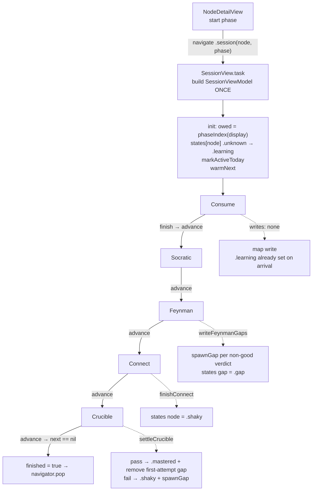
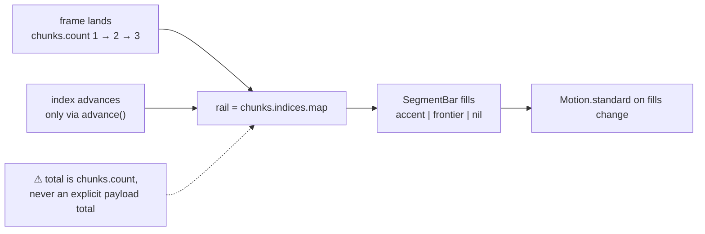
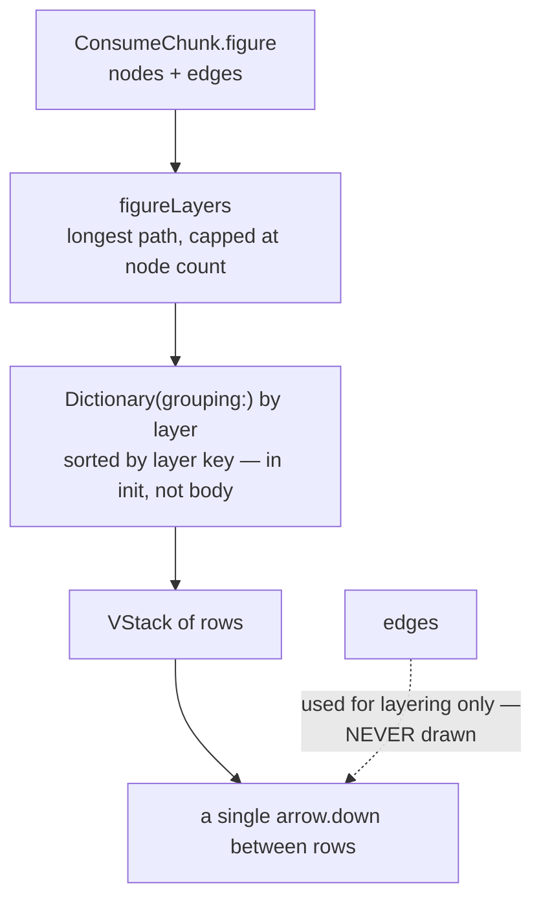
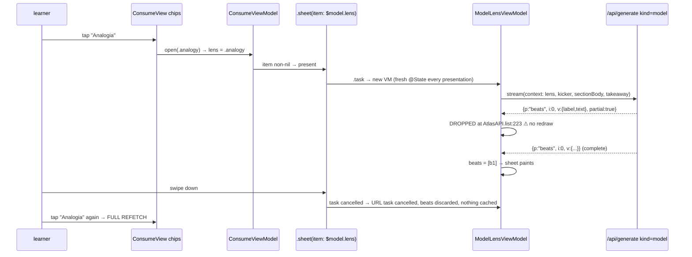
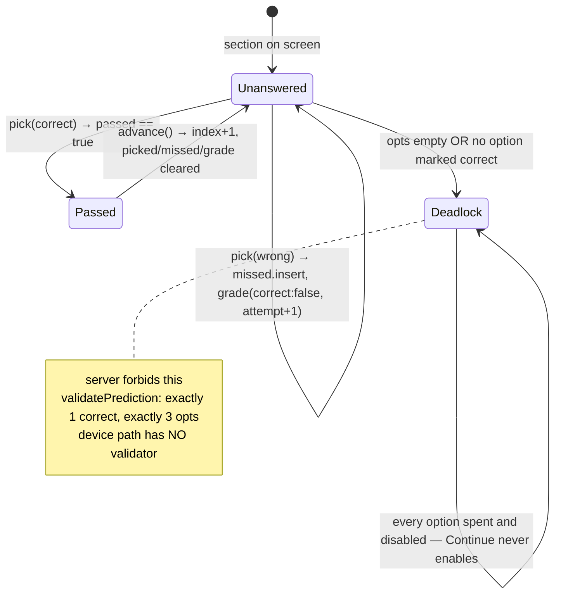
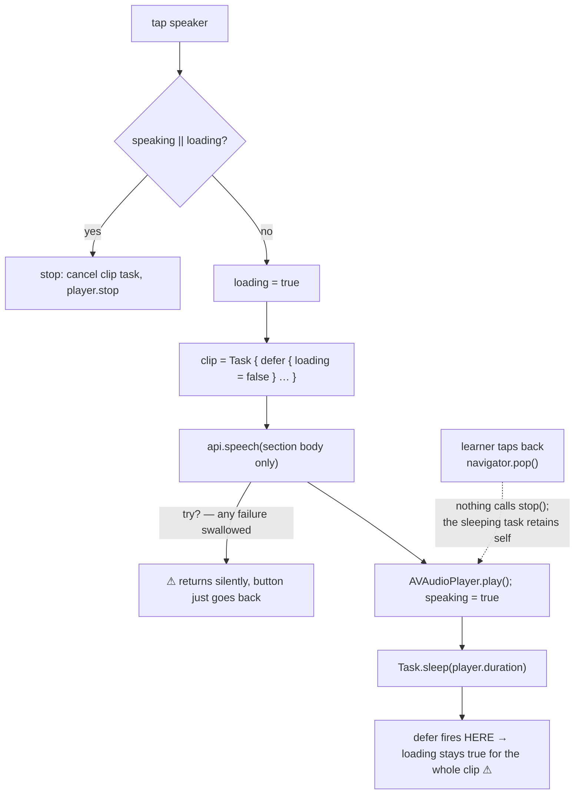
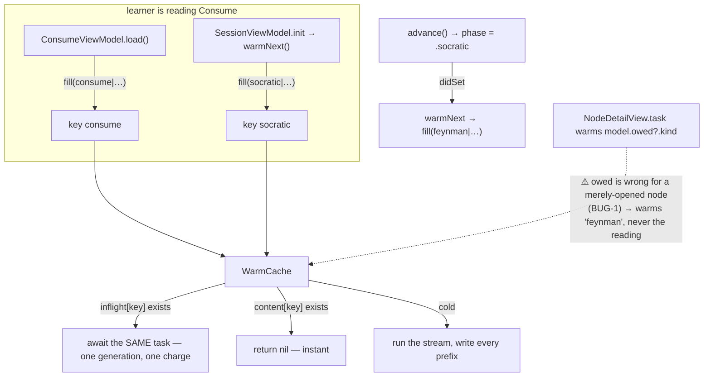

# Atlas iOS — Engineering Audit

## Area: the session spiral shell + the Consume phase (reading pass, figures, model lenses)

Files read in full: `SessionView.swift`, `SessionViewModel.swift`, `ConsumeView.swift`,
`ConsumeViewModel.swift`, `ModelLensView.swift`, `ModelLensViewModel.swift`, `FigureView.swift`,
`Domain/PhaseContent.swift`, `Tests/SessionTests.swift`. Context read: `Data/Warm.swift`,
`Data/Prompts.swift`, `Data/AtlasAPI.swift`, `Data/NDJSONStream.swift`, `Data/AtlasError.swift`,
`Core/Speech.swift`, `Core/Components.swift`, `Core/Support.swift`, `Domain/Concept.swift`,
`Data/AtlasStore.swift`, `Data/RunSnapshot.swift`, `Features/Map/NodeDetail*.swift`, `ios/AGENTS.md`,
`ios/PLAN.md`. Web comparison: `components/session/ConsumeView.tsx`, `components/session/consume/*`,
`components/atlas/useSpiral.ts`, `lib/curriculum/consume.ts`, `lib/curriculum/calibration.ts`,
`lib/api.ts`, `lib/speech.ts`, `lib/server/generate/{consume,model}.ts`, `lib/server/job.ts`,
`lib/server/stream.ts`, `lib/server/openrouter.ts`, `app/api/speech/route.ts`.

Severity scale: **S1** breaks or lies to the learner · **S2** loses work or money · **S3** degrades the
experience · **S4** polish. Each finding is labelled **Confirmed** (read off the code and its
counterpart) or **Suspected** (a real code path, but I could not run it).

---

# 1 · Session chain / phase handoff + mastery writes

## 1.1 Objective

One pass over one node runs Consume → Socratic → Feynman → Connect → Crucible as a single pushed
screen, with exactly one object owning which phase is up and every write the spiral makes to the
map. No phase screen is allowed to touch `states` or `graph` itself, so what a phase _means_ for
mastery lives in one file and can be tested without a view.

## 1.2 How it works

`SessionView` (`ios/AtlasKit/Sources/AtlasKit/Features/Session/SessionView.swift`) is a shell with no
state: it builds `SessionViewModel` once in `.task` (`SessionView.swift:42`, guarded by
`if session == nil`), then switches on `session.phase` (`:46-55`) to render one phase view. The
phase view is keyed `.id(session.phase)` (`:23`) so each phase is a fresh identity that slides in
from the trailing edge (`:24-28`); the tab bar and nav bar are hidden (`:39-41`) and the only way
back is each phase's own `PhaseBar`. When the last phase hands back, `session.finished` flips and
`.onChange` pops the stack (`:31`).

`SessionViewModel` (`Features/Session/SessionViewModel.swift`) owns three things:

- **Which phase is owed.** `init` reads `phaseIndex(store.display[node.id])` and clamps into
  `Phase.allCases` minus the trailing `.retained` (`:29-30`).
- **The mastery writes.** On arrival, a node in `.unknown` is written `.learning` (`:33-34`) and the
  streak is ticked (`:35`). `finishConnect()` lifts `.unknown`/`.learning` → `.shaky` (`:65-68`).
  `settleCrucible(_:gap:)` is the only path to `.mastered` and the only path that spawns a gap
  (`:75-92`). `writeFeynmanGaps(_:beats:)` hangs a gap per unresolved rubric row (`:97-105`).
- **Warming.** `phase` has `didSet { warmNext() }` (`:14`) and `init` calls it once explicitly
  (`:36`) because `didSet` does not fire for the initialising assignment.

`advance()` (`:58-61`) walks `Phase.next` (`Domain/Concept.swift:194-197`), which deliberately stops
before `.retained` — so Crucible's advance sets `finished` and the map takes the screen back.
`SessionTests.swift:46-57` pins that order; `:33-43` pins "arriving marks Learning, never walks
mastery backwards"; `:68-98` pins the Crucible's two outcomes; `:122-130` pins the redo path.



## 1.3 User value

The learner taps one node and gets a coherent five-screen arc with a single back arrow, and the map
behind it changes only in ways the pedagogy justifies: green is earned by transfer alone, a failure
leaves a named red sub-node they can go work on, and a redo of an earlier phase never walks their
mastery backwards.

## 1.4 Bugs

**BUG-1 · S1 · Confirmed — arriving marks Learning, and Learning means "Feynman is owed", so opening a
node and backing out skips the reading forever.**
`SessionViewModel.swift:33-34` writes `.learning` the moment the pass is constructed — before a
single section has landed. `phaseIndex(.learning)` returns `2` (`Domain/Concept.swift:247`), and
`Phase.allCases[2]` is `.feynman`. The file even carries the ponytail that names the missing guard:
_"no `readingPhaseIndex` correction — that needs `ConsumeProgress`, which arrives with Consume in
phase 5. Add the two guards there."_ (`Concept.swift:242-243`). Consume shipped; the guard did not,
and no `ConsumeProgress` equivalent exists anywhere in the iOS client (`RunSnapshot.swift` carries
the web's `consumeProgress` key through `extras` untouched, `:46-47`).

Failure scenario: a learner taps "Limites laterais" on the map, the drawer says _Começar · Consume_,
they push the session, read nothing, hit back. `states["lat"] == .learning` is now persisted. They
come back an hour later: `NodeDetailViewModel.current == 2` (`NodeDetailViewModel.swift:22`), so the
drawer draws Consume ✓ and Socratic ✓ as **done** (`NodeDetailView.swift:100-102`), the CTA reads
_Começar · Feynman_, and tapping it opens a teach-back on material they have never read. Tapping the
Consume row still works (it is `index < current`, so `open(.consume)` runs) — but the drawer has
already told them they finished it. Web: `readingPhaseIndex` (`lib/curriculum/calibration.ts:200-210`)
returns 0 while `!progress.finished` and 1 while `!progress.handedOff`, and Learning is only written
on exit and only when `idx >= 1 || finished` (`useSpiral.ts:686-696`).

**BUG-2 · S3 · Confirmed — the streak is ticked by opening a screen.**
`SessionViewModel.swift:35` calls `store.markActiveToday()` in `init`. A learner who opens a node,
sees the wrong phase and backs out has a day added to their streak with zero work done. The web ties
the day to adherence, not to a mount.

**BUG-3 · S3 · Suspected — the `.retained` branch is a trap if anything ever routes to it.**
`SessionView.swift:53` renders `Pending("Revisão")` for `.retained`, on a screen that has hidden the
tab bar, the nav bar and the back button (`:39-41`) and whose only exit is a `PhaseBar` that
`Pending` does not draw. Today the branch is unreachable — `NodeDetailView.open(_:)` forks
`.retained` to the Review tab (`NodeDetailView.swift:135-141`) and `init` clamps to `.crucible`
(`SessionViewModel.swift:30`) — so this is latent, not live. It is one careless `AtlasRoute` call
away from a screen with no way out.

## 1.5 Must-improve (ranked)

1. **Port `ConsumeProgress` and `readingPhaseIndex`.** A `ConsumeProgress`-shaped struct on
   `AtlasStore` (`idx`, `checks`, `total`, `finished`, `handedOff`), persisted in `RunSnapshot` under
   the _same_ `consumeProgress` key the web already writes, plus a `readingPhaseIndex(state:
reviewed:progress:)` in `Domain/Concept.swift` used by `SessionViewModel.swift:29` and
   `NodeDetailViewModel.swift:22`. This is the single change that fixes BUG-1, gives resume, and
   makes the phone and the browser agree about where the learner is. (`Concept.swift:244`,
   `RunSnapshot.swift:46`)
2. **Move the Learning write to the exit, gated on evidence.** `SessionViewModel.swift:33-34` should
   not fire on construction; Consume should report "one section read" and the shell should write
   `.learning` then, mirroring `exitConsume` (`useSpiral.ts:686-696`).
3. **Tie `markActiveToday()` to work, not to a mount** (`SessionViewModel.swift:35`) — move it into
   the first `advance()` or the first check passed.
4. **Give `Pending` a top bar or delete the `.retained` case** (`SessionView.swift:53`).
5. **Test the handoff, not just the writes.** `SessionTests.swift` covers `advance`/`settleCrucible`
   but nothing asserts that a fresh node opens on `.consume` after a partial read, which is exactly
   the regression BUG-1 is.

---

# 2 · Consume streamed reading pass

## 2.1 Objective

Open the reading screen in milliseconds, not seconds: sections arrive one at a time from a streamed
generation, land in the run's shared warm cache, and redraw the screen as they arrive. A pass written
by a background warm — or by the browser — opens with no wait at all.

## 2.2 How it works

`ConsumeView` builds `ConsumeViewModel` once in `.task` and awaits `load()`
(`Features/Session/Consume/ConsumeView.swift:26-30`) — correct per `ios/AGENTS.md` §MVVM. The model
holds **no sections of its own**: `chunks` is a computed read of the store's warm cache
(`ConsumeViewModel.swift:49` → `Warm.swift:197`), so any writer filling that key redraws this screen.

`load()` (`ConsumeViewModel.swift:72-77`) calls `store.consume(node)` (`Warm.swift:207-211`), which is
`warm.fill(key, live:)`. `WarmCache.fill` (`Warm.swift:54-83`) joins an in-flight task by key
(`:58`), returns immediately on a landed key (`:59`), and otherwise runs the stream, writing **every
prefix** into `content` as it arrives (`:66-69`). `AtlasAPI.list(_:_:_:)`
(`AtlasAPI.swift:214-240`) is the frame folder: it drops frames of the wrong part and every
`partial: true` frame (`:223`), fills by index rather than appending (`:224-227`), and yields
`Landed(value:raw:)` so the decoded array and the model's own JSON stay in step.

Transport is `NDJSONStreamer.frames` (`Data/NDJSONStream.swift:18-45`): one `JSONDecoder` for the
stream (`:26`), one frame per line, `__error` recognised and turned into a throw (`:30-32`), and
`continuation.onTermination` cancels the URL task when the consumer walks away (`:43`). For `consume`
the kind is **ported to the device** (`Prompts.swift:168-175`), so the frames are synthesised locally
from `OpenRouter.objects` with the ids the server would have stamped (`AtlasAPI.swift:103-122`).

```mermaid
sequenceDiagram
    participant V as ConsumeView.task
    participant M as ConsumeViewModel
    participant S as AtlasStore.consume
    participant W as WarmCache.fill
    participant A as AtlasAPI.list
    participant N as NDJSON / OpenRouter

    V->>M: load()
    M->>S: consume(node)
    S->>W: fill(key "consume|subject|node|lang|")
    alt key already landed
        W-->>M: nil  (no round trip, screen already drawn)
    else warm in flight
        W-->>M: await the SAME task (never a 2nd generation)
    else cold
        W->>A: live() stream
        loop each NDJSON line
            N-->>A: {p:"chunks", i:0, v:{...}}
            A->>A: partial == true ? DROP : decode into slot i
            A-->>W: Landed(value:[c1], raw:[...])
            W->>W: content[key] = [c1]; raw[key] = [...]; revision += 1
            W-->>V: @Observable redraw — section 1 on screen
        end
        N-->>A: {p:"__error", v:{code,message,requestId}}
        A->>W: throw AtlasError("upstream")
        W->>W: failed(key) → content[key] = nil  ⚠ EVERYTHING LANDED IS ERASED
        W-->>M: error → message = ErrorCopy.sentence(...)
    end
```

The ⚠ box is BUG-4.

## 2.3 User value

Opening a node the learner was on the map next to is instant — `MapView.swift:44` warms the two
frontier nodes' readings, so the screen is usually already written. Cold, the first section is on
screen in a couple of seconds rather than after the whole 8-15 minute pass has been generated, and a
pass written in the browser opens on the phone with no generation at all (`Warm.swift:312-327`).

## 2.4 Bugs

**BUG-4 · S1 · Confirmed — a stream that dies mid-pass erases every section that already landed, and
offers no retry.**
`WarmCache.failed(_:_:)` clears `content[key]` and `raw[key]` (`Warm.swift:139-145`) on any error
from the stream, including one thrown after three sections have been written and read. Because
`ConsumeViewModel.chunks` _is_ that cache entry (`:49`), `chunk` goes nil and `ConsumeView` falls
through to `Waiting(verbatim: model.waitingCopy, spinning: false)` (`ConsumeView.swift:58-60`) — the
prose, the figure, the check the learner just answered and their place in the pass all disappear
mid-sentence. There is no retry control anywhere on the screen; the only exit is the back arrow, and
re-entering starts the generation over from section 1.

The web does the exact opposite, and says so: _"Frames that already landed have been handed to
`onFrame` and are on screen. Throwing here does not take them back"_ (`lib/api.ts:344-347`), with the
incomplete notice pinned under the sections that survived and a retry that re-enters the node
(`components/session/ConsumeView.tsx:1113-1123`, `useSpiral.ts:255-258`). This is the single largest
behavioural drift in the area.

Note the interaction with the cache's own doctrine: "nothing incomplete is kept" (`Warm.swift:16-18`)
is right for the _cache_ — a half pass must not be served to the next caller — but it is being used
to decide what the _screen_ shows, and those are different questions.

**BUG-5 · S2 · Confirmed — the `__error` frame's `code` is thrown away, so a quota or auth death is
reported as a generic failure.**
`NDJSONStream.swift:30-32` detects the terminal frame and throws
`AtlasError(code: "upstream", message: "stream died mid-flight")` without reading `frame.v`. The
server puts `{code, message, requestId}` in that frame (`lib/server/stream.ts:245-253`) and the web
maps `v.code` onto its error vocabulary (`lib/api.ts:315-327`). On iOS every mid-stream death lands in
`ErrorCopy`'s `default` branch (`Core/Support.swift:29`) — so a learner who has hit the monthly quota
or whose token expired is told "Não conseguimos escrever sua leitura agora. Tente de novo em
instantes," which is false and unactionable, and no `requestId` reaches the log.

**BUG-6 · S2 · Confirmed — one malformed section kills the whole reading pass, and the device path has
no validator to prevent it.**
`AtlasAPI.list` decodes inside the loop (`AtlasAPI.swift:226`); a `DecodingError` finishes the stream
with a throw (`:234`), which reaches `WarmCache.fill`'s catch and triggers BUG-4. `ConsumeChunk`
requires `id`, `kicker`, `body`, `takeaway` (`PhaseContent.swift:71-86`) — and on the device path
nothing validates them: `Prompts.streamed("consume", …)` returns a ported prompt
(`Prompts.swift:171`) and `AtlasAPI.frames` yields whatever OpenRouter emitted with an id stamped on
(`AtlasAPI.swift:103-122`). The server's equivalent runs `validateConsumeSection`
(`lib/server/generate/consume.ts:74-110`) _and_ has a documented single-shot retried fallback when
nothing usable has landed yet (`:196-215`). Neither exists on device.

Failure scenario: section 4 of 5 comes back with `takeaway` missing. On the web the stream throws and
the learner keeps sections 1-3 with a retry. On iOS sections 1-3 vanish and the learner is left
staring at a generic error sentence.

**BUG-7 · S2 · Confirmed — the learner's place in the pass is not persisted anywhere.**
`index`, `picked`, `missed` and `grade` are `ConsumeViewModel` state (`:21-31`) and die with the
screen. `RunSnapshot` never writes a consume progress record — the web's `consumeProgress` column
rides through as an opaque extra (`RunSnapshot.swift:46-47`). A learner ten minutes into a five
section pass who takes a phone call and comes back re-reads from section 1 and re-answers every
check; a learner who read three sections in the browser opens the phone at section 1. `ConsumeProgress`
exists on the web precisely because "the reading pass is the longest surface in Atlas — so where the
learner got to has to outlive the screen" (`lib/curriculum/consume.ts:147-159`).

**BUG-8 · S4 · Suspected — a warm that lands after a map switch can be filed into the new run's cache
row.** `WarmCache.clear()` empties `inflight` but deliberately lets running tasks finish
(`Warm.swift:111-116`), and those tasks then call `self.write(key, …)` on the _same_ `content`/`raw`
dictionaries (`:120-124`). `cachesRow(over:)` files by `cacheSlot`, which reads `kind` and `nodeId`
and **ignores the subject** (`Warm.swift:348-352`), so a late-landing reading for subject A is
uploaded into subject B's `caches` column under the same node id. It only bites when two maps share a
node id, which model-generated slugs make unlikely but not impossible.

## 2.5 Must-improve (ranked)

1. **Keep what landed on a mid-stream failure.** `WarmCache.fill` should distinguish "failed with
   nothing" from "failed with a usable prefix": keep the prefix in `content` (and out of
   `raw`/`revision`, so it is never uploaded or served as complete), and hand the caller both the
   error _and_ the fact that a prefix survived. (`Warm.swift:63-83`, `:139-145`)
2. **Give Consume the web's incomplete notice + retry.** A row under the last landed section with
   `ErrorCopy.sentence` and a "Tentar de novo" that re-runs `load()`; today the only affordance is
   back. (`ConsumeView.swift:58-60`, `ConsumeViewModel.swift:72-77`)
3. **Read the `__error` payload.** Decode `v.code`/`v.message`/`v.requestId` in
   `NDJSONStream.swift:30-32` into the thrown `AtlasError` so `ErrorCopy` can speak and the log can
   be joined to the server's.
4. **Skip a bad section instead of killing the pass.** Catch the per-frame decode in
   `AtlasAPI.list` (`:226`) and drop that slot, or port `validateConsumeSection` next to
   `Prompts.consume` — the device path is generating unvalidated pedagogy today.
5. **Persist `ConsumeProgress`** (see §1.5.1) — same change, two features.
6. **Cache the key string.** `chunks` builds a `String` key and does an `as?` cast on every access
   (`Warm.swift:190-197`), and `chunk`, `next`, `rail` and `spoken` each call it, several times per
   redraw during the section-turn animation. Store the key once per view model.

---

# 3 · Section progress rail

## 3.1 Objective

Say, in one 3pt line at the top of the screen, how many sections this reading has, which one the
learner is on, and which are behind them — the only element on the page that says "you moved".

## 3.2 How it works

`ConsumeViewModel.rail` maps `chunks.indices` to one optional colour per section: accent for read,
`NodeState.frontier.color` for the current index, nil for not-yet-reached
(`ConsumeViewModel.swift:61-63`). `ConsumeView` hands it to the shared `SegmentBar(model.rail,
height: 3)` (`ConsumeView.swift:41-43`), which draws capsules and animates on any change to `fills`
(`Core/Components.swift:298-317`). `index` advances only through `advance()`
(`ConsumeViewModel.swift:87-95`), which also clears the check state for the new section.



## 3.3 User value

The learner can see the pass is four sections long and that they are on the second, which is what
turns "an endless wall of text" into "eight more minutes".

## 3.4 Bugs

**BUG-9 · S3 · Confirmed — the rail's total is `chunks.count`, so it grows under the learner while the
pass streams.**
`ConsumeViewModel.swift:61` derives the segment count from the array length; the NDJSON frames carry
no explicit total and nothing memoises a high-water mark. On a cold open the rail is one segment
(implying "one section, you're done"), then two, then four. The web has the same live count but
compensates twice: it suppresses the section count in the intro copy while `streaming`
(`components/session/ConsumeView.tsx:602-607` — _"fall back to the no-count phrasing rather than
announcing a number that's about to change"_) and it persists `ConsumeProgress.total` with
`Math.max(chunks.length, before?.total ?? 0)` so a re-entry can never shrink it
(`useSpiral.ts:625-628`, `lib/curriculum/consume.ts:180-183`). iOS has neither.

**BUG-10 · S3 · Confirmed — the rail is invisible to VoiceOver.**
`SegmentBar` is a `ForEach` of `Capsule`s with no `accessibilityElement`, label or value
(`Components.swift:298-317`), so the only progress indicator on the screen announces nothing. The
web's rail is a row of real `<button>`s with `aria-label={t.jumpTo(i+1, sectionName(c.kicker))}` and
`aria-current="step"` (`ConsumeView.tsx:497-520`) — and doubles as navigation back to a section
already read, which iOS also lacks.

## 3.5 Must-improve (ranked)

1. **Hold a high-water total in the view model** and feed the rail from `max(chunks.count,
seenTotal)`; persist it with the rest of `ConsumeProgress`. (`ConsumeViewModel.swift:61-63`)
2. **Make the rail speak**: one accessibility element on `SegmentBar` with a value of
   "seção 2 de 4". (`Components.swift:298-317`)
3. **Consider tap-to-jump** for sections already read, as the web has — cheap on a rail that already
   knows the index of each segment.

---

# 4 · Figures

## 4.1 Objective

Dual-code the reading: when a section is structural, draw the model's box-and-arrow description of it
next to the prose, laid out from the graph itself rather than from per-section artwork, and never let
a model-authored cycle hang the renderer.

## 4.2 How it works

`ConsumeChunk.figure` is an optional `ConsumeFigure` of `nodes` + `edges`
(`Domain/PhaseContent.swift:36-41`, `:83`). `figureLayers(_:)` (`:46-60`) is a longest-path
relaxation capped at the node count — a direct port of `lib/curriculum/consume.ts:75-89` — so a cycle
costs `n` passes and then stops. `FigureView.init` runs it **once** and buckets the nodes into rows
(`Features/Session/Consume/FigureView.swift:9-14`), explicitly to keep the walk out of `body`.
`body` then draws each row as an `HStack` of labelled boxes with a single `arrow.down` glyph between
rows (`:16-36`). The caption (`chunk.diagram`) is drawn under it and only when a figure exists
(`ConsumeView.swift:109-115`), matching the server's rule that `diagram` and `figure` are omitted
together (`lib/server/generate/consume.ts:97-99`). `SessionTests.swift:100-119` pins the cycle
behaviour and a two-node chain.



## 4.3 User value

A process or a hierarchy gets a picture that is actually about this section, and a model that writes
a loop produces a flat diagram instead of a spinning phone.

## 4.4 Bugs

**BUG-11 · S3 · Confirmed — the figure draws layers, not edges, so it asserts relationships the model
never wrote.**
`FigureView.swift:18-24` emits one `arrow.down` between consecutive rows and never consults
`figure.edges` again after layering. A figure with two independent chains (`a→b`, `c→d`) renders as
`[a c] ↓ [b d]`, which reads as "a and c both feed b and d". A cross edge (`a→c` where both are in
row 0 by another path) is silently invisible. The web draws every edge as its own arrowed path
between the two boxes it actually connects (`components/session/consume/Figure.tsx:108-130`). The
mobile design may well justify simplifying the drawing, but not to the point of implying edges that
do not exist.

**BUG-12 · S4 · Suspected — duplicate node ids from the device path corrupt the layout.**
`ConsumeFigure.Node` is `Identifiable` on the model's own `id` (`PhaseContent.swift:37`) and
`FigureView` iterates `ForEach(layer)` (`:26`). The server rejects duplicate ids
(`lib/server/generate/consume.ts:29-30`), but `consume` runs on the device with no validator
(`Prompts.swift:171`), so a model that writes two boxes called `"a"` produces a SwiftUI duplicate-ID
`ForEach`, which drops or mis-diffs rows.

**BUG-13 · S4 · Confirmed — edge labels are dropped.** `ConsumeFigure.Edge` decodes only `from`/`to`
(`PhaseContent.swift:38`); the prompt asks the model for `"label": "≤3 words, optional"`
(`Prompts.swift:88`) and the web renders it. The tokens are generated and paid for, then discarded.

## 4.5 Must-improve (ranked)

1. **Draw the real edges.** A `Canvas` overlay over the laid-out boxes, or at minimum suppress the
   inter-row arrow when the rows are not fully connected. (`FigureView.swift:16-36`)
2. **De-duplicate ids in `init`** before grouping (`FigureView.swift:9-14`) — one line, and it makes
   the view total over anything the device path can emit.
3. **Give the figure an accessibility label** from `chunk.diagram`; today it is an unlabelled stack of
   `Text` that VoiceOver reads as loose words. The web sets `role="img"` + `<title>`
   (`Figure.tsx:96-99`).
4. **Decode and draw `edge.label`** when the edges arrive (`PhaseContent.swift:38`).

---

# 5 · Model lenses (Simpler / Example / Analogy / Go deeper)

## 5.1 Objective

Give a learner who did not follow a section a second route through _that section_ without taking the
section away: four chips open a sheet over the prose that walks the same material a beat at a time,
generated on demand for this section's exact wording.

## 5.2 How it works

`AltKey` is the four-case enum with localised labels (`Domain/PhaseContent.swift:14-27`). The chips
are a `LazyVGrid` over `AltKey.allCases` calling `model.open(key)`
(`ConsumeView.swift:137-152` → `ConsumeViewModel.swift:98`), which sets `lens`, and
`.sheet(item: $model.lens)` presents `ModelLensView` at `.medium`/`.large` detents
(`ConsumeView.swift:72-76`). The context is built by `ConsumeViewModel.lensContext(_:)`
(`:111-119`): the shared node context plus `lens`, `kicker`, `sectionBody`, `takeaway` — exactly the
keys `lib/server/job.ts:370-403` reads, so the request is contract-correct and hits the server's
content cache keyed on the section's own prose.

`ModelLensView` builds its view model in `.task` (`ModelLensView.swift:30-34`) and
`ModelLensViewModel.load()` iterates `api.model(context)` directly — **not** through `WarmCache** —
assigning the whole landed array on every frame (`ModelLensViewModel.swift:22-29`). `model` is not a
ported kind (`Prompts.streamed`returns nil for it,`Prompts.swift:173`), so it goes to
`/api/generate`with`stream: true` (`AtlasAPI.swift:86-94`).



## 5.3 User value

The section the learner is stuck on stays exactly where it was, scrolled where they left it, while a
plainer or deeper walk-through opens over it — and the four chips are offered on every section with
nothing to wait for, because they are generated only when tapped.

## 5.4 Bugs

**BUG-14 · S3 · Confirmed — `partial: true` frames are dropped, so the lens sheet sits blank through
the whole first beat.**
`AtlasAPI.list` skips every partial frame (`AtlasAPI.swift:223`), with the comment that a partial is
"a redraw of prose elsewhere but not something a list can hold". For `model` that "elsewhere" is
exactly here: the server _does_ emit partials for this kind
(`lib/server/generate/model.ts:155-160`, produced by `streamJsonObjectsProgressive` with the
`draftConsumeModelBeat` repairer, `openrouter.ts:563-577`), and its whole design note is that
"`label` is written before `text`, so a redraw with a label and no prose is still worth showing"
(`model.ts:45-46`). The web renders them (`useSpiral.ts:445-455`). On iOS the sheet shows only
"Escrevendo…" until a complete beat closes its brace — several seconds of nothing on a surface the
learner opened _because_ they were stuck. Note the good half: nothing anywhere assembles partials, so
the "never assemble" rule is honoured; the "must redraw" half is simply unimplemented.

**BUG-15 · S2 · Confirmed — the lens is regenerated on every open; nothing is cached, and a dismissed
sheet throws away beats already paid for.**
`ModelLensViewModel` holds its beats in its own property (`:9`) and streams straight off the API
(`:25`); `ModelLensView`'s `@State model` (`:9`) is fresh on every presentation. Close the sheet
half-way through and every beat that landed is gone; reopen the same lens on the same section and it
is fetched again. The web keys `modelCache` on `(nodeId, chunkId, lens)`, joins in-flight warms
rather than duplicating them, and additionally warms the _same lens on the next section_ on the
theory that the lens a learner reaches for is the one they reach for again
(`useSpiral.ts:411-470`). The server's `content_cache` absorbs the model spend on a repeat
(`job.ts:394`), so this is latency and quota rather than money — but on a flaky connection it is the
learner's help vanishing.

**BUG-16 · S3 · Confirmed — a nil context produces a silent, permanently empty sheet.**
`ModelLensViewModel.load()` returns immediately when `context == nil`
(`ModelLensViewModel.swift:23`), leaving `beats` empty and `message` empty. `ModelLensView` then
renders the kicker plus `Waiting(spinning: true)` forever (`:20-22`) — a spinner for a request that
was never made. `lensContext` returns nil whenever `chunk` is nil
(`ConsumeViewModel.swift:112`).

**BUG-17 · S3 · Confirmed — §6's adaptive modality is entirely absent.**
Nothing tallies which lens the learner opens (`ConsumeViewModel.open(_:)` is one assignment,
`:98`), so there is no learned default marked on later sections, no "sua preferência" caption, and
no missing-prerequisite flag when a learner leans on _Simpler_ three times — all of which the web
implements off the same four chips (`ConsumeView.tsx:158-166`, `:986-1004`; `preferredModality`,
`lib/curriculum/consume.ts:226-237`). The lens note under the title (`lensNote`, `consume.ts:263-279`)
is also missing, so the sheet does not say what the lens promises.

**BUG-18 · S4 · Confirmed — opening a lens does not stop read-aloud.** `open(_:)`
(`ConsumeViewModel.swift:98`) does not call `speaker.stop()`, unlike `advance()` and `finish()`
(`:88`, `:105`), so the section keeps being read aloud under the sheet.

**BUG-19 · S4 · Confirmed — `lensContext(key)` is computed in `body`.** `ConsumeView.swift:73` calls
it inside the sheet builder, which `ios/AGENTS.md` §MVVM explicitly forbids ("a view … computes
nothing in `body` that a stored property could carry"). Harmless today because the sheet builder runs
once per presentation, but it is the pattern the rule exists to stop.

## 5.5 Must-improve (ranked)

1. **Route the lens through `WarmCache`** with a key of `model|subject|nodeId|chunkId|lens|language`,
   so a reopen is a state change and a dismissed sheet keeps what landed.
   (`ModelLensViewModel.swift:22-29`, `Warm.swift:190-192`)
2. **Render partial beats.** A second folding path in `AtlasAPI` — or a `partial`-aware variant of
   `list` — that yields the redraw for the in-progress slot without ever writing it to
   `content`/`raw`. This is the only place in the app that loses a designed behaviour to the blanket
   partial drop. (`AtlasAPI.swift:214-240`)
3. **Never leave the sheet silent**: make `lensContext` non-optional (the chip is only tappable when a
   chunk exists) or show an error sentence when it is nil. (`ModelLensViewModel.swift:23`)
4. **Add the modality tally and the learned default** — it is one `[AltKey: Int]` on `AtlasStore` and
   a border tint on the chip, and it closes SPEC §6 on mobile. (`ConsumeViewModel.swift:98`)
5. **Stop read-aloud when a lens opens** (`ConsumeViewModel.swift:98`) and **hoist `lensContext` out of
   `body`** (`ConsumeView.swift:73`).

---

# 6 · The comprehension check gate

## 6.1 Objective

Make each section close on a receipt: one short question answerable only by someone who read _this_
section, whose right answer is what earns Continue. A miss is a re-read, not a dead end — the missed
option is spent, everything else stays live.

## 6.2 How it works

`ConsumePrediction` is `q` + `opts[{label, correct}]` + `right`/`wrong`
(`Domain/PhaseContent.swift:63-69`), optional on the chunk so pre-check cached content stays ungated
(`:84-85`). The gate is one computed property:

```swift
var passed: Bool {                                   // ConsumeViewModel.swift:54-58
    guard let check = chunk?.check else { return true }
    guard let picked else { return false }
    return check.opts[safe: picked]?.correct == true
}
```

`pick(_:)` (`:79-85`) refuses once `passed`, refuses an option already in `missed`, records the miss,
and bumps `CheckGrade.attempt` so a second miss is a distinct haptic event (`:7-10`,
`ConsumeView.swift:68-71`). The view disables an option once it is spent
(`ConsumeView.swift:203`), marks green/amber via `mark(_:_:_:)` (`:244-248`), tints the card's border
by verdict (`:252-255`), and both Continue and the finish CTA carry `.disabled(!model.passed)`
(`:263`, `:270`). `advance()` clears `picked`/`missed`/`grade` for the new section (`:87-95`).



## 6.3 User value

The learner cannot skim four sections and arrive at Socratic with nothing in their head; and because a
miss only spends that option, a wrong guess sends them back into the prose instead of ending the
section.

## 6.4 Bugs

**BUG-20 · S1 · Confirmed as a reachable code path — a check with no correct option deadlocks the
section with no way out but back.**
`passed` can only become true by finding an option with `correct == true`
(`ConsumeViewModel.swift:57`). Every wrong pick permanently disables its row
(`ConsumeView.swift:203`). If the payload has zero correct options — or an empty `opts` array — the
learner exhausts the options, every row goes grey, Continue and the finish CTA stay at 0.5 opacity
and disabled (`:263-271`), and the screen offers no skip, no reveal and no retry. The server makes
this impossible (`validatePrediction` fails unless `opts.length === 3` and exactly one is correct,
`lib/server/generate/consume.ts:53-62`) — but **`consume` runs on the device, where no validator
runs at all** (`Prompts.swift:171`, `AtlasAPI.swift:103-122`). Backing out is the only exit, and
because nothing is persisted (BUG-7) the whole section is re-read afterwards.

**BUG-21 · S3 · Confirmed — the check is on screen from the moment the section is, so it can be
answered without reading.**
`ConsumeView.swift:154` renders the check inline at the bottom of the section as soon as the chunk
exists. The web deliberately holds it back behind an `IntersectionObserver` with
`rootMargin: "0px 0px -15% 0px"` — _"not merely peeking over the fold — the end of the section has to
be properly on screen"_ (`components/session/consume/SectionCheck.tsx:23-35`). On iOS a learner can
scroll straight past the prose, tap until green, and Continue. The gate still works as a gate; it
just no longer implies reading.

**No deadlock and no bypass found in the ordinary path.** `passed` returning `true` for a chunk with
no `check` (`ConsumeViewModel.swift:55`) is the documented legacy-content behaviour and matches the
web (`ConsumeView.tsx:648`). `pick` is idempotent after a pass. `advance()` is only reachable when
`next != nil` (`ConsumeView.swift:261`), so `index` can never run past the array.

## 6.5 Must-improve (ranked)

1. **Make the gate un-deadlockable.** Either validate on decode — reject a `check` whose `opts` do not
   contain exactly one `correct`, and treat the section as ungated (`PhaseContent.swift:63-69`) — or
   reveal the answer after the last live option is spent. Both are cheap; the first is the honest one.
2. **Reveal the check on scroll-to-end**, matching `SectionCheck`'s observer, e.g. with an
   `onScrollVisibilityChange` on the check card. (`ConsumeView.swift:154`)
3. **Persist `checks` per chunk id** so a passed check stays passed across a re-entry — the reason the
   web keeps it in `ConsumeProgress` rather than in session state
   (`lib/curriculum/consume.ts:171-176`).
4. **There is no test for any of this.** `SessionTests.swift` covers the spiral and `figureLayers` and
   nothing else in Consume: `passed`, `pick`, the miss set and `advance`'s reset are all untested,
   and they are the rules that gate the phase.

---

# 7 · Read-aloud in Consume

## 7.1 Objective

The reading pass is the one surface in Atlas long enough to be worth listening to. A speaker in the
phase bar reads the section on screen, one clip at a time, with the provider key never leaving the
server.

## 7.2 How it works

The control is drawn only when the learner has the setting on (`ConsumeView.swift:38`), is disabled
without a chunk (`:91`), and dims while `speaker.loading` (`:92`). It calls
`ConsumeViewModel.toggleReadAloud()` (`:100`), which passes `spoken` — the section's body paragraphs
joined with spaces (`:66`) — to `Speaker.toggle(_:api:)` (`Core/Speech.swift:29-50`). That posts to
`/api/speech`, decodes base64 audio (`AtlasAPI.swift:335-345`), forces the shared `AVAudioSession`
back to `.playback` (in case dictation left it on `.record`), plays, and sleeps for the clip's
duration before stopping itself. `advance()` and `finish()` both stop it
(`ConsumeViewModel.swift:88`, `:105`).



## 7.3 User value

A learner can put the phone down and listen to a section, and the control answers immediately —
symbol swap plus a variable-colour pulse while it speaks.

## 7.4 Bugs

**BUG-22 · S2 · Confirmed — the audio keeps playing after the learner leaves the screen.**
The back arrow is `PhaseBar(… back: { navigator.pop() })` (`ConsumeView.swift:37`) and nothing on that
path calls `speaker.stop()`. Popping releases the view, but the in-flight clip `Task` captures `self`
strongly and is parked in `Task.sleep(for: .seconds(player.duration))` (`Speech.swift:47`), so the
`Speaker` — and its `AVAudioPlayer` — stay alive and audible for the rest of the clip, over the map.
The web does exactly the opposite and says why: `onClick={() => { reading.cancel(); onExit(); }}`
(`components/session/ConsumeView.tsx:428-431`), plus _"the hook cancels on unmount, since the audio
element would otherwise keep talking after the learner leaves"_ (`:110-113`).

**BUG-23 · S3 · Confirmed — `loading` stays true for the entire clip, so the speaker button is drawn
as "still loading" the whole time it speaks.**
`defer { loading = false }` sits at the top of the clip closure (`Speech.swift:33`) and therefore runs
when the _closure_ ends — after the `Task.sleep(player.duration)` on `:47`. `ConsumeView.swift:92`
applies `.opacity(model.speaker.loading ? 0.4 : 1)`, so the control sits at 40% for the whole clip,
which is precisely the state the flag exists to distinguish ("a tap that looks like nothing happened
is the failure mode read-aloud actually has", `Speech.swift:19-20`).

**BUG-24 · S3 · Confirmed — every read-aloud failure is silent.**
`guard let audio = try? await api.speech(text) … else { return }` (`Speech.swift:34-36`) swallows
auth failures, a 429 from the TTS provider, a deploy with TTS switched off (`/api/speech` returns
`notfound`, `app/api/speech/route.ts:43`) and — importantly — `text_too_long`, since the route caps
input at 4 000 characters (`:24`, `:53`) and iOS sends the section's whole body as one request
(`ConsumeViewModel.swift:66`). A five-paragraph section can exceed that. In every one of those cases
the button flickers and does nothing. The web added a visible `readingFailedNote` for exactly this
regression (`ConsumeView.tsx:692-706`).

**BUG-25 · S4 · Confirmed — what is spoken and what is on screen disagree.**
`spoken` is the body paragraphs only (`ConsumeViewModel.swift:66`); the web reads prose **plus the
worked example's title and steps plus the takeaway** (`segmentsForChunk`, `lib/speech.ts:57-63`). A
listener hears the explanation and not the worked example that follows it.

## 7.5 Must-improve (ranked)

1. **Stop the clip on the way out.** Either give `PhaseBar`'s `back` closure a
   `model.stopReadAloud()` (`ConsumeView.swift:37`) or make the clip `Task` capture `self` weakly and
   bail when the view model is gone (`Speech.swift:32`). The first is the honest fix; do both.
2. **Move `defer { loading = false }` above the sleep** — set `loading = false` the moment
   `player.play()` succeeds (`Speech.swift:33`, `:44-47`).
3. **Surface a failure.** Give `Speaker` a `message`/`failed` flag and draw the web's one-line note in
   the phase bar (`Speech.swift:34`, `ConsumeView.swift:79-93`).
4. **Segment the request** the way `segmentsForChunk` does — under the 4 000-char cap, first audio
   sooner, and the clips share the server's cache with the browser
   (`ConsumeViewModel.swift:66`, `app/api/speech/route.ts:24`).

---

# 8 · One-phase-ahead warming

## 8.1 Objective

Never make a screen wait on a model. While the learner is reading, write what they will need next, so
the next tap is a state change rather than a round trip — and make sure a warm and the tap that beats
it never become two generations or two charges.

## 8.2 How it works

Three call sites warm, and all three go through one store function:

- `MapView.swift:44` — the two frontier nodes' readings, on the map.
- `NodeDetailView.swift:26` — the phase the drawer says is owed, on open.
- `SessionViewModel.warmNext()` (`:42-45`) — `phase.next?.kind`, on construction (`:36`) and on
  every phase change (`:14`).

`AtlasStore.warmUp(_:for:)` fires an unstructured `Task` per kind (`Warm.swift:249-260`), each landing
in the same `warm.fill(key:…)` the foreground click uses. The key is built in exactly one place
(`Warm.swift:190-192`) from `kind|subject|nodeId|language|inputs`, and the context is built in exactly
one place (`:160-178`), which is what makes the warm and the click address the same content. `fill`
dedupes by key with no suspension between the check and the `inflight` write
(`:58-59`, `:81`), so two callers can never both start one — pinned by
`WarmTests.swift:36-53`. A failure erases the key so the next caller retries rather than inheriting it
(`:139-145`, pinned by `WarmTests.swift:56-70`).

Cancellation is deliberately _not_ propagated: `warm.fill` awaits an unstructured `Task`, so a learner
who backs out mid-stream does not cancel the generation — the content still lands in the cache for
the next visit ("a warm that outlives the screen that started it is the whole point", `Warm.swift:60-62`).
The lens sheet is the opposite: it streams outside the cache, so dismissing it _does_ cancel the
request via `NDJSONStreamer`'s `onTermination` (`NDJSONStream.swift:43`).



## 8.3 User value

Continue at the end of the reading opens Socratic with the script already written; the map's frontier
nodes open their reading with the first section already on screen. And clicking through early costs
the remainder of a request already running, never a second one.

## 8.4 Bugs

**BUG-26 · S2 · Confirmed — the drawer warms the wrong kind for exactly the nodes a learner is about to
read.** `NodeDetailView.swift:26` warms `model.owed?.kind`, and `owed` is derived from the
uncorrected `phaseIndex` (`NodeDetailViewModel.swift:22-31`). For a node marked `.learning` by BUG-1
that is `"feynman"` — so opening the drawer pays for a teach-back rubric the learner will not reach
while the reading they are one tap away from is never warmed. The wasted generation is real spend.

**BUG-27 · S3 · Confirmed — a failed warm is invisible and un-retried until the tap.**
`warmUp` discards the returned error (`Warm.swift:249-260`), which is the documented design ("a warm
nobody is watching that fails is retried by the click that needed it", `:247-248`). Combined with
BUG-4 that is a thinner safety net than it reads: the click's retry is the _only_ retry, and if that
one dies mid-stream the learner is left with the erased screen and no control to try again.

**BUG-28 · S4 · Confirmed — nothing warms the reading on the review path.** `ReviewView.swift:208`
pushes `.session(node, phase: nil)` with no preceding `warmUp("consume", …)`, so a session started
from Review is always cold. Cheap to fix and consistent with the two other entry points.

## 8.5 Must-improve (ranked)

1. **Fix `owed`** (§1.5.1) — the warm is only as good as the phase derivation behind it.
   (`NodeDetailView.swift:26`, `NodeDetailViewModel.swift:22`)
2. **Let a failed foreground fill be retried in place** rather than only by re-entering the node
   (`Warm.swift:139-145`, `ConsumeViewModel.swift:72-77`) — see §2.5.
3. **Warm from Review** (`ReviewView.swift:208`).
4. **Guard the late-landing write across a map switch**: have `WarmCache.clear()` bump a generation
   token that `write` checks, so a task started for the previous run cannot re-populate `content`
   (`Warm.swift:111-124`) — closes BUG-8.

---

# Cross-cutting notes

**Localisation.** Every user-visible string in this area is a catalogue key and every one of them is
`translated` in `en`: the wait line, the speaker label, "Ver de outro jeito", "Checagem",
"Entendido", the check hint, "Correto"/"Tente outra", "Continuar · %@", "Leitura complementar · %@",
"Escrevendo a próxima seção…", "Seguir para o Socrático →", "Escrevendo…", and the four `AltKey`
labels (verified against `ios/App/Resources/Localizable.xcstrings`). Model-authored text correctly
uses `Text(verbatim:)`/`Kicker(verbatim:)` throughout (`ConsumeView.swift:100-131`,
`ModelLensView.swift:17-18`), so no section prose can be mistaken for a key. **No localisation gaps
found in this area.** The one adjacent gap is behavioural, not textual: `AtlasAPI.language` decides
the warm key (`Warm.swift:191`), so switching language mid-run correctly re-generates rather than
serving Portuguese sections to an English UI.

**Deliberate mobile scope.** `ios/PLAN.md:86` fixes screen 14 as "section progress rail, prose,
figure, lens chips, check block". Measured against that, the following web features are _absent by
design_ and I have not filed them as bugs — but they are the drift a reviewer will ask about:

| Web feature                                                          | iOS                                                                                                                                   | Note                                                                                                    |
| -------------------------------------------------------------------- | ------------------------------------------------------------------------------------------------------------------------------------- | ------------------------------------------------------------------------------------------------------- |
| `passage` / "ask about this" (highlight → question, streamed answer) | **not implemented at all** — no `ask` field on `ConsumeChunk` (`PhaseContent.swift:71-86`), no `passage` kind in `AtlasAPI`, no panel | the largest single omission; `lib/server/generate/passage.ts` and `job.ts:404-425` are ready and unused |
| Pre-taught `terms` pills                                             | not decoded                                                                                                                           | `terms` is in the prompt (`Prompts.swift:75`) and paid for on every section                             |
| Collapse a section to its takeaway ("já sei isso")                   | absent                                                                                                                                |                                                                                                         |
| The closing recap beat before Socratic                               | absent — `finish()` jumps straight to Socratic (`ConsumeViewModel.swift:103-107`)                                                     | web: `finishConsume` → recap → `beginSocraticFromConsume` (`useSpiral.ts:1899-1910`)                    |
| "I know this" → skip to Crucible, from the reading header            | absent                                                                                                                                | `useSpiral.ts:1912-1917`                                                                                |
| Minutes-left estimate                                                | absent                                                                                                                                |                                                                                                         |
| Missing-prerequisite flag on 3× Simpler                              | absent                                                                                                                                | see BUG-17                                                                                              |

**View-model construction.** All three view models in this area are built in `.task` and guarded
(`SessionView.swift:42`, `ConsumeView.swift:26-30`, `ModelLensView.swift:30-34`) — no rebuild-in-body,
no double generation from a parent redraw. The one place a model _is_ rebuilt is
`ModelLensViewModel` on each sheet presentation, which is correct SwiftUI but costs a refetch because
the lens has no cache (BUG-15).

# Findings index

| #   | Feature       | Severity | Status         | File:line                                                  |
| --- | ------------- | -------- | -------------- | ---------------------------------------------------------- |
| 1   | Session chain | S1       | Confirmed      | `SessionViewModel.swift:33-34`, `Concept.swift:244-251`    |
| 2   | Session chain | S3       | Confirmed      | `SessionViewModel.swift:35`                                |
| 3   | Session chain | S3       | Suspected      | `SessionView.swift:53`                                     |
| 4   | Reading pass  | S1       | Confirmed      | `Warm.swift:139-145`, `ConsumeView.swift:58-60`            |
| 5   | Reading pass  | S2       | Confirmed      | `NDJSONStream.swift:30-32`                                 |
| 6   | Reading pass  | S2       | Confirmed      | `AtlasAPI.swift:226-235`, `Prompts.swift:171`              |
| 7   | Reading pass  | S2       | Confirmed      | `ConsumeViewModel.swift:21-31`, `RunSnapshot.swift:46`     |
| 8   | Reading pass  | S4       | Suspected      | `Warm.swift:111-124`, `:348-352`                           |
| 9   | Progress rail | S3       | Confirmed      | `ConsumeViewModel.swift:61-63`                             |
| 10  | Progress rail | S3       | Confirmed      | `Components.swift:298-317`                                 |
| 11  | Figures       | S3       | Confirmed      | `FigureView.swift:18-24`                                   |
| 12  | Figures       | S4       | Suspected      | `FigureView.swift:26`, `PhaseContent.swift:37`             |
| 13  | Figures       | S4       | Confirmed      | `PhaseContent.swift:38`                                    |
| 14  | Model lenses  | S3       | Confirmed      | `AtlasAPI.swift:223`, `model.ts:155-160`                   |
| 15  | Model lenses  | S2       | Confirmed      | `ModelLensViewModel.swift:22-29`, `ModelLensView.swift:31` |
| 16  | Model lenses  | S3       | Confirmed      | `ModelLensViewModel.swift:23`                              |
| 17  | Model lenses  | S3       | Confirmed      | `ConsumeViewModel.swift:98`                                |
| 18  | Model lenses  | S4       | Confirmed      | `ConsumeViewModel.swift:98`                                |
| 19  | Model lenses  | S4       | Confirmed      | `ConsumeView.swift:73`                                     |
| 20  | Check gate    | S1       | Confirmed path | `ConsumeViewModel.swift:54-58`, `ConsumeView.swift:203`    |
| 21  | Check gate    | S3       | Confirmed      | `ConsumeView.swift:154`                                    |
| 22  | Read-aloud    | S2       | Confirmed      | `ConsumeView.swift:37`, `Speech.swift:32-49`               |
| 23  | Read-aloud    | S3       | Confirmed      | `Speech.swift:33`, `:47`, `ConsumeView.swift:92`           |
| 24  | Read-aloud    | S3       | Confirmed      | `Speech.swift:34`, `app/api/speech/route.ts:24`            |
| 25  | Read-aloud    | S4       | Confirmed      | `ConsumeViewModel.swift:66`                                |
| 26  | Warming       | S2       | Confirmed      | `NodeDetailView.swift:26`                                  |
| 27  | Warming       | S3       | Confirmed      | `Warm.swift:249-260`                                       |
| 28  | Warming       | S4       | Confirmed      | `ReviewView.swift:208`                                     |

## The four fixes that matter most

1. **BUG-1** — port `ConsumeProgress` + `readingPhaseIndex`. It is the one defect that makes the app
   lie to the learner about what they have done, and it drags BUG-7, BUG-26 and half the resume story
   with it.
2. **BUG-4** — stop erasing the sections that landed. Ten minutes of reading currently vanishes on a
   dropped connection, with no retry on screen.
3. **BUG-20** — make the check gate un-deadlockable now that `consume` is generated on-device with no
   validator behind it.
4. **BUG-22** — stop the clip when the learner leaves. Audio that follows you back to the map is the
   kind of bug people uninstall over.
