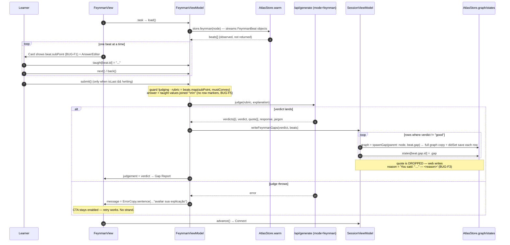
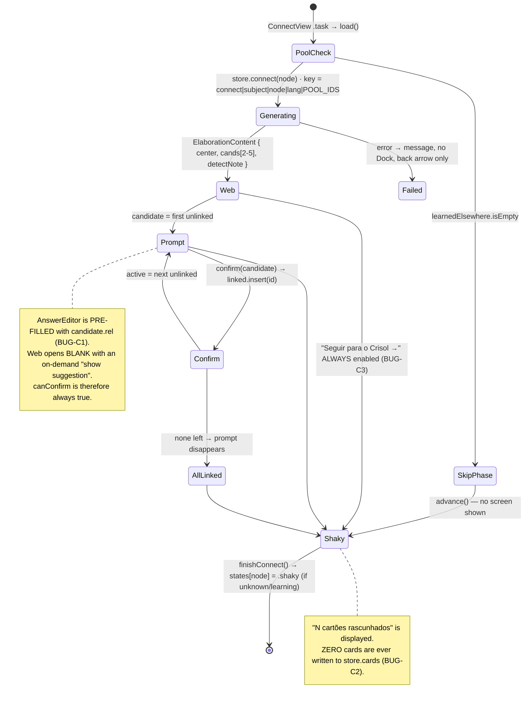
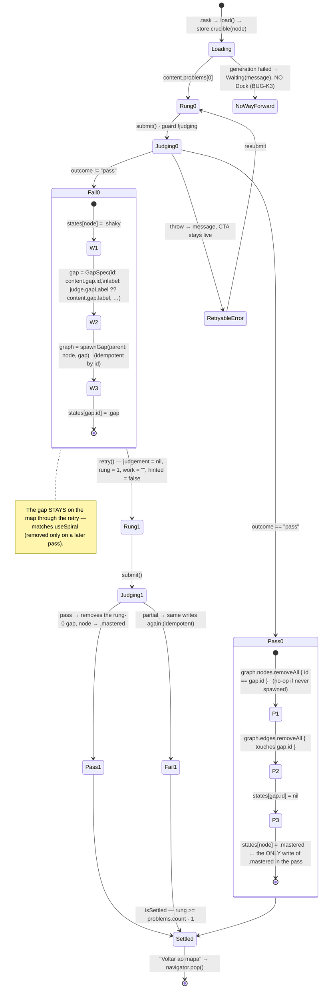
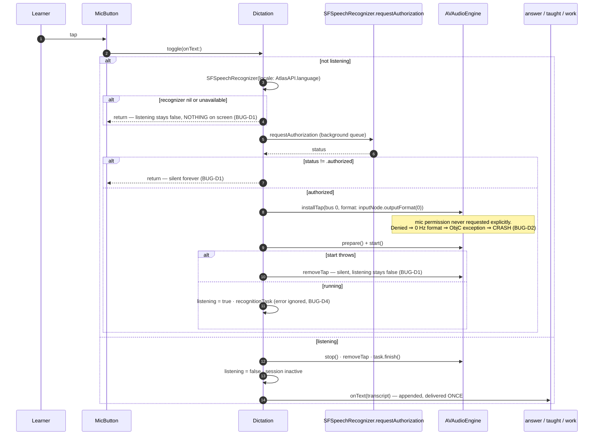

# Audit — the four interactive session phases (Socratic · Feynman · Connect · Crisol) + dictation

Scope: `ios/AtlasKit/Sources/AtlasKit/Features/Session/{Socratic,Feynman,Connect,Crucible}` and
`Core/Speech.swift`. Read in full, line by line. Context read: `Domain/PhaseContent.swift`,
`Domain/Concept.swift`, `Data/Prompts.swift`, `Data/Warm.swift`, `Data/AtlasAPI.swift`,
`Data/NDJSONStream.swift`, `Core/Components.swift`, `Features/Session/SessionView(.Model).swift`,
`ios/AGENTS.md`, `ios/PLAN.md` §5. Web baseline read: `lib/curriculum/{socratic,feynman,connect,crucible}.ts`,
`components/session/{SocraticView,ConnectView}.tsx`, `components/atlas/useSpiral.ts`,
`lib/server/generate/judge.ts`, `lib/server/job.ts`.

Consume and `SessionViewModel`'s own lifecycle are another agent's; `SessionViewModel` is cited only
where a phase writes through it.

---

## 0. The shape of the whole pass (shared mechanism)

`SessionView.swift:42` builds one `SessionViewModel` in `.task`; `SessionView.swift:23` keys the phase
view on `session.phase`, so **every phase view gets a fresh identity and a fresh view model on each
transition** — there is no state carried sideways between phases. `SessionViewModel.warmNext()`
(`SessionViewModel.swift:42-45`) speculates exactly one phase ahead through `AtlasStore.warmUp`
(`Warm.swift:249-260`), and `WarmCache.fill` (`Warm.swift:54-106`) deduplicates by key, so the click
that beats the warm joins the running task rather than paying twice.

Mastery writes made by these four phases, in full:

| phase         | write                                                                | file:line                       |
| ------------- | -------------------------------------------------------------------- | ------------------------------- |
| Socratic      | **none**                                                             | —                               |
| Feynman       | `spawnGap` + `states[gap.id] = .gap` per non-`good` verdict row      | `SessionViewModel.swift:97-105` |
| Connect       | `.unknown`/`.learning` → `.shaky`                                    | `SessionViewModel.swift:65-68`  |
| Crisol (fail) | node → `.shaky`, `spawnGap`, `states[gap.id] = .gap`                 | `SessionViewModel.swift:76-86`  |
| Crisol (pass) | gap node + edges removed, `states[gap.id] = nil`, node → `.mastered` | `SessionViewModel.swift:88-91`  |

That table matches `ios/PLAN.md:121-128` and `useSpiral.ts` (`advanceFromConnect` 1356-1415,
`crucibleSubmit` 1471-1548, `advanceFromCrucible` 1552-1591) — the _destinations_ are right. The drift
is in the mechanisms that reach them, and it is substantial. Nine findings below are behaviours the web
has and the app does not.

**Cross-cutting, applies to all three judged phases:** the judge call is launched from an unstructured
`Task { await model.submit() }` inside a `Button` label (`SocraticView.swift:173`,
`FeynmanView.swift:114`, `CrucibleView.swift:108`). Nothing cancels it. `NDJSONStreamer.frames`
(`NDJSONStream.swift:43`) _does_ wire `onTermination → task.cancel()`, but that only fires if the
consuming task is cancelled, and it never is. See BUG-X1.

---

## 1. Socratic

### 1.1 Objective

Turn the reading into a reconstruction. The tutor asks one probe at a time, the learner answers in
their own words, and a server judge classifies the answer `correct` / `near` / `wrong` / `lost`. A
probe closes only on `correct` (understood) or `lost` (taught outright); `near` and `wrong` earn more
scaffolding and another attempt on the _same_ probe. Nothing is written to the map — the phase's whole
product is that the learner arrives at Feynman having said the idea out loud.

### 1.2 How it works

- `SocraticView.swift:21-25` builds `SocraticViewModel` once in `.task` and awaits `load()`.
- `SocraticViewModel.load()` (`:58-64`) calls `landed()` first, then `await session.store.socratic(node)`
  (`Warm.swift:214-217`), then clears `writing`. The generation is the **ported** device path
  (`Prompts.streamed` returns a `Streamed` for `"socratic"`, `Prompts.swift:172`) — probes stream one
  JSON object at a time straight off OpenRouter.
- The script is never returned: `steps` (`:45`) reads `session.store.steps(node)` →
  `warm.content(key("socratic", node))`. `SocraticView.swift:36` watches `model.steps.count` and calls
  `model.landed()` on every change. `landed()` (`:69`) opens a step when the log is empty or the dock is
  parked (`awaiting`).
- `openStep()` (`:106-111`) guards `step < total`, then either appends the probe as a tutor `Turn` or
  sets `awaiting = true` (the "Escrevendo a próxima pergunta…" state, `SocraticView.swift:87-89`).
- `total` (`:49`) is `socraticPlan(steps)` — the non-`spare` count (`PhaseContent.swift:116-119`),
  mirroring `lib/curriculum/feynman.ts:146`. `done` (`:53`) is `step >= total || (!writing && step >= steps.count)`.
- `send()` (`:80-103`): guard `!judging`, non-empty, `steps[safe: step]` present → clear `answer`,
  append the learner `Turn`, `judging = true`, `await api.judge("socratic", judgeContext(...))`
  (`AtlasAPI.swift:290-301`, which takes the **last complete** `judgement` frame). On success append the
  tutor `Turn` with `verdict.quality`; if `!verdict.closesStep` (`PhaseContent.swift:128` —
  `correct || lost`) raise help on `wrong` and return, leaving `step` where it is. Otherwise
  `help = correct ? max(0,help-1) : min(3,help+1)`, `step += 1`, `openStep()`.
- Judge context (`:113-127`): `question`, `reference` (= `step.tell`), `answer`, `attempt`, `help`,
  `history` (last 8 turns), `misconceptions` (the step's non-`correct` authored replies). Server mapping
  at `lib/server/job.ts:581-635`; prompt at `lib/server/generate/judge.ts:182-234`.
- The dial (`cycleHelp`, `:71`) is `(help + 1) % 4` and only ever reaches the model as the `help` number.
- Dock swap: `SocraticView.swift:44-48` — `done` → the Feynman CTA; else the answer dock, hidden while
  `awaiting`.

```mermaid
stateDiagram-v2
    [*] --> Loading: SocraticView .task → model.load()
    Loading --> Parked: landed() · steps empty → awaiting = true
    Loading --> Probing: landed() · steps warm → log += probe

    Parked --> Probing: SocraticView:36 onChange(steps.count) → landed() → openStep()
    note right of Parked
      The ONLY liveness path.
      A view .onChange drives the probe loop (BUG-S5).
    end note

    Probing --> Judging: send() · guard !judging · answer cleared (BUG-S2)
    Judging --> Verdict: api.judge("socratic")
    Judging --> JudgeFailed: throw

    JudgeFailed --> Probing: message = ErrorCopy · learner must RETYPE
    note right of JudgeFailed
      Web: turn marked failed + "Grade it again".
      iOS: no retry button, answer already discarded.
    end note

    Verdict --> SameProbe: near / wrong → help = min(3, help+1)
    SameProbe --> Probing: same steps[step]; judgeContext.question is now
                           the CRITIQUE, not the probe (BUG-S1)

    Verdict --> NextProbe: correct / lost → closesStep
    NextProbe --> Probing: step += 1 · openStep()
    NextProbe --> Done: step >= total (socraticPlan = non-spare count)

    Done --> [*]: Dock CTA → session.advance() → Feynman
    note right of Done
      total is FIXED. No early exit on 3 unaided,
      no spare bought after 2 assisted (BUG-S4).
      NO mastery write in this phase — by design.
    end note
```

### 1.3 User value

The one place in the pass where the learner's own sentence is read back and corrected by name.
Anti-sycophancy is real: `wrong` is caught and the probe does not advance. The scaffolding dial and
`misconceptions` mean the tutor catches the _anticipated_ wrong idea by name rather than generically.
The transcript stays on screen, so a learner can see their own reasoning improve across a probe.

### 1.4 Bugs

**BUG-S1 — the judge is told the wrong question on every retry. `SocraticViewModel.swift:115`. HIGH. Confirmed.**

```swift
context["question"] = .string(log.last(where: { !$0.learner })?.text ?? current.prompt)
```

`send()` appends the learner turn at `:85` before this runs, so `last(where: !learner)` is the last
_tutor_ turn. On the first attempt that is the probe. On the second attempt it is the tutor's critique
from the first verdict. The server prompt renders it as `The tutor asked: "${question}"`
(`judge.ts:220`). Scenario: probe = "Why does a low gear not reduce total work?"; learner answers, gets
`near` with "You've got the feel right — hold onto 'easier per stroke'."; learner answers again → the
judge is told the tutor asked _"You've got the feel right…"_ and grades a genuine answer to the real
probe against a non-question. `near`/`wrong` loops are exactly where mis-grading is most costly.
Fix: `context["question"] = .string(current.prompt)`.

**BUG-S2 — a failed judge silently eats the learner's answer. `SocraticViewModel.swift:78-84, 100-102`. MEDIUM. Confirmed.**
The doc comment says "Their words are never taken back by a failed judge — … the same answer can be
sent again." The code clears `answer` at `:84` _before_ the network call, and the `catch` at `:100`
only sets `message`. The text survives only as a `Turn` in the transcript; the composer is empty and
`canSend` is false. The learner must retype a paragraph they just wrote. The web models this properly:
`socraticReducer` has `judgeFailed` / `retryJudge` actions (`socratic.ts:259-276`) and the view renders
"Essa resposta não foi avaliada — nada foi perdido." + "Avaliar de novo" (`SocraticView.tsx:49-50`).
Compounding: a retry appends a _second_ learner turn, so the transcript accumulates duplicates and
`attempt` (`:118`) inflates.

**BUG-S3 — there is no escape from a probe the learner cannot answer. `SocraticViewModel.swift` (whole), `SocraticView.swift:52-73`. HIGH. Confirmed.**
`SocraticStep.hint` and `.tell` are decoded (`PhaseContent.swift:108-109`) and **never rendered
anywhere**. The web's two escape hatches — `{type:"stuck"}` (logs `step.hint`, raises help) and
`{type:"tell"}` (logs `step.tell`, closes the step as `told`) — have no iOS equivalent
(`socratic.ts:346-371`; buttons at `SocraticView.tsx:45-46, 68-69`). The iOS "Apoio" dial only changes
a number in the judge prompt. So the only way off a probe is to type something the judge grades
`correct` or `lost`. A learner who types "não sei" will usually get `lost` and advance — but that is a
model behaviour, not a guarantee, and a learner who keeps producing plausible-but-`near` answers can
loop indefinitely with no affordance but the back arrow. This is the phase's single missing control.

**BUG-S4 — the spare probe is generated (and billed) but can never be spent. `SocraticViewModel.swift:49, 53`. MEDIUM. Confirmed.**
`total = socraticPlan(steps)` is computed fresh from the material on every read and never rises.
`Prompts.swift:232` asks the model for exactly one `spare: true` probe, and the web's `advance()`
(`socratic.ts:310-343`) raises `total` by one for every two assisted steps running, and _lowers_ it to
end early after three unaided. iOS does neither: the spare is always written, always paid for, and
always unreachable; a strong learner never gets the early exit. The comment at `:48` ("only a
struggling learner spends one") describes behaviour that does not exist.

**BUG-S5 — the probe loop's only liveness is a view `.onChange`. `SocraticView.swift:36` + `SocraticViewModel.swift:69`. MEDIUM (suspected hang). Confirmed as an MVVM violation.**
`landed()` is called from `.onChange(of: model.steps.count)` on the `PhaseBar` inside `content(model)`,
which only exists once `model != nil`. `.task` sets `self.model` and then calls `load()`, which runs
`landed()` synchronously and suspends inside `warm.fill`. SwiftUI's re-render (which installs the
`onChange` with its baseline) is a run-loop task, not a main-actor continuation, so its ordering
against the stream's first `write(key:)` is not guaranteed. If the whole script lands between
`landed()` and that first render, `awaiting` stays `true`, `log` stays empty, and the screen shows
"Escrevendo a primeira pergunta…" **forever** with no error and no dock — only the back arrow.
Low probability (needs a very fast/cached stream) but a total dead end when it hits. Also a direct
`ios/AGENTS.md` §MVVM violation: this is state-machine logic living in a view.

**BUG-S6 — the scaffolding dial wraps from maximum help to none. `SocraticViewModel.swift:71`, `SocraticView.swift:53-72`. MEDIUM. Confirmed.**
`help = (help + 1) % 4`. A learner at "Mostre-me" (3) who taps once more lands on "Silencioso" (0) —
the tutor stops hinting entirely at the moment they asked for the most help. The web sets the level
directly (`{type:"setHelp"; level}`, `socratic.ts:198`) from a labelled 4-cell control
(`HELP_LABELS_PT = ["Silencioso","Dica","Guiar","Mostre-me"]`, `socratic.ts:15`). iOS draws three
unlabelled capsules with `accessibilityLabel("Nível de apoio")` and **no `accessibilityValue`**, so a
VoiceOver user cannot tell what level they are on or that tapping cycles. Three capsules also cannot
express level 0 vs. level 1 distinctly enough to notice a wrap.

**BUG-S7 — a mid-stream generation failure silently declares the pass finished. `Warm.swift:140-145` + `SocraticViewModel.swift:53`. MEDIUM. Confirmed.**
`WarmCache.failed` wipes `content[key]` on any error, including one thrown after several probes landed.
`steps` then reads `[]`, so `total` becomes `1` (`:49`, `steps.isEmpty ? 1`) and `done` becomes
`step >= 1`, which is true for anyone past probe 1. The screen swaps to "Seguir para o Feynman →" with
no indication the pass was cut short. No mastery is corrupted (Socratic writes none), but the learner
is told they finished something they did not.

**BUG-S8 — `attempt` counts the whole session, not the step. `SocraticViewModel.swift:118`. LOW. Confirmed.**
`log.filter(\.learner).count` is every learner turn in the pass. The server documents the field as
"Which attempt this is on the current step" (`judge.ts:170`) and renders "This is attempt N on this
step. Do not repeat a hint already given above" (`judge.ts:222`). On probe 4, first try, the judge is
told this is attempt 4 and instructed not to repeat hints it never gave.

**Not a bug:** double-submit is protected. `send()` sets `judging = true` synchronously after the guard
(`:82-86`) and both `canSend` (`:55`) and `.disabled` (`SocraticView.swift:183`) read it; two taps in
one run-loop turn enqueue two main-actor tasks that run serially, and the second returns at the guard.

### 1.5 Must-improve (ranked)

1. **Fix `question` to `current.prompt`** — `SocraticViewModel.swift:115`. One line, and it is the only
   defect here that changes what the learner is graded on.
2. **Add "Estou travado" and "Só me conte"** — a two-button row in the dock calling new
   `stuck()`/`tell()` on the view model that log `current.hint` / `current.tell` and (for `tell`)
   `step += 1; openStep()`. Closes BUG-S3 and finally renders two fields that are already generated.
3. **Keep the answer on judge failure and offer a retry** — do not clear `answer` until the verdict
   lands (`:84`), and re-send in place instead of appending a second learner turn.
4. **Move the probe loop into the view model** — have `load()` consume the stream (or observe `steps`
   with `withObservationTracking`) and call `openStep()` itself; delete `SocraticView.swift:36`.
   Closes BUG-S5 and the MVVM violation together.
5. **Port `advance()`'s adaptive `total`** — track `resolutions` and raise/lower `total` exactly as
   `socratic.ts:310-343` does, so the spare is spendable and three unaided answers end the pass.
6. **Make the dial a picker, not a cycle**, with the four `HELP_LABELS_PT` and an `accessibilityValue`.
7. **Roll up `SocraticJudgement.misconception`** — it is decoded (`PhaseContent.swift:124`) and
   dropped. Without it `recurring` (`judge.ts:176`) is never populated from a phone, so the "you keep
   confusing X and Y" line is browser-only. `RunSnapshot.swift:7` already names the roll-up as a field
   the merge carries through; filing into it is a small write.

---

## 2. Feynman

### 2.1 Objective

Gap detection by self-explanation. The learner teaches the concept back in their own words; a judge
diffs that explanation against a rubric they were never shown, and every row it cannot find in their
words is hung under the node as a red `gap` sub-node. The finding is _what they never thought to
mention_ — the phase exists to surface silent gaps, not to score prose.

### 2.2 How it works

- `FeynmanView.swift:22-26` builds the model in `.task`; `load()` (`FeynmanViewModel.swift:50-55`)
  awaits `store.feynman(node)` (`Warm.swift:220-223` → `/api/generate`, kind `feynman`, streamed
  beat-by-beat) and clears `writing`.
- `beats` (`:30`) reads `store.beats(node)`; `beat` (`:31`) is `beats[safe: index]`. Navigation is
  `back()`/`next()` (`:57-64`) with `withAnimation(Motion.standard)`; the rail (`:33-35`) colours
  spent beats `mastered`, the current one `Phase.feynman.tint`.
- Each beat renders a `Card` containing **`Text(verbatim: beat.subPoint)` at 21pt serif**
  (`FeynmanView.swift:79-81`) above an `AnswerEditor` bound to `taught[beat.id]`
  (`FeynmanViewModel.swift:44-48`). Answers survive walking back and forth.
- Submit is gated to the last beat and a finished stream (`FeynmanView.swift:111`); `canSubmit` (`:39`)
  requires at least one non-blank answer.
- `submit()` (`:71-87`) builds `context["rubric"]` from `beats` (`subPoint` + `mustConvey`) and
  `context["answer"]` as **`beats.compactMap { taught[$0.id] }.joined(separator: "\n\n")`** — one blob,
  no row markers. `api.judge("feynman", …)` → `FeynmanJudgement { verdicts:[{i,verdict,quote}], response, jargon }`.
- On success it calls `session.writeFeynmanGaps(verdict, beats:)` **before** setting `judgement`
  (`:82-83`). `writeFeynmanGaps` (`SessionViewModel.swift:97-105`) iterates rows where
  `verdict != "good"`, resolves `beats[safe: row.i]`, calls `spawnGap` and sets `states[gap.id] = .gap`.
- `spawnGap` (`Concept.swift:114-124`) is id-idempotent (`!graph.nodes.contains { $0.id == spec.id }`)
  and hangs the child on a **dashed** edge, which `displayStates` (`Concept.swift:166`) excludes from
  prerequisites — so a gap never locks anything.
- The Gap Report (`FeynmanView.swift:128-166`) prints the judge's `response`, then one row per
  `judgement.verdicts` entry: a coloured dot (`:170-176`), `model.subPoint(at: row.i)`, and the quote.
  `jargon` becomes shaky-tinted chips. Dock: "Seguir para o Connect →".



### 2.3 User value

The teach-back is the highest-yield study act in the whole product, and this screen makes it
low-friction: the beat rail breaks a blank page into steps, answers persist across navigation, and the
report is specific — it quotes the learner's own words per row and names the jargon they leaned on
without unpacking. The gaps it hangs are the connective tissue of the map: they are what a later
targeted pass reopens.

### 2.4 Bugs

**BUG-F1 — the rubric is printed above the answer box, which is the one thing the phase must never do. `FeynmanView.swift:79-81`. HIGH. Confirmed in code; design intent ambiguous.**
`FeynmanViewModel.swift:5-6` states the invariant in its own words: _"The rubric rows are never shown
before the learner teaches — what they never think to mention is the whole diagnostic."_
`lib/curriculum/feynman.ts:50-56` states it at length: _"a sub-point printed above the input is the
outline of the answer handed over before the test."_ The view then prints exactly that — `beat.subPoint`
is the rubric row label, and it is the same string the Gap Report uses for the row
(`FeynmanView.swift:143` → `model.subPoint(at: row.i)`). Consequence: "skipped" becomes almost
unreachable, because the learner is looking at the list of things to mention. The diagnostic collapses
into a form-fill. `ios/PLAN.md:88` does specify "beat rail, one prompt card, prev/next dock", so the
beat-by-beat walk is the mobile design's call — but the _card can carry a neutral prompt_ ("Ensine a
próxima parte", or the beat number alone) instead of the rubric row. Either the comments and the web
engine are wrong, or this screen is. As written they contradict each other and the screen wins.

**BUG-F2 — no client-side backstop for an unruled row. `SessionViewModel.swift:98`. MEDIUM. Confirmed.**

```swift
for row in judgement.verdicts where row.verdict != "good" { … }
```

Only rows the judge returned are considered. The web's reducer inverts this: it materialises a verdict
for **every** beat and defaults the missing ones to `skipped` (`feynman.ts:296-299`, _"silence is a
skip, not a pass. Anything else would grade an unmentioned row good."_). iOS is currently saved by the
server validator, which fails a payload missing any index (`judge.ts:349-360`) — so this is
defence-in-depth, not a live hole. But `ios/PLAN.md:125-126` promises "hangs a gap under **every**
rubric row it can't find", and the client does not enforce it: a validator relaxation, a fixture, or a
cached older payload silently marks the learner clean on material they never explained. Two lines fix
it: iterate `beats.indices`, look up the row, default to `skipped`.

**BUG-F3 — the learner's own words never reach the gap node. `SessionViewModel.swift:100`. MEDIUM. Confirmed.**
`FeynmanJudgement.Row.quote` is decoded (`PhaseContent.swift:148`), rendered in the report
(`FeynmanView.swift:146-148`), and then thrown away. The web writes it into the gap's summary:
`{ ...b.gap, reason: 'You said: "<quote>" — <reason>' }` (`feynman.ts:344-350`). That reason is the gap
node's `summary` (`Concept.swift:119`) and therefore the whole context a later pass on that gap opens
with. On iOS the gap always carries the reason written _before_ the learner said anything.

**BUG-F4 — there is no "Fix this" and no "teach it again". `FeynmanView.swift:164`, `PhaseContent.swift:133-141`. MEDIUM. Confirmed.**
`FeynmanBeat` does not even declare the `fix` field the web's rubric carries
(`feynman.ts:65`), and the Gap Report's only action is "Seguir para o Connect →". The web offers a
one-probe corrective per red row that flips it to `good` before write-back (`feynman.ts:305-330`) and a
`teachAgain` that keeps the previous verdicts for a visible delta (`feynman.ts:333-338`, _"the one
place the loop is visible working"_). On iOS every gap the judge finds is permanent for that pass,
including one the learner could close in fifteen seconds. Combined with BUG-F1 this inverts the phase:
easy to score well, impossible to recover if you don't.

**BUG-F5 — the explanation is submitted as an unlabelled concatenation. `FeynmanViewModel.swift:79`. LOW. Confirmed.**
`beats.compactMap { taught[$0.id] }.joined(separator: "\n\n")`. Two effects: (a) `compactMap` skips
beats the learner never touched, so the blob's paragraph order no longer aligns with the rubric indices
the judge is diffing against — a learner who fills rows 0 and 2 sends two paragraphs and the judge must
guess which is which; (b) the judge prompt (`judge.ts:315`) says _"A row they simply never mentioned is
'skipped'"_, which is right for a monologue and misleading for a per-row form. Prefixing each block
with its index (`"[0] …"`) — or, better, fixing BUG-F1 and taking one real monologue — resolves both.

**BUG-F6 — N graph copies and N debounced saves per report. `SessionViewModel.swift:100`. LOW. Confirmed.**
`store.graph = spawnGap(store.graph, …)` inside the loop. Each assignment triggers
`didSet { rederive(); saveSoon() }` (`AtlasStore.swift:14`) over the whole graph. Build the new graph
in a local and assign once.

**BUG-F7 — a mid-stream rubric failure hides work the learner has already typed. `Warm.swift:140-145` + `FeynmanView.swift:42-49`. MEDIUM. Confirmed.**
`WarmCache.failed` wipes `content[key]`, so `beats` becomes `[]`. `beat` is then nil and the view falls
through to `Waiting(verbatim: model.waitingCopy)` — no editor, no dock, no submit, and `submit()` would
refuse anyway (`guard … !beats.isEmpty`, `:72`). The `taught` dictionary still holds everything the
learner wrote and there is no way to see it or send it. Only the back arrow works, and the pass is lost.

**Not a bug:** double-submit is protected (`:72-74`, plus `.disabled(!model.canSubmit)` at
`FeynmanView.swift:116`). Gap spawning is idempotent by `spec.id` (`Concept.swift:116`). A judge
failure does **not** strand: `judgement` stays nil, the CTA stays enabled, and the learner can resubmit.

### 2.5 Must-improve (ranked)

1. **Stop printing the rubric row above the editor** (`FeynmanView.swift:79`) — or delete the invariant
   from `FeynmanViewModel.swift:5-6` and `feynman.ts` and admit the phase is a guided form. As it
   stands the code and its own documentation disagree about what the screen is for.
2. **Default unruled rows to `skipped`** in `writeFeynmanGaps` — iterate `beats.indices`, not
   `judgement.verdicts` (`SessionViewModel.swift:98`).
3. **Carry `row.quote` into the gap's `reason`**, matching `feynmanGaps` (`SessionViewModel.swift:100`).
4. **Add the verdict label to each report row** (`FeynmanView.swift:139-153`) — the web has
   `VERDICT_LABEL_PT = ["Bem explicado","Pulado · enrolado","Errado · confuso"]` (`feynman.ts:30-34`).
   Right now verdict is conveyed by dot colour alone: green, grey and red are indistinguishable to a
   colour-blind learner and invisible to VoiceOver (no `accessibilityLabel` on the row).
5. **Handle the wiped-cache case** — keep the last good `beats` (or don't clear on partial content) so
   BUG-F7 shows the learner's work with a retry instead of an empty wait.
6. **Assign `store.graph` once** per report (BUG-F6), and add a `writeFeynmanGaps` test —
   `SessionTests.swift` covers `finishConnect` and `settleCrucible` but not this write.
7. Port `fix` / `teachAgain` when the budget allows; they are the phase's recovery loop.

---

## 3. Connect

### 3.1 Objective

Durable encoding by elaboration: wire the new concept to concepts the learner _already owns_, in their
own sentence, so the memory has more than one road in. Every confirmed link is meant to become a review
card. The phase writes `.shaky` — understood and wired, but nothing has proven it transfers.

### 3.2 How it works

- `ConnectView.swift:26-30` builds the model in `.task`. `load()` (`ConnectViewModel.swift:62-71`)
  first checks `session.learnedElsewhere` (`SessionViewModel.swift:54` → `AtlasStore.learned(besides:)`,
  `Warm.swift:182-184`, `states[$0.id].isLearned` = learning/shaky/mastered). **Empty pool → immediate
  `advance()`**, which writes `.shaky` and moves to the Crisol without showing anything.
- Otherwise `store.connect(node)` (`Warm.swift:228-236`) puts the pool in the context _and in the warm
  key_ (`key("connect", node, pool.ids)`), so a web drawn for one pool is never served for another. It
  is a whole-object kind (`AtlasAPI.swift:264-266`).
- `content` (`:24`) reads `store.web(node)`, which **recomputes the pool on every read**
  (`Warm.swift:200-202`).
- `candidate` (`:29-32`) = the one being edited (`active`) else the first not in `linked`.
- `draft(_:)` (`:44-46`) binds to `drafts[id]`, defaulting through `text(for:)` (`:40`) to
  **`candidate.rel` — the generation's own suggested relationship**.
- `canConfirm` (`:48`) = the text is non-blank. `confirm` (`:50-53`) inserts into `linked` and points
  `active` at the next unlinked candidate.
- `advance()` (`:57-60`) calls `session.finishConnect()` (→ `.shaky`) then `session.advance()`.
- The web is a `Canvas` (`ConnectView.swift:127-165`): edges from the centre to each candidate, dashed
  and grey until linked, solid violet after. `place()` scales both axes by `size.width / 560`; the
  Canvas is `.frame(height: 190)`.
- Confirmed links are listed under "Matéria-prima · N cartões rascunhados" (`ConnectView.swift:98-120`).



### 3.3 User value

Real when it works: the candidates are nodes off the learner's own map, so no link is trivia, and the
canvas makes the new concept's neighbourhood visible in one glance. The empty-pool shortcut is
correct — asking a learner to relate a concept to things they have never met is the failure elaboration
exists to avoid, and both the store (`Warm.swift:231`) and the view model (`:67`) refuse it.

### 3.4 Bugs

**BUG-C1 — the answer is pre-filled with the answer. `ConnectViewModel.swift:40, 44-48`. HIGH. Confirmed.**
`text(for:)` falls back to `candidate.rel`, so the editor opens containing the generation's own
sentence about the relationship. The learner reads a plausible sentence and taps "Confirmar vínculo".
The web deliberately does the opposite and says why, in the reducer:

> `case "select": // Open the prompt blank. The map's suggested relationship is still there (the view
offers it on demand …) but handing it over unasked turns generation into recognition — the learner
reads a plausible sentence, confirms, and encodes almost nothing.` (`connect.ts:129-135`)

`ConnectView.tsx:665-684` renders "show suggestion" as an underlined text button that disappears once
there is anything to lose. Because `rel` is always non-blank, `canConfirm` (`:48`) is a no-op gate:
"Confirmar vínculo" is enabled before the learner has typed a character. The elaboration mechanism is
not weakened here, it is absent.

**BUG-C2 — "N cartões rascunhados" is drafted nowhere. `ConnectView.swift:103` vs. `ConnectViewModel.swift:50-60`. HIGH. Confirmed.**
The UI states a count of drafted cards. `confirm()` only inserts an id into a `Set`; `advance()` only
writes `.shaky`. Nothing anywhere in AtlasKit creates a Connect card — the only `cards.append` in the
package is the Retain factory (`Warm.swift:281-283`). The web's `advanceFromConnect`
(`useSpiral.ts:1360-1393`) turns `connectCards(...)` into real persisted `StoredCard`s keyed
`"<centerId>-connect-<candId>"` — a stable key precisely so re-doing the phase rewrites in place rather
than stacking duplicates. Two learner-visible consequences: the promised cards never appear in Revisão,
and the learner's own sentence — the whole product of the phase — is discarded when they leave the
screen. `Retain.swift:9` already documents `why` cards as "de Connect", and `ScheduledCard` +
`AtlasStore.cards` are ready to receive them.

**BUG-C3 — the advance gate is missing. `ConnectView.swift:57-59`. MEDIUM. Confirmed.**
The CTA is unconditional. The web disables it on `!connectReady(session, cands.length)` —
`min(2, max(1, candCount))` confirmed links (`connect.ts:196-203`, `ConnectView.tsx:155, 387`). On iOS
a learner can open Connect and immediately tap through to the Crisol, and the node still becomes
`.shaky` as if the elaboration happened. `finishConnect`'s doc comment claims "understood and wired";
nothing verifies the wiring.

**BUG-C4 — three of five candidates are drawn outside the canvas. `ConnectView.swift:134, 161`. MEDIUM. Confirmed by arithmetic.**
`place()` scales x _and_ y by `size.width / 560`, but the frame is a fixed `height: 190`. The server
places candidates in a **560×440** canvas at fixed slots `[104,66] [408,92] [472,314] [250,404] [64,300]`
with the centre at `(290,210)` (`lib/server/generate/connect.ts:7-14, 56`). On a 393pt-wide device:
content width `393 − 2·20 = 353`, Canvas width `353 − 16 = 337`, scale `337/560 = 0.602`.

- slot 3 `y=314` → `189.0`, node radius `23·0.602+8 = 21.8` → bottom at **211** (clipped);
- slot 4 `y=404` → **243** — entirely outside the 190pt canvas, invisible;
- slot 5 `y=300` → `180.6`, bottom at **202** (clipped).

The generator asks for 2–5 candidates (`connect.ts:107`), so any web with three or more loses nodes and
its edges run off the bottom edge. Correct height is `width · 440/560` (≈265pt at that width).

**BUG-C5 — the concept web is inert and invisible to assistive tech. `ConnectView.swift:127-165`. MEDIUM. Confirmed.**
The `Canvas` has no hit-testing and no accessibility representation at all. The learner cannot choose
_which_ candidate to link — the order is whatever the generation emitted — and cannot revisit a
confirmed link to edit it (`active` only moves forward, `:52`). The web's `{type:"select"; id}`
(`connect.ts:126`) lets the learner pick any node. For VoiceOver the entire diagram, the linked/unlinked
distinction and the candidate labels do not exist.

**BUG-C6 — the pool is recomputed on every redraw, and the reader can drift off the writer's key. `ConnectViewModel.swift:24` → `Warm.swift:200-202`. LOW/MEDIUM. Confirmed (perf); suspected (drift).**
`ios/AGENTS.md` is explicit: _"Every kind is asked for in exactly one place, because a warm and the
click after it only share a task if they agree on the key and on the inputs behind it — compute a pool
or a boundary twice and you pay for the generation twice"_ (`Warm.swift:150-153`). `learned(besides:)`
is in fact evaluated in four places per pass: `web(node)` (`:201`), `problems(node)` (`:204`),
`connect(node)` (`:230`), `crucible(node)` (`:240`), plus `cacheInputs` (`:369`) — and `web(node)` is a
computed property read several times per `body` evaluation, each time scanning `graph.nodes` and
building a key string. I traced the mutation paths inside a session (`writeFeynmanGaps` writes `.gap`,
`finishConnect`/`settleCrucible` write the session's own node) and **none of them changes the pool**, so
there is no double-billing today. The exposure is that the invariant is unenforced: if any node ever
became `learned` while the Connect generation was in flight, the reader's key would no longer match the
writer's, `content` would read nil forever, and the screen would sit on "Procurando o que você já
sabe…" with no error and no dock — `load()` has already returned. Compute the pool once in the view
model and pass it into both the reader and the filler.

**BUG-C7 — the pool does not match `connectPool`. `Warm.swift:182-184` vs. `connect.ts:174-190`. LOW. Confirmed.**
The web filters `!n.gap`, sorts mastered → shaky → learning, and caps at 8. iOS filters on state only.
So (a) a spawned gap sub-node the learner opened a pass on (which sets `.learning`,
`SessionViewModel.swift:34`) becomes an offered "concept you already know"; (b) the pool is unbounded,
so on a large map the prompt and the cache key grow without limit; (c) the model is handed the pool in
arbitrary graph order rather than most-owned first.

**Not a bug:** `spawnGap` is not reached from this phase; `finishConnect` is correctly conditional
(`SessionViewModel.swift:67`), so re-running Connect on an already-`mastered` node cannot demote it.

### 3.5 Must-improve (ranked)

1. **Open the link editor blank** (`ConnectViewModel.swift:40`) and add an on-demand "Ver a sugestão do
   mapa" button that fills `drafts[id] = candidate.rel`, hidden once the field is non-blank. That
   restores both the elaboration and the meaning of `canConfirm`.
2. **Actually draft the cards** — on `advance()`, write one `ScheduledCard` per confirmed link keyed
   `"\(content.centerId)-connect-\(candidate.id)"`, front `"\(centerLabel) ↔ \(label): qual é a
conexão?"`, back the learner's draft (falling back to `rel`), `source: "Connect"`, type `why`. Upsert
   by id so a redo rewrites in place. Until then, delete the "N cartões rascunhados" line — the UI is
   claiming something false.
3. **Gate the CTA** on `linked.count >= min(2, max(1, cands.count))` (`ConnectView.swift:58`).
4. **Give the Canvas the right height** — `width * 440/560` instead of `190` (`ConnectView.swift:161`).
5. **Make the web tappable and readable** — a `contentShape`/hit-test per candidate that sets `active`,
   plus `accessibilityLabel`s per node and an `accessibilityRepresentation` for the diagram.
6. **Compute the pool once per pass** and hand it to both `web(node)` and `connect(node)`; align it with
   `connectPool` (exclude `gap` nodes, sort, cap at 8).

---

## 4. Crisol (Crucible)

### 4.1 Objective

The transfer test, and the only path to green. A problem in a framing the learner was never handed: if
they memorised the pattern instead of understanding it, this is where it shows. A failure is the
diagnostically rich outcome — it names the sub-concept that did not carry over, hangs it under the node
as a red gap, flips the node `.shaky`, and offers a 30-second re-explanation before one scaffolded
re-attempt.

### 4.2 How it works

- `CrucibleView.swift:22-26` builds the model; `load()` (`CrucibleViewModel.swift:40-44`) awaits
  `store.crucible(node)` (`Warm.swift:238-245`) — a whole-object kind keyed on the same learned pool as
  Connect, with `masteredLabels` in the context so the problem may interleave what the learner owns.
- `content.problems` is the ladder: `[0]` novel transfer, `[1]` scaffolded re-attempt. `problem` (`:31`)
  is `problems[safe: rung]`.
- The attempt screen (`CrucibleView.swift:54-122`): a headline that changes with `rung`, the problem in
  a rust-bordered card with `Kicker(verbatim: problem.tag)`, an optional hint revealed by "Dica"
  (`showHint()`, `:38` — one-way, never re-hidden), an `AnswerEditor` bound to `$model.work`, and a
  dock of "Enviar tentativa" + "Dica".
- `submit()` (`:48-63`): guard `!judging, content, problem` → `judging = true` → context gets
  `problem`, `hint`, `answer` → `api.judge("crucible", …)` (server maps `answer → attempt`,
  `job.ts:664-676`; prompt at `judge.ts:424-445`) → **`session.settleCrucible(verdict, gap: content.gap)`**
  → `judgement = verdict`.
- `settleCrucible` (`SessionViewModel.swift:75-92`):
  - fail → `states[node] = .shaky`; a `GapSpec` is rebuilt with the judge's `gapLabel`/`gapReason` when
    present, `spawnGap`, `states[gap.id] = .gap`;
  - pass → the gap node and its edges are removed from `graph`, `states[gap.id] = nil`,
    `states[node] = .mastered`.
- The diagnostic (`CrucibleView.swift:126-176`): pass/fail kicker and sentence, one row per
  `judgement.transfer` (dot + text), and on failure the 30-second re-explanation
  (`judgement.reExplain ?? content.reExplain`, `:36`). Dock: `isSettled` (`:35` — passed, or on the last
  rung) → "Voltar ao mapa" → `navigator.pop()`; else "Tentar de novo · um degrau abaixo" → `retry()`
  (`:66-71`), which clears `judgement`, `work`, `hinted` and bumps `rung`.



### 4.3 User value

The only honest signal of mastery in the product, and the code keeps it honest: green is written in
exactly one place and only on `outcome == "pass"`, and a failure produces a _named_ sub-concept on the
map rather than a score. The ladder gives the learner a second, easier shot with what they missed
already named, and the re-explanation is aimed at the specific gap the judge found. The pass path
correctly retracts the gap it spawned on the first attempt, so the map does not accumulate scars from a
recovered failure.

### 4.4 Bugs

**BUG-K1 — no confidence gate, so the calibration hook never fires from the Crisol. `CrucibleViewModel.swift` (whole), `Domain/Calibration.swift:6-7`. MEDIUM. Confirmed; acknowledged in-repo.**
The web opens the Crucible on a confidence tap before revealing the problem (`crucible.ts:96, 118-130`,
`useSpiral.ts:1427`), and `crucibleSubmit` records `recordCalib(nodeId, CRUCIBLE_FELT[conf],
outcome === "partial" ? 45 : 88)` (`useSpiral.ts:1512-1519`) plus a read-back sentence
(`crucibleCalib`, `crucible.ts:222-244`) whose whole subject is overconfidence — _"You said 'Very
confident' — and the first-try transfer still broke."_ iOS has no stage before the problem and never
calls `recordCalib` from here. `Calibration.swift:6-7` names it: _"Review is the only hook so far — the
Crucible's own tap is part of screen 18, and feeds the same `recordCalib` the day it lands."_ Screen 20
therefore plots review confidence only, and the phase that exists to catch the gap between feeling
ready and being ready never measures it.

**BUG-K2 — an in-flight verdict rewrites the map after the learner has left. `CrucibleView.swift:108` + `CrucibleViewModel.swift:58`. MEDIUM. Confirmed.**
`Task { await model.submit() }` is unstructured and nothing cancels it on `navigator.pop()`
(`CrucibleView.swift:32`); the `AtlasAPI` stream is cancelled only via `onTermination`
(`NDJSONStream.swift:43`), which needs the consuming task to be cancelled. There is no deadline
anywhere on the `/api/generate` path (`AtlasAPI.swift:84-95` uses `URLSession.shared` defaults;
`stream()` sets no `timeoutInterval`, unlike `OpenRouter.swift:80, 144`). Scenario: the learner submits,
waits ~10s, gives up and taps back; 20s later the verdict lands, `settleCrucible` runs, and a red gap
node animates onto the map, or the node turns green, with no report and no explanation. The web has the
same structural gap but at least shows a toast (`useSpiral.ts:1539`). Either cancel on disappear and
tell the learner the attempt was abandoned, or keep the write and surface it.

**BUG-K3 — a failed problem generation leaves no way forward but the back arrow. `CrucibleView.swift:37-42`. MEDIUM. Confirmed.**
The `Dock` lives inside `attempt(_:_:)`, so when `problem` is nil the screen is a bare `Waiting` with
`ErrorCopy`'s sentence — which ends in _"Tente de novo em instantes."_ while offering nothing to tap
(`Support.swift:26-31`). The same shape holds in `FeynmanView.swift:48` and `ConnectView.swift:61`.
Recovery is not catastrophic (backing out and re-entering re-derives the phase from the node's state —
`.shaky` → `phaseIndex` 4 → Crisol, `Concept.swift:244-252`), but the learner is not told that, and
`WarmCache.failed` has already cleared the key so a retry would in fact work. Every failed-generation
`Waiting` in these phases needs a retry button.

**BUG-K4 — the transfer diagnostic is colour-only. `CrucibleView.swift:140-150`. MEDIUM. Confirmed.**
`Circle().fill(row.verdict == "good" ? NodeState.mastered.color : NodeState.gap.color)` beside
`Text(verbatim: row.text)`, with no label and no `accessibilityLabel`. Green and red at 8pt are the sole
carrier of "this carried over" vs. "this didn't". Same defect as BUG-F4's sibling in the Gap Report.

**BUG-K5 — the pass path mutates and saves the graph even when nothing was ever spawned. `SessionViewModel.swift:88-90`. LOW. Confirmed.**
On a clean first-attempt pass no gap node exists, yet `graph.nodes.removeAll` and `graph.edges.removeAll`
are two separate assignments to `store.graph`, each triggering `didSet { rederive(); saveSoon() }`
(`AtlasStore.swift:14`) over the whole graph. Guard on `graph.nodes.contains { $0.id == gap.id }`.

**BUG-K6 — a second failure keeps the first failure's gap wording. `SessionViewModel.swift:78-86`. LOW. Confirmed.**
`spawnGap` refuses to add a node whose id already exists (`Concept.swift:116`), which is the right
idempotency rule — but on a rung-1 failure the judge's _new_ `gapLabel`/`gapReason` are computed at
`:80-81` and then silently dropped, so the map keeps the rung-0 naming. The web keeps the two in sync
by writing the judged gap back into the content cache (`useSpiral.ts:1527-1535`). Low impact; worth a
line that updates the existing node's `label`/`summary`.

**Not a bug:** double-submit is protected (`:49-51` + `.disabled(!canSubmit)` at
`CrucibleView.swift:110`). `rung` cannot run past the ladder — `retry()` is only reachable when
`!isSettled`, i.e. `rung < problems.count - 1` (`:35`). Gap spawning is exactly-once for a given
`gap.id`. A judge failure does **not** strand: `judgement` stays nil, the attempt screen and its dock
remain, and the learner can resubmit with their work intact (`work` is never cleared on error).

### 4.5 Must-improve (ranked)

1. **Add the confidence gate** before the problem is revealed, and call `recordCalib` on the verdict
   (BUG-K1). The type (`CalibSample`), the store field (`AtlasStore.calib`) and the screen that plots it
   (screen 20) all already exist; only the tap and one call are missing.
2. **Cancel the judge on disappear** — hold the `Task` on the view model and cancel it in `onDisappear`,
   or keep the write and show the learner what happened when they get back to the map (BUG-K2).
3. **Put a retry in every failed-generation `Waiting`** across Crisol, Feynman and Connect (BUG-K3), and
   give `stream()` a first-frame deadline the way `OpenRouter.swift:144` does.
4. **Label the transfer rows** ("Atravessou" / "Não atravessou") rather than relying on dot colour
   (BUG-K4).
5. **Make "Dica" reversible and mark it as spent** — `showHint()` (`:38`) is one-way and the button
   gives no feedback that the hint is already open (it stays visually identical). The web treats hint use
   as contingent difficulty; here it costs nothing and signals nothing.
6. Guard the pass path's graph mutation and refresh the gap's wording on a repeat failure
   (BUG-K5, BUG-K6).

---

## 5. Dictation / voice input (cross-cutting)

### 5.1 Objective

Voice is not a second-class path: every free-text answer in the spiral can be spoken instead of typed.
`Dictation` (`Speech.swift:65-134`) wraps `SFSpeechRecognizer` + `AVAudioEngine` with no dependency,
and delivers the whole transcription **once, on stop** — a field that rewrites itself under the
learner's cursor while they think is worse than one that waits (`Speech.swift:62-64`).

### 5.2 How it works

- Voice is a setting: `store.dictationOn` (`AtlasStore.swift:43`, backed by `Defaults`) gates the mic
  everywhere — `AnswerEditor` (`Components.swift:387-396`) and Socratic's composer
  (`SocraticView.swift:165-169`).
- Two ownership models. Socratic holds one `Dictation` on its view model
  (`SocraticViewModel.swift:31`), so it survives redraws for the whole pass. `AnswerEditor` builds its
  own in `.task` (`Components.swift:400`), so Feynman gets **one per beat** — the `Card` is keyed
  `.id(beat.id)` (`FeynmanView.swift:91`) and is destroyed on `next()`.
- `MicButton` (`Components.swift:406-440`) calls `dictation.toggle(onText:)`; the glyph swaps
  `mic` → `mic.fill` and runs `.symbolEffect(.variableColor.iterative)` while `listening`, with a
  localised `accessibilityLabel` and `.sensoryFeedback(.selection)`.
- `toggle` (`:75-77`) → `start()` (`:79-93`): build an `SFSpeechRecognizer` for `AtlasAPI.language`,
  bail if unavailable, then `SFSpeechRecognizer.requestAuthorization` and, **only if `.authorized`**,
  hop to the main actor and `listen()`.
- `listen(_:)` (`:95-120`): clear the transcript, build an `SFSpeechAudioBufferRecognitionRequest` with
  `shouldReportPartialResults = true`, set the shared `AVAudioSession` to `.record/.measurement/.duckOthers`,
  `installTap` on input bus 0 appending buffers, `engine.prepare()`, `engine.start()`, set `listening`,
  and start a `recognitionTask` whose callback ships only the `String` back to the main actor.
- `stop(_:)` (`:122-134`): stop the engine, remove the tap, `task.finish()`, clear `listening`,
  deactivate the session with `.notifyOthersOnDeactivation` (so a later read-aloud is not playing into a
  recording session), then deliver the trimmed transcript through the callback — appended to the
  existing text (`SocraticViewModel.dictated`, `:73`; `Components.swift:388`) rather than replacing it.



### 5.3 User value

Real accessibility and real speed: a teach-back or a Crucible attempt is far easier spoken than typed
on glass, and the phases where that matters most all have a mic beside the field. Delivering once on
stop is the right call — a live-rewriting field is unusable while composing. The session category is
handed back on stop, which is why read-aloud on the next screen works.

### 5.4 Bugs

**BUG-D1 — every failure path is silent. `Speech.swift:80-81, 89, 112`. HIGH. Confirmed.**
Three separate `return`s with no state change and no message: recognizer unavailable (`:80-81`),
authorisation not granted (`:89`), audio engine failed to start (`:112`). The task brief's exact
scenario: a learner who denied speech recognition (or is offline in a locale with no on-device model)
taps the mic and **nothing happens, forever**. `listening` never flips, so the glyph does not change,
the haptic does not fire, and there is no sentence anywhere. There is no `error`/`denied` property on
`Dictation` at all, so no call site could show one even if it wanted to. This is the failure mode the
`Speaker` class explicitly guards against for read-aloud (`Speech.swift:22-23`: _"a tap that looks like
nothing happened is the failure mode read-aloud actually has"_) and that reasoning was not carried
across to the mic.

**BUG-D2 — microphone permission is never requested, and denial can raise an uncatchable exception. `Speech.swift:87, 107-110`. HIGH (crash) / suspected — needs a device.**
`start()` requests _speech recognition_ authorisation (`SFSpeechRecognizer.requestAuthorization`) but
never `AVAudioApplication.requestRecordPermission`. The two are separate TCC permissions with separate
`Info.plist` keys — both of which the project does declare (`ios/Project.swift:29-30`). Touching
`engine.inputNode` prompts for the mic implicitly, but the prompt is asynchronous: `listen()` reads
`input.outputFormat(forBus: 0)` and immediately passes it to `installTap`. When mic access is
not-yet-granted or denied, that format comes back with a 0 sample rate and `installTap` raises
`NSInvalidArgumentException` ("required condition is false: format.sampleRate == hwFormat.sampleRate"),
which Swift cannot catch — the app terminates. Even on the benign path the learner sees two permission
sheets back to back with no explanation of why. Fix: request record permission first, then speech, then
`listen()`, and validate `format.sampleRate > 0 && format.channelCount > 0` before installing the tap.

**BUG-D3 — `toggle` is not re-entrant across the authorisation round trip. `Speech.swift:75-93`. MEDIUM. Suspected crash.**
`listening` is only set inside `listen()`, which runs after `requestAuthorization`'s callback. Between
the tap and that callback, `listening` is `false`, so a second tap calls `start()` again. Two `listen()`
calls then race to `installTap(onBus: 0, …)` on the same node — `AVAudioNode` raises on a duplicate tap
— and start two `recognitionTask`s writing the same `transcript`. A "pending" flag set synchronously in
`start()` and cleared in `listen()`/`stop()` closes it.

**BUG-D4 — recognition errors and the 60-second limit leave the mic stuck on. `Speech.swift:114-119`. MEDIUM. Confirmed.**

```swift
task = recognizer.recognitionTask(with: request) { @Sendable result, _ in
```

The error is discarded (`_`) and the `result.isFinal` flag is never read. `SFSpeechRecognitionTask`
ends with an error on a network drop and Apple caps a single recognition at roughly a minute; in both
cases the callback stops firing, `listening` stays `true`, the glyph keeps breathing, and the engine
keeps recording. The learner taps to stop and gets whatever partial text arrived before the failure,
with no indication it was truncated. Handle the error: stop, clear `listening`, surface a sentence.

**BUG-D5 — leaving a screen while dictating discards the transcript and leaves the engine running. `Speech.swift:65-134` (no `deinit`/cancel), `FeynmanView.swift:91`, `Components.swift:400`. MEDIUM. Confirmed.**
`Dictation` has no cleanup hook and no view calls `stop`. Concrete case: on Feynman the learner speaks
into beat 2 and taps "Próximo tópico" — the `Card` is keyed on `beat.id`, so the `AnswerEditor` and its
`Dictation` are torn down mid-recognition. Everything spoken is lost (delivery happens only in `stop`),
and until the object is actually released the engine is still recording with the shared session on
`.record`. Same on any `navigator.pop()` out of a phase. `AnswerEditor` should stop its recognizer in
`onDisappear`, and `Dictation` should stop in `deinit`.

**BUG-D6 — sending while the mic is live loses the answer. `SocraticView.swift:173`, `CrucibleView.swift:108`. MEDIUM. Confirmed.**
Nothing links the send/submit action to `dictation.listening`. A learner who finishes speaking and taps
the arrow without tapping the mic again submits whatever was typed (often nothing — `canSend` would
block a truly empty field, but a partially typed answer submits without the spoken half) and the
transcript is discarded on teardown. Submit should flush a live dictation first.

**BUG-D7 — the mic's state is not exposed to assistive tech beyond its label. `Components.swift:406-440`. LOW. Confirmed.**
`accessibilityLabel` toggles between "Ditar resposta" and "Parar de ditar", which is good, but there is
no `accessibilityValue`, no `.accessibilityAddTraits(.startsMediaSession)`, and no announcement when a
transcript is delivered — a VoiceOver user gets no confirmation that anything was captured.

**Not a bug:** the `Sendable` handling is careful and correct. `nonisolated(unsafe) let ready`
(`:86`) and the `@Sendable` TCC closure (`:87`) are the right shape for Swift 6 strict concurrency —
the callback carries no main-actor isolation, and the hop is explicit. Only the `String` crosses back
from the recognition callback (`:117-118`). The session category dance in `stop` (`:128-130`) and in
`Speaker.toggle` (`Speech.swift:40-41`) is deliberate and mutually consistent.

### 5.5 Must-improve (ranked)

1. **Surface every failure.** Add `enum Dictation.Trouble { unavailable, denied, engine, recognition }`
   and a `private(set) var trouble: Trouble?`; render it as a sentence beside the mic. Silence is the
   worst possible outcome for a control whose entire signal is state.
2. **Request record permission explicitly, before touching `inputNode`**, and validate the input format
   before `installTap` (BUG-D2). This is the one item here that can terminate the app.
3. **Guard re-entrancy** with a `starting` flag (BUG-D3) and **read the recognition error** (BUG-D4).
4. **Stop on teardown** — `deinit` on `Dictation`, `onDisappear` in `AnswerEditor` — and **flush on
   submit** in Socratic and Crisol (BUG-D5, BUG-D6).
5. **Hoist the `Dictation` out of `AnswerEditor`** into the phase view models, the way Socratic already
   does (`SocraticViewModel.swift:31`). One recognizer per screen instead of one per beat removes the
   Feynman teardown case entirely and makes the flush-on-submit fix trivial.
6. Consider `requiresOnDeviceRecognition` when available — it removes the network failure mode and the
   privacy surface for a feature that is otherwise offline-capable.

---

## 6. Localisation (`ios/AGENTS.md` §Copy)

I extracted every copy literal from the five files and checked each against
`ios/App/Resources/Localizable.xcstrings`. **All 55 keys are present with an `en` translation; none is
missing.** Plurals are handled in the catalogue, not in Swift: `"%lld cartões rascunhados"` carries
`one`/`other` variations in both languages, as §Copy requires. Generated material consistently uses the
`verbatim:` overloads — `Kicker(verbatim: problem.tag)` (`CrucibleView.swift:70`),
`Text(verbatim: beat.subPoint)` (`FeynmanView.swift:79`), `Waiting(verbatim: model.waitingCopy)`,
`Text(verbatim: "\(index+1) / \(count)")` (`FeynmanView.swift:34`) — and view models expose
`String(localized:)` for the strings they inspect (`waitingCopy` in all four models,
`doing: String(localized: "avaliar sua resposta")` etc.). Interpolation is used rather than
concatenation everywhere, including `"Como \(centerLabel) se relaciona com \(candidate.label)?"`
(`ConnectView.swift:77`). This is the cleanest part of the audit.

Two observations rather than defects:

- **All 290 catalogue entries carry `"extractionState": "stale"`.** That is uniform across the file, so
  it reflects how the catalogue is maintained rather than anything about these phases — but it means
  `make strings`' "entry the code no longer uses" check is the only thing keeping dead keys out, and it
  cannot distinguish a stale entry from a live one by state alone.
- **Ternaries of two string literals** are used for copy in `CrucibleView.swift:59-64` and `:132-134`.
  Both keys resolve and both are in the catalogue, so extraction evidently works today; it is worth
  knowing that this is the one construct in these files where `SWIFT_EMIT_LOC_STRINGS` extraction is not
  obviously guaranteed, and `make strings` is what would catch a regression.

Genuinely missing copy, as opposed to unlocalised copy: the Socratic help dial's four level names
(`HELP_LABELS_PT`, `socratic.ts:15`) and the Feynman/Crisol verdict labels (`VERDICT_LABEL_PT`,
`feynman.ts:30-34`; transfer good/red). Those are strings the web ships and the app draws as colour
only — see BUG-S6, BUG-F4, BUG-K4.

---

## 7. Consolidated findings

| #   | Severity | Phase     | file:line                          | Finding                                                                                                              |
| --- | -------- | --------- | ---------------------------------- | -------------------------------------------------------------------------------------------------------------------- |
| F1  | HIGH     | Feynman   | `FeynmanView.swift:79`             | The rubric row is printed above the answer box — contradicts the phase's own documented invariant and the web engine |
| C1  | HIGH     | Connect   | `ConnectViewModel.swift:40`        | The link editor is pre-filled with the generation's own answer; elaboration becomes recognition                      |
| C2  | HIGH     | Connect   | `ConnectView.swift:103`            | "N cartões rascunhados" is shown; zero cards are ever written                                                        |
| S1  | HIGH     | Socratic  | `SocraticViewModel.swift:115`      | The judge is told the tutor's critique was the question, on every retry                                              |
| S3  | HIGH     | Socratic  | `SocraticViewModel.swift` (absent) | No "stuck"/"tell" — `hint` and `tell` are generated and never rendered; no escape from a probe                       |
| D1  | HIGH     | dictation | `Speech.swift:80,89,112`           | Every mic failure path returns silently; no error state exists on `Dictation`                                        |
| D2  | HIGH\*   | dictation | `Speech.swift:87,107`              | Mic permission never requested; a denied mic can raise an uncatchable exception in `installTap`                      |
| S2  | MEDIUM   | Socratic  | `SocraticViewModel.swift:84,100`   | A failed judge discards the learner's answer despite the comment claiming otherwise; no retry                        |
| S4  | MEDIUM   | Socratic  | `SocraticViewModel.swift:49`       | `total` never adapts — the spare probe is billed and unreachable, no early exit                                      |
| S5  | MEDIUM   | Socratic  | `SocraticView.swift:36`            | The probe loop's only liveness is a view `.onChange`; a race can hang the screen forever                             |
| S6  | MEDIUM   | Socratic  | `SocraticViewModel.swift:71`       | The help dial wraps 3 → 0; unlabelled, no `accessibilityValue`                                                       |
| S7  | MEDIUM   | Socratic  | `Warm.swift:140` + `:53`           | A mid-stream failure wipes `steps` and silently marks the pass done                                                  |
| F2  | MEDIUM   | Feynman   | `SessionViewModel.swift:98`        | No client backstop defaulting an unruled rubric row to `skipped`                                                     |
| F3  | MEDIUM   | Feynman   | `SessionViewModel.swift:100`       | `row.quote` never reaches the gap node's reason                                                                      |
| F4  | MEDIUM   | Feynman   | `FeynmanView.swift:139`            | No verdict labels; no "Fix this"/"teach again"; verdict is colour-only                                               |
| F7  | MEDIUM   | Feynman   | `Warm.swift:140`                   | A mid-stream failure hides the learner's typed teach-back with no way to submit it                                   |
| C3  | MEDIUM   | Connect   | `ConnectView.swift:58`             | The advance CTA is ungated — `connectReady` has no equivalent                                                        |
| C4  | MEDIUM   | Connect   | `ConnectView.swift:161`            | Canvas is 190pt tall for a 440-unit layout; candidates 3-5 are clipped or invisible                                  |
| C5  | MEDIUM   | Connect   | `ConnectView.swift:127`            | The concept web has no hit-testing and no accessibility representation                                               |
| K1  | MEDIUM   | Crisol    | `CrucibleViewModel.swift` (absent) | No confidence gate; `recordCalib` never fires from the phase built to catch overconfidence                           |
| K2  | MEDIUM   | Crisol    | `CrucibleView.swift:108`           | The judge is not cancelled on back-navigation and has no deadline; the map changes after the learner leaves          |
| K3  | MEDIUM   | Crisol    | `CrucibleView.swift:37`            | A failed generation leaves no dock and no retry (same in Feynman and Connect)                                        |
| K4  | MEDIUM   | Crisol    | `CrucibleView.swift:143`           | Transfer rows are colour-only                                                                                        |
| D3  | MEDIUM\* | dictation | `Speech.swift:75`                  | `toggle` is not re-entrant across the auth round trip; double tap can double-tap the bus                             |
| D4  | MEDIUM   | dictation | `Speech.swift:114`                 | Recognition errors and the ~60s cap are ignored; the mic sticks on                                                   |
| D5  | MEDIUM   | dictation | `Speech.swift` (no `deinit`)       | Leaving mid-dictation loses the transcript and leaves the engine running                                             |
| D6  | MEDIUM   | dictation | `SocraticView.swift:173`           | Submitting while listening discards the spoken answer                                                                |
| S8  | LOW      | Socratic  | `SocraticViewModel.swift:118`      | `attempt` counts the session, not the step                                                                           |
| F5  | LOW      | Feynman   | `FeynmanViewModel.swift:79`        | The explanation is an unlabelled concatenation with holes                                                            |
| F6  | LOW      | Feynman   | `SessionViewModel.swift:100`       | N graph copies + N saves per report                                                                                  |
| C6  | LOW/MED  | Connect   | `Warm.swift:200`                   | The pool is recomputed per redraw — the AGENTS "compute once" rule is unenforced                                     |
| C7  | LOW      | Connect   | `Warm.swift:182`                   | The pool does not exclude gap nodes, sort, or cap at 8 like `connectPool`                                            |
| K5  | LOW      | Crisol    | `SessionViewModel.swift:88`        | The pass path mutates and saves the graph twice even with no gap to remove                                           |
| K6  | LOW      | Crisol    | `SessionViewModel.swift:78`        | A repeat failure drops the judge's newer gap wording                                                                 |
| D7  | LOW      | dictation | `Components.swift:406`             | No `accessibilityValue` or delivery announcement on the mic                                                          |

\* suspected — needs a device to confirm the exception path.

### What is already right

- The mastery ladder is exactly as specified: Socratic writes nothing, Connect writes `.shaky`, the
  Crucible is the only writer of `.mastered` and the only spawner of a Crucible gap, and the pass path
  retracts the gap it spawned. Covered by `SessionTests.swift:60-98`.
- Gap spawning is idempotent by id (`Concept.swift:116`) and always dashed, so a gap can never lock a
  node.
- Double-submit is genuinely impossible in all three judged phases — the `judging` flag is set
  synchronously on the main actor before the first suspension, and every button also reads it.
- A judge failure never strands the learner in Socratic, Feynman or the Crisol: the work survives, the
  submit control stays live, and re-sending works. (The _generation_ failure paths do strand — K3.)
- `WarmCache` deduplication means clicking through a warm costs the remainder of a request already
  running, never a second charge (`Warm.swift:58, 92`), and the Connect/Crisol pool is correctly part of
  the cache key.
- Localisation is complete and idiomatic across all five files.
