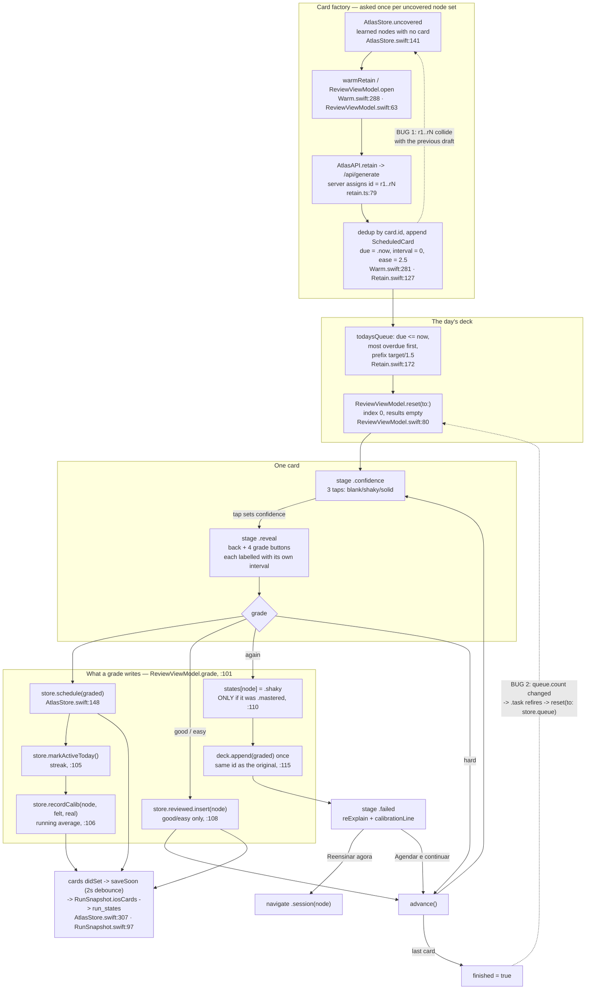
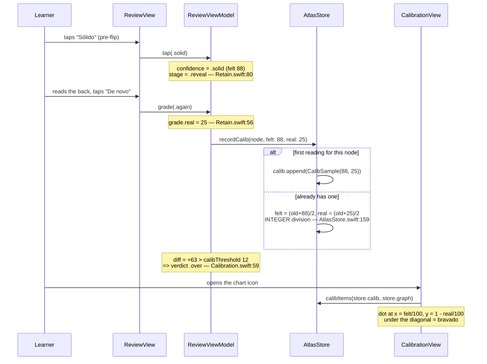

# Atlas iOS — Retention audit (Review deck + Calibration)

Scope: `Features/Review/*`, `Domain/Retain.swift`, `Domain/Calibration.swift`,
`Tests/AtlasKitTests/RetainTests.swift`, with `Data/AtlasStore.swift`,
`Data/Warm.swift`, `Data/RunSnapshot.swift`, `Data/Defaults.swift` for context.
Web reference: `lib/curriculum/retain.ts`, `lib/curriculum/calibration.ts`,
`lib/curriculum/adherence.ts`, `lib/fsrs.ts`, `lib/server/generate/retain.ts`,
`components/atlas/useSpiral.ts`, `components/atlas/useRunState.ts`.

Every line of the seven required files was read. Findings are labelled
**confirmed** (traced end to end in the code) or **suspected** (needs a run or a
dependency this checkout does not contain).

---

## Headline

| #   | Finding                                                                                                                                                                | File:line                                                            | Sev          |
| --- | ---------------------------------------------------------------------------------------------------------------------------------------------------------------------- | -------------------------------------------------------------------- | ------------ |
| 1   | Server card ids are request-scoped (`r1…rN`); iOS uses them verbatim as identity + dedup key, so **every draft after the first files zero cards** and re-bills forever | `Data/Warm.swift:281`, `lib/server/generate/retain.ts:79`            | **critical** |
| 2   | The daily minute budget is not a cap — finishing a deck immediately deals another                                                                                      | `Features/Review/ReviewView.swift:20`, `ReviewViewModel.swift:63-66` | **high**     |
| 3   | SM-2 has no repetition counter: the second `good` schedules 2.5 d instead of SM-2's 6 d, and elapsed time is never an input                                            | `Domain/Retain.swift:138-156`                                        | **high**     |
| 4   | "1 d" means 24h from the grade instant, not the next calendar day — a queue that is empty at the learner's usual hour                                                  | `Domain/Retain.swift:134,154`                                        | **high**     |
| 5   | A miss only flags `.mastered` nodes Shaky; the web flags any node                                                                                                      | `ReviewViewModel.swift:110` vs `useSpiral.ts:1765`                   | medium       |
| 6   | Streak resets on date-line travel; and it never resets until the learner works again, so the header lies for days                                                      | `AtlasStore.swift:165-179`                                           | medium       |
| 7   | Nothing recomputes `store.queue` as time passes; "Volte amanhã" is shown over a card due in 10 minutes                                                                 | `AtlasStore.swift:138`, `ReviewViewModel.swift:49`                   | medium       |
| 8   | The calibration curve is one unlabelled blob to VoiceOver                                                                                                              | `CalibrationView.swift:63-66`                                        | medium       |
| 9   | The whole `cards` array is re-uploaded on every graded card, and is never pruned                                                                                       | `AtlasStore.swift:23,307-319`; `RunSnapshot.swift:97`                | medium       |
| 10  | One undecodable card drops the entire persisted deck                                                                                                                   | `RunSnapshot.swift:79`                                               | medium       |

Verified **not** broken, despite being on the watch list: the calibration curve
draws safely at 0 and 1 readings with no division by zero; cards, schedule,
`calib` and `reviewed` **do** survive relaunch (`RunSnapshot` + `iosCards`,
covered by `RunSnapshotTests.swift:105`) — `ios/PLAN.md` still says they do not,
and that line is stale; the SM-2 ease **floor** of 1.3 is correct in both places
that apply it; and localisation coverage of this area is complete in both
`pt-BR` and `en`, plurals included.

---

## The real mechanism, end to end



The tap-then-grade pair that becomes one calibration reading:



---

## 1 · Card factory — drafting the day's deck

**Objective.** Turn nodes the learner has actually learned into atomic review
cards, exactly once per node, so the scheduler has something to schedule. The
generation is a _factory_, not a queue: what it returns is scheduled locally
from then on, mirroring the contract stated in `lib/server/generate/retain.ts:44`.

**How it works.** `AtlasStore.uncovered` (`Data/AtlasStore.swift:141-145`)
selects nodes whose state `.isLearned` (learning/shaky/mastered, `Concept.swift:20`)
and that no `ScheduledCard` names. `AtlasStore.warmRetain()` (`Warm.swift:288`)
fires it ahead of the tab from the map, and `ReviewViewModel.open()`
(`ReviewViewModel.swift:63-78`) fires the same call if the tab is opened first.
Both land in `draftCards(for:)` (`Warm.swift:268-285`), which keys the
generation `"retain|subject|language|<node ids>"` and hands it to
`WarmCache.fill(_:once:)` — one generation per key, so the warm and the tap
share a task rather than both paying. `AtlasAPI.retain` (`AtlasAPI.swift:308-319`)
posts topic/budget/nodes/interests and returns `RetainContent.cards`
(`Retain.swift:107`). Each new card becomes `ScheduledCard(card)` with
`due = .now`, `interval = 0`, `ease = 2.5` (`Retain.swift:127-132`) and is
appended to `store.cards`, which saves through `saveSoon`.

**User value.** The tedious step people skip is done for them: they never write
a card, and the deck exists the moment they finish a concept. Content is keyed
to their run and language, and the warm means the tab usually opens on a card
rather than a spinner.

**Bugs.**

- **[CRITICAL · confirmed] Request-scoped card ids collide across drafts, so
  every draft after the first files nothing.** `lib/server/generate/retain.ts:79`
  assigns ``id: `r${i + 1}` `` — the id is the card's index _within that one
  response_. The web knows this and re-ids on receipt:
  `useSpiral.ts:1690` writes `` id: `${c.node}-retain-${stamp}-${i}` ``. iOS does
  not. `Warm.swift:281` uses the raw server id as both the dedup key and the
  `ScheduledCard.id` (`Retain.swift:125`):
  ```swift
  for card in drafted where !cards.contains(where: { $0.card.id == card.id }) {
      cards.append(ScheduledCard(card))
  }
  ```
  Failure scenario, fully concrete: day 1 the learner has mastered 3 concepts,
  the draft returns 4 cards `r1…r4`, all filed. Day 3 they master a 4th
  concept; `uncovered == [node4]`; `draftCards` pays for a generation that
  returns `r1…r3`; **all three collide and none is filed**. `uncovered` still
  contains node4, so the next launch pays again, and again, forever. The
  learner's review deck permanently contains only the concepts they had on day
  one. If the second draft happens to return _more_ cards than the first, the
  tail (`r5…r8`) is filed instead — cards for node4 living under ids that the
  next draft will also claim, which makes the corruption non-deterministic
  rather than merely total. `AtlasStore.schedule` (`AtlasStore.swift:148-151`)
  matches on the same id, so a colliding file would overwrite another node's
  schedule outright.
  Nothing catches it: `RetainTests.swift` constructs cards by hand with
  distinct ids and never drafts twice; `WarmTests.swift` has no `draftCards`
  coverage.
- **[medium · confirmed] A partial draft re-bills forever.** Even with ids
  fixed, `uncovered` (`AtlasStore.swift:141`) only drops a node once a card
  _names_ it. The generator is asked for 3–8 cards for up to 8 nodes
  (`retain.ts:23-41`) and is under no obligation to cover every node, so a node
  the model skipped stays uncovered and is re-requested on every launch. There
  is no "asked and answered" marker.
- **[low · confirmed] The warm entry is immortal.** `WarmCache.content` keeps
  every `"retain|…"` key for the life of the run (`Warm.swift:111` only clears
  on a map switch), and each key holds a different node set. Memory grows with
  the number of distinct drafts. It is correctly excluded from the shared
  `caches` column (`Warm.swift:348-352`, 4 parts not 5), so nothing is uploaded.
- **[low · confirmed] `drafting` races with the view's own re-fire.**
  `ReviewView.swift:20` keys `.task` on `store.queue.count`; `draftCards`
  appends to `store.cards`, which changes that count, which cancels the running
  `.task` and starts a new one. `WarmCache.fill`'s `await task.value` is not
  cancellation-aware, so the original `open()` resumes and calls
  `reset(to: store.queue)` a second time after the new one already did. Two
  resets a few milliseconds apart are invisible today, but the second one
  silently discards `index`/`results`.

**Must-improve (ranked).**

1. Re-id on receipt, exactly as the web does — `Warm.swift:281`, e.g.
   `"\(card.node)-retain-\(Int(Date.now.timeIntervalSince1970))-\(i)"`, and
   dedup on the _content_ (node + front/back) rather than the server's index.
   Add a regression test that calls `draftCards` twice with two different node
   sets and asserts both batches land.
2. Record which node sets have been asked (a `draftedNodes: Set<String>` on the
   store, persisted in `RunSnapshot`) so a model that skips a node costs one
   generation, not one per launch — `AtlasStore.swift:141`.
3. Make cancellation real: check `Task.isCancelled` after the `await` in
   `ReviewViewModel.open()` (`ReviewViewModel.swift:73`) before touching state.

---

## 2 · The scheduler — SM-2 intervals and due dates

**Objective.** Give each of the four grade buttons a real next-review date, and
put that date on the button so the learner is never lied to about what a tap
costs. `Retain.swift:111-117` states the deliberate choice: SM-2 rather than a
Swift port of FSRS, because the deck is device-local anyway.

**How it works.** `ScheduledCard` (`Retain.swift:118-165`) holds `due`,
`interval` (days) and `ease`. `graded(_:now:)` (`:138-156`):

| grade   | ease                    | interval                                    | due                    |
| ------- | ----------------------- | ------------------------------------------- | ---------------------- |
| `again` | `max(1.3, ease - 0.2)`  | `0`                                         | `now + 600s`           |
| `hard`  | `max(1.3, ease - 0.15)` | `max(1, interval * 1.2)`                    | `now + interval·86400` |
| `good`  | unchanged               | `interval == 0 ? 1 : interval * ease`       | `now + interval·86400` |
| `easy`  | `min(3, ease + 0.15)`   | `interval == 0 ? 3 : interval * ease * 1.3` | `now + interval·86400` |

`isDue` is `due <= now` (`:134`). `todaysQueue` (`:172-177`) filters due,
sorts most-overdue-first, and prefixes `max(1, Int(target / 1.5))` — arithmetic
identical to the web's `retainContentFromStore` (`lib/fsrs.ts`). `label(for:)`
(`:159-164`) re-runs `graded` per button per render to print the interval.

**Checked against reference SM-2.** The ease floor of 1.3 is correct in both
places it is applied (`:142`, `:147`) — that watch-list item is clean. `good`
leaving ease untouched is also correct: SM-2's `q = 4` yields
`0.1 − 1·(0.08 + 1·0.02) = 0`. `hard` at −0.15 is within a rounding error of
SM-2's `q = 3` (−0.14). The deviations that matter are below.

**User value.** Each button says what it buys ("1 d", "3 d", "2 meses"), so the
grade is an informed choice, not a mood. The queue is cut to minutes against
the daily target rather than shown as a wall of cards.

**Bugs.**

- **[HIGH · confirmed] No repetition counter: the second successful review is
  2.5 d instead of SM-2's 6 d.** `Retain.swift:149` distinguishes "new" from
  "review" solely by `interval == 0`. Reference SM-2 fixes `I(1) = 1` and
  `I(2) = 6`, then `I(n) = I(n−1) · EF`. Here `I(2) = 1 · 2.5 = 2.5`. All-Good
  ladders, in days:
  - SM-2: 1, 6, 15, 37.5, 93.8 → **5 reviews** inside a year
  - this: 1, 2.5, 6.25, 15.6, 39, 97.7 → **6 reviews** inside a year

  ≈20 % more repetitions per card per year for the same modelled retention, and
  the gap is front-loaded exactly where a new habit is most fragile: the second
  review lands on day 3.5 instead of day 7. This is the closest thing to the
  "off-by-one on repetition count" in the brief — it is not an off-by-one in a
  counter, it is a _missing_ counter, and the effect is the same shape.

- **[HIGH · confirmed] Elapsed time is not an input to the schedule.** `:154`
  computes `due = now + interval·86400` from the _stored_ interval, with no
  reference to when the card was last seen. A card whose stored interval is 15 d
  and that the learner answers `good` 90 days late gets 37.5 d — the same as if
  they had answered it on time. This is precisely the retrievability term FSRS
  exists for: `lib/fsrs.ts` feeds `scheduler.next(card, now, rating)` and
  ts-fsrs recomputes stability from the actual delay. **Cost of the divergence:**
  after any break, the iOS deck's intervals are fiction — they encode a
  retention the learner demonstrably no longer has, and the app will keep
  stretching them. There is also no overdue _bonus_ on the other side, so a
  learner who is late is neither penalised nor rewarded; the schedule is simply
  blind.
- **[HIGH · confirmed] Day-boundary: "1 d" is 24 hours from the grade instant.**
  `:134` and `:154` are timestamp comparisons. Grade a card `good` at 21:40 on
  Monday; on Tuesday it becomes due at 21:40. A learner whose habit is 21:00
  opens Review on Tuesday and sees _"Fila limpa por hoje. Volte amanhã"_
  (`ReviewViewModel.swift:49`) with 40 minutes to go. The next day the same card
  is due at 21:40 again — the deck drifts later every day until it rolls past
  midnight and the learner skips a day, which also resets the streak
  (`AtlasStore.swift:168`). The web has the same timestamp semantics, so this is
  not an iOS-only divergence, but on a phone with a daily-habit product it is
  materially worse: a `todaysQueue` that means "queue as of this instant"
  contradicts the function's own name and the "Volte amanhã" copy.
- **[medium · confirmed] The device clock is trusted absolutely.** No monotonic
  reference, no clamp. Setting the clock back a month (or landing in a timezone
  behind the one the cards were graded in) makes every card's `due` future, and
  `todaysQueue` returns nothing: the deck vanishes with the honest-sounding
  "Fila limpa por hoje". Setting the clock forward makes every card due at once
  and the learner burns their whole future schedule in one sitting; because the
  new intervals are computed from `now`, the damage is written back permanently
  by `store.schedule` and survives the clock being corrected.
- **[medium · confirmed] `hard` and `good` are indistinguishable on a new card.**
  `:147` gives `max(1, 0 · 1.2) = 1` and `:149` gives `1`. Both buttons read
  "1 d". The only difference is the ease penalty, which is invisible. On a fresh
  deck — the state every new learner is in — half the grade dock is a placebo.
  Anki's equivalent is a 10-minute learning step for Hard.
- **[low · confirmed] `<1 d` for a 10-minute step.** `:161`. `again` schedules
  600 s and the button reads "<1 d", implying tomorrow, when the card is
  actually coming back in this session (`ReviewViewModel.swift:115`). The web
  formats the same case as `<10 min` (`lib/fsrs.ts` `fmtInterval`). Small, but
  it is the one button whose meaning the learner most needs to trust.
- **[low · confirmed] Unbounded interval, unguarded `Int` conversion.** There is
  no maximum interval (Anki caps at 36 500 d). `:162-163` does
  `Int(days.rounded())` and `Int((days / 30).rounded())` with no clamp. `interval`
  is decoded straight off the persisted row (`RunSnapshot.swift:79`) with no
  validation, so a row carrying `"interval": 1e30` — a corrupt write, or a
  future web-side merge into `iosCards` — traps on `Int(_:)` the moment the
  Review tab renders a grade button. Low likelihood; a hard crash when it hits.
- **[low · confirmed] `easy` caps ease at 3.0** (`:151`), which reference SM-2
  does not. A card the learner finds trivially easy stops accelerating. Harmless
  in practice, but it is a silent departure from the algorithm named in the doc
  comment.
- **[low · confirmed] `todaysQueue`'s sort is not stable.** `:174` uses
  `sorted(by:)`, which Swift does not guarantee is stable. Freshly drafted cards
  each take their own `.now` so ties are rare; a restored deck whose dues were
  written in the same second can reorder between two reads of `store.queue`.
  `reset(to:)` snapshots once, so it is cosmetic today.

**Must-improve (ranked).**

1. Add `repetitions: Int` to `ScheduledCard` and implement the real SM-2 ladder
   (`I(1)=1, I(2)=6, I(n)=I(n-1)·EF`), resetting to 0 on `again` —
   `Retain.swift:118-156`. This is a two-field change that closes the largest
   quantified divergence from the web.
2. Move due dates onto day boundaries: schedule to
   `Calendar.current.startOfDay(for: now + interval·86400)` and make `isDue`
   compare against `startOfDay(.now) + 1 day` — `Retain.swift:134,154`. That
   makes "1 d" mean "tomorrow", which is what the copy already promises.
3. Feed elapsed time in: even without FSRS, scale the next interval by
   `min(1, daysSinceLastReview / interval)` on a `good` after a long lapse —
   `Retain.swift:149`. Store `lastReviewed: Date?` to make it possible.
4. Give `hard` on a new card a distinct step (e.g. `now + 3600`), and format
   sub-day intervals in minutes — `Retain.swift:147,161`.
5. Clamp on decode: a custom `init(from:)` on `ScheduledCard` that pins
   `interval` to `0...36_500` and `ease` to `1.3...3.0` — `Retain.swift:118`.
6. Cap the interval and add a monotonic-clock sanity check on launch (if
   `.now` is earlier than the newest `due` by more than the largest interval,
   the clock moved) — `Retain.swift:172`.

---

## 3 · The review deck UI — stacked backs, self-rating before flip, four-grade dock

**Objective.** One card at a time, with the confidence tap _before_ the flip so
the reading is honest, and grade buttons that carry their own real intervals.
Screen 19 in `ios/PLAN.md`.

**How it works.** `ReviewView.body` (`:13-25`) creates the view model in a
`.task(id: store.queue.count)` and calls `open()`. `content(_:)` (`:28-58`) draws
the top bar with the calibration icon (`:37-43`), then either `deck` + `dock` or
the `Waiting` copy. `deck` (`:62-93`) draws the `SegmentBar` rail from
`model.rail` (`ReviewViewModel.swift:43`), the "Cartão n de m" / "~m min
restantes" line, the type chip and provenance, then `face`. `face` (`:96-151`)
`ZStack`s two `RoundedRectangle` backs at y-offset 18/9 and scale 0.956/0.978,
shown only while cards remain (`:102`), under the live card. The card's body
switches on `model.stage`: three confidence buttons at 48pt (`:116-128`), the
revealed back (`:130-137`), or the fail block (`:138-141`). `dock` (`:176-213`)
carries the hint, the four grade buttons each labelled `card.label(for: grade)`
(`:193`), or the two fail actions. `sensoryFeedback(.selection, trigger: model.stage)`
(`:57`) is the haptic.

**User value.** The pre-flip tap makes self-deception expensive: you commit
before you see the answer. The stacked backs give the deck physical depth, so
"three left" is felt rather than counted. The grade buttons carry consequences,
so grading is a decision.

**Bugs.**

- **[HIGH · confirmed] The daily minute budget is not a cap.**
  `ReviewView.swift:20` keys `.task` on `store.queue.count`. When the last card
  of the deck is graded, `finished = true` and `store.cards` changes, so the
  `.task` re-fires; `open()` (`ReviewViewModel.swift:63-66`) sees `hasCard ==
false`, finds `store.queue` non-empty (because `todaysQueue` capped the deck at
  `target/1.5` and more cards are still due) and calls `reset(to: store.queue)`.
  Concrete: `dailyTarget = 15`, 25 cards due. The learner is dealt 10, works
  through "~15 min restantes" to zero — and is instantly dealt 10 more with the
  rail cleared and the counter back at 15. Then 5 more. The honest-queue
  principle that both `lib/curriculum/retain.ts` and `ios/PLAN.md` build the
  surface around is defeated by its own refresh mechanism, and there is no
  "done for today" moment to end on.
- **[medium · confirmed] The rail marks the requeued card as graded before it is
  answered.** `ReviewViewModel.swift:115` appends the _same card id_ to the
  deck; `results` is keyed by id (`:21`); `rail` is `deck.map { results[$0.id]?.tint }`
  (`:43`). The moment the miss is recorded, **both** segments — the original and
  the still-unanswered requeue — light up in the `.again` red. The learner is
  told they have finished a card they have not seen yet. Same root cause makes
  `face(...).id(card.id)` (`ReviewView.swift:83`) identical across the
  index-0→index-1 step, so the requeued card arrives with no transition.
- **[medium · confirmed] A failed draft is a dead end.** `open()` writes
  `message` (`:74`) and `ReviewView.swift:50` renders it through
  `Waiting(verbatim:spinning: false)` — a sentence with no button. Recovery
  requires `store.queue.count` to change, which by definition it cannot, so the
  learner must switch tabs and hope, or relaunch. Every other failure surface in
  the app is required to be recoverable.
- **[medium · suspected] The grade dock has no truncation strategy at
  accessibility text sizes.** `ReviewView.swift:188-202` puts four buttons in an
  `HStack(spacing: 7)` with `frame(maxWidth: .infinity, minHeight: Metrics.cta)`
  and a two-line `VStack` inside each. `Font.atlas` uses `.custom(_:size:)`
  (`Theme.swift:52-54`), which _does_ scale with Dynamic Type, so at
  `.accessibility3` "Difícil" and "2 meses" have roughly 80pt of width each.
  There is no `minimumScaleFactor`, `lineLimit(1)`, or `ViewThatFits`, and
  `minHeight` does not stop horizontal clipping. The three confidence buttons
  (`:116-128`) have the same shape. `ios/AGENTS.md:289` makes "a screen that
  breaks at the largest size is not done" an explicit rule. Marked suspected
  only because it needs a render to confirm the break point.
- **[low · confirmed] The cloze fallback can show the answer as the question.**
  `ReviewViewModel.swift:129-132`: if `cloze` is present but not exactly two
  halves, it returns `card.front ?? card.back` — and a cloze card has no
  `front`, so the learner is shown the **back**. `lib/server/generate/retain.ts:90`
  enforces exactly two halves, so this is unreachable for freshly generated
  content; it is reachable for a deck restored from a row written by a different
  version. Related: `ReviewCard.answer` (`Retain.swift:99`) is decoded, persisted
  and never rendered anywhere — the cloze blank is filled by `______` on the
  front and the whole sentence on the back, so the specific answer word is
  never highlighted.
- **[low · confirmed] `finished` and the "clear queue" copy disagree with the
  schedule.** After grading the only card `again` and tapping "Agendar e
  continuar", `advance()` sets `finished` and the screen says _"Fila limpa por
  hoje. Volte amanhã — é quando essas memórias começam a desvanecer."_
  (`ReviewViewModel.swift:49`) for a card due in ten minutes.
- **[low · confirmed] `remaining` counts requeued cards twice.**
  `ReviewViewModel.swift:39` is `deck.count - index`, and the deck grew by the
  requeue, so "~min restantes" jumps _up_ after a miss.

**Must-improve (ranked).**

1. Make the budget a real cap: track cards answered this calendar day in the
   store, and have `open()` refuse to `reset` past the day's allowance —
   `ReviewViewModel.swift:63-66`. Give the learner an explicit "mais 10 cartões"
   opt-in instead of dealing silently.
2. Give the requeued card its own identity in the deck (wrap the deck element in
   a `struct Slot { let id: UUID; var card: ScheduledCard }`, or key `results`
   on the deck index) — `ReviewViewModel.swift:21,43,115`.
3. Add a retry action to the failure state: pass a closure into `Waiting`, or
   render a `GhostButton("Tentar de novo")` under it — `ReviewView.swift:50`,
   `ReviewViewModel.swift:74`.
4. Constrain the grade dock at large text: `lineLimit(1)` +
   `minimumScaleFactor(0.7)` on both `Text`s, and a `ViewThatFits` that stacks
   the four buttons 2×2 — `ReviewView.swift:191-194`.
5. Drop the `cloze.count == 2` fallback to `card.back`; show the front's
   `answer` on reveal in the grade colour — `ReviewViewModel.swift:130`.

---

## 4 · The Shaky flag a miss hangs on the node

**Objective.** The alive-loop — the thing that separates this from "Anki plus a
chatbot". A retention failure is not only a reschedule: it writes the map and
offers to re-enter the spiral immediately.

**How it works.** In `grade` (`ReviewViewModel.swift:109-116`), an `again`
sets `store.states[node] = .shaky` (only from `.mastered`, `:110`), requeues the
card once, and moves to `.failed`. `ReviewView.failed` (`:155-171`) shows the
back, the generated `reExplain` on the danger background, and
`model.calibrationLine` (`ReviewViewModel.swift:136-145`) — the tap held against
the miss. The dock (`:204-210`) offers "Reensinar agora" →
`navigator.navigate(to: .session(node, phase: nil))` and "Agendar e continuar".
The state write flows through `AtlasStore.states.didSet` → `rederive()` →
`display`/`frontier`/`masteredCount`, so the map is repainted and the
`masteredCount` share drops.

**User value.** The failure is the most teachable moment in the product, and it
is one tap from the fix. The map tells the truth about what has decayed instead
of holding a green node the learner can no longer answer.

**Bugs.**

- **[medium · confirmed] Only `.mastered` nodes are flagged.**
  `ReviewViewModel.swift:110` is
  `if store.states[node] == .mastered { store.states[node] = .shaky }`.
  The web (`useSpiral.ts:1765-1771`) writes `.shaky` for **any** state that is
  not already `.shaky`. Because `uncovered` (`AtlasStore.swift:143`) drafts
  cards for any `.isLearned` node — `learning` and `shaky` included — a card for
  a `learning` node can be missed and the map records nothing at all: no state
  change, no colour change, no signal. The learner's only evidence that the
  concept has rotted is that a card came back, which is exactly what the map is
  supposed to make visible.
- **[medium · confirmed] No shaky _reason_ and no toast.** The web writes
  `setShakyReason(card.node, "review-miss")` and shows
  `cardFlaggedShaky(label)` / `mapUpdated` (`useSpiral.ts:1770-1776`), so the
  learner is told a node moved on a screen they are not looking at. iOS writes
  neither. The map turns orange silently, which reads as a bug the next time the
  learner opens it.
- **[low · confirmed] The re-teach path drops the rest of the deck.**
  `ReviewView.swift:206-208` calls `model.advance()` then navigates away. The
  view model survives (it is `@State` on the tab), so returning resumes at the
  next card — but everything graded so far is retained only in memory; the deck
  is never re-derived from `store.queue` on return, and if the tab is rebuilt
  the `results` rail is lost. Cosmetic, since the schedule itself is already
  written.
- **[low · confirmed] The 30-second re-explanation is optional and unmarked.**
  `ReviewCard.reExplain` is `String?` (`Retain.swift:103`) and
  `ReviewView.swift:160` simply omits the block when nil. The server requires it
  (`retain.ts:86` `str(c.reExplain, …)`), so this is defensive — but a nil turns
  the alive-loop's centrepiece into a blank gap with no explanation of why.

**Must-improve (ranked).**

1. Match the web: flag any non-`shaky` state, not just `.mastered` —
   `ReviewViewModel.swift:110`.
2. Add a toast (or at minimum the node label in `calibrationLine`) naming the
   node that just moved — `ReviewViewModel.swift:110`, `ReviewView.swift:167`.
3. Port `shakyReason` so the node sheet can say _why_ a green node went orange —
   `AtlasStore.swift` alongside `states`.

---

## 5 · Review history that earns Retained

**Objective.** Close the spiral honestly: being `.mastered` is phase 5 of 6, and
only a real review — a card for that node graded `good` or `easy` — earns the
sixth, "Retido ✓".

**How it works.** `ReviewViewModel.swift:108` inserts into `store.reviewed`
(`AtlasStore.swift:29`) on `good`/`easy` only. `phaseIndex(_:reviewed:)`
(`Concept.swift:244-252`) returns `6` for `.mastered && reviewed`, `5`
otherwise — a direct mirror of `lib/curriculum/calibration.ts`'s `phaseIndex`.
`NodeDetailViewModel.swift:22` reads it for the node sheet's spiral. `reviewed`
persists as `reviewedNodes` in the run row (`RunSnapshot.swift:78,96`) and is
covered by `RetainTests.swift:92-104`.

**User value.** The sixth ring cannot be bought by cramming. It is the one piece
of the UI that says "you kept this", and it is the payoff that makes the daily
queue worth opening.

**Bugs.**

- **[low · confirmed] Retained is permanent.** `reviewed` is an insert-only
  `Set<String>` — nothing ever removes a node, including
  `ReviewViewModel.swift:110` when the same node is flagged `.shaky` by a miss.
  A node that was reviewed once in March and has been missed three times since
  still reads Retained the moment its state is nudged back to `.mastered`. The
  web has the identical shape (`setReviewedNodes` only appends), so this is a
  faithful port of a shared weakness rather than an iOS regression.
- **[low · confirmed] One `good` on one card of a node earns it.** A node may
  carry several cards (the factory drafts 3–8 across up to 8 nodes); grading any
  one of them `good` marks the whole node reviewed. Faithful to the web
  (`useSpiral.ts:1761`), and defensible, but worth stating.

**Must-improve.**

1. Remove the node from `reviewed` when a miss flags it `.shaky` —
   `ReviewViewModel.swift:108-110`. One line, and it makes the sixth ring mean
   "currently retained" rather than "once retained". Coordinate with the web so
   the two clients keep agreeing on `reviewedNodes`.

---

## 6 · Calibration reading capture

**Objective.** Turn the pre-flip confidence tap and the post-flip grade into one
number pair per node — stated confidence against delivered performance — with no
extra work asked of the learner.

**How it works.** `ReviewConfidence.felt` (`Retain.swift:80-86`) maps
blank/shaky/solid → 20/55/88; `ReviewGrade.real` (`:56-63`) maps
again/hard/good/easy → 25/55/75/95. **Both tables match the web exactly**
(`useSpiral.ts:93-98` `REVIEW_FELT` / `GRADE_REAL`) — verified value by value.
`ReviewViewModel.swift:106` calls `store.recordCalib(node, felt:real:)`
(`AtlasStore.swift:155-161`), which appends a `CalibSample` for a node with no
reading, or merges into the existing one as a 50/50 running average. The samples
persist as `calibSamples` (`RunSnapshot.swift:77,95`) and are shared with the
browser verbatim. `RetainTests.swift:52-68,107-121` cover the pair and the
average.

**User value.** The most valuable metacognitive signal in the product is
collected for free — one tap the learner would want to make anyway, times every
card they review.

**Bugs.**

- **[low · confirmed] The running average truncates where the web rounds.**
  `AtlasStore.swift:159-160` is integer division: `(89 + 88) / 2 == 88` in Swift
  (88.5 truncated), where `useRunState.ts:257-258` uses
  `Math.round((s.felt + felt) / 2) == 89`. Every merge biases both `felt` and
  `real` downward by up to 0.5. Over a dozen reviews of the same node the two
  clients drift several points apart on a shared row, and `diff` — which is
  compared against a threshold of 12 (`Calibration.swift:48`) — is computed from
  both. Concrete: a node oscillating around felt 80 / real 68 (`diff = 12`,
  verdict `.ok`) can be pushed either side of the band by rounding noise alone.
- **[low · confirmed] A requeued card records a second reading for the same
  node in the same session.** The miss records (88, 25), then the requeue is
  answered and records again, halving the node's history toward one card
  answered twice. Faithful to the web, which requeues to the front of the queue.
- **[low · confirmed] The average is an EMA with weight 0.5, not an average.**
  One reading is worth as much as all history. The docs on both sides call it a
  "running average"; it is not, and a single unlucky card can flip a node's
  verdict. Shared with the web, so not an iOS bug — but the copy the surface
  builds on it ("Você se dá 88% e entrega 25%") is stated with more confidence
  than one sample supports.
- **None found** on the capture path itself: `confidence` is guaranteed non-nil
  at `:106` because `tap` is the only route from `.confidence` to `.reveal`
  (`ReviewViewModel.swift:93-97`) and `grade` guards `stage == .reveal` (`:102`).

**Must-improve.**

1. Round instead of truncating: `Int((Double(old + new) / 2).rounded())` —
   `AtlasStore.swift:159-160`. One line, and it makes the two clients agree on a
   shared row.
2. Store a sample count per node so the surface can say "de 1 leitura" and
   weight the average properly — `Calibration.swift:10-14`. Requires a matching
   web change to keep `calibSamples` compatible.

---

## 7 · Calibration curve screen

**Objective.** Show the learner where their sense of knowing outruns their
delivery. Confidence runs left to right, delivery bottom to top; the diagonal is
perfect calibration and everything under it is bravado.

**How it works.** `CalibrationView` (`:11-19`) builds a `CalibrationViewModel`
in `.task`; the model resolves and sorts once in `init` via `refresh()`
(`:14-17,26`). `calibItems` (`Calibration.swift:65-79`) joins each sample to its
node label (falling back to the raw id), and sorts over → under → ok, largest
`|diff|` first inside each band — the same order as the web's `CALIB_ORDER` +
`calibRows`. `isEmpty` (`:19`) gates the whole screen behind an explanatory
`Waiting` (`CalibrationView.swift:35-37`). `plot` (`:77-120`) insets 14pt, fills
the two triangles at 7 % opacity, strokes the dashed diagonal, draws the two
zone kickers, then one dot per item — radius 5 for `.ok`, 6.5 otherwise —
and finally labels `model.worst` under its dot, clamped to `plot.maxY`. Below,
`row(_:_:)` (`:124-138`) renders each reading with its verdict kicker, the node
label, and `model.reading(item)` (`CalibrationViewModel.swift:30-39`).

**User value.** The one screen that teaches the _feeling_ rather than the
material: "you gave yourself 88 % and delivered 25 %" is a sentence a learner
can act on, and the dot's position under the diagonal makes it visceral.

**Bugs.**

- **[medium · confirmed] The curve is one unlabelled blob to VoiceOver.**
  `CalibrationView.swift:63-66` puts a single `.accessibilityLabel` on a
  `Canvas`. Everything inside — the diagonal, the two zone kickers drawn with
  `context.draw(Text(...))` at `:102-105`, every dot, the `worst` label at
  `:117` — is pixels with no accessibility representation. A VoiceOver user gets
  "Curva de confiança contra desempenho, 7 leituras" and nothing else: not which
  node is worst, not which side of the diagonal anything falls on. There is no
  `.accessibilityElement(children:)`, no `accessibilityChartDescriptor`, no
  `accessibilityValue`. The rows below carry the same data in text, which
  mitigates it, but the chart is the screen's headline and it is inert.
  (`ios/AGENTS.md:289` requires labels on icon-only controls; a chart is the
  harder version of the same rule.)
- **[low · confirmed] `worst` can name an underconfident reading.**
  `CalibrationViewModel.swift:21-24` returns `items.first` whenever its verdict
  is not `.ok`. With no overconfident readings at all, the first item is the
  _most underconfident_ one, and it is drawn on the canvas as the singled-out
  node — where the surrounding design (the "SUPERESTIMA" zone, the doc comment
  at `Calibration.swift:64` "the worst overconfidence leads") says the callout
  means bravado. The web keeps the two separate: `calibWorstOver` and
  `calibWorstUnder` are different functions.
- **[low · confirmed] `refresh()` is dead after `init`.**
  `CalibrationViewModel.swift:26` is never called again, and `items` is a plain
  stored property, so the screen does not observe `store.calib`. It is correct
  today only because there is no way to record a reading while this screen is
  on top. It becomes a stale-data bug the moment the Crucible's own confidence
  tap lands ("part of screen 18", per `Calibration.swift:6`).
- **[low · confirmed] Dot and label overflow at the extremes.** `:81-82` maps
  `felt = 100` to exactly `plot.maxX`, so a dot of radius 6.5 hangs 6.5pt into
  the 14pt inset; the `worst` label at `:117-118` is centred on the dot and is
  clamped vertically but not horizontally, so a long node label at `felt ≈ 95`
  runs off the card. Only reachable at 95+ (`easy` = 95, `solid` = 88), so it is
  a real position, not a theoretical one.
- **[low · suspected] The screen is presented as a sheet but draws a push.**
  `AtlasRoute.presentationStyle` is `.sheet` for every case including
  `.calibration` (`App/AtlasRoute.swift:17`), while `CalibrationView:16-17`
  applies `.navigationBarBackButtonHidden()` and `.toolbar(.hidden, for:
.navigationBar)` and draws its own `BackButton { navigator.pop() }` (`:25`).
  If it really presents as a sheet, both navigation-bar modifiers are inert and
  `pop()` is the wrong dismissal verb. Cannot be confirmed: the `Navigation`
  package is an external SPM dependency and is not vendored in this checkout.
- **Divide by zero with 0 or 1 readings: none found (confirmed).** `plot`
  divides only by the constants `100` and `30`; nothing is divided by
  `items.count`. Zero readings never reach `plot` at all (`:35`), and a single
  reading draws one dot plus its label correctly. A momentarily-zero `size.width`
  would make `plot.width` negative and the fills degenerate, which SwiftUI
  tolerates without a crash.
- **Localisation: none found (confirmed).** All 22 sampled keys on this surface
  and the Review deck exist in `App/Resources/Localizable.xcstrings` with `en`
  translations, and the two count-bearing strings — `%lld meses` and the curve's
  accessibility label — carry proper `one`/`other` plural variations in both
  languages. `%lld d` has no plural variation, which is correct for an
  abbreviation. `CalibrationViewModel.reading` correctly escapes `%%`.

**Must-improve (ranked).**

1. Make the chart accessible: `.accessibilityElement(children: .ignore)` plus a
   per-item `AccessibilityChartDescriptor`, or — cheaper and nearly as good — an
   `.accessibilityValue` that reads the top three readings as "Limites laterais,
   sentiu 85, entregou 40, excesso de confiança" — `CalibrationView.swift:63-66`.
2. Split `worst` into `worstOver` / `worstUnder` and only label the canvas with
   the overconfident one, matching `calibWorstOver` —
   `CalibrationViewModel.swift:21-24`.
3. Inset the point mapping by the dot radius and clamp the label's x into
   `plot` — `CalibrationView.swift:80-83,117-118`.
4. Observe the store instead of snapshotting in `init` — make `items` a computed
   property, or call `refresh()` from `.task` — `CalibrationViewModel.swift:26`.
5. Port `calibCoach` / `calibTopicLine` (`lib/curriculum/calibration.ts`): the
   iOS screen has per-node readings but none of the run-wide "you are
   systematically overconfident across X, Y, Z" line, which is the sentence that
   actually changes behaviour.

---

## 8 · Streak

**Objective.** The adherence hook — consecutive days with work on them, shown as
a chip on Início and a stat on Perfil. Deliberately reduced from the web:
`ios/PLAN.md` phase 6 says "a streak that any work ticks and a missed day
resets", with the forgiving freeze left in `lib/curriculum/adherence.ts`.

**How it works.** `AtlasStore.markActiveToday()` (`:165-172`) is called from
`ReviewViewModel.grade` (`:105`) and `SessionViewModel:35`. It compares
`Self.day(.now)` against `lastActiveDay`; same day is a no-op, exactly yesterday
increments, anything else resets to 1. `Self.day` (`:176-179`) formats
year-month-day from `Calendar.current`. Both `streak` and `lastActiveDay` live
in `UserDefaults` (`Defaults.swift:34-41`), read once into the store at init
(`AtlasStore.swift:64-65`). `HomeView.swift:30-33` draws the chip,
`ProfileView.swift:52` the stat. `RunSnapshot.whole` (`:144-154`) writes a
placeholder `adherence` object with `streak: 0` so the browser can load a row
this client wrote — the two never agree.

**User value.** The one number that rewards showing up, and the reason the deck
gets opened at all on a day the learner does not feel like it.

**Bugs.**

- **[medium · confirmed] Travelling east across the date line resets the
  streak.** `:168` compares against `Self.day(.now - 86_400)` in
  `Calendar.current`. Last active in Tokyo on the 25th; fly to Los Angeles,
  arriving local evening of the 24th. `today == "2026-8-24"`,
  `day(now - 86400) == "2026-8-23"`, `lastActiveDay == "2026-8-25"` — neither
  branch matches, so a 40-day streak becomes 1. The same arithmetic misfires
  across DST transitions in a 23- or 25-hour day, where `.now - 86_400` is not
  yesterday.
- **[medium · confirmed] The streak never resets until the learner works
  again.** `markActiveToday` is the only writer and it runs only on a grade or a
  phase completion. A learner who misses four days opens the app and sees the
  chip still reading "12 dias"; it silently becomes "1 dia" the instant they
  grade a card. The web rolls over on load (`rolloverAdherence`,
  `adherence.ts`), which is what makes the number true when it is read rather
  than when it is written. Concretely, the reward moment fires backwards: the
  learner is punished at the exact instant they return.
- **[medium · confirmed] The streak is the device's, not the learner's.** It
  lives only in `UserDefaults` (`Defaults.swift:34-41`) and is never written to
  the run row — `RunSnapshot.whole` (`:147`) hard-codes `streak: 0`. Reinstall,
  a second device, or signing in elsewhere loses it; signing out keeps it
  (`AtlasStore.signOut` clears the run but not `Defaults.streak`), so the next
  learner on the device inherits it. Switching maps (`switchTo`, `:251`) also
  carries it across, so a fresh subject starts on someone else's momentum.
  `AtlasStore.swift:38-40` acknowledges the divergence; the cross-account leak
  is the part that is not acknowledged.
- **[low · confirmed] The day key is not zero-padded.** `:176-179` produces
  `"2026-8-4"`, where the web's `localDay` produces `"2026-08-04"`
  (`adherence.ts`, `toLocaleDateString("en-CA")`). Only equality is used today,
  so it is harmless — and it is a trap for the port that eventually reconciles
  `lastActiveDay` with `adherence.lastDay`, since the two formats will never
  compare equal.
- **[low · confirmed] `streak` is `private(set)` on the store but its source of
  truth is `Defaults`.** Nothing re-reads `Defaults.streak` after `init`, so two
  `AtlasStore` instances (tests, previews) diverge silently.

**Must-improve (ranked).**

1. Compute rollover on read, not on write: expose `streak` as a computed
   property that compares `lastActiveDay` against today and returns 0 when more
   than one day has passed — `AtlasStore.swift:64,165`.
2. Use calendar arithmetic, not `-86_400`:
   `Calendar.current.dateComponents([.day], from: last, to: today).day == 1`,
   with dates stored as `Date` rather than a formatted string —
   `AtlasStore.swift:168,176`.
3. Zero-pad the day key (or store an ISO `yyyy-MM-dd` with a fixed
   `en_US_POSIX` formatter) so it can be reconciled with `adherence.lastDay`
   later — `AtlasStore.swift:176-179`.
4. Clear `Defaults.streak` / `Defaults.lastActiveDay` in `signOut` —
   `AtlasStore.swift:363-377`; and move the streak into `RunSnapshot.adherence`
   so it follows the learner rather than the handset.

---

## Cross-cutting: persistence and cost

`ios/PLAN.md` ("Deliberately not in v1") states the iOS client "doesn't read or
write that row yet either, so the run, the deck and the calibration curve live
for one launch." **This is stale and wrong** — verified against
`RunSnapshot.swift:34,79,97` (`iosCards`), `:32,77,95` (`calibSamples`),
`:33,78,96` (`reviewedNodes`), `AtlasStore.swift:236-239,297-299`, and the
passing round-trip test at `RunSnapshotTests.swift:105-124`. Cards, ease,
interval, due date, readings and review history all survive relaunch, and the
merge deliberately parks the deck under `iosCards` so the browser's FSRS `cards`
key rides through untouched. Fix the plan text before someone re-implements it.

Two real defects live in that path:

- **[medium · confirmed] One undecodable card drops the entire deck.**
  `RunSnapshot.swift:79` is `cards = Self.read(row, "iosCards") ?? []`, and
  `read` (`:136-139`) is a `try?` over `[ScheduledCard]`. Any single malformed
  element — a card written by a future version with a new required field, a
  truncated write — fails the whole array decode and the learner's schedule
  resets to empty while `reviewed` and `calibSamples` survive, so the map still
  claims "Retido ✓" on nodes with no cards behind them. Decode element by
  element and keep what parses.
- **[medium · confirmed] The whole deck is re-uploaded on every graded card.**
  `store.cards` `didSet` → `saveSoon` (`AtlasStore.swift:23,307-319`) debounces
  2 s, and `RunSnapshot.snapshot` (`:97`) encodes the _entire_ `cards` array
  into the row every time. Nothing ever prunes a card, so a mature run (say 150
  nodes × 5 cards, each carrying `back` + `reExplain` ≈ 300 bytes) re-uploads
  roughly 200 KB every two seconds through a review session — on cellular, for a
  one-field change. The `caches` column is correctly excluded behind
  `warm.revision` (`:335-337`); `snapshot` has no equivalent guard. Also worth
  noting: `due` is serialised through the default `JSONEncoder` date strategy, so
  it lands in the shared row as a bare `.deferredToDate` Double (seconds since 2001) rather than the ISO-8601 string the web uses everywhere else — opaque in
  the database and fragile if the decoder's strategy is ever changed globally.

Finally, **nothing recomputes the queue as time passes** (medium · confirmed).
`AtlasStore.queue` (`:138`) calls `todaysQueue(cards, target:)` with the default
`now: .now`, which is not an observable dependency. `ReviewView.swift:20`'s
`.task(id: store.queue.count)` and `HomeViewModel.swift:24-36`'s three reads only
re-evaluate when `cards` or `dailyTarget` change. Leave the app open across the
moment a card comes due — including the 10-minute `again` step — and Início
keeps saying "Fila limpa" and Review keeps saying "Volte amanhã". There is no
`scenePhase` observer, no `TimelineView`, and no timer anywhere in the package
(grepped). A foreground refresh that nudges an observable "clock tick" is the
one-line fix, at `AtlasStore.swift:138`.
