# Atlas iOS — audit 07: Home (Início), Profile (Perfil), Settings (Configurações)

Screens 11–13 of `ios/PLAN.md`, phase 6 ("done"). Read line by line:
`Features/Home/{HomeView,HomeViewModel}.swift`,
`Features/Profile/{ProfileView,ProfileViewModel,SettingsView,SettingsViewModel}.swift`,
`Data/Defaults.swift`, `Core/Support.swift`. Read for context: `Data/AtlasStore.swift`,
`Data/{SessionStore,RunSnapshot,RunStore,AtlasAPI,Warm}.swift`, `Domain/{Retain,Concept,Diagnostic}.swift`,
`Core/{Components,Speech,Theme}.swift`, `App/{RootView,AtlasRoute}.swift`,
`App/Resources/Localizable.xcstrings`, `ios/AGENTS.md`, `ios/PLAN.md`, and on the web
`components/{SettingsScreen,ProfileScreen}.tsx`, `components/atlas/{useNavigation,useDerived}.ts`,
`app/api/account/delete/route.ts`. Paths are repo-root relative unless prefixed `ios/`.
No repo file was modified.

---

## Where every displayed number comes from

The spine of Home and Profile; per-feature sections reference it rather than redrawing it.

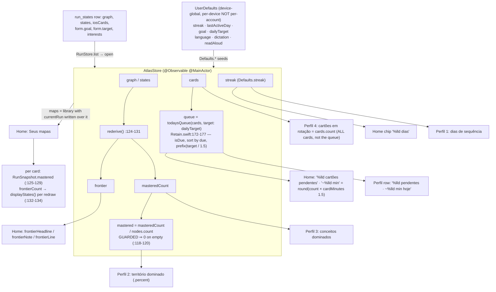

Two facts that fall out of this and recur below:

- Every division is guarded (`AtlasStore.swift:118-120`, `RunSnapshot.swift:126`).
  **No NaN and no divide-by-zero is reachable on any of these screens.**
- `streak`, `goal`, `dailyTarget`, `language` and the two voice flags live in
  unkeyed `UserDefaults` (`Defaults.swift:5-42`). They are _device_ state
  presented as _account_ state — the root of H-6, S-22 and ST-1.

---

# HOME (Início) — screen 11

## 1. Today's review card

**Objective.** Answer the first of the day's two decisions — is there anything to
retrieve right now — framed in minutes rather than card counts, and send the
learner to the Revisão tab. It decides nothing itself.

**How it works.** `HomeView.reviewCard(_:)` (`HomeView.swift:83-92`) is a `Button`
whose action is `tabs.switchTab(to: .review)`, wrapping the shared `summary(...)`
block (`:106-122`) in a `Card` bordered `Palette.accent.opacity(0.22)`. Strings
come from `HomeViewModel`: `reviewHeadline` (`:29-31`, `String(localized:)` in both
branches because one is inspected), `reviewNote` (`:33-37`,
`Int((Double(queue.count) * cardMinutes).rounded())` with `cardMinutes = 1.5` at
`Domain/Retain.swift:169`), `reviewAction` (`:39`, a `LocalizedStringKey`).
`queue` (`:24`) is `AtlasStore.queue` (`AtlasStore.swift:138`) →
`todaysQueue(cards, target: dailyTarget)` (`Retain.swift:172-177`): due only,
sorted by `due`, then `prefix(max(1, Int(Double(target) / cardMinutes)))` — 10
cards at the default 15 min target.

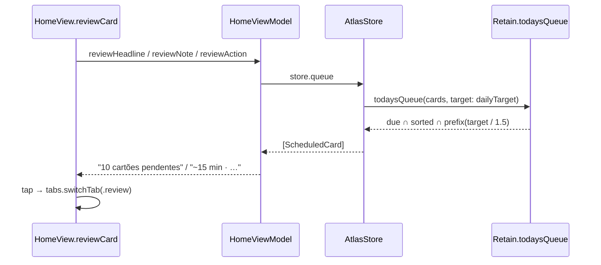

**User value.** The learner never faces a queue of 200. The count shown is the
count asked for today, and the minutes arithmetic is the same one the Revisão
screen uses (`ReviewViewModel.swift:41`), so Home and Revisão cannot disagree.

**Bugs.**

- **H-1 (confirmed, low)** `HomeViewModel.swift:25-37`. `queueIsEmpty` reads the
  _capped_ queue. "Fila limpa" is still honest (a cap of ≥1 can never empty a
  non-empty due set), but the inverse is invisible: with 60 due and a 15 min
  target the card says "10 cartões pendentes" with no signal that 50 more are
  waiting. The web caps identically, so this is parity, not regression — logged
  because a learner reads "10 pendentes" as "10 exist".

**Must-improve.**

1. (`HomeViewModel.swift:29-37`) Add a clause when
   `cards.filter(isDue).count > queue.count` — mobile is the only place a
   learner will notice their deck falling behind.

---

## 2. Frontier card

**Objective.** Answer the second decision — what am I allowed to learn next — by
naming the head of the derived frontier, and open the Mapa tab.

**How it works.** `HomeView.frontierCard(_:)` (`:94-103`), same `summary(...)`
block, border `NodeState.frontier.color.opacity(0.28)`, action
`tabs.switchTab(to: .map)`. `frontier` (`HomeViewModel.swift:41`) reads
`store.frontier`, which is _stored_, not computed: `AtlasStore.rederive()`
(`:124-131`) runs `displayStates(states, graph)` (`Domain/Concept.swift:163-175`)
on every `graph`/`states` write. `frontierHeadline` (`:44`) is
`frontier.first?.label`, rendered `Text(verbatim:)` (`HomeView.swift:112`) because
a node label is generated material — correct per `ios/AGENTS.md` §Copy.
`frontierNote` (`:45-47`) is the node's `summary`. `frontierLine` (`:48-50`) is a
`LocalizedStringKey`; the catalogue carries both `one`/`other` plural variations
(verified).

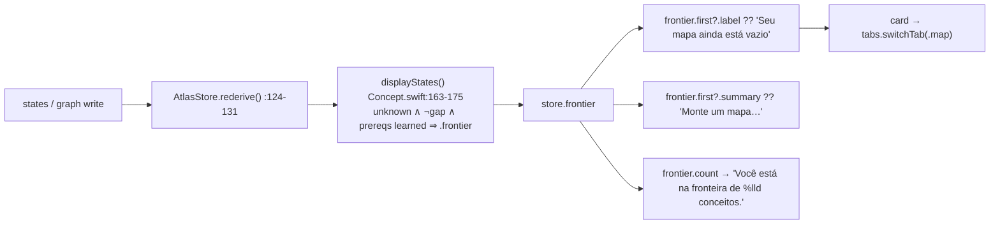

**User value.** One name, one sentence, one tap. The frontier derivation is
shared with the map canvas and node drawer, so this card cannot disagree with the
map it opens — the single-derivation rule of `ios/AGENTS.md` §State genuinely holds.

**Bugs.**

- **H-2 (confirmed, medium)** `HomeViewModel.swift:44-50`. `frontier` is empty in
  two unrelated situations — no map, and _every node learned_ — and the fallback
  copy only covers the first. `RootView.swift:28` routes to onboarding whenever
  `store.graph.nodes.isEmpty`, so Home is only ever drawn with a non-empty graph:
  the "map is empty" branch is unreachable for its stated reason and always fires
  for the wrong one. Failure: a learner finishes a 12-concept map and Home
  congratulates them with "Seu mapa ainda está vazio" / "Monte um mapa para
  acender sua primeira fronteira." under "Você está na fronteira de 0 conceitos.
  Continue de onde parou." Medium — this is the product's completion moment.
- **H-3 (confirmed, low)** `HomeViewModel.swift:52` uses `!store.subject.isEmpty`
  for `hasRun`; `RootView.swift:28` uses `store.graph.nodes.isEmpty`. `clearRun()`
  (`AtlasStore.swift:382-391`) clears both so they agree today, but a run whose
  snapshot failed to decode (`RunSnapshot.init?` returns nil on an unknown
  version, `:64`) would draw Home with a "Seus mapas" section and no frontier.

**Must-improve.**

1. (`HomeViewModel.swift:44-47`) Split the empty-frontier case on
   `graph.nodes.isEmpty` vs `masteredCount == graph.nodes.count` and give the
   second real copy ("Mapa completo — a revisão é o que o mantém").
2. (`HomeViewModel.swift:52`) Derive `hasRun` from the shell's own predicate.

---

## 3. Map list ("Seus mapas")

**Objective.** List every saved run, show each one's mastery share and frontier
size, and let a tap switch the whole store onto it — a second map without going
through onboarding.

**How it works.** Gated on `model.hasRun` (`HomeView.swift:59`).
`ForEach(model.maps)` (`:62`) → `AtlasStore.maps` (`:271-280`): `library` with the
open run's row replaced by `currentRun` (`:284-301`), a fresh `RunSnapshot` built
by copying `graph`, `states`, `cards`, `calib`, `reviewed` out of the live store.
`RunSnapshot.id` is `subject` (`:48`), half the row's primary key, so `ForEach`
identity is sound. Per card (`HomeView.swift:127-161`): `Kicker(map.goal.label)`,
a `Chip(model.status(map))` from `isOpen` (`HomeViewModel.swift:64`),
`ProgressView(value: map.mastered)` (`RunSnapshot.swift:125-129`, guarded), and
`model.frontierCount(map)` (`HomeViewModel.swift:71-73`) which for a non-open map
runs a **full `displayStates` pass** (`RunSnapshot.swift:132-134`). Tapping:
`Task { await model.open(map); tabs.switchTab(to: .map) }` (`:129-133`) →
`store.switchTo` (`AtlasStore.swift:251-255`) → `await saveNow()` → `open(run)`
under `quiet`. "+ Novo mapa" (`:165-167`) → `store.newMap()` (`:261-267`) →
`saveNow()`, `clearRun()`, and `RootView` swaps to onboarding (`:28`, `:51-54`).

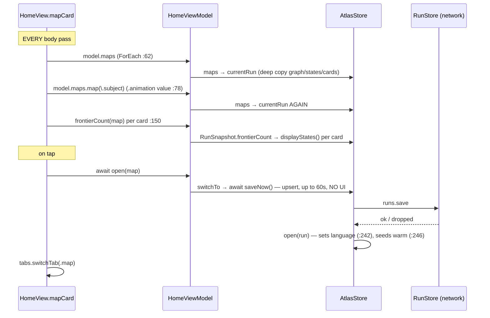

**User value.** Concurrent maps ("Cálculo" and "Direito Constitucional") without
losing either, with a per-map progress figure read exactly the way the map screen
reads it.

**Bugs.**

- **H-4 (confirmed, medium)** `HomeView.swift:62`, `:78`, `:150`. Both `:62` and
  `:78` evaluate `model.maps`, and `AtlasStore.maps` builds `currentRun`
  (`:284-301`) — a struct copy of the whole run — each time: two deep copies per
  body pass. On top, `frontierCount` walks every non-open map's nodes and edges
  (`Concept.swift:163-175`) once per card per pass. Three saved 60-node maps means
  2 deep copies + 3 graph derivations on the main actor every time the streak chip
  or a tab return re-runs `body`. Directly violates `ios/AGENTS.md` §MVVM
  ("computes nothing in `body` that a stored property could carry").
- **H-5 (confirmed, medium)** `HomeView.swift:129-133`. `switchTo`
  (`AtlasStore.swift:253`) awaits an upsert running at `URLSession`'s default 60 s
  `timeoutInterval` — no explicit timeout is set anywhere in `Data/` (verified by
  grep; only `OpenRouter.swift:40-42` sets one). The learner taps a map card and
  nothing happens, possibly for a minute. Nothing disables the button, so a second
  tap starts a second `switchTo`; the first `open()` can land after the second,
  leaving the store on one map and the tab bar showing another. Same on "+ Novo
  mapa" (`:166`).
- **H-6 (confirmed, HIGH)** `AtlasStore.swift:242` → `Defaults.swift:19-25`.
  `open(_:)` sets `self.language = run.language`, firing the `language` didSet
  (`:48-58`) whose `Defaults.language = language` (`:51`) writes **`AppleLanguages`**.
  `quiet` guards only `loaded?.language` and `saveSoon()` (`:55-57`) — the defaults
  write is unconditional. Failure: a Brazilian learner with a Portuguese phone taps
  a map built in the browser in English; `AppleLanguages` becomes `["en"]`; on the
  next cold start every `Text` and `String(localized:)` is English, with no alert,
  no explanation, and no way back except finding Configurações › Idioma in a
  language they may not read. The same path fires on **every launch** via
  `loadLibrary()` → `open(freshest)` (`:220`). This is exactly the effect screen 13
  spends an `exit(0)` making explicit, happening implicitly.
- **H-7 (confirmed, low)** `HomeView.swift:30-37` vs `:77`. The streak chip in the
  `TopBar` carries `.contentTransition(.numericText())` and `.transition(.scale…)`,
  but the only `.animation(Motion.spring, value: model.streak)` sits at `:77` on the
  `VStack` **inside the ScrollView** — it cannot drive a transition on a sibling
  subtree in the `TopBar`. Nothing calls `withAnimation` when `markActiveToday()`
  mutates the streak (`AtlasStore.swift:165-172`). The chip pops in unanimated and
  the numeric transition is inert; the comments at `:33-34` and `:75-76` claim
  otherwise.
- **H-8 (confirmed, medium)** `HomeView.swift:38`.
  `Button { tabs.switchTab(to: .profile) } label: { Avatar(model.email) }` —
  `Avatar`'s default size is 34 and it applies `.frame(width: size, height: size)`
  (`Components.swift:578`, `:584`), with no `Metrics.tap` floor and no
  `.contentShape`. `ios/AGENTS.md` §Touch: "Nothing tappable is under
  `Metrics.tap` (44pt)." This is the only route to Perfil from Home, 23 % under.

**Must-improve.**

1. (`AtlasStore.swift:242`, `:48-58`) Separate "the content language of the run I
   just opened" from "the language the interface is pinned to". `open()` should set
   a non-persisting `contentLanguage`; only `SettingsViewModel.choose(language:)`
   should reach `Defaults.language`. Fixes H-6.
2. (`HomeView.swift:62`, `:78`, `:150`) Move `maps` and per-card `frontierCount`
   into stored properties recomputed on store change.
3. (`HomeView.swift:129-133`) `isSwitching` on the view model, `.disabled(...)` on
   the cards, visible progress during the flush.
4. (`HomeView.swift:38`) `.frame(width: Metrics.tap, height: Metrics.tap).contentShape(.circle)`.
5. (`HomeView.swift:30-37`) Move the streak `.animation` onto the `TopBar` `HStack`.

---

# PROFILE (Perfil) — screen 12

## 4. The 2×2 stat grid

**Objective.** Four numbers saying what the run adds up to, in the design's
stacked two-column form.

**How it works.** `ProfileView.stats(_:)` (`:50-57`) — a `LazyVGrid` of two
`GridItem(.flexible(), spacing: 12)` columns, feeding `stat(_:_:tint:)` (`:59-70`):
value at `.atlas(.serif, 26)` with `.contentTransition(.numericText())`, caption at
`.atlas(.sans, 12.5)`, on a 14 pt-radius `Palette.card` tile. All four values are
pre-formatted `String`s on the model, rendered `Text(verbatim:)` — correct, they
are counts and not copy.

| tile                | source                                | file:line                          |
| ------------------- | ------------------------------------- | ---------------------------------- |
| dias de sequência   | `store.streak` (UserDefaults)         | `ProfileViewModel.swift:14`        |
| território dominado | `store.mastered.formatted(.percent…)` | `:15` → `AtlasStore.swift:118-120` |
| conceitos dominados | `store.masteredCount`                 | `:16` → `AtlasStore.swift:128-130` |
| cartões em rotação  | `store.cards.count`                   | `:17`                              |

`.animation(Motion.reward, value: model.masteredShare)` (`ProfileView.swift:36`)
drives the numeric transition on the whole grid.

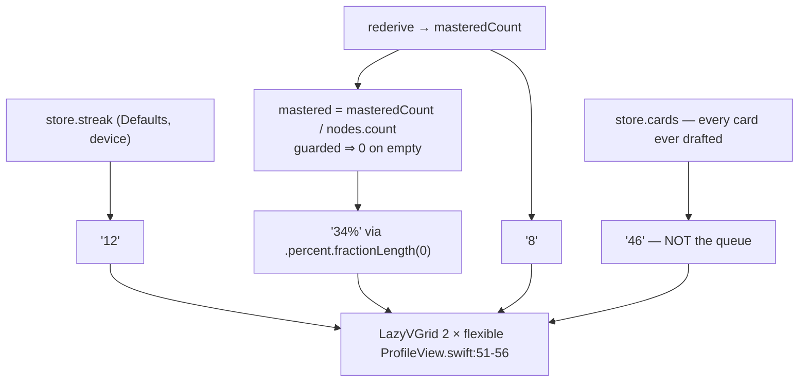

**User value.** The share and the concept count are what make a long run feel like
it is going somewhere; the card count says how much is in rotation; the streak is
the adherence beat.

**Bugs.**

- **P-1 (confirmed, medium)** `ProfileView.swift:51-70`. `Font.atlas` is
  `.custom(name, size:)` (`Core/Theme.swift:52-54`), which **does** scale with
  Dynamic Type — so at AX5 (~310 %) the value renders near 80 pt and the caption
  near 39 pt inside a column of roughly `(screen − 40 − 12) / 2 ≈ 160 pt`.
  "território dominado" wraps to four or five lines; "100%" at 80 pt is ~200 pt wide
  and will wrap or truncate. No `@ScaledMetric`, no `dynamicTypeSize` check to
  collapse to one column, no `.minimumScaleFactor`, no `.lineLimit`.
  `ios/AGENTS.md` §Touch: "a screen that breaks at the largest size is not done."
  Nothing clips (LazyVGrid rows grow) but the numbers become unreadable and the
  tiles wildly unequal.
- **P-2 (confirmed, low)** `ProfileView.swift:59-70` has no
  `.accessibilityElement(children: .combine)`, so VoiceOver reads "12" and
  "dias de sequência" as two separate elements a swipe apart.
- **P-3 (confirmed, low)** Drift. `components/atlas/useDerived.ts:325-330` ships
  streak / conceptsMastered / **onTheFrontier** / mapMastered. iOS
  (`ProfileViewModel.swift:14-17`) drops the frontier size — the number both
  platforms treat as the run's forward edge, and which Home already computes — for
  a raw card total that appears nowhere else in the product; the ordering differs
  too, so a cross-platform screenshot comparison reads as a bug even when it isn't.
- **P-4 — NaN / divide-by-zero: none found.** Every arithmetic expression
  reachable from these four properties was read. `AtlasStore.mastered` (`:118-120`)
  and `RunSnapshot.mastered` (`:126`) short-circuit on an empty node set;
  `masteredCount` and `cards.count` are `Int`; `.formatted(.percent…)` of `0.0` is
  `0%`. An empty run cannot produce NaN here.

**Must-improve.**

1. (`ProfileView.swift:51`) `@Environment(\.dynamicTypeSize)`; switch to one
   column at `>= .accessibility1`; `.minimumScaleFactor(0.6)` on the value.
2. (`:59-70`) `.accessibilityElement(children: .combine)`.
3. (`ProfileViewModel.swift:17`) Restore `store.frontier.count` as the fourth
   stat, matching `useDerived.ts:328`.

---

## 5. Learning profile + the three rows

**Objective.** Say what the run is _for_ (goal, interests), then get out of the
way: settings, review schedule, and the way out of the account.

**How it works.** `ProfileView.profile(_:)` (`:74-99`) — a
`Kicker("Perfil de aprendizado")`, the goal label (`ProfileViewModel.swift:18` →
`GoalKind.label`, `Domain/Diagnostic.swift:12-19`), and, when non-empty, the
interests as `Chip(verbatim:)` in a `LazyVGrid(.adaptive(minimum: 90))`.
`interests` (`ProfileViewModel.swift:21-26`) splits on `,`/`;`, trims via
`String.trimmed` (`Core/Support.swift:15`), drops empties.
`ProfileView.rows(_:)` (`:103-120`) is three `Button`s over `row(_:_:tint:)`
(`:122-137`, each `minHeight: 64` + `.contentShape(.rect)`):
`navigator.navigate(to: .settings)` (`App/AtlasRoute.swift:14`, `:24`),
`tabs.switchTab(to: .review)` subtitled `model.queueLine`
(`ProfileViewModel.swift:28-33`), and `model.signOut()` → `AtlasStore.signOut()`
(`:363-377`).

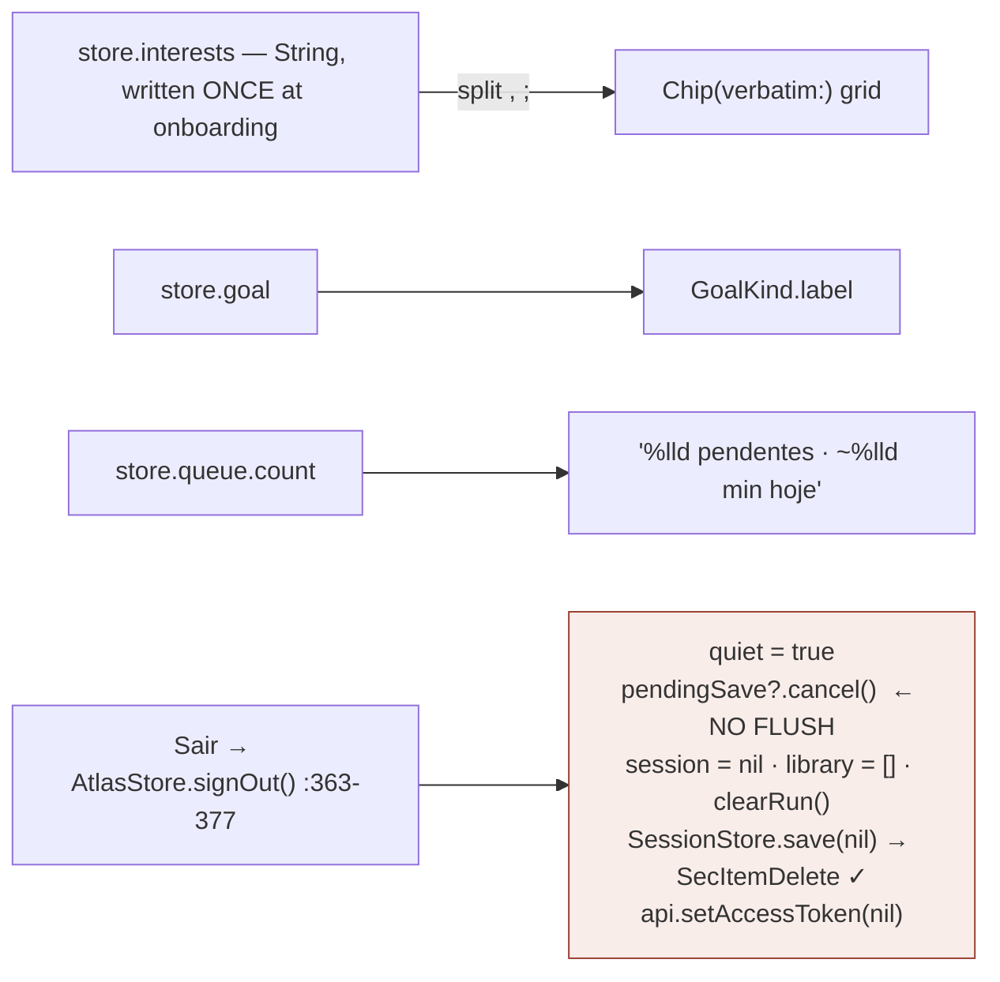

**User value.** The interests chips are the only place a learner can confirm that
the analogies they keep seeing come from something they chose; the queue subtitle
makes the Revisão row honest rather than decorative.

**Bugs.**

- **P-5 (confirmed, HIGH)** `AtlasStore.swift:367`, reached from
  `ProfileView.swift:113` → `ProfileViewModel.swift:35`. `signOut()` line 367 is
  `pendingSave?.cancel()` — the debounced upsert is **cancelled, not flushed**.
  Every other bulk transition does the opposite: `switchTo` awaits `saveNow()`
  first (`:253`), `newMap` awaits it (`:262`), `restart()` awaits it before
  `exit(0)` (`SettingsViewModel.swift:52`). Failure: the learner grades the last
  card of a review, taps Perfil, taps Sair inside the 2 s debounce (`:311`) — the
  grade, the calibration sample and the `reviewed` insert are gone, and because
  the client has no local persistence beyond `run_states` (`ios/PLAN.md:152`) they
  are gone permanently. One-line fix in principle (`await saveNow()`), though it
  means making `signOut` async or flushing on a task that outlives the clear.
- **P-6 (confirmed, medium)** `ProfileView.swift:113-115`. "Sair" is styled in
  `NodeState.gap.color` beside two benign rows, has no `.alert`, and immediately
  swaps the shell and resets every tab stack (`RootView.swift:31`, `:44-46`). A
  mis-tap in a stack of 64 pt targets costs the session. The web at least lands on
  `/login` with the session intact (`useNavigation.ts:60-70`); here the keychain
  item is destroyed (`SessionStore.swift:13`).
- **P-7 (confirmed, medium)** `store.interests` is written exactly once, at
  `OnboardingViewModel.swift:217`, from a single-line `TextField`
  (`WelcomeView.swift:44`). `ProfileView.swift:83-91` renders them under
  "Interesses — usados para analogias", and `SettingsView` has no interests field
  at all — while `components/SettingsScreen.tsx:391-408` does. A learner whose
  interests changed, or who typo'd during onboarding, has no route to fix them on
  a screen that advertises them as load-bearing.
- **P-8 (confirmed, low)** `ProfileViewModel.swift:32` builds the key
  `%lld pendentes · ~%lld min hoje`. Verified in `Localizable.xcstrings`: a flat
  `stringUnit` for `en` and **no plural variation** in either language — unlike
  `%lld cartões pendentes` and `%lld dias`, which have both. With one card due the
  row reads "1 pendentes · ~2 min hoje". `ios/AGENTS.md` §Copy: "Plural agreement
  belongs to the catalogue."
- **P-9 (confirmed, low)** `ProfileViewModel.swift:13` returns `""` when
  `session?.email` is nil; `ProfileView.swift:28` then renders `Text(verbatim: "")`
  beside a 66 pt avatar whose initials fall back to "A" (`Components.swift:593`).
  Reachable in fixture mode (`AtlasStore.swift:395-404`) and for any session
  without an email claim.
- **P-10 (confirmed, low)** `ProfileViewModel.swift:22` splits on `,;`;
  `useDerived.ts:321` splits on `/[,\n]/`. Harmless today (the iOS input is
  single-line) but interests typed in the browser with newlines render as one chip.

**Must-improve.**

1. (`AtlasStore.swift:363-377`) Flush before clearing in `signOut`, matching
   `switchTo`/`newMap`. Highest-value one-line fix in the area.
2. (`ProfileView.swift:113`) Put "Sair" behind a `.confirmationDialog` naming the
   unsaved work.
3. (`SettingsView.swift`) Add an interests `TextField` bound to `$store.interests`
   — it already persists via `didSet { saveSoon() }` (`AtlasStore.swift:19`).
4. (`ProfileViewModel.swift:32`) Add the plural variation.

---

# SETTINGS (Configurações) — screen 13

## 6. Goal

**Objective.** Keep the onboarding goal editable for the life of the run —
"orienta o que priorizamos".

**How it works.** `SettingsView.swift:36-42`: a 2×2 `LazyVGrid` over
`GoalKind.allCases` (`Domain/Diagnostic.swift:8-19`), each a `choice(...)`
(`:133-147`) writing `store.goal = goal` through `@Bindable var store = store`
(`:22`). The didSet (`AtlasStore.swift:41`) writes `Defaults.goal` **and**
`saveSoon()` (the row, under `form.goal`).

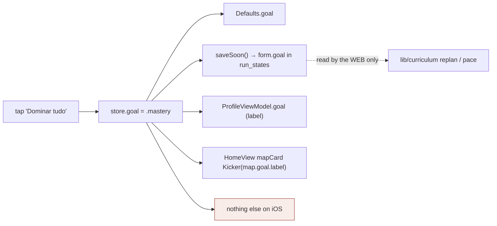

**User value.** Real on the _web_: the goal feeds the curriculum build and the
placement (`AtlasAPI.swift:152`, `:198`) and steers pruning. It also travels
correctly in the row, so a goal changed on the phone is honoured in the browser.

**Bugs.**

- **S-1 (confirmed, medium)** Exhaustive grep of `AtlasKit` for reads of
  `store.goal` returns four sites: the picker (`SettingsView.swift:39`), two label
  renders (`ProfileViewModel.swift:18`, `HomeViewModel.swift:54`) and a map-card
  kicker (`HomeView.swift:138`). The two places `goal` reaches a model
  (`AtlasAPI.swift:152`, `:198`) take an `OnboardingForm`, not the store, and are
  only called from `OnboardingViewModel`. Changing the goal here re-plans,
  re-prunes and re-generates **nothing** on device — it changes a caption and a
  column. The on-screen note "— orienta o que priorizamos" (`SettingsView.swift:36`)
  is a promise the iOS build does not keep.
- **S-2 (confirmed, low)** `components/SettingsScreen.tsx:294-322` reveals an
  exam-date input whenever `goal === "exam"`, which is the iOS default
  (`Defaults.swift:7`). iOS has no such field; the date rides through the row
  untouched (`RunSnapshot.swift:44`). A learner who picks the exam goal on the
  phone gets a countdown-less run until they open the browser.

**Must-improve.**

1. (`SettingsView.swift:36`) Either soften the note to what it does ("viaja com o
   mapa") or wire `store.goal` into `Warm`'s generation inputs.

---

## 7. Daily target

**Objective.** Set the streak unit and the honest size of the day's review deck.

**How it works.** `SettingsView.swift:44-50`: an `HStack` of
`choice("\(minutes) min", …)` over `dailyTargets = [10, 15, 20, 30]`
(`Domain/Diagnostic.swift:36`), writing `store.dailyTarget`. The didSet
(`AtlasStore.swift:42`) writes `Defaults.dailyTarget` and `saveSoon()`.
`Defaults.dailyTarget` (`Defaults.swift:10-13`) validates against the same array
on read and falls back to 15, so a corrupt or absent key can never yield a 0 target.

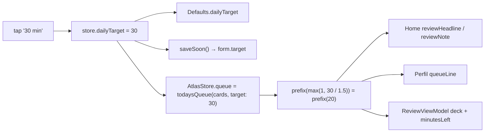

**User value.** **Not cosmetic** — unlike the goal, this genuinely re-plans the
day: it is the divisor in `todaysQueue` (`Retain.swift:175`), so 15 → 30 doubles
the deck on Home, on Perfil and in the review session. Verified correct.

**Bugs.**

- **S-3 (confirmed, low)** `ReviewViewModel` snapshots the queue on construction;
  `store.queue` recomputes but the in-flight session does not. Reachable only by
  pushing Settings from another tab mid-session.
- **S-4 (confirmed, low)** `SettingsView.swift:45-49` is four `choice` pills in a
  non-wrapping `HStack`. At AX5 "30 min" in an ~80 pt column wraps to two lines and
  the row cannot reflow the way the goal block's grid does (`:37`). Same class as P-1.

**Must-improve.**

1. (`SettingsView.swift:45`) Use the goal block's `LazyVGrid`, or `ViewThatFits`
   between an `HStack` and a 2×2 grid.

---

## 8. Language switch — the `exit(0)` relaunch

**Objective.** Change _both_ the interface language and the language generated
content comes back in, via one `UserDefaults` key rather than a `Locale` threaded
through every view model — and be honest that the interface half only lands on
the next launch.

**How it works.** The highest-risk mechanism in the area, in full:

1. `SettingsView.swift:52-60` renders one `choice` per `AtlasAPI.languages`
   (`AtlasAPI.swift:362` = `["pt-BR", "en"]`), labelled "Português"/"English",
   selected on `store.language == code`, action `model.choose(language: code)` —
   the one picker on the screen that does not write the store directly.
2. `SettingsViewModel.choose(language:)` (`:35-39`) guards
   `language != store.language` (re-picking the current one is a silent no-op),
   sets `store.language`, sets `restarting = true`.
3. `AtlasStore.language`'s didSet (`:48-58`) runs **synchronously**:
   `AtlasAPI.language = language` (every generation from this instant asks for the
   new language); `Defaults.language = language` (`Defaults.swift:19-25` — writes
   the `"language"` key **and `AppleLanguages`**, which `Bundle.main` reads at the
   next launch to pick an `.lproj`); `if !quiet { loaded?.language = language }`;
   `saveSoon()`.
4. `restarting` raises the alert (`SettingsView.swift:81-85`) — one button, no
   cancel, deliberately (`:79-80`: the screen behind it is still in the old language).
5. `Button("Fechar o Atlas") { Task { await model.restart() } }` — the alert
   dismisses immediately, then the task runs.
6. `restart()` (`SettingsViewModel.swift:51-54`): `await store.saveNow()`, `exit(0)`.
7. `saveNow()` (`AtlasStore.swift:327-346`) cancels the pending task, guards
   `signedIn && !subject.isEmpty && token`, builds `currentRun`, conditionally
   attaches `caches`, then
   `guard (try? await runs.save(run, caches: sendCaches, token: token)) != nil else { return }`.
8. `exit(0)`. iOS records an abnormal termination, indistinguishable from a crash.
9. Next launch: `Bundle.main.preferredLocalizations` leads with the new code, so
   every `Text`/`String(localized:)` resolves in it and `AtlasAPI.deviceLanguage`
   (`:357-359`) agrees.

```mermaid
sequenceDiagram
  autonumber
  participant U as Learner
  participant V as SettingsView
  participant M as SettingsViewModel
  participant S as AtlasStore
  participant D as UserDefaults / cfprefsd
  participant N as RunStore (network)
  participant OS as iOS

  U->>V: tap "English"
  V->>M: choose(language: "en")
  M->>M: guard "en" != store.language
  M->>S: store.language = "en"
  activate S
  S->>S: AtlasAPI.language = "en"
  S->>D: Defaults.language → "language" = "en"
  S->>D: Defaults.language → AppleLanguages = ["en"]  ⚠ written NOW, before any confirmation
  S->>S: loaded?.language = "en"   ⚠ stamps the run though its caches are pt-BR
  S->>S: saveSoon() → 2s debounce armed
  deactivate S
  M->>V: restarting = true
  V->>U: alert "Reabra o Atlas" (one button, no cancel)
  U->>V: tap "Fechar o Atlas"
  V->>M: Task { await restart() }
  Note over V,U: alert already dismissed — screen stays live and tappable for the whole flush
  M->>S: await saveNow()
  S->>S: pendingSave?.cancel(); pendingSave = nil
  alt not signed in / subject empty
    S-->>M: return immediately — defaults write to exit(0) gap is microseconds
  else signed in
    S->>N: runs.save(...)  — default 60s timeout, no UI
    alt 2xx
      N-->>S: savedWarm / loaded / library updated
    else transport error, 4xx, 5xx, offline
      N-->>S: throw → try? → guard … else { return }   ⚠ WRITE SILENTLY DROPPED
    end
  end
  S-->>M: void — indistinguishable from success
  M->>OS: exit(0)
  OS->>OS: process killed — logged as an abnormal exit
  U->>OS: tap Atlas on the springboard
  OS->>D: Bundle.main.preferredLocalizations reads AppleLanguages
  OS-->>U: interface in English; run.language = "en"; caches still hold pt-BR prose
```

**User value.** The one honest way to change interface language on iOS without a
locale threaded through every model. The alert names the cost, the button says
exactly what will happen, and the copy behind it is never half-translated.

**Bugs.**

- **S-5 (confirmed, HIGH)** `SettingsViewModel.swift:51-54` + `AtlasStore.swift:338`.
  `restart()` awaits `saveNow()` and then calls `exit(0)` **unconditionally**.
  `saveNow`'s `guard (try? await runs.save(...)) != nil else { return }` returns
  `void` on transport failure, on any non-2xx from PostgREST and on an expired
  token (`RunStore.swift:53-63`) — exactly as it does on success. `restart()`
  cannot tell them apart. Because the client has no local persistence beyond
  `run_states` (`ios/PLAN.md:152`: "the run, the deck and the calibration curve
  live for one launch"), the dropped write is not deferred, it is destroyed.
  Concrete: a learner on the subway grades twelve cards and masters two nodes,
  switches to English, taps "Fechar o Atlas"; `runs.save` fails offline; `exit(0)`.
  On relaunch `loadLibrary()` reads the last successful upsert — everything since
  is gone, with no error, no toast, no retry. **The brief's central question
  answered: the run is _attempted_, not _guaranteed_, flushed.**
- **S-6 (confirmed, medium)** `SettingsViewModel.swift:53`. `exit(0)` is
  acknowledged in-code (`:47-50`) and in `ios/AGENTS.md` §Copy's HTML comment, so
  this is a known accepted risk rather than a discovery — but it belongs in the
  ledger. Apple's HIG forbids quitting programmatically; the exit is recorded as
  an abnormal termination and pollutes the crash-rate metric the App Store surfaces.
- **S-7 (confirmed, medium)** `SettingsView.swift:81-85`. The alert dismisses the
  instant the button is tapped, then `restart()` awaits a round trip that can run
  the full 60 s default `timeoutInterval` (no explicit timeout anywhere in `Data/`).
  For that window the learner sees Settings doing nothing, can navigate back,
  switch tabs, start a review — and the process then vanishes under them. No
  blocking overlay, no `AtlasPulse`, no disabled state.
- **S-8 (suspected, low)** `Defaults.swift:19-25` + `SettingsViewModel.swift:53`.
  The write goes through `UserDefaults.standard.set` and there is **no**
  `synchronize()` anywhere in the package (verified by grep). On modern iOS the
  value is forwarded to `cfprefsd` over XPC and the daemon outlives the app, and
  the awaited `saveNow()` usually buys tens of milliseconds — but when `saveNow`
  returns immediately via the guard at `AtlasStore.swift:330` the gap is
  microseconds. If the write is lost the learner closes the app on instruction and
  reopens it in the _old_ language, indistinguishable from the feature being broken.
  Suspected: not provable from source alone.
- **S-9 (confirmed, medium)** `AtlasStore.swift:48-58` + `Warm.swift:312-327`. The
  language didSet does **not** call `warm.clear()` — that only happens in `open`
  (`:230`) and `clearRun` (`:383`). Warm keys carry the language
  (`Warm.swift:190-192`: `"\(kind)|\(subject)|\(node.id)|\(language)|\(inputs)"`)
  but the persisted `caches` column does not: `seedWarm` is keyed by `kind` and
  `nodeId` only and rebuilds keys with the store's _current_ language. Sequence:
  switch to `en` → `loaded?.language = "en"` → saved → relaunch → `open(run)` sets
  `language = "en"` (`:242`) → `seedWarm` (`:246`) files the Portuguese Consume
  sections under `consume|…|en|` keys → Consume opens instantly, in Portuguese, in
  an English interface, and never regenerates because the cache hit is a hit.
- **S-10 (confirmed, low)** `SettingsView.swift:55`:
  `code == "pt-BR" ? "Português" : "English"`, both `LocalizedStringKey` literals.
  The catalogue translates `"Português"` → `en: "Portuguese"` (verified). So an
  English interface offers "Portuguese"/"English". The web hard-codes the endonym
  in _both_ string tables (`components/SettingsScreen.tsx:38-39` and `:76-77` both
  say `portuguese: "Português"`). A language picker is the one control that must
  be readable to someone who cannot read the current interface language.
- **S-11 (confirmed, low)** `SettingsViewModel.swift:35-39` writes
  `store.language`, `AppleLanguages`, `loaded?.language` and arms `saveSoon()`
  **before** the alert appears, and the alert has no Cancel by design. A mis-tap on
  "English" is already committed; the only undo is to tap Português, which raises
  the same alert and stamps `loaded?.language` a second time.

**Must-improve.**

1. (`SettingsViewModel.swift:51-54`) Make the flush observable and gate the exit on
   it: `AtlasStore.saveNow()` → `Bool` (or `throws`); `restart()` surfaces
   `ErrorCopy.sentence(for:doing:)` and does **not** exit when the write did not
   land. The single highest-value change in this audit.
2. (`SettingsViewModel.swift:53`) Drop `exit(0)` before App Store submission, as
   `ios/AGENTS.md` §Copy already instructs. Honest alternative: keep the alert,
   change the button to "Entendi", let the learner close the app.
3. (`SettingsView.swift:81-85`) Cover the screen with a non-dismissable
   `AtlasPulse` overlay during the flush, and give `RunStore` an explicit timeout.
4. (`AtlasStore.swift:48-58`) `warm.clear()` on a deliberate (`!quiet`) language
   change and drop the regenerable `caches` buckets. Closes S-9.
5. (`SettingsView.swift:55`) Pass endonyms as `Text(verbatim:)`; delete the
   `"Português"` catalogue entry.
6. (`SettingsViewModel.swift:53`) `UserDefaults.standard.synchronize()` immediately
   before `exit(0)` — deprecated but not removed, and the only belt-and-braces
   available while the exit exists.

---

## 9. The two voice toggles

**Objective.** One switch for dictation (a mic on every free-text answer), one for
read-aloud (Consume sections can be spoken); both device preferences, both
following the interface language, never a second voice choice.

**How it works.** `SettingsView.swift:62-70`: two `toggle(...)` rows (`:149-159`,
`minHeight: 60`, `.tint(Palette.accent)`) bound through `@Bindable var store` to
`$store.dictationOn` / `$store.readAloudOn`. `AtlasStore.swift:43-44` — these are
the **only** run-adjacent properties whose didSet writes `Defaults` and
deliberately does _not_ call `saveSoon()`. Correct: voice is a device preference,
as on the web (`useVoicePrefs`, `SettingsScreen.tsx:230-232`).
`Defaults.dictationOn`/`readAloudOn` (`Defaults.swift:26-33`) read via
`object(forKey:) as? Bool ?? true`, so absent means _on_ — right default, and not
achievable with `bool(forKey:)`. Consumers: `Components.swift:385` and `:395`
(`AnswerEditor`'s mic), `SocraticView.swift:161`/`:165`/`:185`,
`ConsumeView.swift:38`.

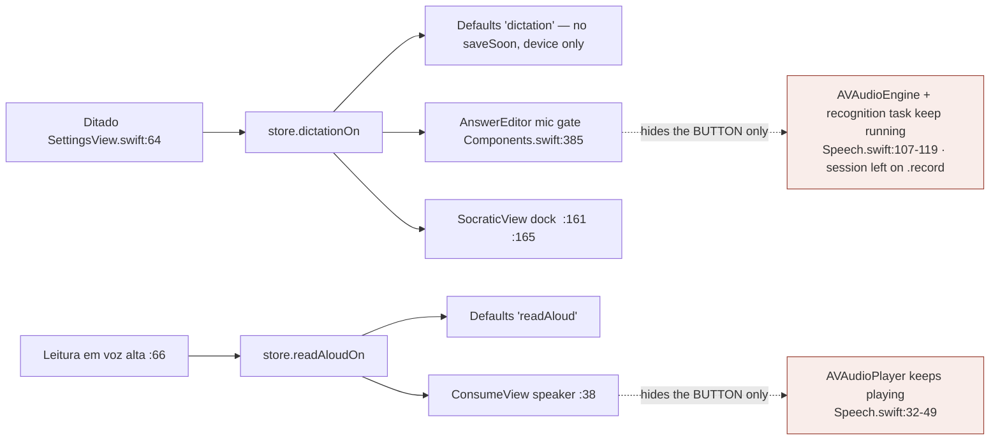

**User value.** Dictation is the difference between a Socratic answer typed on a
phone keyboard and one spoken; read-aloud makes a Consume pass usable while
walking. Device-level rather than run-level is right — the same account on a
tablet should not inherit the phone's setting.

**Bugs.**

- **S-12 (confirmed, medium)** `Components.swift:385`, `ConsumeView.swift:38`. Both
  gates are plain `if` statements in `body`; neither `Dictation.stop`
  (`Speech.swift:122-134`) nor `Speaker.stop` (`:52-59`) is called, and there is no
  `onChange(of: store.dictationOn)` anywhere. Failure: the learner starts dictating
  a Feynman answer, a colleague appears, so they open Configurações and switch
  Ditado off — the mic button disappears but `AVAudioEngine` is still running with
  the input tap installed (`Speech.swift:107-112`), the recognition task is live,
  the orange recording indicator is lit, and no control exists that can stop it.
  The session is also left on `.record` (`:105`), which will silence the next
  read-aloud. Same shape for a read-aloud clip in flight.
- **S-13 (confirmed, medium)** `Speech.swift:79-92`. `Dictation.start()` returns
  silently when `SFSpeechRecognizer(locale:)` is nil or `!isAvailable`, and again
  when authorization is not `.authorized`; `Speaker.toggle` (`:32-49`) returns
  silently when `/api/speech` fails. A learner who denied the mic permission once
  sees a mic button that does nothing, forever, with no copy and no route to iOS
  Settings. The web solves exactly this — `SettingsScreen.tsx:346-368` renders
  `dictationUnsupported`/`readAloudUnsupported` and _disables_ the toggle via
  `voiceSupport`. iOS ships neither the check nor the sentence.
- **S-14 (confirmed, low)** `SettingsView.swift:64`, `:66` pass fixed subtitles;
  the web swaps the whole sentence (`dictationOn`/`dictationOff`,
  `SettingsScreen.tsx:44-47`) so an off switch says what off means. Cosmetic — a
  `Toggle` does carry its state visually.

**Must-improve.**

1. (`SettingsView.swift:62-70`) `.onChange` on both flags calling the respective
   `stop()`. The engines are owned by `AnswerEditor`/`ConsumeViewModel`, so this
   likely wants a small coordinator in `Core/Speech.swift`.
2. (`Speech.swift:79-92`) Expose authorization state on `Dictation`
   (`@Observable var available`), gate the toggle on it, add the two copy lines
   the web already has.

---

## 10. Data export

**Objective.** "Seus dados — são seus." Hand the learner their map and their deck
in formats another tool can read, with no server round trip.

**How it works.** Both payloads are built **once**, in `SettingsViewModel.init`
(`:23-27`) and stored (`:18-19`); the comment at `:15-17` explains why —
`ShareLink` takes a value and encoding the graph per `body` pass would be felt on
scroll. `makeExportedMap()` (`:63-69`) encodes a local
`struct Export { topic; graph: ConceptGraph; states: StateMap }` with
`.prettyPrinted`, `?? "{}"` on failure. `makeExportedCards()` (`:73-84`) is a
hand-rolled CSV: `cell(_:)` quotes each field and doubles interior quotes (RFC 4180
quoting, correctly done); columns front (falling back to cloze segments joined by
`" ______ "`), back, node id, `due.formatted(.iso8601)`; header
`"frente,verso,no,vencimento"`. `SettingsView.swift:99-100` renders both as
`ShareLink(item: model.exportedMap) { ghostLabel(...) }`.

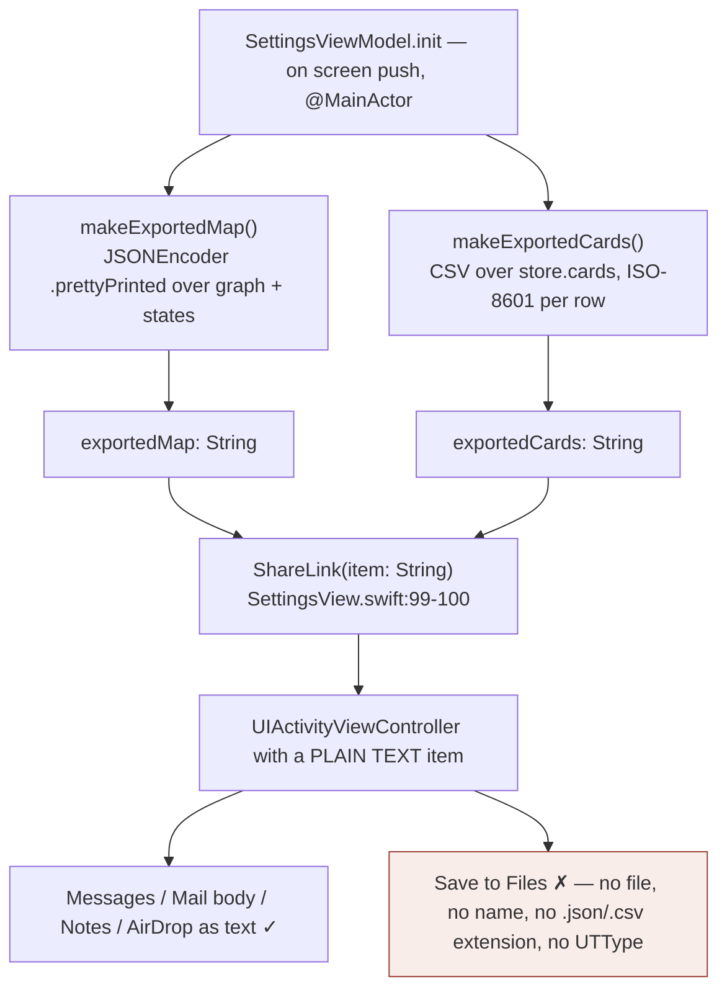

**User value.** Real and rare: an unlocked copy of the map and the deck, produced
on device, requiring no account anywhere else.

**Bugs.**

- **S-15 (confirmed, medium)** `SettingsView.swift:99-100`. `ShareLink(item:)` with
  a `String` offers plain text — no filename, no extension, no `UTType`. "Save to
  Files" is not offered for a bare string item, and neither is "Open in Anki". The
  button promises "(JSON)"/"(CSV)"; the best outcome is pasting 40 KB into Notes.
  Fix: write to `URL.temporaryDirectory.appending(path: "atlas-map.json")` and
  `ShareLink(item: url, preview:)`, or make the export `Transferable` with `.json`
  / `.commaSeparatedText`.
- **S-16 (confirmed, low)** `SettingsViewModel.swift:23-27` runs on `@MainActor`,
  called from `SettingsView.swift:18`'s `.task`. `makeExportedMap` walks the whole
  graph and state map with `.prettyPrinted`; `makeExportedCards` formats an
  ISO-8601 date per card. For a 60-node map with 300 cards that is real main-thread
  work landing during the push animation. The comment at `:15-17` correctly moved
  it out of `body` but stopped one step short of off the main actor.
- **S-17 (confirmed, low)** `SettingsViewModel.swift:74`. A card front or back
  beginning `=`, `+`, `-` or `@` is executed as a formula by Excel, Numbers and
  LibreOffice. Content is model-generated (a maths card starting `= x²` is
  plausible), so this is a plausible-not-adversarial case with a one-line mitigation.
- **S-18 (confirmed, low)** `SettingsViewModel.swift:83`:
  `"frente,verso,no,vencimento"` — `no` should be `nó` (node); as written it reads
  as the Portuguese preposition. It is a raw Swift `String`, so it is Portuguese
  even for an English-language learner. Arguably data, but a header row is read by
  a person.
- **S-19 (confirmed, low)** `SettingsViewModel.swift:77`. The exported front is the
  cloze segments with blanks between them; which segment was the deletion is not
  recoverable, so an Anki import of a cloze card is a different card.
- **S-20 (confirmed, low)** `SettingsScreen.tsx:52-54` offers map JSON, **cards
  JSON with full scheduling**, and Anki CSV. The iOS CSV drops `ScheduledCard`'s
  SM-2 state, so an export/reimport loses the learner's scheduling history. Three
  lines (`JSONEncoder().encode(store.cards)`) would close it.
- **S-21 — data leakage: none found.** Both encoders were read line by line.
  `makeExportedMap` emits only `subject`, `graph`, `states`; `makeExportedCards`
  only card text, node id and due date. Neither touches `store.session`, the access
  or refresh token, the keychain, `store.calib` or `AtlasAPI` state. No email, no
  bearer, no request id.

**Must-improve.**

1. (`SettingsView.swift:99-100`) Share file URLs, not strings — this is what makes
   the feature actually work.
2. (`SettingsViewModel.swift:23-27`) Build both payloads off the main actor and
   publish the results.
3. (`SettingsViewModel.swift:73-84`) Escape formula leaders; fix `no` → `nó`; add
   the cards-JSON export.

---

## 11. Account deletion

**Objective.** Wipe the learner's data from the server and clear the device,
behind a confirmation, satisfying the App Store's account-deletion requirement.

**How it works.** `SettingsView.swift:101-108` — a `Palette.dangerBg`/`dangerInk`
button at `minHeight: 48`, action `model.askToDelete()` (`SettingsViewModel.swift:29`).
`SettingsView.swift:86-91` — a two-button `.alert("Apagar minha conta?")` with
`role: .cancel` and `role: .destructive`, message "Seu mapa, seu progresso e seus
cartões são apagados do servidor. Não dá para desfazer."
`SettingsViewModel.delete()` (`:87-94`): `try await store.api.deleteAccount()` then
`store.signOut()`, catching into
`message = ErrorCopy.sentence(for: error, doing: String(localized: "apagar sua conta"))`
(`Core/Support.swift:24-31`) — correct per `ios/AGENTS.md` §Copy: the upstream
`message` never reaches the screen and the `doing:` fragment is itself a catalogue
entry. `AtlasAPI.deleteAccount()` (`:326-328`) POSTs `api/account/delete` with the
bearer and discards the body. Server (`app/api/account/delete/route.ts`):
`getClaims()`; `run_states.delete().eq("user_id", userId)` under RLS (`:30`); if
`SUPABASE_SECRET_KEY` is present, `admin.auth.admin.deleteUser(userId)` whose FK
cascade also purges `generation_log` (`:41-50`); `signOut()`; `200 { ok, authDeleted }`.
Device: `AtlasStore.signOut()` (`:363-377`) → `SessionStore.save(nil)`
(`SessionStore.swift:12-19`) → `SecItemDelete` on the `kSecClassGenericPassword`
item `"atlas.session"` — **the keychain is genuinely cleared** — plus
`api.setAccessToken(nil)`, `library = []`, `clearRun()`.

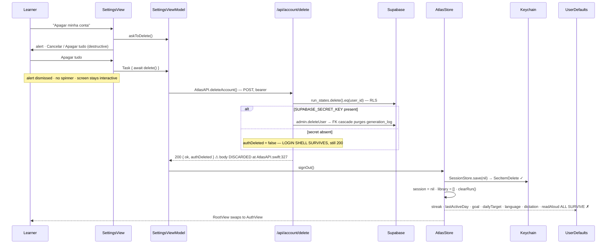

**User value.** A real, one-tap, confirmed deletion that reaches the server — both
the right thing and an App Store requirement. The copy names exactly what goes and
that it is irreversible.

**Bugs.**

- **S-22 (confirmed, medium)** `AtlasStore.swift:363-377` clears the keychain, the
  library and the run but touches **none** of the seven `UserDefaults` keys in
  `Defaults.swift:5-42`. After deleting their account the learner's `streak`,
  `lastActiveDay`, `goal`, `dailyTarget`, `language`, `dictation` and `readAloud`
  all remain. Failure: learner A deletes their account and hands the phone to
  learner B, who signs up; B's Perfil opens with A's 40-day streak and A's goal,
  and Home congratulates B on a streak they never earned. For a feature whose
  purpose is "excluir tudo — sem volta", leaving the adherence record behind is a
  defect.
- **S-23 (confirmed, medium)** `route.ts:41-54` deliberately returns 200 with
  `authDeleted: false` when the service key is absent — data gone, login shell not.
  `AtlasAPI.deleteAccount()` (`:326-328`) is `_ = try await send(...)`, so
  `delete()` (`:87-94`) treats partial and full deletion identically and shows
  nothing. The learner is told the account is gone and then finds they can still
  sign in (into an empty account). The decode is two lines.
- **S-24 (confirmed, medium)** `SettingsViewModel.swift:87-94` has no `deleting`
  flag. The alert dismisses on tap; the POST can run to the 60 s default timeout
  with the screen live and the button still enabled. A learner who assumes the tap
  missed will confirm again, issuing a second DELETE — harmless server-side, but it
  races `signOut()` and will most likely surface "Sua sessão expirou" _after_ the
  first call already succeeded.
- **S-25 (confirmed, low)** `SettingsViewModel.swift:14`, `:92`. `message` is set on
  failure and nothing resets it — not `askToDelete()`, not `cancelDelete()`, not a
  later success. `SettingsView.swift:110-113` renders it in danger ink, so a
  learner who fails once and then succeeds sees the stale sentence until the shell
  swaps.
- **S-26 (confirmed, low)** `delete()` calls `signOut()`, which cancels the pending
  save (`AtlasStore.swift:367`). Cancelling is _right_ here — re-upserting into
  rows the server just deleted would resurrect them — but it is right by accident:
  `signOut` has one behaviour and two opposite callers (see P-5).
- **S-27 — confirmation, server effect, keychain: all verified correct.** A proper
  two-button `.alert` with `role: .destructive` (`SettingsView.swift:86-91`); the
  endpoint really deletes rows and the auth user (`route.ts:30`, `:47`); the
  keychain item really is removed (`SessionStore.swift:13` ← `AtlasStore.swift:375`).

**Must-improve.**

1. (`AtlasStore.swift:363-377`) Add `eraseDevice()` clearing all seven `Defaults`
   keys and call it from `delete()`. Closes S-22.
2. (`AtlasAPI.swift:326-328`) Decode `{ ok, authDeleted }`; when false, say the
   data is gone but the login remains.
3. (`SettingsViewModel.swift:87-94`) `private(set) var deleting`; disable the
   button and show `AtlasPulse`; clear `message` on entry.
4. (`SettingsView.swift:96-118`) Add the privacy-policy link the web has
   (`SettingsScreen.tsx:483-487` → `/privacy`). Absent from the entire iOS package
   — verified by grep for `privacy`/`Privacidade` across `ios/**/*.swift`. This is
   a submission requirement, not a nicety.

---

## 12. Streak display

**Objective.** One number saying how many consecutive days have had work on them —
shown as an amber chip on Home and as the first Perfil stat.

**How it works.** Storage: `Defaults.streak` and `Defaults.lastActiveDay`
(`Defaults.swift:34-41`), mirrored into `AtlasStore.streak` (`private(set)`, `:64`)
and `lastActiveDay` (`private`, `:65`), both seeded at init. The comment at `:38-40`
is explicit: "the streak is the exception — it is the device's alone until the
web's `adherence` is ported." Tick: `markActiveToday()` (`:165-172`) — same day,
nothing; yesterday, `streak + 1`; older, `1`. `Self.day(_:)` (`:176-179`) formats
`"\(year)-\(month)-\(day)"` from `Calendar.current` (local midnight, not GMT —
correct, and self-consistent because both sides use the same unpadded format).
Exactly two call sites: `SessionViewModel.swift:35` (on _arriving_ at any phase)
and `ReviewViewModel.swift:105` (on grading). Display: `HomeView.swift:30-37`
(hidden at 0) and `ProfileView.swift:52`.

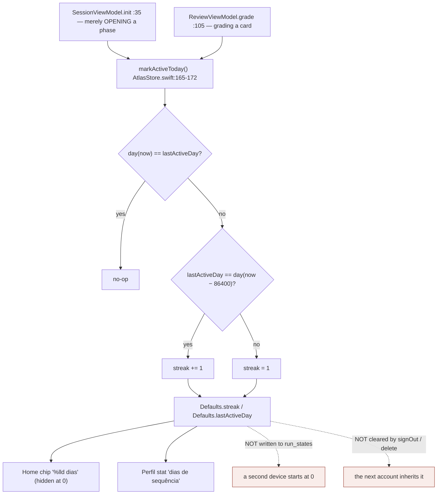

**User value.** The one figure that rewards showing up rather than achieving
something — correctly the first Perfil stat and the only thing in the Home top bar
besides the wordmark and the avatar.

**Bugs.**

- **ST-1 (confirmed, medium)** `Defaults.swift:34-41` keys are global and
  `AtlasStore.signOut()` (`:363-377`) does not clear them. Two symmetric failures:
  sign in on a new phone and a 40-day streak reads 0, with no explanation; sign out
  and in as a different learner and you inherit the previous learner's streak. The
  store's comment (`:38-40`) acknowledges the first as scope; the second is
  acknowledged nowhere and is the worse of the two. `RunSnapshot` already carries
  an `adherence` blob through the round trip (`:43`) — nothing writes to it.
- **ST-2 (confirmed, low)** `AtlasStore.swift:168`:
  `lastActiveDay == Self.day(.now.addingTimeInterval(-86_400))`. Across a DST
  transition the local day is 23 or 25 hours, so 86 400 s does not land on
  yesterday. Worked example (US Eastern — DST applies to the `en` build and to
  travellers): fall-back Sunday 1 Nov is 25 h. Learner works Sunday; Monday 2 Nov at
  23:30 they grade a card; `now − 86400` is _Monday_ 00:30, so `day(now−86400)` is
  Monday, the comparison fails and the **streak resets to 1**. Spring-forward gives
  the mirror failure just after midnight. Fix:
  `Calendar.current.date(byAdding: .day, value: -1, to: .now)`. Low (narrow windows,
  and pt-BR's primary market abolished DST in 2019) but the current form is wrong.
- **ST-3 (confirmed, low)** `SessionViewModel.swift:35` calls `markActiveToday()`
  in `init`, before the learner has read a word or answered anything — tapping a
  node and backing out banks the day. `ReviewViewModel.swift:105` (on grade) is the
  correct shape.
- **ST-4 (confirmed, low)** The chip's animation is inert — see H-7; repeated here
  because the streak is the feature that animation exists for.
- **ST-5 (confirmed, low)** `AtlasStore.streak` is only mutated by
  `markActiveToday()`. An app left open across midnight, or resumed from the
  background next morning, shows yesterday's streak on Home until the learner
  enters a session or review. No `scenePhase` hook, no timer.

**Must-improve.**

1. (`AtlasStore.swift:363-377`) Clear `Defaults.streak`/`lastActiveDay` in
   `signOut()`, and stamp the streak into `RunSnapshot`'s `adherence` blob so it
   survives a device change.
2. (`AtlasStore.swift:168`) `Calendar.date(byAdding: .day, value: -1)`.
3. (`SessionViewModel.swift:35`) Move the tick to the first real mastery write.

---

# Cross-cutting

**Localisation (`ios/AGENTS.md` §Copy).** Verified against
`App/Resources/Localizable.xcstrings` (source `pt-BR`, 290 keys): **every** key
used by these six files is present, and **every** one of the 290 has an English
translation — zero missing-English entries. Interpolation rather than
concatenation throughout; `verbatim:` used correctly for node labels
(`HomeView.swift:112-113`), map subjects (`:144`), stat values
(`ProfileView.swift:61`), interests (`:88`) and error sentences
(`SettingsView.swift:111`); component parameters that are always copy are typed
`LocalizedStringKey`. This part of the rulebook genuinely holds. Three exceptions,
reported above: **P-8** (no plural variation on `%lld pendentes · ~%lld min hoje`),
**S-10** (`"Português"` translated to `"Portuguese"`), **S-18** (raw Portuguese CSV
header). One catalogue-wide observation, not this area's defect: all 290 entries
carry `"extractionState": "stale"`, so the catalogue has not been regenerated by
`make strings-update` since the last code change.

**Touch targets (`ios/AGENTS.md` §Touch).**

| control                                          | size                                     | file:line                   | verdict     |
| ------------------------------------------------ | ---------------------------------------- | --------------------------- | ----------- |
| Settings `choice` pills (goal, target, language) | `minHeight: 48`                          | `SettingsView.swift:138`    | ✓           |
| Settings voice `Toggle` rows                     | `minHeight: 60`                          | `:158`                      | ✓           |
| Settings export / delete buttons                 | `minHeight: 48`                          | `:105`, `:165`              | ✓           |
| `BackButton`                                     | 44 × 44                                  | `Components.swift:566`      | ✓           |
| Profile rows                                     | `minHeight: 64` + `.contentShape(.rect)` | `ProfileView.swift:135-136` | ✓           |
| Home cards                                       | full width, ≥ 100 pt                     | `HomeView.swift:119-121`    | ✓           |
| **Home avatar → Perfil**                         | **34 × 34**                              | **`HomeView.swift:38`**     | **✗ (H-8)** |

One violation in the whole area.

**Test coverage.** `ios/AtlasKit/Tests/AtlasKitTests/` contains no `HomeTests`,
`ProfileTests` or `SettingsTests`. The nearest coverage is `SaveTests.swift:52`
(`aChangeToTheRunReachesTheServerOnItsOwn`), which exercises the debounce but not
`saveNow`'s failure path — **S-5, the highest-severity bug here, is in the one code
path with no test at all.** These view models are pure `@MainActor` store-backed
classes: `reviewNote`, `queueLine` and `makeExportedCards` are directly unit-testable
against a fixture store.

---

# Bug ledger

| id         | sev       | file:line                                                | one line                                                                                         |
| ---------- | --------- | -------------------------------------------------------- | ------------------------------------------------------------------------------------------------ |
| S-5        | **high**  | `SettingsViewModel.swift:51-54` + `AtlasStore.swift:338` | `exit(0)` runs even when the flush upsert failed; no local persistence, so the work is destroyed |
| P-5        | **high**  | `AtlasStore.swift:367` ← `ProfileView.swift:113`         | "Sair" cancels the pending save instead of flushing it                                           |
| H-6        | **high**  | `AtlasStore.swift:242` → `Defaults.swift:23`             | opening a saved map silently rewrites `AppleLanguages`, changing the UI language on next launch  |
| H-2        | med       | `HomeViewModel.swift:44-50`                              | a fully-mastered map is told "Seu mapa ainda está vazio"                                         |
| H-4        | med       | `HomeView.swift:62`, `:78`, `:150`                       | `body` deep-copies the run twice and runs `displayStates` per saved map per redraw               |
| H-5        | med       | `HomeView.swift:129-133`                                 | map switch is a silent ≤60 s network call — no feedback, no re-entrancy guard                    |
| H-8        | med       | `HomeView.swift:38`                                      | avatar → Perfil is a 34 pt tap target (`Metrics.tap` is 44)                                      |
| P-1        | med       | `ProfileView.swift:51-70`                                | 2×2 stat grid has no Dynamic Type escape hatch                                                   |
| P-6        | med       | `ProfileView.swift:113-115`                              | "Sair" is unconfirmed and destroys the keychain session                                          |
| P-7        | med       | `SettingsView.swift` (absent)                            | interests are display-only; the web lets you edit them                                           |
| S-1        | med       | `SettingsView.swift:36-42`                               | changing the goal re-plans nothing on iOS despite its on-screen note                             |
| S-6        | med       | `SettingsViewModel.swift:53`                             | `exit(0)` reads as a crash to iOS; App Store rejection risk (known)                              |
| S-7        | med       | `SettingsView.swift:81-85`                               | app stays interactive during the pre-exit flush and can die mid-tap                              |
| S-9        | med       | `AtlasStore.swift:48-58` + `Warm.swift:312-327`          | language switch does not clear `caches`; old-language prose served under the new key             |
| S-12       | med       | `Components.swift:385`, `ConsumeView.swift:38`           | turning a voice toggle off hides the control but leaves the mic/player running                   |
| S-13       | med       | `Speech.swift:79-92`                                     | no permission/capability feedback; the web shows two explicit sentences                          |
| S-15       | med       | `SettingsView.swift:99-100`                              | `ShareLink(item: String)` shares text, not a `.json`/`.csv` file                                 |
| S-22       | med       | `AtlasStore.swift:363-377`                               | account deletion leaves streak, goal, target, language and voice prefs on the device             |
| S-23       | med       | `AtlasAPI.swift:326-328`                                 | the `authDeleted: false` partial-deletion case is discarded and never shown                      |
| S-24       | med       | `SettingsViewModel.swift:87-94`                          | destructive delete has no in-flight state and can be issued twice                                |
| ST-1       | med       | `Defaults.swift:34-41`, `AtlasStore.swift:363-377`       | streak is device state presented as account state, and survives sign-out                         |
| H-1        | low       | `HomeViewModel.swift:25-37`                              | no signal that the deck is capped away                                                           |
| H-3        | low       | `HomeViewModel.swift:52` vs `RootView.swift:28`          | `hasRun` and the shell disagree on what "has a run" means                                        |
| H-7 / ST-4 | low       | `HomeView.swift:30-37` vs `:77`                          | streak chip's reward animation is on the wrong subtree and never fires                           |
| P-2        | low       | `ProfileView.swift:59-70`                                | stat tiles are two VoiceOver elements each                                                       |
| P-3        | low       | `ProfileViewModel.swift:17`                              | fourth stat drifts from the web's "on the frontier"                                              |
| P-8        | low       | `ProfileViewModel.swift:32`                              | queue subtitle has no plural variation in the catalogue                                          |
| P-9        | low       | `ProfileViewModel.swift:13`                              | an email-less session renders an empty row                                                       |
| P-10       | low       | `ProfileViewModel.swift:22`                              | interests split on `,;` vs the web's `,\n`                                                       |
| S-2        | low       | `SettingsView.swift:36`                                  | no exam-date field, so the exam goal is inert on iOS                                             |
| S-3        | low       | `SettingsView.swift:47`                                  | target change does not resize an in-flight review                                                |
| S-4        | low       | `SettingsView.swift:45-49`                               | daily-target `HStack` cannot reflow at large Dynamic Type                                        |
| S-8        | susp. low | `Defaults.swift:19-25` + `SettingsViewModel.swift:53`    | `AppleLanguages` is never `synchronize()`d before `exit(0)`                                      |
| S-10       | low       | `SettingsView.swift:55`                                  | language names are exonyms in both languages, unlike the web                                     |
| S-11       | low       | `SettingsViewModel.swift:35-39`                          | the "confirmation" alert appears after the write is already committed                            |
| S-14       | low       | `SettingsView.swift:64`, `:66`                           | toggle subtitles never say what "off" means                                                      |
| S-16       | low       | `SettingsViewModel.swift:23-27`                          | both exports encode synchronously on the main actor at push time                                 |
| S-17       | low       | `SettingsViewModel.swift:74`                             | CSV formula injection on `=`/`+`/`-`/`@` leaders                                                 |
| S-18       | low       | `SettingsViewModel.swift:83`                             | CSV header untranslated; `no` should be `nó`                                                     |
| S-19       | low       | `SettingsViewModel.swift:77`                             | cloze cards export without their deletion                                                        |
| S-20       | low       | `SettingsView.swift:96-100`                              | no cards-JSON export, so SM-2 scheduling is lost on round trip                                   |
| S-25       | low       | `SettingsViewModel.swift:92`                             | the delete error sentence is never cleared                                                       |
| S-26       | low       | `AtlasStore.swift:367`                                   | `signOut` is right for delete and wrong for Sair — one behaviour, two opposite callers           |
| ST-2       | low       | `AtlasStore.swift:168`                                   | "yesterday" uses 86 400 s not the calendar; DST resets the streak                                |
| ST-3       | low       | `SessionViewModel.swift:35`                              | opening a phase screen banks the day before any work                                             |
| ST-5       | low       | `AtlasStore.swift:165-172`                               | nothing recomputes the streak across a midnight boundary                                         |
| —          | none      | `AtlasStore.swift:118-120`, `RunSnapshot.swift:126`      | **NaN / divide-by-zero: none found** on an empty run                                             |
| —          | none      | `SettingsViewModel.swift:63-84`                          | **export leakage: none found** — no email, token or keychain material                            |
| —          | none      | `SettingsView.swift:86-91`, `SessionStore.swift:13`      | **deletion is confirmed, reaches the server, and clears the keychain**                           |

# Ranked must-improve (whole area)

1. **Gate `exit(0)` on a proven flush.** `saveNow()` → `Bool`; `restart()`
   (`SettingsViewModel.swift:51-54`) surfaces `ErrorCopy.sentence` and does not
   exit on failure. (S-5)
2. **Flush before clearing in `signOut()`** (`AtlasStore.swift:363-377`). (P-5)
3. **Stop `open()` writing `AppleLanguages`** (`AtlasStore.swift:242`,
   `Defaults.swift:19-25`) — separate content language from interface language. (H-6)
4. **Share files, not strings** (`SettingsView.swift:99-100`). (S-15)
5. **Wipe device defaults on deletion; clear the streak on sign-out**
   (`AtlasStore.swift:363-377`). (S-22, ST-1)
6. **Stop the mic and the player when their toggle goes off**
   (`SettingsView.swift:62-70`, `Core/Speech.swift`). (S-12)
7. **In-flight state on both slow/destructive actions** — delete
   (`SettingsViewModel.swift:87-94`) and map switch (`HomeView.swift:129-133`). (S-24, H-5)
8. **Fix the fully-mastered frontier copy** (`HomeViewModel.swift:44-47`). (H-2)
9. **Make the stat grid survive AX5** (`ProfileView.swift:51-70`). (P-1)
10. **Move `maps`/`frontierCount` out of `body`** (`HomeView.swift:62`, `:78`, `:150`). (H-4)
11. **Add the privacy link and an interests field** to Settings — the two real gaps
    against `components/SettingsScreen.tsx`. (P-7, S-27/4)
12. **Give this area its first tests** — `saveNow`'s failure path above all.
