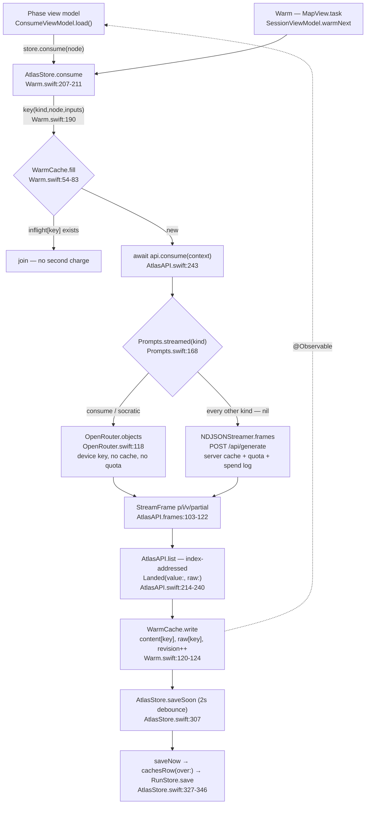
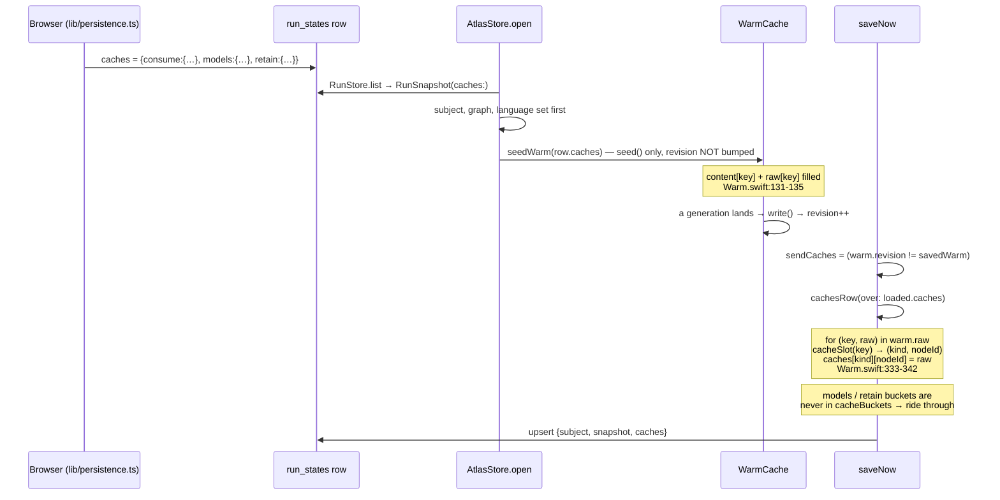

# Atlas iOS — Data & Infrastructure Audit

Scope: `ios/AtlasKit/Sources/AtlasKit/Data/*`, `Core/{Theme,Components,Speech,Support}.swift`,
`Tests/AtlasKitTests/{OpenRouter,Warm,ContentCache}Tests.swift`, `ios/Makefile`,
`ios/Project.swift`, `ios/Tuist.swift`, `ios/scripts/strings.mjs`, `ios/AtlasKit/Package.swift`.
Rules applied: `ios/AGENTS.md` §Where a call goes, §Networking, §Never make a screen wait on
a model, §State. Cross-checked against `lib/server/openrouter.ts`, `lib/server/generate/*.ts`,
`lib/server/job.ts`, `lib/server/contentCache.ts`, `lib/server/apiError.ts`, `lib/theme.ts`,
`lib/curriculum/replan.ts`.

Every file listed was read in full. Findings are labelled **confirmed** (provable from the
source shown) or **suspected** (depends on a first-party package I could not read —
`NavigationPackage` / `NetworkingPackage` are remote `branch: "main"` dependencies).

---

## 0. Executive orientation — the pipeline



---

## 1. The API seam & endpoint values

### Objective

`AtlasAPI` is meant to be the only place in the app that talks to a content backend: one
actor, one `send`, one classification of failures into `AtlasError`, one method per kind, and
a set of `HTTPRequestData` values in `AtlasEndpoint` with no request type per call.

### How it works

- `AtlasAPI` (`Data/AtlasAPI.swift:10`) is an `actor`. It holds a `URLSessionNetworkClient`
  built with `successStatusCodes: 0..<600` (`:27`) so a 4xx body survives to `AtlasError.http`,
  an `NDJSONStreamer` (`:30`), an `OpenRouter` (`:16`) and the bearer (`:18`, written by
  `setAccessToken` at `:33`).
- `send(_:)` (`:37-46`) is the only place a transport failure or a non-2xx status becomes an
  `AtlasError` for unary calls. Streamed calls classify separately in
  `NDJSONStreamer.check` (`Data/NDJSONStream.swift:49-58`).
- Kinds: `generate`/`generated` (`:49-62`), `stream` (`:84-95`), `curriculum` (`:147-185`),
  `diagnosticQuestion` (`:190-204`), the progressive `list` helper (`:214-240`) feeding
  `consume`/`model`/`socratic`/`feynman` (`:243-260`), `whole` (`:274-282`) feeding
  `connect`/`crucible`/`retain`, `judge` (`:290-301`), `deleteAccount` (`:326`),
  `speech` (`:335-345`).
- `AtlasEndpoint` (`Data/AtlasEndpoint.swift:7-28`) holds three factories; `RunEndpoint`
  (`:33-57`) and `GoTrueEndpoint` (`:60-70`) are the Supabase halves. `bearer(_:)` (`:75-78`)
  is the one auth header helper.
- `Landed<T>` (`Data/AtlasError.swift:123-132`) carries the decoded value _and_ the model's
  own JSON, which is what keeps `terms`/`ask`/`encoding` alive for the browser.

### User value

One seam means a kind can be moved from the server to the device (or back) without a screen
noticing — that is what makes the device-generation experiment reversible. `successStatusCodes:
0..<600` is why a learner sees "you asked for a lot in a short time" instead of "request
failed (429)".

### Bugs

**B1 — `ErrorCopy` speaks a code vocabulary the server does not emit. (medium, confirmed)**
`Data/AtlasError.swift:20-27` invents `"request"` for any 4xx; `Core/Support.swift:24-31`
switches on `auth | rate_limit | request | default`. The server's actual code set
(`lib/server/apiError.ts:31-41`) is `offline | auth | rate_limit | timeout | upstream |
invalid | notfound | declined | unknown`. `AtlasError.http` (`AtlasError.swift:47-55`)
prefers `body["code"]`, so a real 400 arrives as `invalid` — which falls into `default`, not
into the `request` branch written for exactly that case. Symmetrically, `"request"` is only
ever produced when the error-body decode _fails_. Net effect: the sentence tuned for "describe
the topic another way" is nearly unreachable, and `timeout`/`invalid` both read as the generic
"try again in a moment".

**B2 — `offline` and `cancelled` have no learner sentence. (medium, confirmed)**
`AtlasError.transport` (`AtlasError.swift:38-42`) deliberately mints `offline` and
`cancelled`. Neither has a case in `ErrorCopy.sentence` (`Support.swift:26-29`). An aeroplane-
mode learner is told "try again in a moment" (they cannot), and a _cancelled_ request — which
is not a failure at all — renders a red error sentence. Failure scenario: learner opens
Consume, backs out before the first section, re-enters; the cancelled stream surfaces through
`WarmCache.fill`'s return value into `ConsumeViewModel.message`
(`Features/Session/Consume/ConsumeViewModel.swift:73-76`) as a spurious error.

**B3 — a streamed 4xx drops the body, so its `code` never reaches the screen. (medium,
confirmed)** `NDJSONStream.swift:49-58` builds the `AtlasError` from the _status alone_
(`codeForStatus`), never reading the response body — even though AGENTS §Networking states
"a 4xx body carries the `code` a screen speaks". The unary path does read it
(`AtlasError.http`). So `/api/generate` streaming quota/`declined`/`invalid` responses are
flattened, and the `reason` sub-case (`apiError.ts:60-61`) is lost for every streamed kind —
which is every progressive kind in the app.

**B4 — `speech` decodes outside the `decoded(_:_:from:)` funnel. (low, confirmed)**
`AtlasAPI.swift:340` uses a bare `JSONDecoder().decode` so a malformed clip throws a raw
`DecodingError` rather than an `AtlasError`; `ErrorCopy` then sees `nil` code and falls to
`default`. Cosmetic given B7 swallows it anyway, but it breaks the "one classification point"
invariant.

**B5 — request-id header lookup may be case-sensitive. (low, suspected)**
`AtlasError.swift:53` does `response.headers["x-atlas-request-id"]` — a plain dictionary
subscript. Next.js emits the header lowercase (`apiError.ts:25`), but `HTTPURLResponse`
preserves server casing and `NetworkResponse.headers` is a first-party type I could not read.
If it is a plain `[String: String]`, this works today only by luck of casing. Verify, or fold
the lookup into a case-insensitive helper.

### Must-improve (ranked)

1. Align `codeForStatus` + `ErrorCopy` with `lib/errors.ts`'s `ErrorCode` union
   (`AtlasError.swift:20-27`, `Support.swift:24-31`) — add `offline`, `timeout`, `invalid`;
   drop `request`; make `cancelled` return `nil`/no sentence so callers can skip it.
2. Read the error body in `NDJSONStream.check` (`NDJSONStream.swift:49-58`) — the stream has
   not started, so `session.data(for:)`-style body read costs nothing.
3. Route `speech`'s decode through `decoded(_:_:from:)` (`AtlasAPI.swift:340`).

---

## 2. NDJSON streaming

### Objective

Give a screen its first frame in hundreds of milliseconds rather than its last in tens of
seconds, without letting a second HTTP client type into the app.

### How it works

`NDJSONStreamer` (`Data/NDJSONStream.swift:12-59`) is a `Sendable` struct with no client
protocol. `frames(_:)` (`:18-45`) builds the same `HTTPRequest` value the unary half uses
(`:22`), takes over only the _reading_ via `URLSession.bytes` (`:23`), checks the status
(`:24`), then decodes one `StreamFrame` per non-empty line with a single reused `JSONDecoder`
(`:25-29`). A frame whose part is `StreamFrame.errorPart` (`"__error"`,
`AtlasError.swift:144`) throws (`:30-32`). `continuation.onTermination` cancels the task
(`:43`) so a screen that goes away stops paying.

Above it, `AtlasAPI.list` (`AtlasAPI.swift:214-240`) is the one accumulator: it grows two
sparse arrays (decoded + raw) addressed **by `frame.i`**, skips `partial != true` frames
(`:223`), and yields a `Landed` of everything landed so far — which satisfies AGENTS' "never
derive 'is this the last item?' from a streamed array's length". `curriculum` (`:147-185`) is
the same shape over two parts (`nodes` / `scopes`).

### User value

The reading pass paints its first section while the rest is still being written; the map
draws real concepts as they are laid out rather than a spinner. That is the difference
between a 30-second wait and a 2-second one on the surface SPEC §2 asks the learner to watch.

### Bugs

**B6 — `__error` throws away everything that landed, against the stated rule. (medium,
confirmed)** AGENTS §Networking: _"A frame named `__error` means the stream died after
committing to a 200: keep what landed and offer a retry."_ `NDJSONStream.swift:30-32` throws;
the error propagates into `WarmCache.fill`'s `catch` and `failed(key:_:)`
(`Warm.swift:140-145`) **nils the content and the raw**. `ConsumeViewModel.chunks` is a live
read of that cache (`ConsumeViewModel.swift:49`), so the three sections the learner was
reading vanish mid-sentence and the retry regenerates all of them — a second full charge for
content that was already paid for. Same for `socratic`, `feynman`, `curriculum`.
This is the direct collision between §Networking's rule and `Warm.swift`'s "nothing
incomplete is kept"; today the cache wins silently.

**B7 — partial frames never reach a device-generated stream. (low, confirmed)**
`AtlasAPI.frames` (`:103-122`) calls `openRouter.objects(ported.messages)` without
`partial:`, so `OpenRouter.pump`'s `wantsPartial` is `false` (`OpenRouter.swift:118-120,
171-176`). The server does the same for `consume`/`socratic`
(`lib/server/generate/consume.ts:220` uses `streamJsonObjects`, complete-only), so this is
_not_ drift — but it means `closePartialJSON`, its three tests, and the whole
`partialInterval` machinery are dead weight on the device today. Flagging so it is not
mistaken for working behaviour.

### Must-improve

1. Decide the `__error` policy once. Either honour AGENTS (keep what landed; add a
   `WarmCache.partial(key:)` state a screen can retry from), or amend AGENTS. Today the doc
   and the code disagree — `NDJSONStream.swift:30`, `Warm.swift:140`.
2. `AtlasAPI.list` rebuilds `items.compactMap` **and** `.array(raw.compactMap)` on every frame
   (`:228-231`) — O(n²) copies of the raw JSON. Harmless at 5 sections, wasteful at a
   16-node curriculum stream. Yield a slice or accumulate lazily.

---

## 3. On-device OpenRouter generation + the prompt mirror

### Objective

`OpenRouter.swift` must be a faithful port of the _transport half_ of
`lib/server/openrouter.ts` (same request, same deadlines, same streaming-JSON scanning), and
`Prompts.swift` must hold _copies_, not paraphrases, of `lib/server/generate/*.ts`.

### How it works

`OpenRouter` (`Data/OpenRouter.swift:15`) is an actor holding `Secrets.openRouterKey` /
`openRouterModel` (`:16-17`). `Role.temperature` is `judge ? 0 : 0.6` (`:26`) — identical to
`temperatureFor` (`openrouter.ts:56-58`). `request(_:role:stream:)` (`:206-230`) posts to
`https://openrouter.ai/api/v1/chat/completions` with `response_format: {"type":"json_object"}`
only when not streaming (`:227`) — matching `chatOnce` (`openrouter.ts:114`) vs
`chatStreamOnce` (`openrouter.ts:310-315`). `pump` (`:136-184`) scans SSE lines via
`delta(from:_:)` (`:187-202`), buffers, calls `extractCompleteObjects` (`:273-307`), and
throws when `index == 0` (`:181-183`) — the same "a clean empty stream is a failure"
invariant as `openrouter.ts:585`. `check` (`:242-252`) singles out 401/402 as operator
problems, mirroring `openrouter.ts:158-162`.

**Prompt fidelity — verified mechanically.** I dedented the Swift multi-line literals,
replaced every interpolation with a sentinel, did the same for the TS template literals, and
diffed:

| artefact                | Swift                   | TypeScript                          | result                     |
| ----------------------- | ----------------------- | ----------------------------------- | -------------------------- |
| section shape           | `Prompts.swift:72-98`   | `shapes.ts CONSUME_SECTION_SHAPE`   | **byte-identical**         |
| socratic step shape     | `Prompts.swift:100-111` | `socratic.ts SOCRATIC_STEP_SHAPE`   | **byte-identical**         |
| socratic worked example | `Prompts.swift:115-129` | `socratic.ts SOCRATIC_STEP_EXAMPLE` | **byte-identical**         |
| `system`                | `Prompts.swift:17-23`   | `common.ts:98-105`                  | identical                  |
| `languageNote`          | `Prompts.swift:31-35`   | `common.ts:123-127`                 | identical                  |
| `sizeRule`              | `Prompts.swift:39-41`   | `common.ts:140-151`                 | identical                  |
| `interestNote`          | `Prompts.swift:43-48`   | `common.ts:154-158`                 | identical                  |
| `boundaryNote`          | `Prompts.swift:52-68`   | `common.ts:171-194`                 | identical                  |
| consume stream prompt   | `Prompts.swift:178-219` | `consume.ts:208-232`                | **identical**              |
| socratic stream prompt  | `Prompts.swift:224-243` | `socratic.ts:156-180`               | identical modulo constants |

The only textual delta on socratic is that the Swift hard-codes `1` / `probe` where the TS
interpolates `SOCRATIC_SPARES` and its pluralisation (`socratic.ts:53`). `SOCRATIC_SPARES = 1`
(`lib/curriculum/feynman.ts:131`), `SOCRATIC_MIN_STEPS = 2` (`:126`), `SOCRATIC_STEPS = 4`
(`:120`) — so the rendered strings match today. **The prompt text has not drifted.**

### User value

A ported kind skips a round trip to Vercel and its cold start, and works against a preview
deployment without redeploying. For the learner: a Consume pass that starts writing sooner.

### Bugs

**B8 — CRITICAL: the OpenRouter spend credential ships inside the app binary.**
`OpenRouter.swift:16` reads `Secrets.openRouterKey`, a `public static let String`
(`Secrets.example.swift.txt:29`). Swift string literals land in `__TEXT.__cstring`; `strings`
over an extracted `.app`/`.ipa` returns it in one command. `Secrets.swift` is correctly
git-ignored (root `.gitignore`, last stanza) and is **not** in the repo or its history
(verified: `git ls-files | grep -i secret` returns only the `.txt` template) — so this is a
_binary_ exposure, not a repo leak.

Quantified exposure. Anyone with the binary gets:

- **Unbounded spend.** AGENTS §Where a call goes states the device path deliberately has no
  quota and no spend log. There is no per-user cap, no rate limit, no attribution. The only
  bound is the OpenRouter account balance.
- **No revocation signal.** Nothing on the device reports which key it used; a leaked key is
  discovered by the balance dropping.
- **Full model access**, not just Atlas's kinds — the key is a raw provider credential, so an
  extractor can call any model on OpenRouter at any price tier.
- **Distribution surface.** TestFlight builds, ad-hoc builds, `.app` bundles pulled off a
  simulator's `~/Library/Developer/CoreSimulator/…` directory, and any device backup.

Fix, in order of preference:

1. **Delete the device path.** `/api/generate` is still deployed and `Prompts.streamed`
   returning `nil` is already the switch (`Prompts.swift:168-175`) — deleting the two `case`s
   at `:171-172` reverts every kind to the server, and `Secrets.openRouterKey` /
   `OpenRouter.swift` can be removed entirely. This is the refactor the example file itself
   names (`Secrets.example.swift.txt:12-15`).
2. If the device path must stay for the development phase: put a **hard credit limit** on the
   key in the OpenRouter dashboard (a provisioning-key–minted sub-key with a ceiling), rotate
   it on a schedule, and never build a distributable configuration with it — gate the whole
   file behind `#if DEBUG` so a Release build cannot compile the constant in.
3. Long term: mint a short-lived, scoped token server-side (`/api/openrouter/token`) that the
   app exchanges its Supabase bearer for. That keeps the streaming-on-device latency win
   without shipping a permanent spend credential.

**B9 — no retry, no backoff, no fallback chain on the device. (high, confirmed drift)**
`openrouter.ts:143-185` retries every transient failure twice per model with `[1000, 4000]ms`
backoff, across a fallback model chain, before surfacing `BUSY_MESSAGE`. `OpenRouter.swift`
has none of that — `pump` (`:136`) makes one attempt, and the class comment (`:8-14`) frames
it as intentional ("a laptop build can just be re-run"). It is intentional for the _retry
ladder across models_, but the consequence is broader than the comment admits: a single 429
or a single 5xx from OpenRouter kills the learner's reading pass with no second attempt, and
`WarmCache.failed` (`Warm.swift:140`) throws away the sections that already landed (B6).
The web never shows that failure at all.

**B10 — the documented single-shot fallback does not exist; `OpenRouter.json` is dead code.
(high, confirmed drift)** `OpenRouter.swift:116-117` says _"The caller falls back to the
one-shot path, which is retried."_ No caller does. `AtlasAPI.frames` (`:103-122`) has a bare
`catch { continuation.finish(throwing: error) }`. Meanwhile `generateConsumeStream`
(`consume.ts:234-244`) and `generateSocraticStream` (`socratic.ts:182-192`) both fall back to
the retried `generateJson` path when nothing has been yielded — the mechanism `consume.ts:198-206`
calls "the proven, retried path" that "covers the common failure mode (format
non-compliance)". `OpenRouter.json` (`:49-75`), including its corrective-retry conversation
(`:61-68`), is written, tested by nothing, and called by nothing (`grep` finds no call site).

**B11 — the first-token deadline does not actually cap first-token silence. (medium,
confirmed)** `openrouter.ts:276-291` arms two independent timers on one `AbortController`:
`FIRST_TOKEN_MS` (25s), _disarmed by the first content delta_ (`:349-352`), and
`REQUEST_MS` (90s), never disarmed. `OpenRouter.swift:144` instead sets
`request.timeoutInterval = firstTokenSeconds` and comments that URLSession's timeout "is the
silence between bytes, which is the first-token deadline once the stream is running." That is
two drifts in one:

- `URLRequest.timeoutInterval` is an **inactivity** timeout over the whole transfer, so it
  keeps applying _after_ the first token. A model that pauses 26 s mid-generation is killed on
  the phone and survives on the server.
- OpenRouter emits `: OPENROUTER PROCESSING` keep-alive comments while a request queues.
  Those are bytes. They reset the inactivity timer and `delta(from:)` (`:187-202`) skips them
  because they do not start with `data:` — so the _actual_ first-token failure the web guards
  against (`openrouter.ts:22-27`: a model mute for 12m45s) is caught on the phone only by the
  90 s total, five times later than on the server. A learner waits 90 s where the web waits 25.

Also: the 90 s total is only checked _inside_ the line loop (`:157-159`), so it can only fire
when a line arrives. That is fine while keep-alives flow, but it means the two deadlines are
not independent the way the server's are.

**B12 — a non-2xx from a streamed OpenRouter call reports no body. (low, confirmed drift)**
`OpenRouter.swift:147` calls `Self.check(response, Data())` — an empty body. `check`
(`:242-252`) then formats `"OpenRouter \(status): "` with nothing after it, where
`openrouter.ts:317-322` includes `body.slice(0, 600)`. Debugging a 400 (bad model slug, bad
`response_format`) on device is guesswork.

**B13 — the boundary the device computes is far narrower than the web's, and it changes what
is taught. (high, confirmed)** This is the most consequential drift and it is _not_ in
`Prompts.swift` — it is in the inputs.

`lib/curriculum/replan.ts:249-270` (`conceptBoundary`):

- `priorLabels` = **every transitive ancestor** over solid edges,
- `laterLabels` = **every other non-gap node on the map**,
- gap nodes excluded from both, explicitly so the shared `content_cache` row does not fork
  per learner (`replan.ts:245-247`).

`AtlasStore.context(for:)` (`Data/Warm.swift:160-178`):

```swift
let prereqs = graph.prerequisites(of: node.id).map(\.label)   // DIRECT parents only
let later = graph.edges.filter { $0.from == node.id && !$0.dashed }
                       .compactMap { byId[$0.to]?.label }     // DIRECT children only
…
"priorLabels": .array(prereqs.map { .string($0) }),           // == prereqLabels
"laterLabels": .array(later.map { .string($0) }),
```

`prerequisites(of:)` (`Domain/Concept.swift:266-274`) is one hop. So the phone sends the
_direct neighbourhood_, the browser sends the _whole map_. Two consequences:

- **Pedagogy.** `boundaryNote` (`common.ts:160-170`) exists precisely because "a concept two
  columns back already taught the thing it is re-deriving". On iOS that list is empty for
  anything more than one hop away, so a device-written Consume re-derives concepts the learner
  read yesterday, and teaches material a non-adjacent later node owns. The prompt text is a
  perfect copy; the pass it produces is not the same pass.
- **Cost.** `lib/server/job.ts:145-165` folds `boundary(body)` straight into the cache-key
  params for `consume` (`:350-358`), `socratic` (`:435-442`), `feynman` (`:458-465`) and
  `crucible` (`:505-512`); `contentKey` hashes them (`contentCache.ts:113-128`). Because iOS
  sends different label arrays for the same node on the same map, **every unported kind
  generated from the phone misses the row the browser wrote, and vice versa** — the shared
  `content_cache` is fully forked between the two clients for every per-node kind. That is a
  100% cache-miss rate on `feynman`/`connect`/`crucible` across the platform boundary, paid at
  full model price.

Fix: port `conceptBoundary` into `Domain/Concept.swift` (BFS over `!dashed` edges, gap nodes
excluded from both lists) and call it from `context(for:)` — 15 lines, and it fixes the
pedagogy and the cache fork at once.

**B14 — the device path forfeits the cross-learner `content_cache` entirely. (medium, by
design, but quantify it)** For `consume` and `socratic`, `Prompts.streamed`
(`Prompts.swift:171-172`) routes past `/api/generate`, so `contentCache.readContent`
(`contentCache.ts`) never runs. Two learners studying "Limites laterais" in Cálculo I each pay
for a full pass on the phone where the browser would have served the second from a row. Per
node that is roughly one 4–5-section Consume plus one 3–5-step Socratic — the two largest
per-node generations in the product. The `run_states.caches` column (§4) recovers this
_within_ one learner's run but never across learners.

### Must-improve (ranked)

1. **B8** — decide the credential story. Nothing else in this report is a security issue;
   this one is.
2. **B13** — port `conceptBoundary` into `context(for:)` (`Warm.swift:160-178`). Highest
   quality-per-line fix in the layer: correctness _and_ cost.
3. **B10** — wire the documented fallback: `catch` in `AtlasAPI.frames` (`:116`) should, when
   nothing was yielded, call `openRouter.json` with the non-streaming variant of the prompt
   and replay it as frames. `OpenRouter.json` already exists.
4. **B11** — arm a real first-token deadline: a `Task` that cancels the stream task after 25 s
   unless a _content delta_ has landed, and keep `timeoutInterval` at the 90 s total.
5. **B9** — one bounded retry (single delay, no model chain) around `pump` when zero objects
   have been emitted.
6. **B12** — read the error body before `check` on the streaming path.

---

## 4. The warm cache — one-generation-per-key, cache-as-column

### Objective

No screen waits on a model. One generation per key, nothing incomplete kept, one place that
decides a kind's inputs, and a cache that is also the `run_states.caches` column shared with
the browser.

### How it works

`WarmCache` (`Data/Warm.swift:25`) is `@Observable @MainActor`. It holds `content`
(decoded, `:28`), `raw` (the model's own JSON, `:32`), `revision` (`:36`) and
`inflight` (`:40`).

`fill` (`:54-83` streamed, `:88-106` whole) performs **all three checks before any
suspension** — `inflight[key]` (`:58`), `content[key]` (`:59`), then `Task {}` construction
and `inflight[key] = task` (`:81`) — so the dedup is genuinely airtight on the main actor.
`WarmTests.aClickJoinsAWarmInsteadOfPayingForASecondGeneration` (`WarmTests.swift:36-53`)
pins it, and `aPassThatLandsEmptyIsAFailure` (`:73-94`) pins the "nothing incomplete is kept"
half.

The builders (`:207-245`) are the only place a kind is asked for, and `key(_:_:_:)` (`:190`)
is `kind|subject|nodeId|language|inputs`. Connect and Crucible put the learned-pool ids into
`inputs` (`:235, :244`) so content written for one pool is never served for another.

The column merge:



`cacheBuckets` (`:308`) is the five kinds this client fills; `cacheSlot` (`:348-352`) requires
exactly five pipe-separated parts and a known bucket, which is what keeps the Retain draft's
four-part key (`:270`) and any pipe-bearing subject out of the shared column —
`ContentCacheTests.whatIsNotSharedStaysOutOfTheColumn` (`:69-77`) pins all three cases.
`cachesRow` starts from `loaded` (`:334`), so `models` and `retain` survive untouched —
pinned by `ContentCacheTests.swift:54, 65`.

### User value

This is the layer the learner feels most directly. Opening Socratic after Consume is a state
change, not a round trip. A reading pass written in the browser at lunchtime opens on the
phone on the bus with no generation and no bill. Clicking Continue while a warm is still
running joins that request instead of starting a second one — literally halving the spend on
an impatient learner.

### Bugs

**B15 — HIGH: `clear()` does not cancel in-flight tasks, so one run's content can be written
into another run's row. (high, confirmed)**
`clear()` (`Warm.swift:111-116`) empties `content`, `raw` and `inflight` but explicitly leaves
running tasks alone (`:108-110`: "cancelling a generation that is nearly back wastes what was
paid for it, and it writes into a dictionary nothing reads any more"). The second half of that
claim is false: the task's closure holds a **strong `self`** (`:61-63`) and calls
`self.write(key, …)` (`:69`) on the _same_ `WarmCache` instance — `AtlasStore.warm` is a
`let` (`AtlasStore.swift:73`) and is never replaced. So after `clear()`:

1. `content[key]`, `raw[key]` are repopulated with the **previous run's** content, and
2. `revision` is bumped (`:123`), which makes `saveNow` set `sendCaches = true`
   (`AtlasStore.swift:335-337`), and
3. `cachesRow` (`:333-342`) parses `kind` and `nodeId` out of that stale key and writes the
   old run's payload into the **new** run's `caches` column under that node id.

Two concrete failures:

- _Same account, two maps._ Learner opens "Cálculo I", a Consume warm starts for node `lim`,
  they switch to "Álgebra Linear" (`switchTo` → `open` → `warm.clear()`,
  `AtlasStore.swift:251-255, 230`). The Cálculo pass lands and is uploaded into the Álgebra
  row under whatever node happens to share the id `lim`. The learner opens that node and reads
  the wrong concept — from the browser too, since the column is shared.
- _Two accounts on one device._ `signOut()` → `clearRun()` → `warm.clear()`
  (`AtlasStore.swift:374, 383`). Learner B signs in, opens a run; learner A's in-flight
  generation lands and is uploaded into **learner B's row**. Cross-account content leakage.

Fix: hold a generation counter on `WarmCache`, bump it in `clear()`, capture it in the task
and make `write`/`failed` no-ops when it no longer matches. (Cancelling the tasks would also
work but forfeits the paid-for generation, which is what the comment is protecting.)

**B16 — nondeterministic winner when two pools produced content for the same node.
(medium, confirmed)** `key` for Connect/Crucible includes the pool ids (`:235, :244`), but
`cacheSlot` (`:348-352`) reduces every key to `(kind, nodeId)`, and `cachesRow` (`:336-340`)
iterates `warm.raw` — a `Dictionary`, whose order is unspecified and salted per process. After
the learner masters another node, Connect regenerates under a new key while the old key is
still in `warm.raw`; whichever the dictionary yields last wins the column slot. Failure: the
stale web is persisted, then `seedWarm` (`:312-327`) re-seeds it under the _current_ pool key
(`cacheInputs`, `:368-370`) on the next launch, so the learner is permanently served the
pre-mastery web and no regeneration ever fires.
Fix: when writing a bucket slot, prefer the entry whose `inputs` half matches
`cacheInputs(kind, node)` today, or evict superseded keys on `write`.

**B17 — a seeded empty array permanently bricks a node. (medium, confirmed)**
`fill` treats an empty landing as a failure (`:71-74`) and `WarmTests.swift:88-93` pins it.
`seed` (`:131-135`) has no such guard: `try? raw.decode([ConsumeChunk].self)` on a `[]`
succeeds, `content[key] = []` is stored, and thereafter `store.consume(node)` returns `nil`
immediately at `fill`'s `if content[key] != nil` (`:59`). `ConsumeViewModel.chunks` is `[]`,
`writing` goes false, `message` is empty, and the learner stares at an empty Consume screen
with no error and no retry, forever. A `caches.consume.<node> = []` in the row (a truncated
browser write, a failed browser pass) is enough to trigger it.
Fix: in `seed(_:_:_:as:)` (`Warm.swift:357-362`), reject an empty collection before seeding.

**B18 — the Retain draft's raw forces a full caches re-upload it will never be part of.
(low, confirmed)** `draftCards` (`:268-285`) fills a four-part key whose `raw` `cacheSlot`
correctly rejects — but `write` still bumped `revision` (`:123`), so the very next `saveNow`
re-uploads the _entire_ caches column for a payload that will not appear in it.
Fix: give `WarmCache` a `write(…, shared: Bool)` or bump `revision` only for keys
`cacheSlot` accepts.

**B19 — `caches` grows without bound and is re-uploaded whole. (medium, confirmed)**
`cachesRow` (`:333-342`) merges over `loaded.caches` and never evicts. `RunStore.save`
(`Data/RunStore.swift:46-50`) sends the entire column whenever any generation landed. A Consume
pass is ~10–20 KB of JSON; a 60-node map with four kinds each is 2–5 MB, re-uploaded from a
phone on cellular every time a single new section is written. The comment at
`AtlasStore.swift:333-336` correctly guards the _node-drag_ case but not the _steady-state
growth_ case.
Fix: an LRU or "last N nodes touched" cap on the column, or per-key upload (PostgREST
`jsonb_set` via an RPC) instead of whole-column replacement.

**B20 — `cacheSlot` is positional, so a `|` in a node id misfiles content. (low, confirmed)**
`:348-352` takes `parts[2]` as the node id after asserting `parts.count == 5`. A subject with a
pipe is handled (documented, `:346-347`, tested `ContentCacheTests.swift:76`); a **node id**
with a pipe is not — it would produce six parts and be silently dropped (acceptable), but a
_language_ or _inputs_ value with a pipe shifts the parse. Node ids are model-generated. Use a
non-typeable separator (`\u{1F}`) or store the tuple beside the key.

### Must-improve (ranked)

1. **B15** — generation-counter guard in `WarmCache.write`/`failed` (`Warm.swift:120, 140`).
   Cross-account write is the worst defect in this layer.
2. **B13** (see §3) — `context(for:)` boundary, which lives in this file (`:160-178`).
3. **B17** — empty-collection guard in `seed` (`:357-362`).
4. **B16** — pool-aware bucket write in `cachesRow` (`:333-342`).
5. **B19** — cap the caches column.

---

## 5. AtlasStore + auto-save

### Objective

One owner of everything persisted; the run is a row and it saves itself; bulk writes hold
`quiet`; `frontier` is derived, never stored.

### How it works

`AtlasStore` (`Data/AtlasStore.swift:10`) is `@Observable @MainActor`. Every run-owned
property carries `didSet { saveSoon() }` (`:14-58`), and `graph`/`states` additionally
`rederive()` (`:14-15`), which recomputes `display`, `frontier` and `masteredCount` in one
pass (`:124-131`). `frontier` is a stored _derivation_, never written by a surface — the
AGENTS rule holds.

`saveSoon` (`:307-319`) guards on `!quiet, signedIn, !subject.isEmpty`, cancels the previous
pending task, sleeps 2 s, then **clears `pendingSave` before calling `saveNow`** (`:316`) —
the comment at `:313-315` records the earlier bug where `saveNow`'s own
`pendingSave?.cancel()` cancelled the task it was running inside. `saveNow` (`:327-346`)
snapshots `currentRun`, decides `sendCaches` from `warm.revision != savedWarm` (`:335-336`),
merges the column, upserts, then advances `savedWarm`, `loaded` and `library`.

`quiet` (`:81`) starts `true` and is only released by `restore()`'s `defer` (`:197`).
`open` (`:225-247`), `newMap` (`:261-267`), `signOut` (`:363-377`) and `clearRun` (`:382-391`)
all hold it — the AGENTS §State rule is honoured, and `adoptFixtures` (`:395-404`) leaves it
set permanently so a demo run never upserts.

`RunSnapshot` (`Data/RunSnapshot.swift`) is the merge on the other side: `extras` (`:47`),
`form` (`:44`) and `adherence` (`:45`) are held whole and handed back (`:90-120`), and
`snapshot` back-fills the five keys the browser reads without a guard (`:109, 115-119`).

### User value

A learner never presses save and never loses a graded card to a backgrounded app — _in
theory_. The dashboard's card for the open map reads live state rather than the row
(`maps`, `:271-280`), so it is never a debounce behind.

### Bugs

**B21 — CRITICAL: nothing flushes the pending save when the app leaves the foreground.**
There is no `scenePhase` observer anywhere in the app (`grep -rn scenePhase` over
`Sources/` and `App/Sources/` returns nothing; `RootView.swift:18-53` has `.task`,
`.onOpenURL` and two `.onChange`, no lifecycle hook). `saveSoon`'s 2 s `Task.sleep`
(`:311`) is an ordinary unstructured task; once iOS suspends the process it does not run, and
if the app is jetsammed while suspended it never runs at all. There is also no
`beginBackgroundTask` around `runs.save`, so an upsert already in flight when the app
backgrounds is killed mid-request.
Failure scenario: learner grades the last card of a review session and immediately swipes to
the home screen. The card grade, the calibration sample, the `reviewed` set entry and the node
state change are all still in the debounce. iOS suspends, later reclaims the process; on next
launch `loadLibrary` restores the pre-session row.
Fix: `.onChange(of: scenePhase)` in `RootView` calling `Task { await store.saveNow() }` on
`.inactive`/`.background`, wrapped in `UIApplication.beginBackgroundTask` so the upsert gets
its ~30 s.

**B22 — HIGH: `restart()` calls `exit(0)` on a save that may have silently failed.**
`SettingsViewModel.restart()` (`Features/Profile/SettingsViewModel.swift:51-54`) is
`await store.saveNow(); exit(0)`. `saveNow` swallows every failure —
`guard (try? await runs.save(…)) != nil else { return }` (`AtlasStore.swift:338`) — and returns
normally. So a language switch on a flaky connection kills the process with the run unsaved
and no indication. `exit(0)` also gives iOS no chance to run any cleanup.
Fix: have `saveNow` return a `Bool`/`Error?`; `restart()` must surface a failure and not exit.

**B23 — HIGH: no token refresh mid-run, so a session longer than the access-token lifetime
loses every save silently.** `restore()` refreshes only at launch (`:194-207`, and the
`ponytail` at `:192-193` names the gap). Supabase access tokens default to one hour.
After that, every `RunStore.save` returns 401 → `storageError` (`RunStore.swift:69-77`) →
`try?` → `guard … else { return }` (`AtlasStore.swift:338`) → nothing. `savedWarm` is
correctly not advanced, so the _next_ save retries — and also fails. The learner works for an
hour, sees no error anywhere (there is no "not saved" chip; the `ponytail` at `:324-326`
acknowledges this), and loses everything on relaunch. This is the single largest data-loss
surface in the app, and it compounds B21.
Fix: refresh on 401 inside `RunStore`/`AtlasAPI` (retry once with a renewed bearer), plus a
persistent "not saved" indicator.

**B24 — MEDIUM: two overlapping `saveNow` calls can point `loaded` at the wrong run.**
`saveNow` (`:327`) is re-entrant: it cancels `pendingSave` but a save already _past_ the
cancel point cannot be stopped, and `saveSoon` clears `pendingSave` before awaiting (`:316`),
so `switchTo`'s `await saveNow()` (`:253`) does not cancel the in-flight one. Sequence:

1. debounced `saveNow(A)` starts, captures `currentRun` for run A, suspends at `:338`;
2. learner taps map B; `switchTo` runs its own `saveNow` and then `open(B)` (`:254`), which
   sets `loaded = B` (`:229`);
3. `saveNow(A)` resumes and executes `loaded = run` (`:339`) — `loaded` now points at **A**
   while the live state is **B**.
   From then on `currentRun` (`:284-301`) writes B's live state over **A's** `extras`, `form` and
   `adherence`, and `library[index] = run` (`:342`) files A's row content under B's subject.
   Fix: guard the post-await writes on an epoch (`let epoch = runEpoch; … guard epoch == runEpoch
else { return }`), or serialise saves through a single-flight actor.

**B25 — MEDIUM: opening a saved run silently repins the whole interface language.**
`language`'s `didSet` (`:48-58`) unconditionally runs `Defaults.language = language`, and
`Defaults.language`'s setter writes `AppleLanguages` (`Data/Defaults.swift:19-25`) — which is
what `Bundle.main` reads to pick an `.lproj`. `open` (`:242`) sets `self.language =
run.language` for any run that records one, under `quiet` — but `quiet` only suppresses
`saveSoon`, not the `Defaults` write. So a learner whose phone is in English, opening a run
built in Portuguese, gets the **entire app UI** in Portuguese from the next launch, with no
prompt and no visible cause. AGENTS is explicit that screen 13's picker is what sets both, and
that the switch is deliberate enough to warrant an alert and a relaunch.
Fix: split the two. `AtlasStore.language` should set `AtlasAPI.language` (content) always and
`Defaults.language` (interface) only from `SettingsViewModel.choose(language:)`.

**B26 — MEDIUM: a future snapshot version destroys the row it cannot read.**
`RunSnapshot.versions = 1...9` (`RunSnapshot.swift:59`); `init?` returns nil outside it
(`:63-65`); `RunStore.list` `compactMap`s those away (`:37-39`); `loadLibrary` then leaves the
learner with an empty library and no map (`AtlasStore.swift:212-221`). The `ponytail` at
`:213-216` calls this "wrong but recoverable — building a map with the same subject upserts the
same row". It is not recoverable: the new run has `loaded == nil`, so `currentRun`
(`:285`) starts from a **fresh** `RunSnapshot` with empty `extras`, and `snapshot`
(`RunSnapshot.swift:90-120`) writes a v9 row that has lost every key the app does not name —
reading positions, unfinished Socratic/Feynman passes, the misconception roll-up, the web's
FSRS `cards`. The upsert replaces the whole `snapshot` column.
Fix: when a row exists but cannot be parsed, refuse to upsert that subject (keep the raw
`JSONValue` and merge into it, or mark the subject read-only and tell the learner to update).

**B27 — LOW: `signOut` discards the pending save.** `:369` cancels `pendingSave` without
flushing. Up to two seconds of the learner's last work — plus anything not yet debounced — is
dropped on the way out. Since `signOut` is synchronous and `quiet` must be set before
`clearRun`, the fix is to `await saveNow()` from the caller before `signOut()`, the way
`switchTo`/`newMap` already do.

**B28 — LOW: `AtlasAPI.language` is a `nonisolated(unsafe) static var`.**
`AtlasAPI.swift:351`. Every write is on the main actor (`AtlasStore.language.didSet`,
`:49`) and every read I traced is a default-argument evaluation at a main-actor call site, so
the race is theoretical today — but it is one background read away from being real, and
`@MainActor static var` costs nothing here.

**B29 — LOW: `Defaults.dailyTarget` references an undeclared-in-file `dailyTargets`.**
`Defaults.swift:11` validates against `dailyTargets`, which is defined elsewhere in the module.
Fine, but the whitelist means an out-of-set value silently becomes 15 rather than being
clamped — worth a comment.

### Must-improve (ranked)

1. **B21** — `scenePhase` flush + `beginBackgroundTask`. One `onChange` in `RootView`.
2. **B23** — refresh-on-401 and a visible "not saved" state.
3. **B22** — `saveNow` must report failure; `restart()` must not `exit(0)` over a lost write.
4. **B24** — epoch-guard the post-await writes in `saveNow` (`:339-345`).
5. **B25** — stop `open()` from repinning `AppleLanguages` (`:242`, `Defaults.swift:19-25`).
6. **B26** — never upsert over a row the app could not parse.

---

## 6. Error vocabulary & learner-facing copy

### Objective

`AtlasError` carries a machine `code` and a technical `message`; the screen says something
true about the code in the learner's language; the `message` never appears on screen.

### How it works

`AtlasError` (`Data/AtlasError.swift:6-18`) is four fields. `codeForStatus` (`:20-27`) is the
status→code map. `transport` (`:33-43`) folds `NetworkError` cases into four codes; `http`
(`:47-55`) prefers the body's own `code` and `error`, and lifts `x-atlas-request-id`.
`ErrorCopy.sentence` (`Core/Support.swift:24-31`) is the one place a code becomes a sentence,
and it takes an already-localised `doing:` fragment so each sentence is one catalogue entry —
exactly as AGENTS §Copy requires. `message` is never rendered anywhere I could find.

### User value

"Sua sessão expirou — entre de novo para montar sua revisão" instead of
`OpenRouter 502: {"error":{"message":…`. The request id is captured for support even though
nothing surfaces it yet.

### Bugs

B1, B2, B3 (see §1) are the substance here — the vocabulary is misaligned with the server's,
and the two codes that most need their own sentence (`offline`, `cancelled`) have none.

**B30 — LOW: `AtlasError.http` decodes the body as `[String: String]`.**
`AtlasError.swift:48`. The server's envelope is all-strings today
(`apiError.ts:57-63`), so this works — but any future numeric or null field in the error body
(a `retryAfter`, a `status`) makes the _whole_ decode fail and the real `code` is lost, falling
back to `codeForStatus`. Decode into a purpose-built `struct { code: String?; error: String? }`
instead.

### Must-improve

1. One shared code enum with `lib/errors.ts`, plus `offline`/`timeout`/`invalid` sentences,
   and `cancelled` returning no sentence at all (`Support.swift:24-31`).
2. Surface `requestId` somewhere a learner can read it on a hard failure — it is captured
   (`AtlasError.swift:53`) and then dropped.

---

## 7. Theme tokens

### Objective

Never hard-code a colour, face, duration or gutter that has a token; keep `Theme.swift` and
`lib/theme.ts` in step.

### How it works

`Palette` (`Core/Theme.swift:7-37`), `Face` (`:45-49`), `Motion` (`:58-75`), `Metrics`
(`:78-91`), plus `Color(hex:opacity:)` (`:93-102`).

**Colour audit — every shared token matches `lib/theme.ts:3-30` exactly:** paper `F4F1EA`,
card `FBF9F4`, cardAlt `F8F5EF`, chipBg `F0ECE3`, ink `2C2823`, inkSoft `4A463F`, inkMuted
`6B665C`, inkFaint `8A8478`, inkGhost `A8A29A`, accent `2F6B4F`, accentBg `F2F6F2`, accentInk
`F7F5EF`, amberInk `A06A30`, amberBg `FAF3E6`, successBg `EEF4EE`, dangerInk `9A4034`,
dangerBg `F9EDEA`, hairline `2C2823 @ .10`, hairlineStrong `@ .14`. The phase accents match
their sources too: `connectInk/Bg/Border` (`Theme.swift:29-31`) against `CONNECT_COLOR`
(`lib/curriculum/connect.ts:18-23`), `crucibleInk/Bg/Border` (`:32-34`) against
`CRUCIBLE_COLOR` (`lib/curriculum/crucible.ts:19-24`). **No colour drift.**

**Motion audit — durations match** (`instant` 90→0.09, `fast` 150→0.15, `base` 240→0.24,
`slow` 380→0.38, `deliberate` 620→0.62, `lib/theme.ts:57-65`) **and the three shared curves
match** (`standard` `.4,0,.2,1`; `enter` `.2,.8,.3,1`; `spring` `.34,1.56,.64,1`,
`lib/theme.ts:66-71`).

### User value

The app looks like the same product as the web, and a token change lands on both platforms at
once instead of by eye.

### Bugs

**B31 — MEDIUM: two of the three faces are not bundled, so most of the app renders in the
system font.** `Face.sans = "InstrumentSans-Regular"`, `Face.mono = "SplineSansMono-Regular"`
(`Theme.swift:47-48`). `App/Resources/Fonts/` contains only `Newsreader.ttf` and `OFL.txt`,
and `Project.swift:38` lists `UIAppFonts: ["Newsreader.ttf"]`. `Font.custom` falls back
silently, so `Kicker` (mono, `Components.swift:51`), `CTAButton`, `GhostButton`, `Chip`,
`ChoiceRow`, `Avatar` and `Waiting` — i.e. essentially every non-serif glyph in the app — draw
in SF, not in the design's faces. The comment at `Theme.swift:43-44` names the risk; the
condition is currently _true_, which makes this a shipped visual regression rather than a
warning.
Fix: bundle the two variable fonts, add them to `UIAppFonts`, and add a debug assertion
(`UIFont(name:size:) == nil`) so a missing face fails loudly.

**B32 — MEDIUM: no dark-mode story and no `preferredColorScheme`.** Every `Palette` value is a
fixed light sRGB literal (`Theme.swift:8-36`) and `grep -rn preferredColorScheme` over the
whole package returns nothing. In Dark Mode the paper stays cream but every system-drawn
surface around it inverts: `.alert` sheets (`SettingsView`'s delete/restart alerts), the
keyboard, `TextEditor`'s caret and selection (`Components.swift:379`), `ShareLink`'s share
sheet, and `Divider`'s base colour under the `.overlay` recolouring
(`Components.swift:74, 153, 391`).
Fix: either `.preferredColorScheme(.light)` on `RootView` (honest, one line) or promote
`Palette` to `Color(light:dark:)` pairs mirrored into `lib/theme.ts`.

**B33 — LOW: `Motion.snap` and `Motion.reward` have no `lib/theme.ts` twin; `exit` has no
Swift twin.** `Theme.swift:68, 74` add two tokens; `lib/theme.ts:69` has an `exit` easing the
Swift lacks. AGENTS: _"A new token is added to `Theme.swift` and to `lib/theme.ts` in the same
change, or the two platforms have already drifted."_ They have.

**B34 — LOW: `lib/theme.ts:19` `accentWash` is unmirrored.** Fine while the read-along mark is
web-only, but it is the token the mobile read-aloud highlight will need — note it before it is
reinvented by eye.

### Must-improve

1. **B31** — bundle the two faces, or change `Face` to name the system font honestly.
2. **B32** — pick a colour-scheme posture and state it in one line.
3. **B33** — mirror `snap`/`reward` into `lib/theme.ts` and `exit` into `Motion`.

---

## 8. The component library

### Objective

A screen composes `Components.swift` and re-declares no padding, radius or border a component
already carries; every copy parameter is `LocalizedStringKey`; generated material is
`verbatim:`.

### How it works

`Pressable` (`Components.swift:10-18`) is the one press feedback; `pressable()` (`:22`) is the
shorthand. `Kicker` (`:36-56`), `TopBar` (`:59-76`), `Card` (`:79-93`), `CTAButton` (`:96-122`),
`GhostButton` (`:125-141`), `Dock` (`:144-155`), `Chip` (`:158-182`), `ChoiceMark`/`ChoiceRow`
(`:187-294`), `SegmentBar` (`:298-314`), `PhaseBar` (`:320-348`), `AnswerEditor` (`:353-403`),
`MicButton` (`:406-434`), `AtlasPulse` (`:442-455`), `SkeletonLines` (`:461-502`),
`.arrival` (`:504-508`), `Waiting` (`:515-554`), `BackButton` (`:558-571`), `Avatar`
(`:575-595`), `Pending` (`:599-610`).

The `LocalizedStringKey` / `verbatim:` split is disciplined: `Kicker` (`:41` vs `:46`),
`Chip` (`:163` vs `:168`), `Waiting` (`:523` vs `:526`) each ship both initialisers, and
`ChoiceRow`'s label is `String` + `Text(verbatim:)` (`:246`) because an option is generated
material. Every icon-only control carries a label — `MicButton` (`:432`), `BackButton`
(`:569`), `AtlasPulse` (`:453`). Tap targets: `MicButton`/`BackButton` `Metrics.tap` square
(`:427, :566`), `ChoiceRow` `minHeight: Metrics.tap` (`:259`), `CTAButton` 52/58 (`:113`).

`Waiting` (`:515-554`) is the nicest piece of the file: a failure drops the skeleton and the
dots (`:529-539`) because nothing is coming, and the whole thing is held back 180 ms
(`:545`) so a fast generation never flashes a skeleton.

### User value

Five phase screens read as one surface. A wait looks like the prose it is waiting for. A tap
always answers.

### Bugs

**B35 — MEDIUM: `AnswerEditor` never stops its `Dictation` when it goes away.**
`Components.swift:358` holds `@State private var dictation: Dictation?`, built in `.task`
(`:401`). There is no `.onDisappear` and `Dictation` has no `deinit` cleanup, and its `stop`
is `private` (`Speech.swift:122`). Leaving a phase screen while the mic is live leaves
`AVAudioEngine` running, the input tap installed, and the shared `AVAudioSession` on
`.record` (`Speech.swift:105`) — which silences the next screen's read-aloud until something
else sets `.playback`, and holds the mic (and its indicator) open. See also B39.

**B36 — LOW: `ChoiceRow` communicates its verdict only by colour and glyph.**
`:274` adds `.isSelected` when chosen but nothing announces `right`/`wrong` to VoiceOver, and
`ChoiceMark.tint`/`symbol` (`:192-214`) are purely visual. A VoiceOver learner cannot tell a
graded option from an ungraded one. Add `.accessibilityValue` per `mark`.

**B37 — LOW: SF Symbol glyphs are fixed-size.** `Image(systemName:).font(.system(size: 17))`
in `MicButton` (`:420`), `BackButton` (`:564`), `AtlasPulse` (`:451`), and `.system(size: 9)`
in `ChoiceRow`'s disc (`:284`). `Font.custom(_:size:)` _does_ scale with Dynamic Type, so the
text is fine — but the glyphs beside it do not, so at AX sizes the mic and chevron shrink
relative to their labels. AGENTS says Dynamic Type is honoured; it is, for type only.

**B38 — LOW: `AnswerEditor` force-resolves the store from the environment.**
`:361` `@Environment(AtlasStore.self) private var store` traps if a host forgets
`.environment(store)`. `RootView.swift:41` always provides it, so this is a preview/refactor
hazard rather than a live bug.

### Must-improve

1. **B35** — expose `Dictation.stop()` and call it from `AnswerEditor.onDisappear`.
2. **B36** — `.accessibilityValue` on `ChoiceRow` for the graded state.
3. **B37** — `.imageScale`/`ScaledMetric` on the four fixed-size glyphs.

---

## 9. Speech — read-aloud + dictation

### Objective

Voice both directions with no dependency, following the interface language rather than
offering a second choice; the TTS provider key never leaves the server.

### How it works

`Speaker` (`Core/Speech.swift:16-60`) is `@Observable @MainActor`. `toggle` (`:29-50`) is a
true toggle (`:30`), fetches from `/api/speech` via `AtlasAPI.speech`
(`AtlasAPI.swift:335-345`), sets the shared session back to `.playback` (`:40-41`) because
dictation leaves it on `.record`, plays, and sleeps the clip's own duration rather than taking
a delegate (`:47-48`). `stop` (`:52-59`) cancels the in-flight synthesis, which is the
"a clip that starts after the learner stopped it" failure the class exists to avoid.

`Dictation` (`:67-134`) requests `SFSpeechRecognizer` authorization on a background queue with
a `@Sendable` closure and hops back (`:87-92`), installs an audio tap (`:108-110`), keeps a
running transcript from partial results but delivers it **only on stop** (`:102-104, 131-133`)
— which is the right call for a learner mid-thought. `stop` gives the session back with
`.notifyOthersOnDeactivation` (`:130`). The two `nonisolated(unsafe)` captures (`:86, :100`)
are stated rather than hidden, and are correct: `SFSpeechRecognizer` is read only on the main
actor and the buffer request is the API's documented cross-thread use.

Language follows `AtlasAPI.language` (`:80`) — one setting, as AGENTS requires.

### User value

A learner can listen to a section on a bus and answer a Feynman prompt out loud instead of
typing three paragraphs on a phone keyboard.

### Bugs

**B39 — MEDIUM: `loading` stays true for the entire clip, so the speaker button is dimmed
while it plays.** `Speaker.toggle`'s `defer { loading = false }` (`:33`) fires when the
_Task body_ exits — and the body ends only after `try await Task.sleep(for: player.duration)`
(`:47`). So `loading` is true for the whole playback. `ConsumeView.swift:92` renders
`.opacity(model.speaker.loading ? 0.4 : 1)`, so the control the learner just started sits at
40% opacity for the length of the section instead of showing the "playing" state at `:81-85`.
Fix: set `loading = false` immediately before `player.play()` (`:44`), not in a `defer`.

**B40 — MEDIUM: a failed synthesis is completely silent.** `:34-37`
`guard let audio = try? await api.speech(text), …, let player = try? AVAudioPlayer(data:) else
{ return }` — a 401, a 502, an empty balance, a decode failure and a corrupt clip all produce
the same "nothing happened". The class's own doc comment (`:22-23`) names _exactly_ this as
"the failure mode read-aloud actually has", and then the code creates it.
Fix: carry an `error: String?` on `Speaker` and let `ConsumeView` show the `ErrorCopy` line.

**B41 — MEDIUM: denied or unavailable speech authorization fails silently, and microphone
permission is never explicitly requested.** `start()` (`:79-93`) returns without a word when
the recogniser is nil or unavailable (`:80-81`) and when `status != .authorized` (`:89`).
`listen` returns silently when the engine fails to start (`:112`). Microphone permission is
only ever triggered implicitly by `engine.start()`. Net effect: the first mic tap on a device
where the learner previously denied Speech Recognition does nothing at all, forever, with no
route to Settings.
Fix: expose an `unavailable`/`denied` state and render a one-line explanation with a
`Settings` link.

**B42 — LOW: recognition errors leave `listening` stuck true.** The task callback
(`:114-119`) discards the error parameter entirely (`{ @Sendable result, _ in`). If the
recogniser fails mid-utterance, the engine is still running and the mic still shows as
listening; the only exit is another tap, which delivers whatever partial transcript survived.

**B43 — LOW: `Speaker` never restores the audio session.** After a clip, the shared session
stays on `.playback` and active (`:40-41`); nothing deactivates it. Background audio from
another app stays ducked/interrupted longer than necessary.

### Must-improve

1. **B39** — move `loading = false` out of the `defer` (`Speech.swift:33`).
2. **B40 / B41** — give both classes an error surface; a voice feature that fails silently is
   indistinguishable from a broken one.
3. **B35** (see §8) — a public `stop()` and an `onDisappear` caller.

---

## 10. Fixture mode

### Objective

`ATLAS_FIXTURES=1` boots a demo run so the map and the node sheet are buildable before
onboarding can produce a real graph, with the same flag the web reads.

### How it works

`Fixtures.enabled` (`Data/Fixtures.swift:8-10`) reads the process environment — same key as
`lib/fixtureMode.ts`. `Fixtures.graph` (`:15-39`) is the design artboard's map with real
positions; `states` (`:43-46`) stores progress only, so `displayStates` derives the frontier
(`:41-42`) exactly as the app does; `cards` (`:50-63`) and `calib` (`:66-70`) make screens 19
and 20 reachable without a generation; `session` (`:74-77`) is a token-less `AuthSession` so
`signedIn` is true. `AtlasStore.adoptFixtures` (`AtlasStore.swift:395-404`) is entered before
`restore()`'s `defer` is installed (`:195` precedes `:197`), so `quiet` stays `true` forever
and a demo run can never be upserted onto a real account — a nice, deliberate detail.

Only `AtlasStore.restore` branches on it (`:195`), matching the doc's "nothing else in the app
branches on it".

### User value

Indirect: a designer or reviewer can open the map, the drawer, the review deck and the
calibration chart on a simulator with no account and no spend.

### Bugs

**B44 — LOW: fixture mode is not actually request-free.** The doc (`:72-73`) says "fixture
mode draws local content and makes no request, so there is no token to be honest about". But
`adoptFixtures` does not call `api.setAccessToken`, and nothing disables generation: opening a
fixture node starts a real Consume — on the device path that is a **real OpenRouter charge**
with the shipped key, and read-aloud posts to `/api/speech` with no bearer and 401s.
Fix: either gate `AtlasAPI.stream`/`generate` on `Fixtures.enabled` with canned payloads, or
correct the comment.

**B45 — LOW: fixture data ships in every build.** `Fixtures` is `public` with `public static`
members (`:7-15`), so the graph, the two cards and the calibration samples are compiled into
Release. Harmless in size, but `Fixtures.session` is a `public`-adjacent constant that makes
`signedIn` true — worth `#if DEBUG` for the whole enum.

### Must-improve

1. **B44** — make fixture mode genuinely offline, or stop claiming it is. It is the one path
   where an accidental `ATLAS_FIXTURES=1` on a distributed build spends real money.

---

## 11. Build / CI tooling, incl. `make strings`

### Objective

Three local gates before a push — `make build`, `make test`, `make strings` — over a generated
(never committed) Xcode project, with the i18n gate driven by swiftc's own extraction rather
than a regex.

### How it works

`ios/Makefile` declares `generate`/`build`/`test`/`strings`/`strings-update`/`run`/`open`/
`clean` (`:8`). `build` (`:21-22`) and `test` (`:25-26`) run `xcodebuild` against the
`AtlasKit` package because the two iOS-only dependencies took the host-macOS `swift build`
away (`:14-17`); `BOOTED` (`:18`) scrapes the booted simulator's UDID. `run` (`:37-44`)
generates, builds, installs and launches.

`Project.swift` is the only description of the app target (`:13-45`): `pt-BR` development
region (`:15`), iOS 26 floor (`:23`), the two voice usage descriptions (`:29-30`), the
`atlas://` scheme for the confirmation link (`:32`), `ATLAS_BASE_URL` (`:33`) and
`UIAppFonts` (`:38`). `Tuist.swift` is one line.

`scripts/strings.mjs` is the good part of the tooling. It builds AtlasKit with
`SWIFT_EMIT_LOC_STRINGS=YES` (`:24-37`), walks every `.stringsdata` swiftc emitted
(`:39-56`), and fails on any key with no English (`:69-72`) **and** on any catalogue entry the
code no longer uses (`:73`). `english()` (`:62-67`) handles plural variations, which is what
makes AGENTS' "plural agreement belongs to the catalogue" rule enforceable. `--update`
(`:75-90`) folds in new keys with an empty `new` unit and deletes stale ones, and still exits
non-zero (`:97-104`) because an empty unit is the thing it exists to catch.

### User value

Indirect but real: it is why the app ships in two languages without a lookup table, and why a
new `Text("…")` cannot quietly reach a learner in Portuguese only.

### Bugs

**B46 — HIGH: a fresh clone cannot build.** `Secrets.swift` is git-ignored and required by
`OpenRouter.swift:16-17`, `RunStore.swift:12-14` and `AtlasAuth`. There is no committed
default, no `#if canImport`, no generated stub. `make build` on a clean checkout fails at
compile with "cannot find 'Secrets' in scope" — no message pointing at
`Secrets.example.swift.txt`.
Fix: commit a `Secrets.swift` with empty placeholder constants (git-ignored _changes_ via
`git update-index --skip-worktree`), or add a `make bootstrap` that copies the template, or
generate the file from `.env.local` in the Makefile the way `make generate` already lifts
values for Tuist.

**B47 — HIGH: none of the three gates runs in CI.** `.github/workflows/ci.yml` contains no
iOS job (`grep -n "ios\|swift\|xcode"` returns nothing). `make build`, `make test` and
`make strings` are honour-system, on a macOS-only toolchain. The i18n gate in particular is
the kind that only works when it is automatic — an untranslated key ships the moment someone
forgets.
Fix: a `macos-latest` job running the three targets. It also needs B46 fixed first.

**B48 — MEDIUM: the two dependencies are pinned to `branch: "main"` of a personal account.**
`AtlasKit/Package.swift:15-16`. `Package.resolved` is committed, which pins the _package's_
own resolution — but the Tuist-generated app project resolves independently, and `make clean`
(`Makefile:52`) removes the resolved checkouts. A force-push or a compromise of
`joaoigorandrade/NetworkingPackage` changes the code that carries every bearer token in the
app. AGENTS calls both "first-party", which is true of authorship, not of supply chain.
Fix: pin to tags (`.upToNextMinor(from:)`) or to exact revisions.

**B49 — MEDIUM: `Project.swift`'s header comment is stale and contradicts AGENTS.**
`Project.swift:3-5`: _"The app talks to the deployed web app and to nothing else — auth
included (`/api/auth`), so no Supabase key ships with it either."_ Both halves are false:
`AtlasAuth`/`RunStore` go to Supabase directly with `Secrets.supabasePublishableKey`, and
`OpenRouter` goes to openrouter.ai. `ios/AGENTS.md` §Stack says the opposite ("the Supabase
URL and its publishable key moved into `Secrets.swift`"). The file that defines the app target
is the worst place for a stale claim about what ships in it.

**B50 — LOW: `Secrets.example.swift.txt` misnames the committed template.** `:8` says
"`Secrets.example.swift` is the committed template"; the committed file is
`Secrets.example.swift.txt`. Also, a `.txt` beside Swift sources in a SwiftPM target is an
unhandled resource — SwiftPM warns about it on every build.

**B51 — LOW: `make test` fails opaquely with no booted simulator.** `Makefile:18` leaves
`BOOTED` empty, producing `-destination 'platform=iOS Simulator,id='`. Add a guard that prints
the "boot one (or run `make run`) first" sentence already in the comment (`:16-17`).

**B52 — LOW: `strings.mjs` hard-codes a derived-data path and never checks
`InfoPlist.xcstrings`.** `:50-51` assumes
`Build/Intermediates.noindex/AtlasKit.build`; a different Xcode layout throws a raw ENOENT
from `readdirSync`. And the two `Info.plist` usage descriptions
(`Project.swift:29-30`, `App/Resources/InfoPlist.xcstrings`) are outside the key set entirely,
so a missing English usage description passes the gate.

**B53 — LOW: `make open` does not open anything named.** `Makefile:47-48` runs
`tuist generate` (which opens by default) — correct behaviour, misleading target body next to
`generate`'s explicit `--no-open`.

### Must-improve (ranked)

1. **B46 + B47** — make a clean clone build, then put the three gates in CI. These are one
   piece of work and the i18n gate is worthless without it.
2. **B48** — pin the two package dependencies.
3. **B49 / B50** — fix the two stale comments; they are the ones a new contributor reads first.
4. **B52** — check `InfoPlist.xcstrings` too, and fail with a readable message when the
   derived path is missing.

---

## Appendix A — cross-cutting answers to the brief's specific questions

**Can a pending save be lost on backgrounding or on `exit(0)`?**
Yes to both. Backgrounding: **B21** — no `scenePhase` hook anywhere, and no background task
around the upsert. `exit(0)`: **B22** — `restart()` awaits `saveNow`, but `saveNow` swallows
its failure (`AtlasStore.swift:338`) and returns normally, so a failed write is indistinguishable
from a successful one immediately before the process is killed. **B23** makes both far more
likely, because after an hour every save fails.

**Does `quiet` protect the bulk writes?**
Yes, correctly and completely. `open` (`:226-228` save/restore, not a bare set), `newMap`
(`:263-264`), `signOut` (`:365-366`), `clearRun`'s callers, `restore`'s `defer` (`:197`) and
`adoptFixtures`' permanent `quiet` are all right. The one hole is not `saveSoon` at all —
it is that `quiet` does **not** suppress the `Defaults`/`AppleLanguages` side effect in
`language.didSet` (**B25**).

**Does the cache merge drop `models` / `retain`?**
No. `cachesRow` starts from the loaded column (`Warm.swift:334`) and only writes slots whose
key passes `cacheSlot` against `cacheBuckets` (`:308, 348-352`), and
`ContentCacheTests.swift:54, 65` pins that a `retain` bucket survives. The merge is correct.
The _contents_ of the buckets it does own can be wrong — **B15** (a different run's content)
and **B16** (a stale pool's content).

**Races between two saves?**
Yes — **B24**, `loaded` and `library` can be pointed at the wrong run by a save that resumes
after `open`. Also note `saveNow` correctly captures `warm.revision` _before_ the await
(`:335`) and assigns `savedWarm = revision` after (`:340`), so a generation landing mid-save is
not falsely marked as uploaded. That part is right.

**Task cancellation?**
`NDJSONStreamer.frames` (`:43`) and `AtlasAPI.frames`/`list`/`curriculum`
(`:120, 183, 238`) all cancel on termination — a screen that goes away stops paying.
`WarmCache.fill` deliberately does not (`Warm.swift:60-62`) so a warm outlives its starter,
which is correct. The gap is `clear()` (**B15**), where "don't cancel" is right but "it writes
into a dictionary nothing reads any more" is wrong.

**Actor hops / `@MainActor` violations?**
None found. `AtlasAPI` and `OpenRouter` and `RunStore` are actors and stay off main;
`NDJSONStreamer.frames`' Task inherits the `AtlasAPI` actor, so the per-line JSON decode of a
long stream runs off the main thread. `WarmCache`'s Task inherits `@MainActor`, which is
correct because it writes observable state — the decode already happened upstream. The two
`nonisolated(unsafe)` uses in `Speech.swift:86, 100` are correct and stated. The one global
mutable is `AtlasAPI.language` (**B28**), effectively main-actor-confined today.

**Where can a generation be billed twice?**

1. **B6** — a mid-stream failure discards the sections that already landed; the retry pays for
   all of them again.
2. **B13** — the boundary mismatch forks the server's `content_cache`, so every
   phone-originated `feynman`/`connect`/`crucible` misses a row the browser already paid for.
3. **B14** — `consume`/`socratic` on the device bypass `content_cache` entirely: no
   cross-learner sharing at all for the two largest per-node generations.
4. **B16** — a stale Connect/Crucible payload can win the column slot and then be re-seeded
   under the current pool key, so the _correct_ generation is paid for repeatedly and
   discarded each launch.
5. **B10** — no single-shot fallback, so a format-non-compliance failure that the server
   recovers from for free costs the phone a full retry (started by the learner, not the app).

**What does a mid-stream disconnect do?**
`URLSession.bytes` throws → `continuation.finish(throwing:)` (`NDJSONStream.swift:36-38`) →
`AtlasAPI.list`'s `catch` (`:234`) → `WarmCache.fill`'s `catch` → `failed(key:_:)` wipes the
partial content (`Warm.swift:140-145`) → the screen empties and shows an `ErrorCopy` sentence.
There is **no** retry, **no** backoff, **no** offline queue, and **no** resume-from-index. On
the device path there is not even the server's fallback. `WarmTests.aPassThatLandsEmptyIsAFailure`
(`:77-87`) pins this behaviour deliberately, so changing it is a decision, not a bug fix — but
it is the wrong decision against AGENTS §Networking's `__error` rule (**B6**).

**Could a credential reach a log?**

- OpenRouter: no. `OpenRouter.swift` builds its own `URLRequest` and never logs; `check`
  (`:242-252`) includes only the response body prefix, which does not echo the key. The 401/402
  message names the _file_ (`Secrets.swift`), not the value.
- Supabase: **suspected**. `AtlasLog.logger` (`AtlasAPI.swift:368-376`) installs
  `ConsoleNetworkLogger` in DEBUG only — correct — and is used by both `AtlasAPI`
  (`:28`) and `RunStore` (`RunStore.swift:21`). Those requests carry `Authorization: Bearer
<access token>` and `apikey: <publishable key>` headers. The comment at
  `AtlasAPI.swift:365-367` asserts "the package redacts credentials"; I could not verify it —
  `NetworkingPackage` is a remote `branch: "main"` dependency with no vendored source in the
  repo. **Verify `ConsoleNetworkLogger`'s header handling before trusting that comment**, and
  if it does not redact, the bearer is in the Xcode console of every debug session.
- Keychain handling is correct: `SessionStore` (`Data/SessionStore.swift:12-19`) stores the
  session as a generic password with `kSecAttrAccessibleAfterFirstUnlock` and never touches
  `UserDefaults`.

---

## Appendix B — findings index

| #   | Subsystem    | Severity     | Status    | Where                                                           |
| --- | ------------ | ------------ | --------- | --------------------------------------------------------------- |
| B8  | OpenRouter   | **critical** | confirmed | `OpenRouter.swift:16`, `Secrets.example.swift.txt:29`           |
| B21 | Store/save   | **critical** | confirmed | `AtlasStore.swift:307-319`; no `scenePhase` in `RootView.swift` |
| B23 | Store/save   | high         | confirmed | `AtlasStore.swift:192-207, 338`                                 |
| B22 | Store/save   | high         | confirmed | `SettingsViewModel.swift:51-54`, `AtlasStore.swift:338`         |
| B13 | Warm/prompts | high         | confirmed | `Warm.swift:160-178` vs `replan.ts:249-270`, `job.ts:145-165`   |
| B15 | Warm         | high         | confirmed | `Warm.swift:111-116, 61-69, 120-124`                            |
| B10 | OpenRouter   | high         | confirmed | `AtlasAPI.swift:116`, `OpenRouter.swift:49-75, 116`             |
| B9  | OpenRouter   | high         | confirmed | `OpenRouter.swift:136` vs `openrouter.ts:143-185`               |
| B46 | Build        | high         | confirmed | `OpenRouter.swift:16`, root `.gitignore`                        |
| B47 | Build        | high         | confirmed | `.github/workflows/ci.yml`                                      |
| B24 | Store/save   | medium       | confirmed | `AtlasStore.swift:327-345, 251-255`                             |
| B25 | Store/save   | medium       | confirmed | `AtlasStore.swift:48-58, 242`, `Defaults.swift:19-25`           |
| B26 | Store/save   | medium       | confirmed | `RunSnapshot.swift:59-65`, `AtlasStore.swift:212-221, 285`      |
| B6  | Streaming    | medium       | confirmed | `NDJSONStream.swift:30-32`, `Warm.swift:140-145`                |
| B11 | OpenRouter   | medium       | confirmed | `OpenRouter.swift:144, 157` vs `openrouter.ts:276-291`          |
| B14 | OpenRouter   | medium       | by design | `Prompts.swift:171-172`                                         |
| B16 | Warm         | medium       | confirmed | `Warm.swift:235, 244, 336-340`                                  |
| B17 | Warm         | medium       | confirmed | `Warm.swift:131-135, 357-362`                                   |
| B19 | Warm         | medium       | confirmed | `Warm.swift:333-342`, `RunStore.swift:46-50`                    |
| B1  | Errors       | medium       | confirmed | `AtlasError.swift:20-27`, `Support.swift:24-31`                 |
| B2  | Errors       | medium       | confirmed | `AtlasError.swift:38-42`, `Support.swift:26-29`                 |
| B3  | Errors       | medium       | confirmed | `NDJSONStream.swift:49-58`                                      |
| B31 | Theme        | medium       | confirmed | `Theme.swift:47-48`, `Project.swift:38`                         |
| B32 | Theme        | medium       | confirmed | `Theme.swift:8-36`; no `preferredColorScheme`                   |
| B35 | Components   | medium       | confirmed | `Components.swift:358, 401`, `Speech.swift:122`                 |
| B39 | Speech       | medium       | confirmed | `Speech.swift:33, 47`, `ConsumeView.swift:92`                   |
| B40 | Speech       | medium       | confirmed | `Speech.swift:34-37`                                            |
| B41 | Speech       | medium       | confirmed | `Speech.swift:80-81, 89, 112`                                   |
| B48 | Build        | medium       | confirmed | `Package.swift:15-16`                                           |
| B49 | Build        | medium       | confirmed | `Project.swift:3-5`                                             |
| B4  | API seam     | low          | confirmed | `AtlasAPI.swift:340`                                            |
| B5  | API seam     | low          | suspected | `AtlasError.swift:53`                                           |
| B7  | Streaming    | low          | confirmed | `AtlasAPI.swift:107`, `OpenRouter.swift:171`                    |
| B12 | OpenRouter   | low          | confirmed | `OpenRouter.swift:147`                                          |
| B18 | Warm         | low          | confirmed | `Warm.swift:123, 270`                                           |
| B20 | Warm         | low          | confirmed | `Warm.swift:348-352`                                            |
| B27 | Store        | low          | confirmed | `AtlasStore.swift:369`                                          |
| B28 | Store        | low          | confirmed | `AtlasAPI.swift:351`                                            |
| B29 | Store        | low          | confirmed | `Defaults.swift:11`                                             |
| B30 | Errors       | low          | confirmed | `AtlasError.swift:48`                                           |
| B33 | Theme        | low          | confirmed | `Theme.swift:68, 74`; `lib/theme.ts:69`                         |
| B34 | Theme        | low          | confirmed | `lib/theme.ts:19`                                               |
| B36 | Components   | low          | confirmed | `Components.swift:274`                                          |
| B37 | Components   | low          | confirmed | `Components.swift:284, 420, 451, 564`                           |
| B38 | Components   | low          | confirmed | `Components.swift:361`                                          |
| B42 | Speech       | low          | confirmed | `Speech.swift:114-119`                                          |
| B43 | Speech       | low          | confirmed | `Speech.swift:40-41`                                            |
| B44 | Fixtures     | low          | confirmed | `Fixtures.swift:72-77`, `AtlasStore.swift:395-404`              |
| B45 | Fixtures     | low          | confirmed | `Fixtures.swift:7-15`                                           |
| B50 | Build        | low          | confirmed | `Secrets.example.swift.txt:8`                                   |
| B51 | Build        | low          | confirmed | `Makefile:18`                                                   |
| B52 | Build        | low          | confirmed | `strings.mjs:50-51`                                             |
| B53 | Build        | low          | confirmed | `Makefile:47-48`                                                |

**No defects found** in: the `Landed` two-halves design, `RunSnapshot`'s extras/form/adherence
merge, `cacheBuckets`/`cacheSlot`, `WarmCache`'s one-generation-per-key guarantee,
`SessionStore`'s keychain handling, the colour and motion token values, the
`LocalizedStringKey`/`verbatim:` discipline in `Components.swift`, and — most notably — the
prompt text itself, which is byte-identical to the server's.
